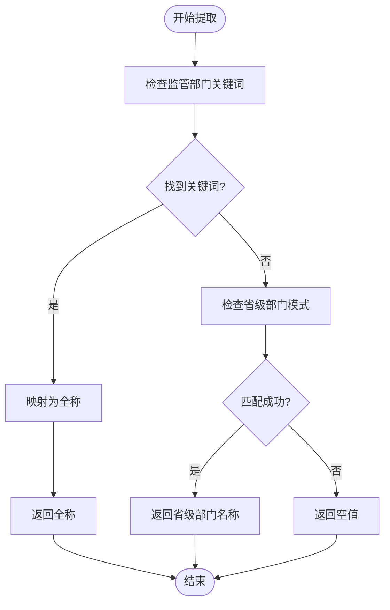
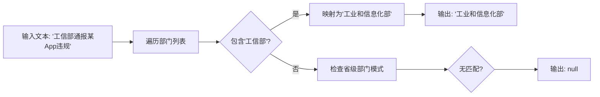

# 自动识别匹配算法

<cite>
**本文档引用文件**   
- [index.ts](file://supabase/functions/parse-multimodal-case/index.ts#L269-L318)
- [api.ts](file://src/db/api.ts#L2162-L2256)
- [compliance_rules.ts](file://src/db/compliance_rules.ts#L75-L94)
- [00022_enhance_high_frequency_issues_with_semantic_split.sql](file://supabase/migrations/00022_enhance_high_frequency_issues_with_semantic_split.sql#L74-L87)
- [00001_create_initial_schema.sql](file://supabase/migrations/00001_create_initial_schema.sql#L100-L114)
</cite>

## 目录
1. [引言](#引言)
2. [核心匹配算法](#核心匹配算法)
3. [部门与平台识别机制](#部门与平台识别机制)
4. [预定义列表与模糊匹配](#预定义列表与模糊匹配)
5. [上下文处理与准确率提升](#上下文处理与准确率提升)
6. [代码示例](#代码示例)
7. [结论](#结论)

## 引言
`parse-multimodal-case`函数是合规通平台的核心功能之一，负责从多模态输入（URL、文本、图片、PDF）中自动提取结构化案例信息。该函数通过一系列文本匹配算法，能够精准识别通报日期、应用名称、开发者、监管部门、应用平台、违规摘要和详细内容等关键字段。其中，`extractDepartment`和`extractPlatform`函数作为实体识别的核心组件，采用了关键词比对和正则模式匹配相结合的策略，确保了高准确率和鲁棒性。本文档将深入解析这些算法的实现逻辑，包括预定义列表的维护、模糊匹配策略以及上下文信息的利用。

## 核心匹配算法
`parse-multimodal-case`函数的核心在于其分步提取和验证机制。当接收到输入请求后，函数首先根据输入类型（URL、文本、图片、PDF）进行内容预处理，然后依次调用一系列提取函数。每个提取函数都采用特定的策略来识别对应的字段。例如，`extractDate`函数通过多个正则表达式模式来匹配不同格式的日期，而`extractAppName`和`extractDeveloper`则通过关键词前缀（如“应用名称”、“开发者”）来定位和提取信息。整个过程通过计算置信度来评估提取结果的可靠性，置信度基于成功提取的字段数量与总字段数量的比例。

**Section sources**
- [index.ts](file://supabase/functions/parse-multimodal-case/index.ts#L75-L115)

## 部门与平台识别机制
`extractDepartment`和`extractPlatform`函数是实体识别的关键。它们通过遍历预定义的关键词列表，在输入文本中进行精确匹配。对于监管部门，函数首先检查文本中是否包含“工业和信息化部”、“国家互联网信息办公室”等全称，如果未找到，则尝试匹配“工信部”、“网信办”等简称，并将其映射为全称。此外，函数还支持省级部门的识别，通过正则表达式匹配“XX省通信管理局”或“XX市网信办”等模式。对于应用平台，函数则直接在预定义的平台列表中进行查找，如“应用宝”、“华为应用市场”等。

**Diagram sources **
- [index.ts](file://supabase/functions/parse-multimodal-case/index.ts#L269-L295)

**Section sources**
- [index.ts](file://supabase/functions/parse-multimodal-case/index.ts#L269-L295)

## 预定义列表与模糊匹配
预定义的部门和平台列表是识别算法的基础。这些列表被硬编码在`extractDepartment`和`extractPlatform`函数中，确保了识别的一致性和效率。为了应对文本中的模糊表述，函数实现了模糊匹配策略。例如，当文本中出现“工信部”时，函数会将其映射为“工业和信息化部”；当出现“网信办”时，则映射为“国家互联网信息办公室”。这种映射关系通过简单的条件判断实现，确保了简称到全称的准确转换。此外，对于平台识别，函数采用直接包含检查，只要文本中包含预定义平台名称的任意部分，即可成功匹配。

**Section sources**
- [index.ts](file://supabase/functions/parse-multimodal-case/index.ts#L271-L287)

## 上下文处理与准确率提升
为了提高识别准确率，`parse-multimodal-case`函数在处理文本时充分考虑了上下文信息。例如，在提取违规摘要时，函数不仅依赖关键词前缀，还会检查匹配内容的长度和语义完整性，避免提取过短或不完整的片段。对于违规详细内容的提取，函数采用基于关键词的段落筛选策略，通过查找包含“违规”、“问题”、“收集”等关键词的句子，并结合长度过滤，确保提取的内容既相关又完整。此外，函数还通过计算置信度来评估整体提取质量，为用户提供结果可靠性的参考。

**Section sources**
- [index.ts](file://supabase/functions/parse-multimodal-case/index.ts#L344-L366)

## 代码示例
以下代码示例展示了`extractDepartment`函数的匹配过程。当输入文本为“工信部通报某App违规”时，函数首先遍历预定义的部门列表，发现“工信部”存在于列表中。随后，根据映射规则，将“工信部”转换为“工业和信息化部”并返回。如果输入文本为“广东省通信管理局发布通知”，则函数通过正则表达式`/([^\s]{2,10}(?:省|市)).*?(?:通信管理局|网信办|市场监管局)/`匹配到“广东省通信管理局”，并直接返回该名称。

**Diagram sources **
- [index.ts](file://supabase/functions/parse-multimodal-case/index.ts#L285-L286)

**Section sources**
- [index.ts](file://supabase/functions/parse-multimodal-case/index.ts#L269-L295)

## 结论
`parse-multimodal-case`函数通过精心设计的文本匹配算法，实现了对多模态输入的高效解析。`extractDepartment`和`extractPlatform`函数利用预定义列表和模糊匹配策略，能够准确识别监管部门和应用平台的实体名称。通过结合上下文信息和置信度计算，该函数不仅提高了识别的准确率，还为用户提供了可靠的结果评估。未来，可以通过引入更复杂的自然语言处理技术，如命名实体识别（NER），进一步提升算法的智能化水平。