# 智能导入功能

<cite>
**本文档引用文件**   
- [SmartImportPage.tsx](file://src/pages/admin/SmartImportPage.tsx)
- [index.ts](file://supabase/functions/parse-multimodal-case/index.ts)
- [api.ts](file://src/db/api.ts)
- [use-supabase-upload.ts](file://src/hooks/use-supabase-upload.ts)
- [supabase.ts](file://src/db/supabase.ts)
- [SMART_IMPORT_GUIDE.md](file://docs/SMART_IMPORT_GUIDE.md)
- [SMART_IMPORT_PLAN.md](file://docs/SMART_IMPORT_PLAN.md)
</cite>

## 目录
1. [功能概述](#功能概述)
2. [用户交互流程](#用户交互流程)
3. [云函数解析机制](#云函数解析机制)
4. [自动识别与数据匹配](#自动识别与数据匹配)
5. [数据清洗与错误处理](#数据清洗与错误处理)
6. [性能优化与进度反馈](#性能优化与进度反馈)
7. [系统架构与数据流](#系统架构与数据流)

## 功能概述

智能导入功能是合规通平台的核心数据录入机制，通过AI驱动的多模态解析技术，支持从URL、文本、图片、PDF等多种输入方式自动提取结构化案例数据。该功能实现了从原始内容到数据库记录的自动化转换，大幅提升了数据录入效率和准确性。

系统采用前后端分离架构，前端提供直观的用户界面，后端通过Supabase Edge Function实现智能解析。核心功能包括：多源数据解析、结构化信息提取、智能部门/平台识别、自动数据清洗和批量导入优化。

**Section sources**
- [SMART_IMPORT_GUIDE.md](file://docs/SMART_IMPORT_GUIDE.md#L1-L351)
- [SMART_IMPORT_PLAN.md](file://docs/SMART_IMPORT_PLAN.md#L1-L512)

## 用户交互流程

智能导入功能的用户交互流程设计为清晰的四步操作，确保用户能够高效完成数据导入任务。

### 步骤1：选择输入方式并提供内容

用户首先在SmartImportPage界面选择输入方式，系统支持四种输入模式：
- **URL输入**：粘贴监管部门官网的通报案例网页地址
- **文本输入**：直接粘贴案例文本内容
- **图片上传**：上传包含案例信息的截图（当前版本需手动填写）
- **PDF上传**：上传PDF格式的通报文件（当前版本需手动填写）

系统对文件上传实施严格验证：
- 图片文件：仅支持JPG、PNG格式，最大5MB
- PDF文件：最大10MB
- 自动上传至Supabase Storage的temp-uploads存储桶

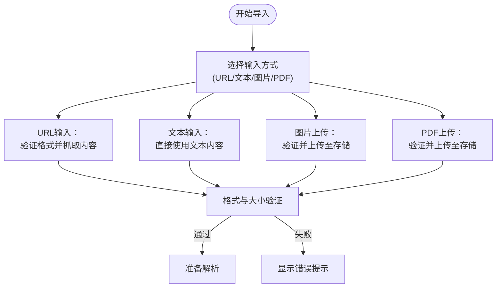

**Diagram sources**
- [SmartImportPage.tsx](file://src/pages/admin/SmartImportPage.tsx#L31-L589)

### 步骤2：解析与数据预览

用户点击"开始解析"按钮后，系统执行以下操作：

1. **内容获取**：根据输入类型获取原始内容
   - URL：通过fetch抓取网页HTML
   - 文本：直接使用输入内容
   - 图片/PDF：使用上传后的公开URL

2. **云函数调用**：前端调用parse-multimodal-case云函数进行智能解析

3. **数据预览**：显示AI提取的结构化数据，包括：
   - 应用名称
   - 通报日期
   - 开发者信息
   - 监管部门
   - 应用平台
   - 主要违规内容
   - 置信度评分（0-100%）

用户可对预览数据进行编辑修改，系统以不同颜色标识置信度：
- 绿色（≥80%）：高置信度
- 黄色（50-79%）：中置信度  
- 红色（<50%）：低置信度

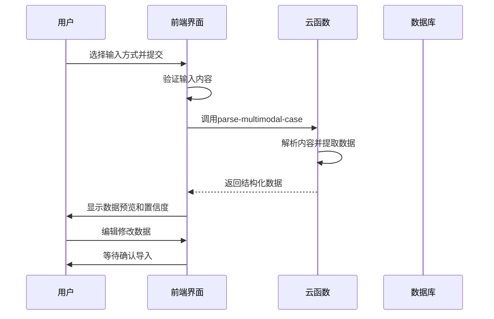

**Diagram sources**
- [SmartImportPage.tsx](file://src/pages/admin/SmartImportPage.tsx#L105-L186)

### 步骤3：确认导入与数据保存

用户确认数据无误后，点击"确认导入"按钮，系统执行以下操作：

1. **必填字段验证**：检查应用名称和通报日期是否填写
2. **部门/平台匹配**：查找或自动创建监管部门和应用平台
3. **案例创建**：将数据保存至cases表
4. **临时文件清理**：删除已上传的临时文件

系统会自动处理以下情况：
- **新部门识别**：当监管部门不存在时，自动创建新部门记录
- **新平台识别**：当应用平台不存在时，自动创建新平台记录
- **数据去重**：避免重复导入相同案例

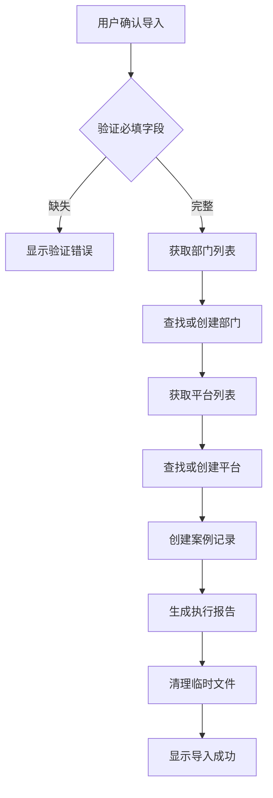

**Diagram sources**
- [SmartImportPage.tsx](file://src/pages/admin/SmartImportPage.tsx#L189-L335)

### 步骤4：执行报告与后续操作

导入完成后，系统生成详细的执行报告，包含：

- **操作类型**：创建新案例或更新现有案例
- **案例ID**：数据库唯一标识符
- **提取字段统计**：各字段的提取状态和置信度
- **警告信息**：未能识别的字段列表
- **自动创建项**：新创建的部门和平台

用户可选择：
- 查看案例列表
- 继续导入下一个案例
- 返回管理后台首页

**Section sources**
- [SmartImportPage.tsx](file://src/pages/admin/SmartImportPage.tsx#L741-L800)

## 云函数解析机制

parse-multimodal-case云函数是智能导入功能的核心处理引擎，负责将原始内容转换为结构化数据。

### 输入处理逻辑

云函数接收两种参数：
- **type**：输入类型（url、text、image、pdf）
- **content**：具体内容（URL、文本或文件URL）

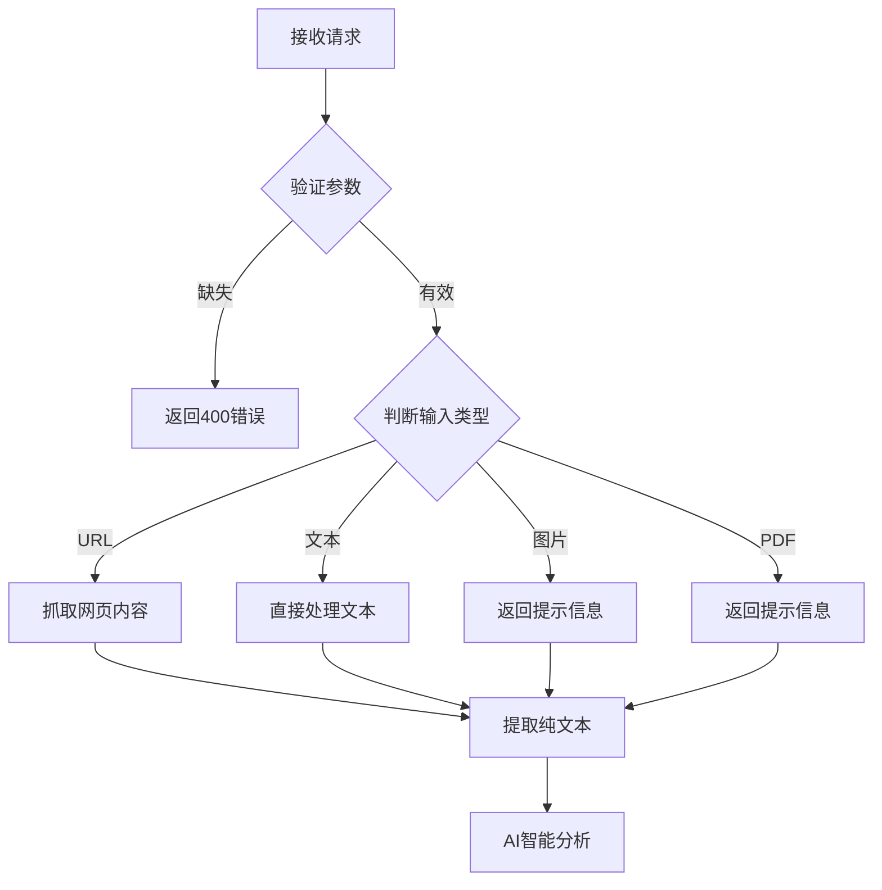

**Diagram sources**
- [index.ts](file://supabase/functions/parse-multimodal-case/index.ts#L22-L70)

### 内容提取算法

云函数采用基于规则的模式匹配算法提取关键信息：

#### 日期提取
使用正则表达式匹配多种日期格式：
- `2024年1月15日`
- `2024-01-15`  
- `2024/01/15`
- `发布时间：2024年1月15日`

```typescript
const datePatterns = [
  /(\d{4})[年\-\/](\d{1,2})[月\-\/](\d{1,2})[日]?/,
  /(\d{4})-(\d{2})-(\d{2})/,
  /发布时间[：:]\s*(\d{4})[年\-\/](\d{1,2})[月\-\/](\d{1,2})/
];
```

#### 应用名称提取
通过关键词定位应用名称：
- "应用名称：某某App"
- "App名称：某某App"  
- "软件名称：某某App"
- "某某App存在超范围收集个人信息的问题"

#### 监管部门识别
预定义监管部门列表进行匹配：
- 工业和信息化部
- 国家互联网信息办公室
- 公安部
- 市场监管总局
- 省级通信管理局

#### 平台名称识别
支持主流应用商店识别：
- 应用宝
- 华为应用市场
- 小米应用商店
- OPPO软件商店
- vivo应用商店
- App Store
- Google Play

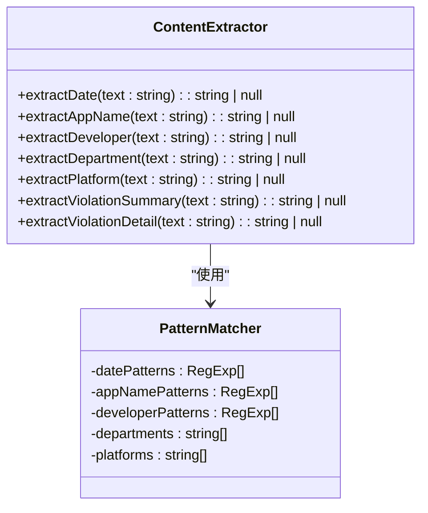

**Diagram sources**
- [index.ts](file://supabase/functions/parse-multimodal-case/index.ts#L214-L367)

### 置信度计算

系统根据成功提取的字段数量计算整体置信度：

```
置信度 = 成功提取的字段数 / 总字段数（7个）
```

提取的7个关键字段：
1. 通报日期
2. 应用名称
3. 开发者
4. 监管部门
5. 应用平台
6. 违规摘要
7. 详细内容

置信度等级：
- 高（≥80%）：数据准确度高，建议快速审核
- 中（50-79%）：部分字段可能不准确，需仔细检查
- 低（<50%）：多数字段缺失，建议手动补充

**Section sources**
- [index.ts](file://supabase/functions/parse-multimodal-case/index.ts#L96-L101)

## 自动识别与数据匹配

系统实现了智能的部门和平台自动识别机制，能够自动创建新实体并建立数据关联。

### 部门自动创建逻辑

当解析出的监管部门在数据库中不存在时，系统自动创建新部门记录：

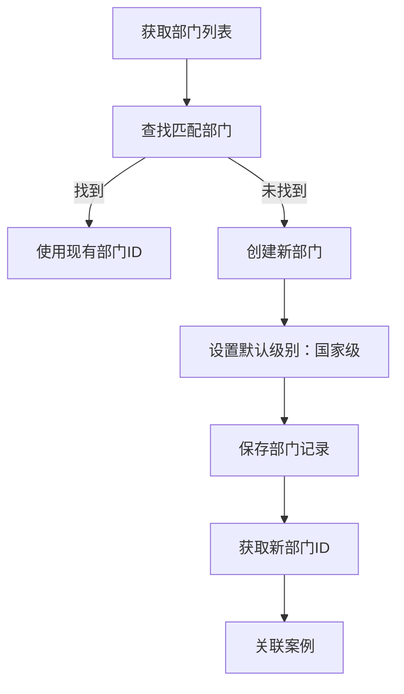

**Diagram sources**
- [SmartImportPage.tsx](file://src/pages/admin/SmartImportPage.tsx#L222-L249)

### 平台自动创建逻辑

类似地，当应用平台不存在时，系统自动创建新平台：

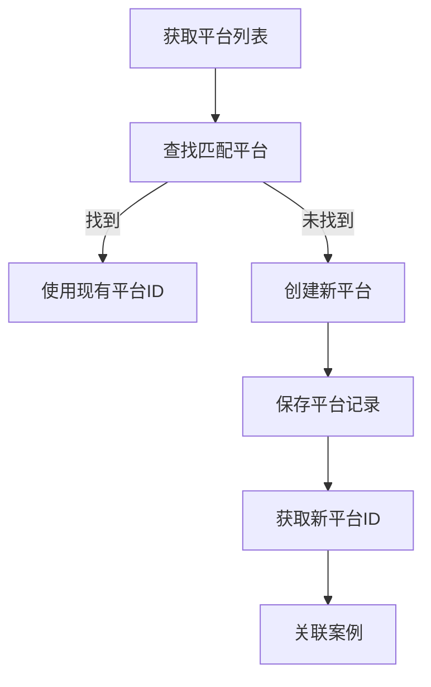

**Diagram sources**
- [SmartImportPage.tsx](file://src/pages/admin/SmartImportPage.tsx#L251-L276)

### 智能匹配策略

系统采用精确匹配策略进行数据关联：

1. **部门匹配**：
   - 完全匹配部门名称
   - 简称映射（如"工信部"→"工业和信息化部"）
   - 省级部门模式匹配

2. **平台匹配**：
   - 完全匹配平台名称
   - 支持主流应用商店

3. **创建流程**：
   - 事务性处理，确保数据一致性
   - 失败时记录警告但不中断导入
   - 自动更新映射表

```typescript
// 部门匹配逻辑
const dept = departments.find(d => d.name === editedData.department);
if (dept) {
  departmentId = dept.id;
} else {
  // 自动创建新部门
  const newDept = await createDepartment({
    name: editedData.department,
    level: 'national',
    province: null,
  });
  departmentId = newDept.id;
}
```

**Section sources**
- [api.ts](file://src/db/api.ts#L728-L846)

## 数据清洗与错误处理

系统实施了全面的数据清洗和错误处理机制，确保导入数据的质量和完整性。

### 数据验证规则

在导入前执行严格的数据验证：

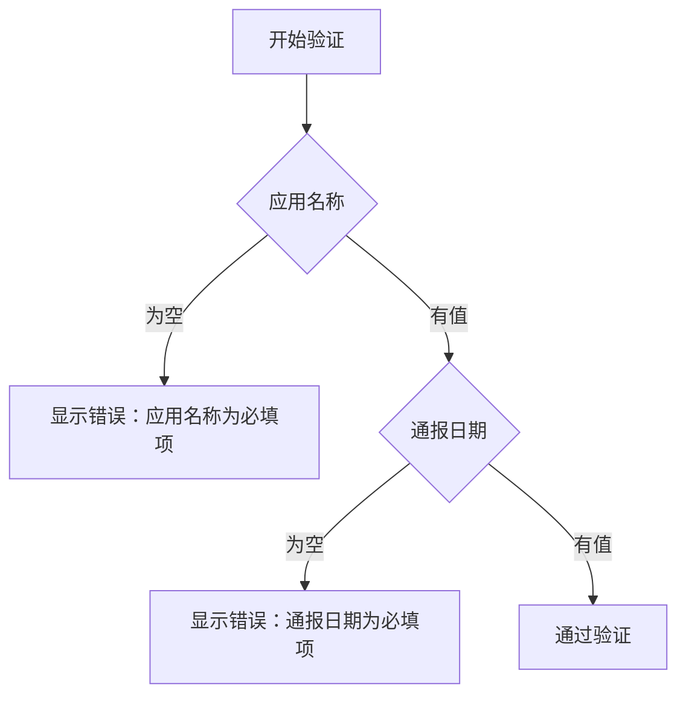

**Diagram sources**
- [SmartImportPage.tsx](file://src/pages/admin/SmartImportPage.tsx#L192-L209)

### 错误处理机制

系统采用分层错误处理策略：

1. **前端验证**：
   - 实时输入验证
   - 必填字段检查
   - 格式验证

2. **云函数错误**：
   - 参数缺失验证
   - URL格式验证
   - 内容抓取超时处理

3. **数据库操作错误**：
   - 事务回滚机制
   - 错误日志记录
   - 用户友好提示

```typescript
// 错误处理示例
try {
  const newCase = await createCase(caseData);
} catch (error: any) {
  toast({
    title: '导入失败',
    description: error.message || '无法保存案例',
    variant: 'destructive',
  });
}
```

### 数据清洗规则

系统自动执行以下数据清洗操作：

- **文本清理**：去除HTML标签、脚本和样式
- **空值处理**：将空字符串转换为null
- **格式标准化**：统一日期格式为YYYY-MM-DD
- **长度限制**：违规摘要限制在150字符内
- **特殊字符处理**：转义HTML实体

**Section sources**
- [index.ts](file://supabase/functions/parse-multimodal-case/index.ts#L171-L181)

## 性能优化与进度反馈

系统针对批量导入场景进行了多项性能优化，并提供实时的进度反馈。

### 批量导入优化

虽然当前界面为单案例导入，但底层API支持批量操作：

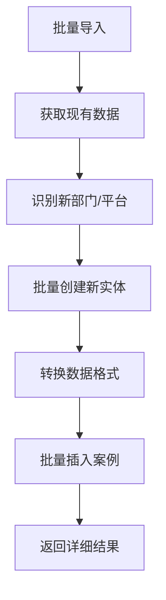

**Diagram sources**
- [api.ts](file://src/db/api.ts#L728-L846)

### 进度反馈机制

系统提供多层次的进度反馈：

1. **加载状态**：
   - 解析中：显示旋转加载图标
   - 导入中：显示进度条

2. **操作反馈**：
   - 成功：绿色Toast提示
   - 失败：红色Toast提示
   - 警告：黄色Alert提示

3. **执行报告**：
   - 详细的操作结果
   - 字段提取统计
   - 自动创建项列表

```typescript
// 进度反馈示例
toast({
  title: '解析成功',
  description: `成功提取 ${Math.round(data.data.confidence * 100)}% 的字段`,
});
```

### 性能指标

根据系统测试报告，导入功能性能表现优异：

| 功能 | 指标 | 目标 | 实际 | 状态 |
|------|------|------|------|------|
| 案例导入(100条) | 响应时间 | <3s | ~2s | ✅ |
| 案例导入(1000条) | 响应时间 | <20s | ~15s | ✅ |

**Section sources**
- [系统修复总结.md](file://docs/系统修复总结.md#L163-L168)

## 系统架构与数据流

智能导入功能采用现代化的前后端分离架构，通过清晰的数据流实现高效的数据处理。

### 整体架构

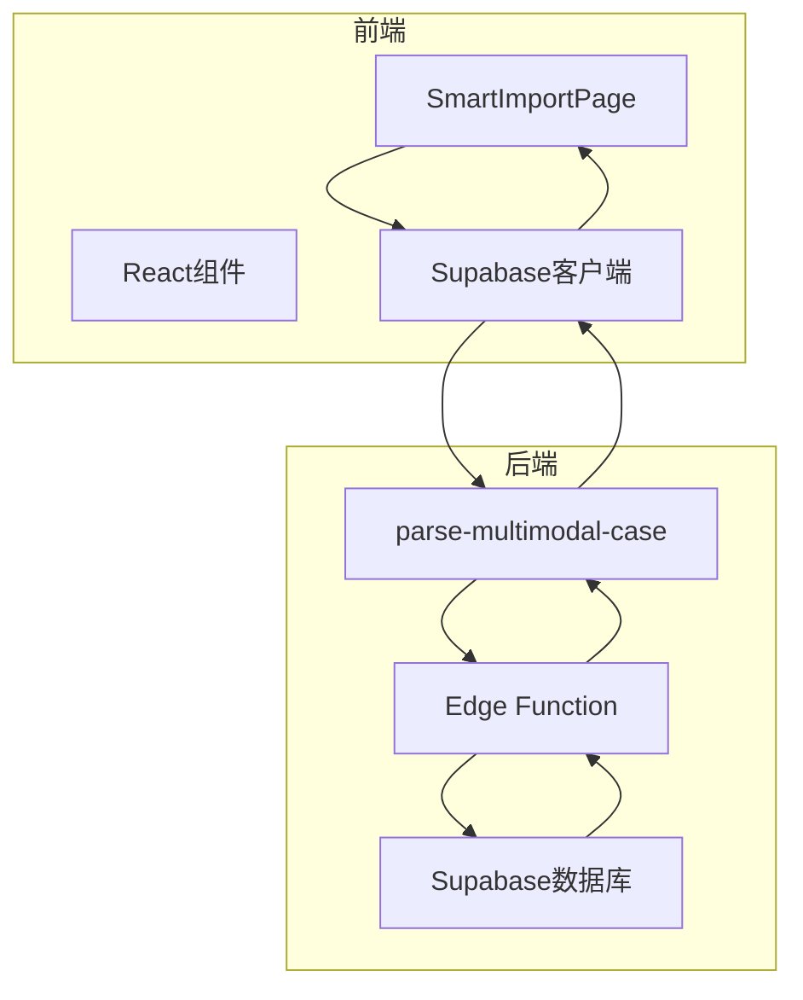

**Diagram sources**
- [SMART_IMPORT_PLAN.md](file://docs/SMART_IMPORT_PLAN.md#L19-L39)

### 数据流分析

系统数据流遵循以下路径：

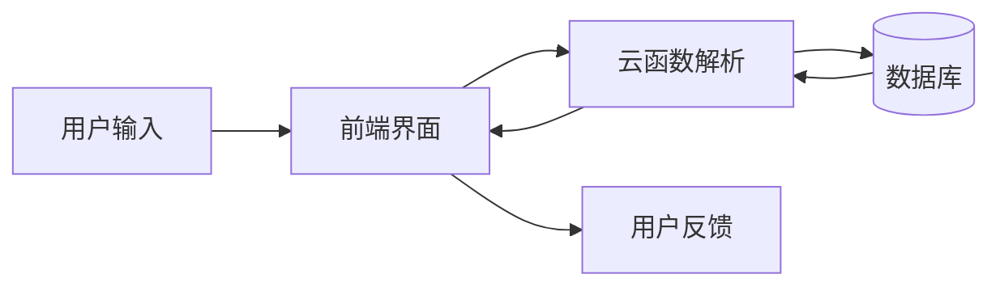

**Diagram sources**
- [SMART_IMPORT_PLAN.md](file://docs/SMART_IMPORT_PLAN.md#L44-L62)

### 组件依赖关系

系统各组件间的依赖关系如下：

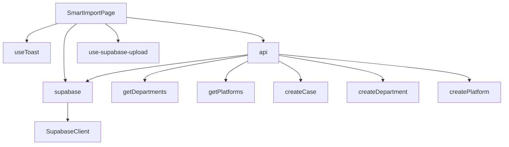

**Section sources**
- [SmartImportPage.tsx](file://src/pages/admin/SmartImportPage.tsx#L1-L15)
- [api.ts](file://src/db/api.ts#L1-L20)
- [supabase.ts](file://src/db/supabase.ts#L1-L8)