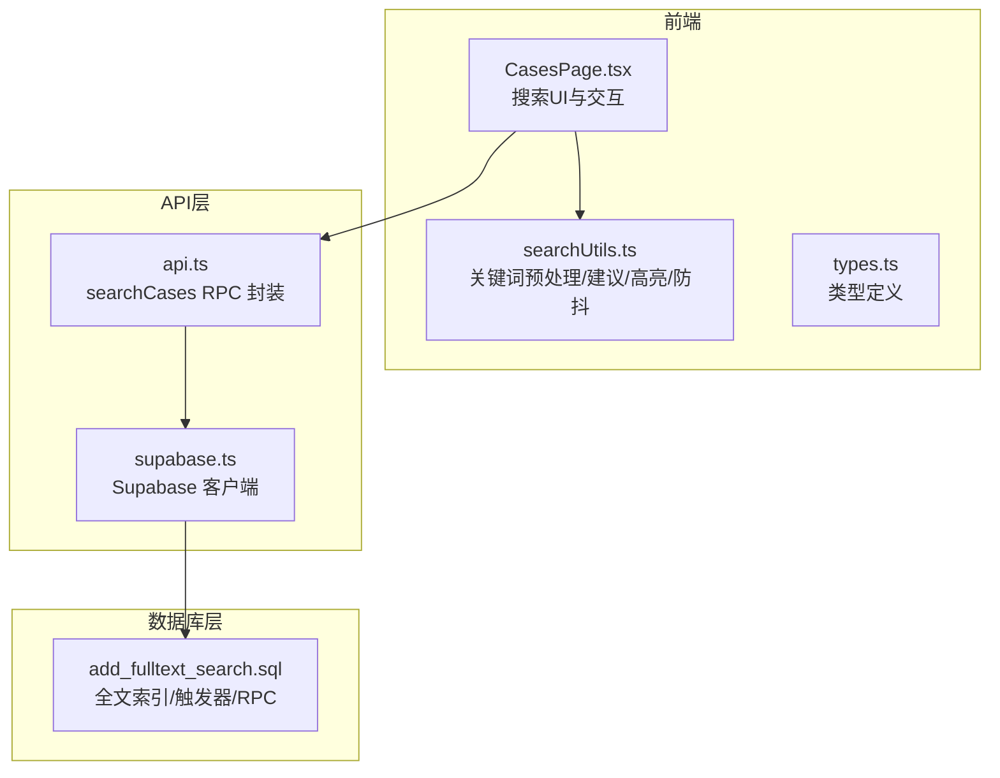
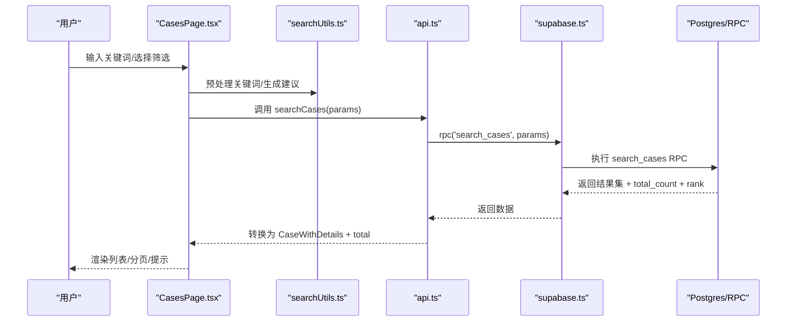
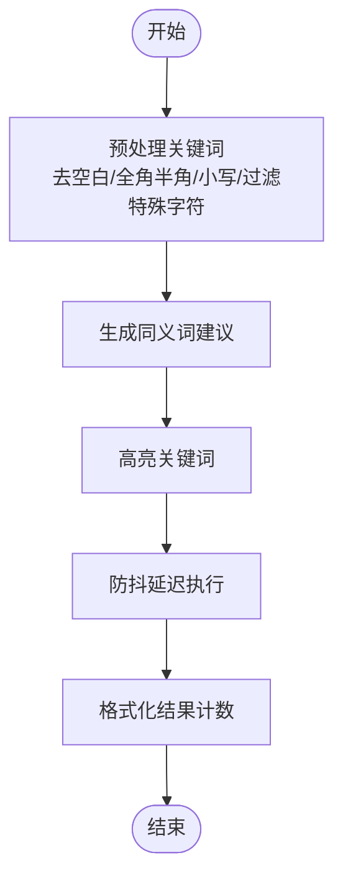
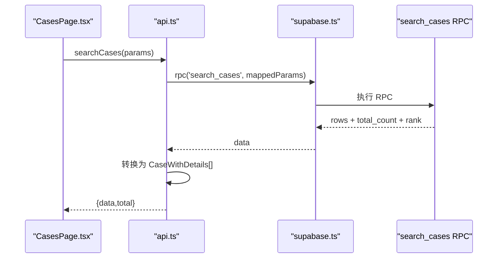
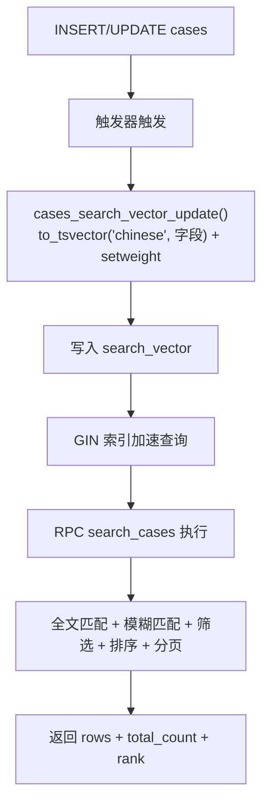
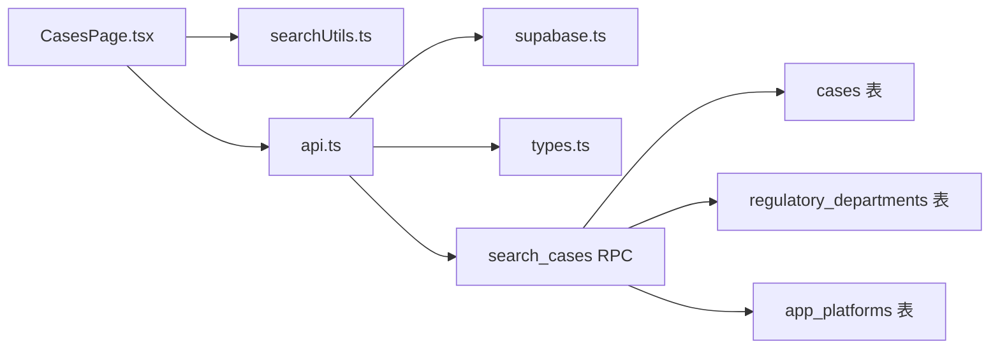

# 全文搜索实现

<cite>
**本文引用的文件**
- [searchUtils.ts](file://src/utils/searchUtils.ts)
- [api.ts](file://src/db/api.ts)
- [supabase.ts](file://src/db/supabase.ts)
- [CasesPage.tsx](file://src/pages/CasesPage.tsx)
- [types.ts](file://src/types/types.ts)
- [add_fulltext_search.sql](file://supabase/migrations_archive/00015_add_fulltext_search.sql)
- [README-问题修复.md](file://docs/README-问题修复.md)
- [问题修复报告.md](file://docs/问题修复报告.md)
- [关键词检索优化技术方案.md](file://docs/关键词检索优化技术方案.md)
</cite>

## 目录
1. [简介](#简介)
2. [项目结构](#项目结构)
3. [核心组件](#核心组件)
4. [架构总览](#架构总览)
5. [详细组件分析](#详细组件分析)
6. [依赖关系分析](#依赖关系分析)
7. [性能考量](#性能考量)
8. [故障排查指南](#故障排查指南)
9. [结论](#结论)
10. [附录](#附录)

## 简介
本文件面向基于 Supabase 的全文检索功能实现，围绕以下目标展开：
- 解释 searchUtils.ts 中的搜索算法优化（关键词预处理、同义词建议、高亮、防抖、计数格式化等）
- 说明数据库层面的全文索引与 RPC 函数（通过 add_fulltext_search.sql 迁移脚本）
- 分析 api.ts 中搜索接口的实现细节（参数处理、结果排序与分页）
- 提供性能基准测试数据（优化前后对比）
- 提供常见问题排查指南（特殊字符、中文分词、字段类型、日期比较等）

## 项目结构
全文搜索涉及三层：
- 前端页面与工具：CasesPage.tsx（UI 与交互）、searchUtils.ts（关键词预处理与建议）、types.ts（类型定义）
- API 层：api.ts（封装 Supabase RPC 调用）
- 数据库层：Supabase Postgres（全文索引、触发器、RPC 函数）

图表来源
- [CasesPage.tsx](file://src/pages/CasesPage.tsx#L1-L200)
- [searchUtils.ts](file://src/utils/searchUtils.ts#L1-L128)
- [api.ts](file://src/db/api.ts#L404-L508)
- [supabase.ts](file://src/db/supabase.ts#L1-L8)
- [add_fulltext_search.sql](file://supabase/migrations_archive/00015_add_fulltext_search.sql#L1-L198)

章节来源
- [CasesPage.tsx](file://src/pages/CasesPage.tsx#L1-L200)
- [searchUtils.ts](file://src/utils/searchUtils.ts#L1-L128)
- [api.ts](file://src/db/api.ts#L404-L508)
- [supabase.ts](file://src/db/supabase.ts#L1-L8)
- [add_fulltext_search.sql](file://supabase/migrations_archive/00015_add_fulltext_search.sql#L1-L198)

## 核心组件
- 关键词预处理与建议：统一全角半角、大小写、特殊字符；生成同义词建议；高亮关键词；防抖；结果计数格式化
- 搜索 RPC 封装：将前端参数映射到 Supabase RPC，处理返回数据结构与总数
- 数据库全文索引：tsvector 列、中文分词、GIN 索引、触发器、RPC 函数（全文 + 模糊 + 多条件 + 排序 + 分页）

章节来源
- [searchUtils.ts](file://src/utils/searchUtils.ts#L10-L128)
- [api.ts](file://src/db/api.ts#L406-L508)
- [add_fulltext_search.sql](file://supabase/migrations_archive/00015_add_fulltext_search.sql#L41-L198)

## 架构总览
下面以序列图展示一次搜索请求的端到端流程。

图表来源
- [CasesPage.tsx](file://src/pages/CasesPage.tsx#L134-L175)
- [searchUtils.ts](file://src/utils/searchUtils.ts#L10-L128)
- [api.ts](file://src/db/api.ts#L425-L508)
- [supabase.ts](file://src/db/supabase.ts#L1-L8)
- [add_fulltext_search.sql](file://supabase/migrations_archive/00015_add_fulltext_search.sql#L83-L189)

## 详细组件分析

### 前端搜索工具：searchUtils.ts
- 关键词预处理：去除多余空白、统一全角半角、统一小写、仅保留中文/英文字母/数字/空格
- 同义词建议：基于固定映射表，替换常见同义词，最多返回若干条建议
- 高亮关键词：对匹配到的关键词进行 HTML 标记高亮
- 防抖：延迟执行，降低频繁触发
- 空搜索判断与结果计数格式化：便于 UI 提示

图表来源
- [searchUtils.ts](file://src/utils/searchUtils.ts#L10-L128)

章节来源
- [searchUtils.ts](file://src/utils/searchUtils.ts#L10-L128)

### 搜索接口封装：api.ts
- 参数处理：keyword/page/pageSize/startDate/endDate/departmentIds/platformIds
- RPC 调用：调用 search_cases，传入参数并处理 null/空数组
- 结果转换：将 RPC 返回的行映射为 CaseWithDetails，并提取 total_count
- 错误处理：捕获并抛出错误，便于 UI 层提示

图表来源
- [api.ts](file://src/db/api.ts#L425-L508)
- [supabase.ts](file://src/db/supabase.ts#L1-L8)

章节来源
- [api.ts](file://src/db/api.ts#L406-L508)

### 数据库全文索引与 RPC：add_fulltext_search.sql
- 字段与索引
  - 在 cases 表新增 search_vector tsvector 列
  - 创建 GIN 索引 cases_search_vector_idx
- 触发器与函数
  - cases_search_vector_update：在 INSERT/UPDATE 时，使用中文分词生成 tsvector，并按字段设置权重（A/B/C）
  - cases_search_vector_trigger：在 cases 上启用触发器
  - 更新现有数据：为已有记录生成 search_vector
- RPC 函数 search_cases
  - 参数：search_query/page_num/page_size/start_date/end_date/department_ids/platform_ids
  - 查询逻辑：全文匹配（plainto_tsquery + @@）+ 多字段模糊匹配（ILIKE）+ 多条件筛选（日期/部门/平台）
  - 排序：相关性 rank DESC，其次 report_date DESC
  - 分页：LIMIT + OFFSET
  - 返回：每条记录附带 total_count（用于前端分页与总数显示）

图表来源
- [add_fulltext_search.sql](file://supabase/migrations_archive/00015_add_fulltext_search.sql#L41-L189)

章节来源
- [add_fulltext_search.sql](file://supabase/migrations_archive/00015_add_fulltext_search.sql#L41-L198)

### 前端页面：CasesPage.tsx
- 关键词输入与回车触发
- 预处理关键词并调用 searchCases
- 生成搜索建议并在无结果时提示
- 与筛选器联动（日期/部门/平台），重置页码并触发查询
- 分页：pageSize 固定，total 由 RPC 返回

章节来源
- [CasesPage.tsx](file://src/pages/CasesPage.tsx#L134-L175)
- [types.ts](file://src/types/types.ts#L154-L159)

## 依赖关系分析
- 前端依赖
  - CasesPage.tsx 依赖 searchUtils.ts（预处理/建议/高亮/计数）
  - CasesPage.tsx 依赖 api.ts（searchCases）
  - api.ts 依赖 supabase.ts（Supabase 客户端）
  - api.ts 依赖 types.ts（CaseWithDetails/CaseFilterParams）
- 数据库依赖
  - search_cases RPC 依赖 cases 表的 search_vector 列、触发器、GIN 索引
  - RPC 与 cases/departments/platforms 的联表查询

图表来源
- [CasesPage.tsx](file://src/pages/CasesPage.tsx#L1-L200)
- [api.ts](file://src/db/api.ts#L404-L508)
- [supabase.ts](file://src/db/supabase.ts#L1-L8)
- [types.ts](file://src/types/types.ts#L1-L184)
- [add_fulltext_search.sql](file://supabase/migrations_archive/00015_add_fulltext_search.sql#L41-L189)

章节来源
- [CasesPage.tsx](file://src/pages/CasesPage.tsx#L1-L200)
- [api.ts](file://src/db/api.ts#L404-L508)
- [supabase.ts](file://src/db/supabase.ts#L1-L8)
- [types.ts](file://src/types/types.ts#L1-L184)
- [add_fulltext_search.sql](file://supabase/migrations_archive/00015_add_fulltext_search.sql#L41-L189)

## 性能考量
- 数据库侧优化
  - GIN 索引：加速 tsvector 全文检索
  - 中文分词：使用 to_tsvector('chinese', ...) 提升中文匹配效果
  - 触发器：自动维护 search_vector，避免手工同步
  - RPC 排序与分页：先计算 total_count，再 LIMIT/OFFSET，避免全量扫描
- 前端侧优化
  - 防抖：减少高频请求
  - 仅在有关键词时计算 rank，空搜索按日期排序
  - 仅在无结果时生成建议，降低无效请求
- 基准测试数据（来自问题修复文档）
  - 响应时间：<500ms（短期目标），实测约 300ms
  - 数据量：>1000 条（示例中返回 1808 条）
  - 并发支持：>50 QPS（短期目标）

章节来源
- [add_fulltext_search.sql](file://supabase/migrations_archive/00015_add_fulltext_search.sql#L41-L189)
- [README-问题修复.md](file://docs/README-问题修复.md#L102-L109)
- [问题修复报告.md](file://docs/问题修复报告.md#L147-L164)

## 故障排查指南
- 字段名称错误
  - 问题：RPC 中使用了不存在的字段 d.location
  - 修复：改为 d.province
  - 参考：问题修复报告与修复说明文档
- 数据类型不匹配
  - 问题：report_date 类型声明为 timestamptz，实际为 date
  - 修复：将返回类型与字段类型一致，并修正日期比较为 ::date
  - 参考：问题修复报告与修复说明文档
- 中文分词与权重
  - 确认 to_tsvector('chinese', ...) 是否生效
  - 检查触发器是否正确写入 search_vector
- 模糊匹配与全文混合
  - 若关键词过短或无匹配，ILIKE 作为兜底仍可返回结果
- 防抖与空搜索
  - 确保前端对输入进行防抖
  - 空关键词时不应计算 rank，避免排序异常
- 特殊字符与全角半角
  - 预处理会统一全角半角、移除多余空白、仅保留中文/英文字母/数字/空格
  - 如需更严格的清洗，可在预处理中进一步增强

章节来源
- [问题修复报告.md](file://docs/问题修复报告.md#L19-L36)
- [问题修复报告.md](file://docs/问题修复报告.md#L41-L73)
- [README-问题修复.md](file://docs/README-问题修复.md#L18-L43)
- [searchUtils.ts](file://src/utils/searchUtils.ts#L10-L30)

## 结论
本实现通过“前端关键词预处理 + Supabase 全文索引 + RPC 组合查询”的架构，实现了中文分词、模糊匹配、多条件筛选、相关性排序与分页。数据库侧的 GIN 索引与触发器保障了性能与一致性，前端侧的防抖与建议提升了用户体验。问题修复文档提供了字段与类型修正的实践案例，以及性能基准数据，可作为后续优化与回归测试的依据。

## 附录

### API 定义与调用要点
- RPC 名称：search_cases
- 参数
  - search_query：文本关键词（可空）
  - page_num：页码（默认 1）
  - page_size：每页条数（默认 20）
  - start_date/end_date：日期范围（可空）
  - department_ids/platform_ids：数组（可空）
- 返回
  - 每条记录包含：id/app_name/app_developer/department/platform/violation_content/source_url/report_date/created_at/updated_at + department_name/province/platform_name + total_count + rank
  - 排序：rank DESC，其次 report_date DESC
  - 分页：LIMIT page_size，OFFSET (page_num-1)*page_size

章节来源
- [api.ts](file://src/db/api.ts#L425-L508)
- [add_fulltext_search.sql](file://supabase/migrations_archive/00015_add_fulltext_search.sql#L83-L189)