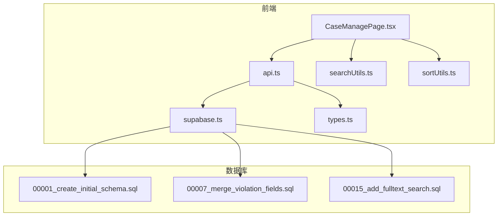
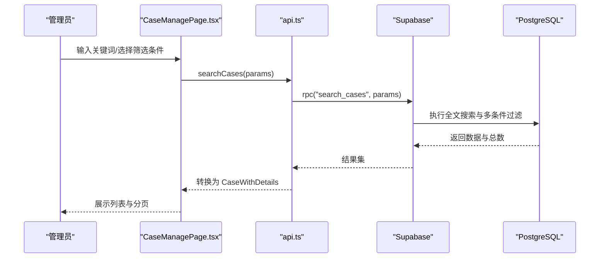
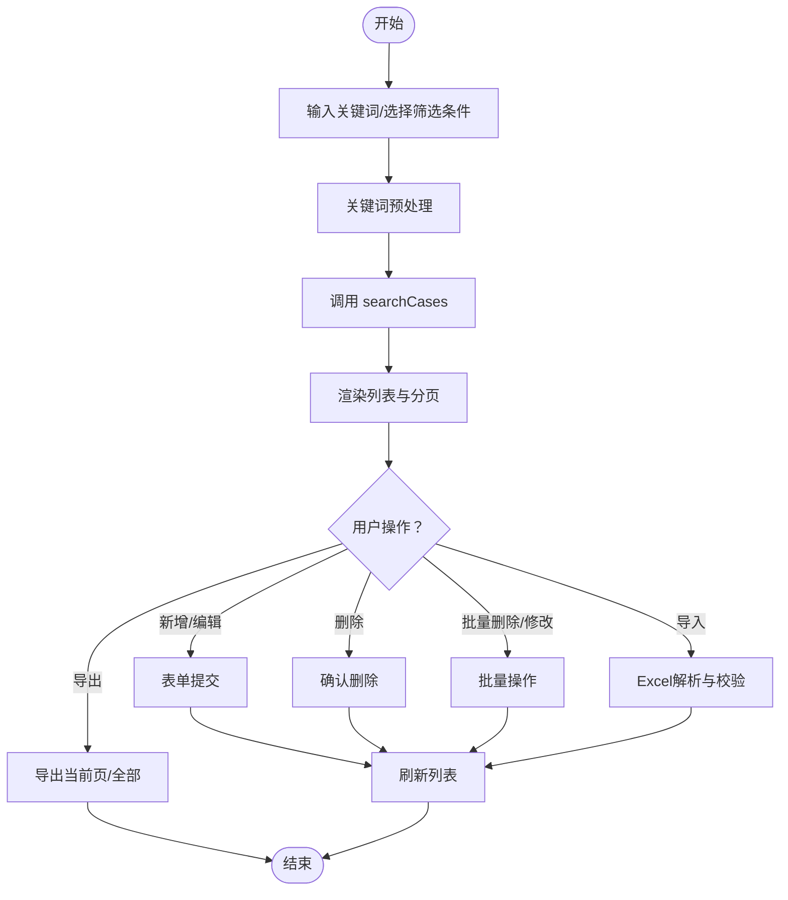
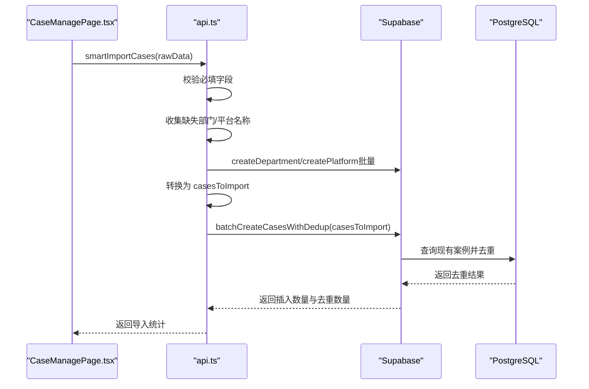
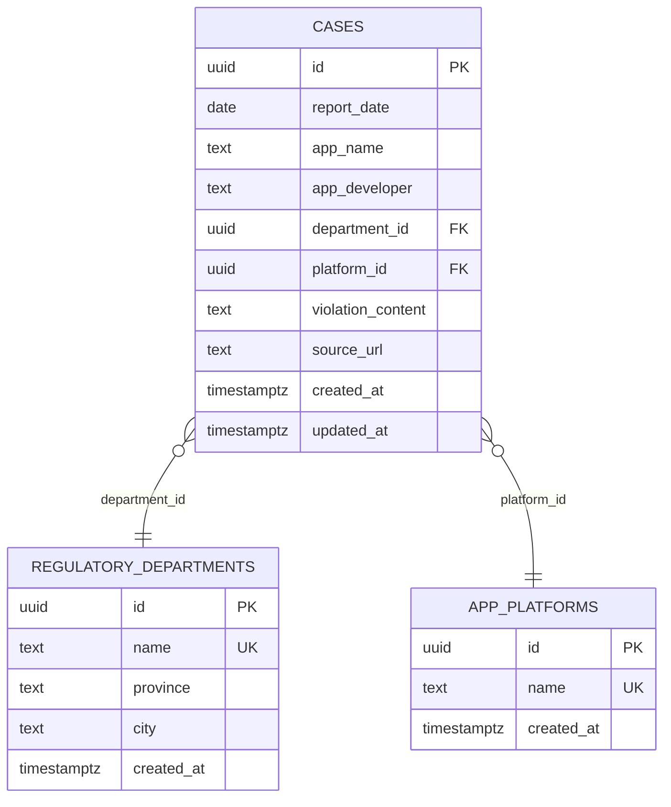
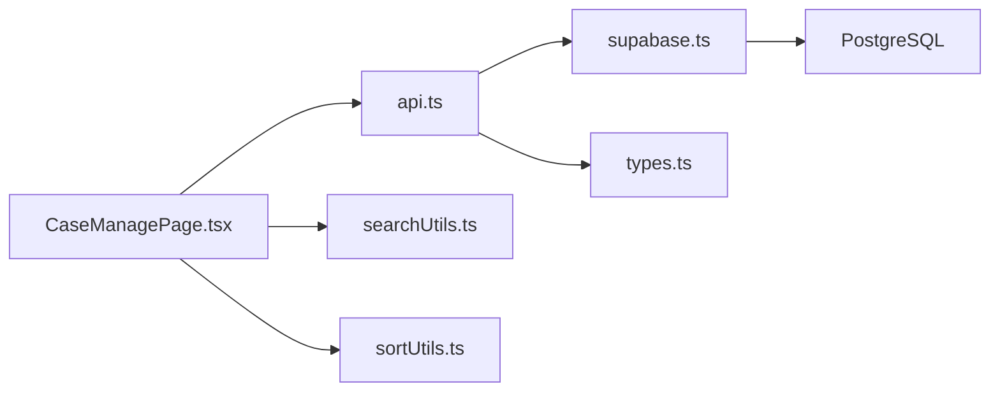

# 后台案例管理

<cite>
**本文引用的文件**
- [CaseManagePage.tsx](file://src/pages/admin/CaseManagePage.tsx)
- [api.ts](file://src/db/api.ts)
- [supabase.ts](file://src/db/supabase.ts)
- [types.ts](file://src/types/types.ts)
- [searchUtils.ts](file://src/utils/searchUtils.ts)
- [sortUtils.ts](file://src/utils/sortUtils.ts)
- [00001_create_initial_schema.sql](file://supabase/migrations/00001_create_initial_schema.sql)
- [00007_merge_violation_fields.sql](file://supabase/migrations/00007_merge_violation_fields.sql)
- [00015_add_fulltext_search.sql](file://supabase/migrations_archive/00015_add_fulltext_search.sql)
- [README-问题修复.md](file://docs/README-问题修复.md)
- [修复验证清单.md](file://docs/修复验证清单.md)
</cite>

## 目录
1. [简介](#简介)
2. [项目结构](#项目结构)
3. [核心组件](#核心组件)
4. [架构总览](#架构总览)
5. [详细组件分析](#详细组件分析)
6. [依赖关系分析](#依赖关系分析)
7. [性能考量](#性能考量)
8. [故障排查指南](#故障排查指南)
9. [结论](#结论)
10. [附录](#附录)

## 简介
本文件面向后台案例管理功能，围绕 CaseManagePage.tsx 的管理能力展开，重点说明管理员对案例数据的增删改查、批量导入、状态修改、数据校验等高级能力，并解释与 Supabase 数据库的交互逻辑（通过 api.ts 进行数据操作与权限控制）。同时覆盖筛选与检索优化、数据一致性保障机制（事务与错误回滚策略），并提供关键操作的实现路径指引与可视化流程图。

## 项目结构
后台案例管理位于前端 admin 页面目录，核心由以下模块组成：
- 页面层：CaseManagePage.tsx 负责管理界面、筛选、导入导出、批量操作与 CRUD。
- 数据访问层：api.ts 封装与 Supabase 的交互，提供搜索、CRUD、批量操作、智能导入等方法。
- 数据模型：types.ts 定义案例、部门、平台、导入数据等类型。
- 工具函数：searchUtils.ts 提供关键词预处理、搜索建议、防抖等；sortUtils.ts 提供部门排序。
- 数据库层：supabase.ts 提供 Supabase 客户端；迁移文件定义表结构、RLS 策略与搜索 RPC。

**图表来源**
- [CaseManagePage.tsx](file://src/pages/admin/CaseManagePage.tsx#L1-L120)
- [api.ts](file://src/db/api.ts#L1-L120)
- [supabase.ts](file://src/db/supabase.ts#L1-L8)
- [types.ts](file://src/types/types.ts#L1-L120)
- [searchUtils.ts](file://src/utils/searchUtils.ts#L1-L60)
- [sortUtils.ts](file://src/utils/sortUtils.ts#L1-L18)
- [00001_create_initial_schema.sql](file://supabase/migrations/00001_create_initial_schema.sql#L1-L120)
- [00007_merge_violation_fields.sql](file://supabase/migrations/00007_merge_violation_fields.sql#L1-L41)
- [00015_add_fulltext_search.sql](file://supabase/migrations_archive/00015_add_fulltext_search.sql#L1-L47)

**章节来源**
- [CaseManagePage.tsx](file://src/pages/admin/CaseManagePage.tsx#L1-L120)
- [api.ts](file://src/db/api.ts#L1-L120)
- [supabase.ts](file://src/db/supabase.ts#L1-L8)
- [types.ts](file://src/types/types.ts#L1-L120)
- [searchUtils.ts](file://src/utils/searchUtils.ts#L1-L60)
- [sortUtils.ts](file://src/utils/sortUtils.ts#L1-L18)
- [00001_create_initial_schema.sql](file://supabase/migrations/00001_create_initial_schema.sql#L1-L120)
- [00007_merge_violation_fields.sql](file://supabase/migrations/00007_merge_violation_fields.sql#L1-L41)
- [00015_add_fulltext_search.sql](file://supabase/migrations_archive/00015_add_fulltext_search.sql#L1-L47)

## 核心组件
- 管理界面（CaseManagePage.tsx）
  - 关键词搜索与建议、日期范围筛选、部门/平台筛选联动。
  - 新增/编辑/删除单条案例，批量删除与批量修改。
  - Excel 导入（含数据校验、去重、智能创建部门/平台）、导出当前页与全部数据。
  - 分页与加载状态提示。
- 数据访问层（api.ts）
  - 搜索案例（searchCases）：封装 RPC 调用，支持关键词、日期、部门、平台多条件组合。
  - CRUD 与批量操作：createCase、updateCase、deleteCase、batchDeleteCases、batchUpdateCases。
  - 智能导入：smartImportCases，自动创建缺失的部门/平台并去重导入。
  - 基础数据：getCasesDateBounds、getDepartments、getPlatforms。
- 数据模型（types.ts）
  - Case、RegulatoryDepartment、AppPlatform、CaseWithDetails、CaseFilterParams 等类型。
- 工具函数（searchUtils.ts、sortUtils.ts）
  - 关键词预处理、搜索建议、格式化结果数量；部门排序。
- 数据库层（supabase.ts、迁移文件）
  - Supabase 客户端初始化；RLS 策略；cases 表索引；search_cases RPC 与全文搜索向量。

**章节来源**
- [CaseManagePage.tsx](file://src/pages/admin/CaseManagePage.tsx#L120-L260)
- [api.ts](file://src/db/api.ts#L405-L508)
- [types.ts](file://src/types/types.ts#L1-L120)
- [searchUtils.ts](file://src/utils/searchUtils.ts#L1-L128)
- [sortUtils.ts](file://src/utils/sortUtils.ts#L1-L18)
- [supabase.ts](file://src/db/supabase.ts#L1-L8)

## 架构总览
后台案例管理采用“页面层-数据访问层-数据库层”三层架构：
- 页面层负责用户交互与状态管理。
- 数据访问层通过 Supabase 客户端调用 RPC 或直接查询，封装业务操作。
- 数据库层通过 RLS 策略限制访问，通过 RPC 与全文搜索向量提升检索性能。

**图表来源**
- [CaseManagePage.tsx](file://src/pages/admin/CaseManagePage.tsx#L139-L180)
- [api.ts](file://src/db/api.ts#L421-L508)
- [00015_add_fulltext_search.sql](file://supabase/migrations_archive/00015_add_fulltext_search.sql#L1-L47)

**章节来源**
- [CaseManagePage.tsx](file://src/pages/admin/CaseManagePage.tsx#L139-L180)
- [api.ts](file://src/db/api.ts#L421-L508)

## 详细组件分析

### 管理界面（CaseManagePage.tsx）
- 关键词搜索与建议
  - 预处理关键词（去除全角、多余空格、大小写归一、保留中文/英文字母/数字/空格）。
  - 生成同义词建议，提升召回率。
  - Enter 键触发搜索，空结果时给出建议提示。
- 筛选与日期边界
  - 日期范围选择器绑定最小/最大可选日期（来自 getCasesDateBounds）。
  - 部门与平台下拉框，支持“全部部门/全部平台”。
- CRUD 与批量操作
  - 新增/编辑：必填字段校验（通报日期、应用名称）。
  - 删除：单条确认删除。
  - 批量删除/批量修改：勾选后弹窗确认，构建更新数据对象（仅非空字段）。
- 导入与导出
  - 导入：Excel 解析、字段校验（日期格式、应用名称必填）、去重、智能创建部门/平台、返回导入统计。
  - 导出：当前页导出；全部数据导出（分批获取，避免内存压力）。
- 分页与加载状态
  - 每页固定 20 条；上一页/下一页按钮禁用状态与加载提示。

**图表来源**
- [CaseManagePage.tsx](file://src/pages/admin/CaseManagePage.tsx#L139-L260)
- [searchUtils.ts](file://src/utils/searchUtils.ts#L1-L73)

**章节来源**
- [CaseManagePage.tsx](file://src/pages/admin/CaseManagePage.tsx#L139-L260)
- [searchUtils.ts](file://src/utils/searchUtils.ts#L1-L73)

### 数据访问层（api.ts）
- 搜索案例（searchCases）
  - 参数：keyword、page、pageSize、startDate、endDate、departmentIds、platformIds。
  - 调用 RPC：search_cases，返回 CaseWithDetails 与 total。
- CRUD 与批量
  - createCase/updateCase/deleteCase：标准增删改。
  - batchDeleteCases：批量删除。
  - batchUpdateCases：逐条更新并聚合错误。
- 智能导入（smartImportCases）
  - 校验必填字段；收集缺失的部门/平台名称；批量创建；转换为 casesToImport；调用 batchCreateCasesWithDedup 去重并返回统计。
- 基础数据
  - getCasesDateBounds：获取最早/最晚通报日期，用于日期选择器边界。
  - getDepartments/getPlatforms：用于筛选下拉框与排序。

**图表来源**
- [api.ts](file://src/db/api.ts#L727-L851)
- [api.ts](file://src/db/api.ts#L666-L725)

**章节来源**
- [api.ts](file://src/db/api.ts#L405-L508)
- [api.ts](file://src/db/api.ts#L666-L725)
- [api.ts](file://src/db/api.ts#L727-L851)

### 数据模型（types.ts）
- Case：案例主表字段（通报日期、应用名称、开发者、部门/平台外键、违规内容、原文链接、时间戳）。
- CaseWithDetails：扩展包含部门与平台对象。
- CaseFilterParams：筛选参数（起止日期、部门ID列表、平台ID列表）。
- CaseImportData：导入数据结构（含部门/平台名称）。

**章节来源**
- [types.ts](file://src/types/types.ts#L1-L120)
- [types.ts](file://src/types/types.ts#L133-L160)

### 数据库层（supabase.ts、迁移文件）
- Supabase 客户端初始化：从环境变量读取 URL 与匿名密钥。
- RLS 策略：cases 表对 authenticated 用户开放读取，管理员拥有全部权限。
- 索引：cases 表对 report_date、department_id、platform_id 建立索引。
- search_cases RPC：全文搜索 + 多条件过滤 + 分页 + 相关性排序。
- 违规字段合并：将 violation_summary 与 violation_detail 合并为 violation_content。

**图表来源**
- [00001_create_initial_schema.sql](file://supabase/migrations/00001_create_initial_schema.sql#L1-L150)
- [00007_merge_violation_fields.sql](file://supabase/migrations/00007_merge_violation_fields.sql#L1-L41)

**章节来源**
- [supabase.ts](file://src/db/supabase.ts#L1-L8)
- [00001_create_initial_schema.sql](file://supabase/migrations/00001_create_initial_schema.sql#L1-L150)
- [00007_merge_violation_fields.sql](file://supabase/migrations/00007_merge_violation_fields.sql#L1-L41)

## 依赖关系分析
- 页面层依赖数据访问层与工具函数；数据访问层依赖 Supabase 客户端与数据库层。
- types.ts 作为跨层数据契约，确保前后端一致的数据结构。
- RLS 策略保证管理员具备写权限，普通用户仅可读取。

**图表来源**
- [CaseManagePage.tsx](file://src/pages/admin/CaseManagePage.tsx#L1-L120)
- [api.ts](file://src/db/api.ts#L1-L120)
- [supabase.ts](file://src/db/supabase.ts#L1-L8)
- [types.ts](file://src/types/types.ts#L1-L120)
- [searchUtils.ts](file://src/utils/searchUtils.ts#L1-L60)
- [sortUtils.ts](file://src/utils/sortUtils.ts#L1-L18)

**章节来源**
- [CaseManagePage.tsx](file://src/pages/admin/CaseManagePage.tsx#L1-L120)
- [api.ts](file://src/db/api.ts#L1-L120)
- [supabase.ts](file://src/db/supabase.ts#L1-L8)
- [types.ts](file://src/types/types.ts#L1-L120)

## 性能考量
- 搜索性能
  - 使用 search_cases RPC 与全文搜索向量（GIN 索引），支持中文分词与模糊匹配，提升召回与相关性排序。
  - 修复历史问题：字段名与类型不匹配导致的错误，确保 RPC 返回字段类型正确。
- 分页与导出
  - searchCases 支持分页；导出全部数据采用分批获取（每批 1000 条），避免内存峰值。
- 防抖与输入优化
  - 关键词预处理与搜索建议减少无效请求，提升用户体验。
- 数据库索引
  - cases 表对 report_date、department_id、platform_id 建立索引，配合 RPC 查询提升性能。

**章节来源**
- [README-问题修复.md](file://docs/README-问题修复.md#L1-L134)
- [修复验证清单.md](file://docs/修复验证清单.md#L1-L65)
- [00015_add_fulltext_search.sql](file://supabase/migrations_archive/00015_add_fulltext_search.sql#L1-L47)
- [CaseManagePage.tsx](file://src/pages/admin/CaseManagePage.tsx#L499-L574)

## 故障排查指南
- 案例查询失败
  - 现象：提示“加载案例失败”。
  - 原因：RPC 函数字段名与类型不匹配（d.location vs d.province；report_date 类型）。
  - 处理：修正 RPC 函数字段名与类型，重新部署迁移；前端对应修改数据转换逻辑。
- 导入失败
  - 现象：导入报错或跳过数据。
  - 原因：Excel 字段校验失败（日期格式、应用名称必填）。
  - 处理：根据提示修正 Excel 数据；必要时使用智能导入自动创建缺失的部门/平台。
- 权限问题
  - 现象：无法新增/编辑/删除案例。
  - 原因：用户角色非管理员。
  - 处理：确认用户角色为管理员，RLS 策略允许管理员对 cases 表进行全部操作。

**章节来源**
- [README-问题修复.md](file://docs/README-问题修复.md#L1-L134)
- [修复验证清单.md](file://docs/修复验证清单.md#L1-L65)
- [CaseManagePage.tsx](file://src/pages/admin/CaseManagePage.tsx#L376-L477)
- [api.ts](file://src/db/api.ts#L599-L664)

## 结论
CaseManagePage.tsx 提供了完整的后台案例管理能力，结合 api.ts 的 RPC 调用与数据库层的全文搜索与索引优化，实现了高性能的关键词检索与多条件筛选。通过智能导入、批量操作与严格的前端校验，保障了数据质量与一致性。RLS 策略确保了权限控制与数据安全。建议持续关注 RPC 性能与前端防抖策略，以进一步优化用户体验与系统吞吐。

## 附录
- 关键实现路径示例（代码片段路径）
  - 搜索案例：[searchCases](file://src/db/api.ts#L421-L508)
  - 新增案例：[createCase](file://src/db/api.ts#L599-L608)
  - 更新案例：[updateCase](file://src/db/api.ts#L610-L617)
  - 删除案例：[deleteCase](file://src/db/api.ts#L619-L626)
  - 批量删除：[batchDeleteCases](file://src/db/api.ts#L639-L646)
  - 批量更新：[batchUpdateCases](file://src/db/api.ts#L648-L664)
  - 智能导入：[smartImportCases](file://src/db/api.ts#L727-L851)
  - 去重导入：[batchCreateCasesWithDedup](file://src/db/api.ts#L666-L725)
  - 获取日期边界：[getCasesDateBounds](file://src/db/api.ts#L556-L582)
  - Supabase 客户端：[supabase.ts](file://src/db/supabase.ts#L1-L8)
  - 案例类型定义：[types.ts](file://src/types/types.ts#L1-L120)
  - 关键词预处理：[preprocessKeyword](file://src/utils/searchUtils.ts#L10-L30)
  - 搜索建议：[generateSearchSuggestions](file://src/utils/searchUtils.ts#L36-L73)
  - 部门排序：[sortDepartments](file://src/utils/sortUtils.ts#L1-L18)
  - RLS 策略与索引：[00001_create_initial_schema.sql](file://supabase/migrations/00001_create_initial_schema.sql#L1-L150)
  - 违规字段合并：[00007_merge_violation_fields.sql](file://supabase/migrations/00007_merge_violation_fields.sql#L1-L41)
  - 全文搜索与 RPC：[00015_add_fulltext_search.sql](file://supabase/migrations_archive/00015_add_fulltext_search.sql#L1-L47)