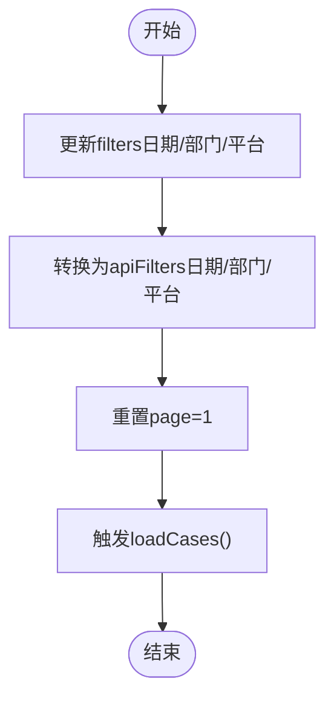

# 案例查询功能

<cite>
**本文引用的文件**
- [CasesPage.tsx](file://src/pages/CasesPage.tsx)
- [api.ts](file://src/db/api.ts)
- [supabase.ts](file://src/db/supabase.ts)
- [searchUtils.ts](file://src/utils/searchUtils.ts)
- [use-debounce.ts](file://src/hooks/use-debounce.ts)
- [types.ts](file://src/types/types.ts)
- [00015_add_fulltext_search.sql](file://supabase/migrations_archive/00015_add_fulltext_search.sql)
</cite>

## 目录
1. [简介](#简介)
2. [项目结构](#项目结构)
3. [核心组件](#核心组件)
4. [架构总览](#架构总览)
5. [详细组件分析](#详细组件分析)
6. [依赖关系分析](#依赖关系分析)
7. [性能考虑](#性能考虑)
8. [故障排查指南](#故障排查指南)
9. [结论](#结论)

## 简介
本文件围绕案例查询页面（CasesPage.tsx）的多条件筛选与全文搜索能力进行深入解析，重点覆盖以下方面：
- 时间范围、监管部门、发布平台、违规类型等筛选条件的实现与状态管理
- 筛选应用与清空流程（handleApplyFilters/handleClearFilters）
- 全文搜索的关键词匹配机制，特别是基于Supabase的全文检索实现
- 筛选状态检测（hasActiveFilters）的判断逻辑
- 筛选面板UI优化（常驻显示）的改进思路
- 性能优化建议（防抖搜索、索引优化）

## 项目结构
案例查询功能涉及前端页面、数据库访问层、Supabase客户端、工具函数与类型定义，整体结构如下：

图表来源
- [CasesPage.tsx](file://src/pages/CasesPage.tsx#L1-L537)
- [api.ts](file://src/db/api.ts#L406-L508)
- [supabase.ts](file://src/db/supabase.ts#L1-L8)
- [searchUtils.ts](file://src/utils/searchUtils.ts#L1-L128)
- [use-debounce.ts](file://src/hooks/use-debounce.ts#L1-L16)
- [types.ts](file://src/types/types.ts#L153-L160)
- [00015_add_fulltext_search.sql](file://supabase/migrations_archive/00015_add_fulltext_search.sql#L80-L198)

章节来源
- [CasesPage.tsx](file://src/pages/CasesPage.tsx#L1-L537)
- [api.ts](file://src/db/api.ts#L406-L508)
- [supabase.ts](file://src/db/supabase.ts#L1-L8)
- [searchUtils.ts](file://src/utils/searchUtils.ts#L1-L128)
- [use-debounce.ts](file://src/hooks/use-debounce.ts#L1-L16)
- [types.ts](file://src/types/types.ts#L153-L160)
- [00015_add_fulltext_search.sql](file://supabase/migrations_archive/00015_add_fulltext_search.sql#L80-L198)

## 核心组件
- 案例查询页面（CasesPage.tsx）
  - 状态管理：keyword/searchKeyword、filters、apiFilters、分页page/pageSize、loading、total
  - 关键词搜索：输入框、回车触发、搜索建议、结果提示
  - 筛选面板：日期范围、监管部门、应用平台（均为常驻显示）
  - 列表渲染：桌面端表格与移动端卡片视图
  - 筛选状态检测：hasActiveFilters
- 数据访问层（api.ts）
  - searchCases(params)：封装Supabase RPC调用，组装分页与多条件参数
- Supabase客户端（supabase.ts）
  - 创建Supabase客户端实例
- 工具函数（searchUtils.ts）
  - 关键词预处理、搜索建议生成、防抖工具、空搜索判断、结果计数格式化
- 类型定义（types.ts）
  - CaseFilterParams、CaseWithDetails等

章节来源
- [CasesPage.tsx](file://src/pages/CasesPage.tsx#L46-L175)
- [api.ts](file://src/db/api.ts#L406-L508)
- [supabase.ts](file://src/db/supabase.ts#L1-L8)
- [searchUtils.ts](file://src/utils/searchUtils.ts#L1-L128)
- [types.ts](file://src/types/types.ts#L153-L160)

## 架构总览
案例查询的端到端流程如下：

图表来源
- [CasesPage.tsx](file://src/pages/CasesPage.tsx#L134-L175)
- [api.ts](file://src/db/api.ts#L425-L508)
- [searchUtils.ts](file://src/utils/searchUtils.ts#L10-L30)

## 详细组件分析

### 多条件筛选机制
- 状态设计
  - filters：当前筛选值（日期范围、监管部门、应用平台），用于UI交互与转换
  - apiFilters：传递给后端的参数对象（startDate/endDate/departmentIds/platformIds），由filters派生
  - tempFilters：本页面未使用临时状态；筛选应用通过直接更新filters并触发副作用计算apiFilters
- 筛选应用（handleApplyFilters）
  - 本页面未定义独立的handleApplyFilters函数；筛选应用通过监听filters变化自动转换为apiFilters，并重置page=1
  - 该策略简化了交互，避免额外按钮，提升易用性
- 筛选清空（handleClearFilters）
  - 本页面未定义独立的handleClearFilters函数；清空逻辑通过清空keyword与searchKeyword、重置filters、清空searchSuggestions、重置page=1实现
  - 该策略与UI上的“清空”按钮行为一致

图表来源
- [CasesPage.tsx](file://src/pages/CasesPage.tsx#L82-L101)

章节来源
- [CasesPage.tsx](file://src/pages/CasesPage.tsx#L63-L101)

### 关键词匹配与全文检索
- 关键词预处理
  - preprocessKeyword：统一全角半角、去除多余空格、小写化、仅保留中文/英文字母/数字/空格
- 全文检索实现
  - Supabase侧：search_cases RPC函数
    - 支持中文分词（chinese配置）、全文检索（plainto_tsquery）、模糊匹配（ILIKE）
    - 多条件筛选：日期范围、部门ID集合、平台ID集合
    - 相关性排序：rank字段（ts_rank），无关键词时按report_date降序
    - 索引加速：cases_search_vector_idx（GIN）
  - 前端侧：searchCases(params)封装RPC调用，传入keyword/page/pageSize/筛选参数
- 搜索建议
  - generateSearchSuggestions：基于常见同义词映射生成建议，最多5个
- 结果提示
  - formatSearchResultCount：根据数量格式化提示文案

图表来源
- [searchUtils.ts](file://src/utils/searchUtils.ts#L10-L30)
- [api.ts](file://src/db/api.ts#L425-L508)
- [00015_add_fulltext_search.sql](file://supabase/migrations_archive/00015_add_fulltext_search.sql#L80-L198)

章节来源
- [searchUtils.ts](file://src/utils/searchUtils.ts#L10-L73)
- [api.ts](file://src/db/api.ts#L425-L508)
- [00015_add_fulltext_search.sql](file://supabase/migrations_archive/00015_add_fulltext_search.sql#L80-L198)

### 筛选状态检测（hasActiveFilters）
- 判断逻辑：当存在关键词或任一筛选条件（日期范围起止、监管部门、应用平台）时，视为有活动筛选
- UI表现：在页面标题旁显示“（已筛选）”提示

图表来源
- [CasesPage.tsx](file://src/pages/CasesPage.tsx#L195-L204)

章节来源
- [CasesPage.tsx](file://src/pages/CasesPage.tsx#L195-L204)

### 筛选面板UI优化（常驻显示）
- 设计说明：筛选面板采用常驻显示，便于用户随时调整筛选条件，减少隐藏面板带来的操作成本
- 交互策略：筛选条件变更即刻生效，无需额外确认按钮，提升响应速度与易用性

章节来源
- [CasesPage.tsx](file://src/pages/CasesPage.tsx#L284-L345)

### 关键字搜索与建议
- 输入与提交：输入框支持回车触发搜索；清空按钮一键清除关键词与建议
- 建议生成：基于同义词映射生成候选关键词，点击可直接替换搜索词并触发查询

章节来源
- [CasesPage.tsx](file://src/pages/CasesPage.tsx#L221-L282)
- [searchUtils.ts](file://src/utils/searchUtils.ts#L36-L73)

## 依赖关系分析
- 组件耦合
  - CasesPage.tsx依赖api.ts提供的searchCases方法与类型定义
  - api.ts依赖supabase.ts创建的客户端实例
  - searchUtils.ts提供关键词预处理与搜索建议
  - use-debounce.ts提供通用防抖Hook（可用于扩展输入防抖）
- 外部依赖
  - Supabase RPC函数search_cases负责全文检索与多条件筛选
  - 数据库索引cases_search_vector_idx保障检索性能

图表来源
- [CasesPage.tsx](file://src/pages/CasesPage.tsx#L1-L537)
- [api.ts](file://src/db/api.ts#L406-L508)
- [supabase.ts](file://src/db/supabase.ts#L1-L8)
- [searchUtils.ts](file://src/utils/searchUtils.ts#L1-L128)
- [use-debounce.ts](file://src/hooks/use-debounce.ts#L1-L16)
- [00015_add_fulltext_search.sql](file://supabase/migrations_archive/00015_add_fulltext_search.sql#L80-L198)

章节来源
- [CasesPage.tsx](file://src/pages/CasesPage.tsx#L1-L537)
- [api.ts](file://src/db/api.ts#L406-L508)
- [supabase.ts](file://src/db/supabase.ts#L1-L8)
- [searchUtils.ts](file://src/utils/searchUtils.ts#L1-L128)
- [use-debounce.ts](file://src/hooks/use-debounce.ts#L1-L16)
- [00015_add_fulltext_search.sql](file://supabase/migrations_archive/00015_add_fulltext_search.sql#L80-L198)

## 性能考虑
- 防抖搜索
  - 当前CasesPage.tsx未对关键词输入做防抖；建议使用use-debounce或searchUtils.debounce对输入事件进行节流，降低频繁请求压力
  - 可在handleKeywordSearch前加入防抖逻辑，避免用户连续输入时的高频查询
- 索引优化
  - 已创建全文检索索引cases_search_vector_idx，有效提升全文检索性能
  - 建议在report_date、department_id、platform_id上建立复合索引，进一步优化日期范围与多条件组合查询
- 分页与缓存
  - 前端已实现分页（page/pageSize），建议在切换筛选条件时保留当前页码，避免不必要的重置
- RPC参数优化
  - 仅在必要时传递非空参数（如departmentIds/platformIds），避免无效过滤导致的扫描扩大

章节来源
- [CasesPage.tsx](file://src/pages/CasesPage.tsx#L134-L175)
- [searchUtils.ts](file://src/utils/searchUtils.ts#L88-L109)
- [00015_add_fulltext_search.sql](file://supabase/migrations_archive/00015_add_fulltext_search.sql#L40-L79)

## 故障排查指南
- “加载案例失败”
  - 可能原因：RPC函数字段名或类型不匹配（历史问题已修复）
  - 排查步骤：
    - 确认RPC函数存在且签名正确
    - 验证report_date字段类型为date，department_province字段存在
    - 检查Supabase客户端环境变量配置（VITE_SUPABASE_URL/VITE_SUPABASE_ANON_KEY）
- 关键词无结果
  - 检查preprocessKeyword是否将输入规范化（全角转半角、大小写、特殊字符清理）
  - 查看searchSuggestions是否生成建议，尝试建议中的关键词
- 筛选无效
  - 确认filters.apiFilters转换逻辑正确（日期格式、部门/平台ID集合）
  - 检查UI选择值是否为'all'（'all'会被忽略，不会作为筛选条件传入后端）

章节来源
- [api.ts](file://src/db/api.ts#L425-L508)
- [supabase.ts](file://src/db/supabase.ts#L1-L8)
- [searchUtils.ts](file://src/utils/searchUtils.ts#L10-L30)
- [CasesPage.tsx](file://src/pages/CasesPage.tsx#L82-L101)

## 结论
本案例查询功能通过“常驻筛选面板 + 即时筛选应用”的交互设计，结合Supabase的全文检索与多条件筛选，实现了高效、直观的案例检索体验。前端通过关键词预处理与搜索建议提升了可用性，后端通过RPC函数与索引保障了性能。为进一步优化，建议引入输入防抖、补充日期/ID复合索引，并在UI层面增强筛选状态可视化与清空快捷入口。