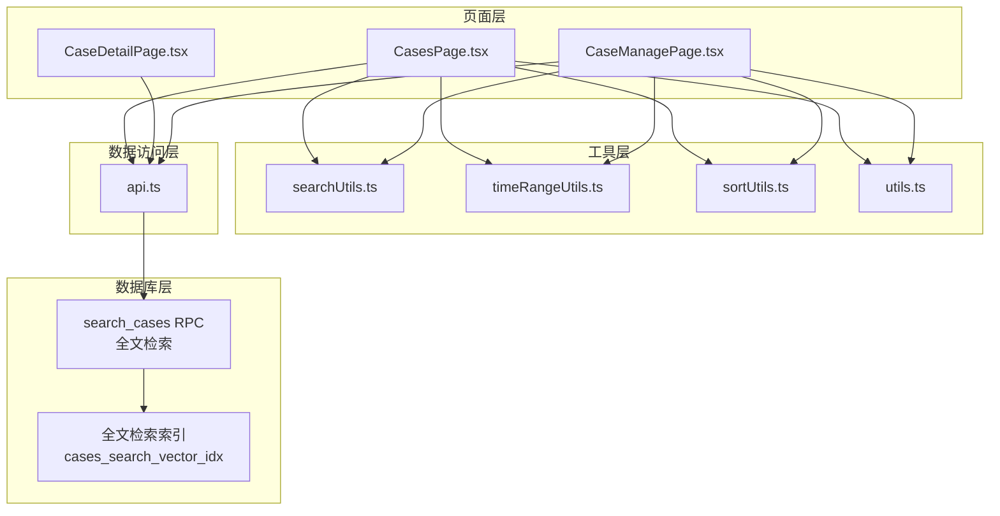
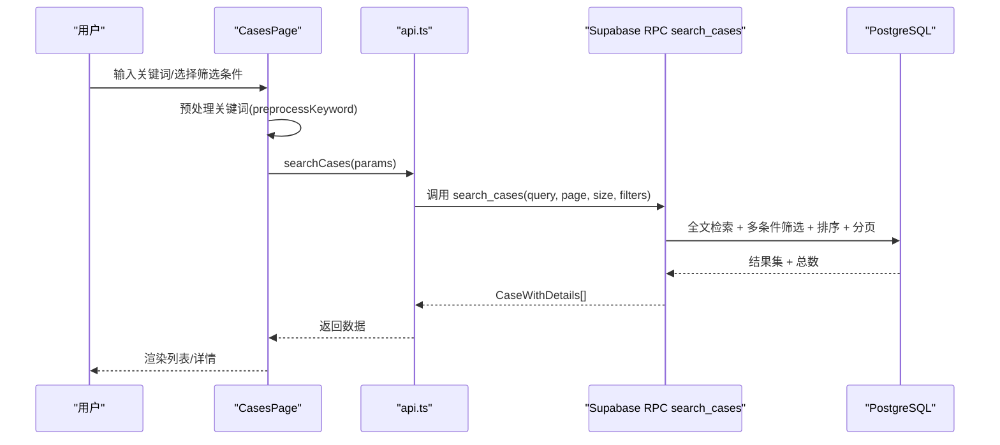
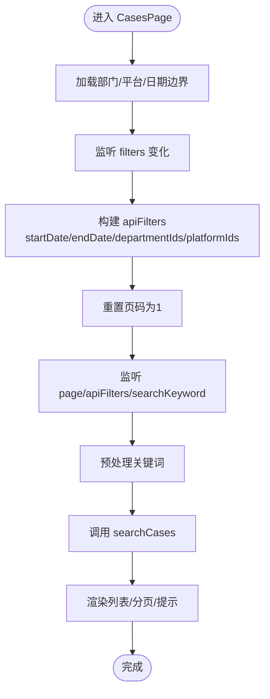
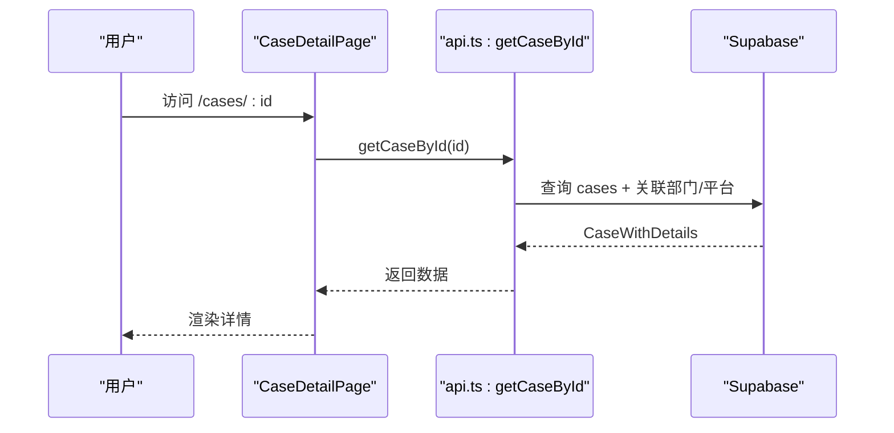
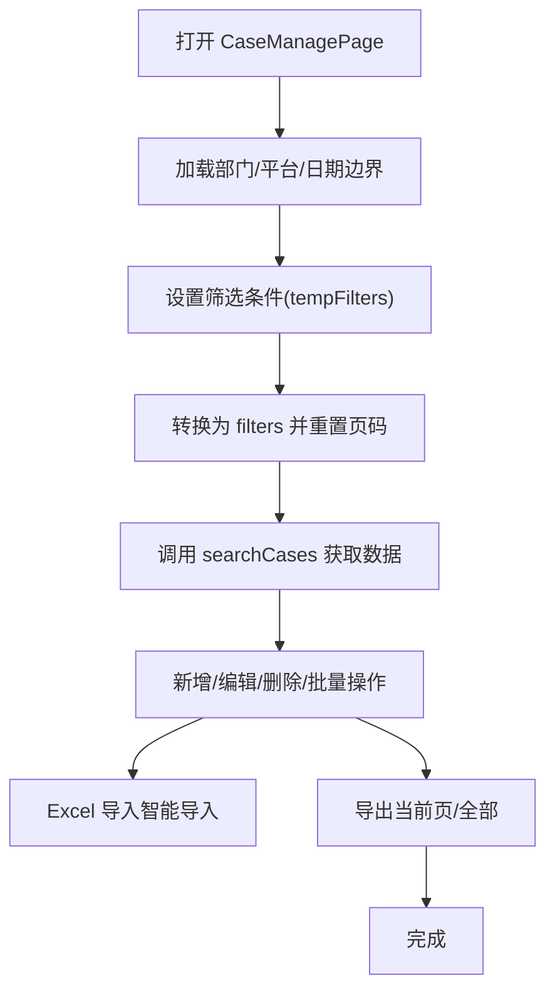
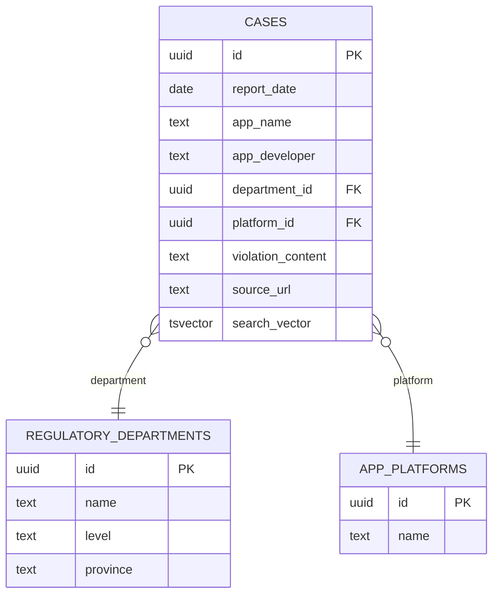
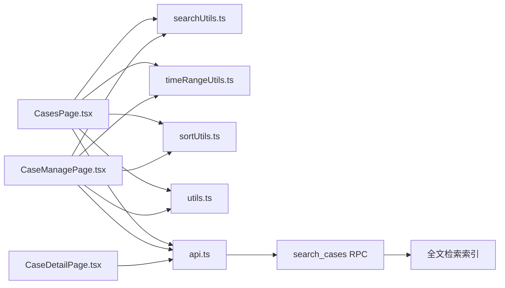

# 案例管理功能

<cite>
**本文引用的文件**
- [CasesPage.tsx](file://src/pages/CasesPage.tsx)
- [CaseDetailPage.tsx](file://src/pages/CaseDetailPage.tsx)
- [CaseManagePage.tsx](file://src/pages/admin/CaseManagePage.tsx)
- [api.ts](file://src/db/api.ts)
- [searchUtils.ts](file://src/utils/searchUtils.ts)
- [timeRangeUtils.ts](file://src/utils/timeRangeUtils.ts)
- [sortUtils.ts](file://src/utils/sortUtils.ts)
- [utils.ts](file://src/lib/utils.ts)
- [types.ts](file://src/types/types.ts)
- [00015_add_fulltext_search.sql](file://supabase/migrations_archive/00015_add_fulltext_search.sql)
- [00007_merge_violation_fields.sql](file://supabase/migrations/00007_merge_violation_fields.sql)
</cite>

## 目录
1. [简介](#简介)
2. [项目结构](#项目结构)
3. [核心组件](#核心组件)
4. [架构总览](#架构总览)
5. [详细组件分析](#详细组件分析)
6. [依赖关系分析](#依赖关系分析)
7. [性能考量](#性能考量)
8. [故障排查指南](#故障排查指南)
9. [结论](#结论)
10. [附录](#附录)

## 简介
本文件面向“案例管理”功能，覆盖案例查询、筛选、详情查看与管理后台的完整工作流。重点说明 CasesPage 的多条件筛选机制（时间范围、部门、平台）、案例详情页面的数据展示与关联信息呈现、管理后台的批量操作与状态修改、以及全文搜索的技术实现与关键词检索优化方案。

## 项目结构
案例管理相关的核心文件组织如下：
- 页面层：CasesPage（案例查询与列表）、CaseDetailPage（案例详情）、CaseManagePage（管理后台）
- 数据访问层：api.ts（封装 Supabase RPC 与 CRUD）
- 工具层：searchUtils.ts（关键词预处理、建议生成、防抖等）、timeRangeUtils.ts（时间范围计算）、sortUtils.ts（部门排序）、utils.ts（Excel日期解析等）
- 类型定义：types.ts（Case、CaseWithDetails、CaseFilterParams 等）
- 数据库层：Supabase RPC search_cases 与全文检索索引

图表来源
- [CasesPage.tsx](file://src/pages/CasesPage.tsx#L1-L537)
- [CaseDetailPage.tsx](file://src/pages/CaseDetailPage.tsx#L1-L256)
- [CaseManagePage.tsx](file://src/pages/admin/CaseManagePage.tsx#L1-L1074)
- [api.ts](file://src/db/api.ts#L405-L508)
- [searchUtils.ts](file://src/utils/searchUtils.ts#L1-L128)
- [timeRangeUtils.ts](file://src/utils/timeRangeUtils.ts#L1-L64)
- [sortUtils.ts](file://src/utils/sortUtils.ts#L1-L18)
- [utils.ts](file://src/lib/utils.ts#L1-L118)
- [00015_add_fulltext_search.sql](file://supabase/migrations_archive/00015_add_fulltext_search.sql#L1-L198)

章节来源
- [CasesPage.tsx](file://src/pages/CasesPage.tsx#L1-L537)
- [CaseDetailPage.tsx](file://src/pages/CaseDetailPage.tsx#L1-L256)
- [CaseManagePage.tsx](file://src/pages/admin/CaseManagePage.tsx#L1-L1074)
- [api.ts](file://src/db/api.ts#L405-L508)
- [searchUtils.ts](file://src/utils/searchUtils.ts#L1-L128)
- [timeRangeUtils.ts](file://src/utils/timeRangeUtils.ts#L1-L64)
- [sortUtils.ts](file://src/utils/sortUtils.ts#L1-L18)
- [utils.ts](file://src/lib/utils.ts#L1-L118)
- [00015_add_fulltext_search.sql](file://supabase/migrations_archive/00015_add_fulltext_search.sql#L1-L198)

## 核心组件
- 案例查询页（CasesPage）：提供关键词搜索、日期范围、部门、平台四维筛选，支持分页与搜索建议。
- 案例详情页（CaseDetailPage）：按 ID 加载案例详情，展示元信息、开发者信息、违规内容与原文链接，支持字体缩放与分享。
- 管理后台（CaseManagePage）：提供新增、编辑、删除、批量删除、批量修改、导入导出、分页与筛选。
- 数据访问（api.ts）：封装 searchCases RPC、getCaseById、CRUD 与批量操作、智能导入等。
- 搜索工具（searchUtils.ts）：关键词预处理、同义词建议、防抖、结果计数格式化。
- 数据库（Supabase）：search_cases RPC 实现全文检索、相关性排序、多条件筛选与分页。

章节来源
- [CasesPage.tsx](file://src/pages/CasesPage.tsx#L1-L537)
- [CaseDetailPage.tsx](file://src/pages/CaseDetailPage.tsx#L1-L256)
- [CaseManagePage.tsx](file://src/pages/admin/CaseManagePage.tsx#L1-L1074)
- [api.ts](file://src/db/api.ts#L405-L508)
- [searchUtils.ts](file://src/utils/searchUtils.ts#L1-L128)

## 架构总览
案例管理采用“页面层-工具层-数据访问层-数据库层”的分层设计。页面通过 api.ts 调用 Supabase RPC，数据库侧通过 search_cases 实现全文检索与多条件筛选，前端负责状态管理、UI 展示与交互。

图表来源
- [CasesPage.tsx](file://src/pages/CasesPage.tsx#L134-L175)
- [api.ts](file://src/db/api.ts#L425-L508)
- [00015_add_fulltext_search.sql](file://supabase/migrations_archive/00015_add_fulltext_search.sql#L83-L189)
- [searchUtils.ts](file://src/utils/searchUtils.ts#L10-L30)

## 详细组件分析

### 案例查询页（CasesPage）多条件筛选机制
- 关键词搜索
  - 输入框支持回车触发与清空按钮。
  - 预处理流程：去除全角符号、多余空格、统一大小写、仅保留中英文数字与空格。
  - 生成搜索建议：基于常见同义词映射，最多返回5个建议。
  - 结果提示：根据总数显示“找到 N 条结果”或“未找到结果”，并给出建议。
- 筛选条件
  - 日期范围：使用日期范围选择器，最小/最大可选日期由数据边界决定。
  - 部门：下拉选择，支持“全部部门”。
  - 平台：下拉选择，支持“全部平台”。
  - 筛选联动：filters 变化时转换为 apiFilters（startDate/endDate/departmentIds/platformIds），并重置页码。
- 数据加载
  - 并行加载部门、平台与日期边界，初始化 min/max 可选日期。
  - 每当 page、apiFilters 或 searchKeyword 变化时触发查询。
  - 支持移动端卡片视图与桌面表格视图，分页控件支持上一页/下一页。
- 交互细节
  - 悬停查看违规内容全文，移动端支持折叠。
  - 点击行跳转详情页。

图表来源
- [CasesPage.tsx](file://src/pages/CasesPage.tsx#L82-L101)
- [CasesPage.tsx](file://src/pages/CasesPage.tsx#L134-L175)
- [searchUtils.ts](file://src/utils/searchUtils.ts#L10-L30)

章节来源
- [CasesPage.tsx](file://src/pages/CasesPage.tsx#L1-L537)
- [searchUtils.ts](file://src/utils/searchUtils.ts#L1-L128)
- [sortUtils.ts](file://src/utils/sortUtils.ts#L1-L18)
- [timeRangeUtils.ts](file://src/utils/timeRangeUtils.ts#L1-L64)

### 案例详情页面（CaseDetailPage）
- 数据加载：按路由参数 id 调用 getCaseById，若不存在则提示并返回列表。
- 展示结构：
  - 标题：应用名称
  - 元信息：通报日期、监管部门、应用平台、原文链接
  - 开发者/运营者：可选字段
  - 主要违规内容：支持字体大小调节，支持复制链接与社交分享
- 交互：
  - 返回列表、分享到微信/微博/QQ/复制链接、字体放大/缩小。

图表来源
- [CaseDetailPage.tsx](file://src/pages/CaseDetailPage.tsx#L1-L256)
- [api.ts](file://src/db/api.ts#L584-L597)

章节来源
- [CaseDetailPage.tsx](file://src/pages/CaseDetailPage.tsx#L1-L256)
- [api.ts](file://src/db/api.ts#L584-L597)

### 管理后台（CaseManagePage）功能
- 筛选与搜索
  - 与 CasesPage 类似的关键词与筛选面板，但使用 tempFilters 作为输入，filters 作为最终调用参数。
  - 预处理与搜索建议逻辑一致。
- 新增/编辑/删除
  - 表单校验：通报日期与应用名称为必填。
  - 编辑模式下更新，新增模式下创建。
  - 删除确认对话框。
- 批量操作
  - 全选/单选：维护 selectedIds。
  - 批量删除：调用 batchDeleteCases。
  - 批量修改：仅提交非空字段，逐条更新。
- 导入/导出
  - 导入：Excel 解析（parseExcelDate）、字段校验、智能导入（自动创建缺失的部门/平台）、去重与统计反馈。
  - 导出：当前页导出与全部导出（分批获取并合并）。
- 表单字段
  - 通报日期、应用名称、开发者/运营者、监管部门（可创建）、应用平台（可创建）、主要违规内容、原文链接。

图表来源
- [CaseManagePage.tsx](file://src/pages/admin/CaseManagePage.tsx#L1-L1074)
- [utils.ts](file://src/lib/utils.ts#L49-L118)
- [api.ts](file://src/db/api.ts#L667-L800)

章节来源
- [CaseManagePage.tsx](file://src/pages/admin/CaseManagePage.tsx#L1-L1074)
- [api.ts](file://src/db/api.ts#L667-L800)
- [utils.ts](file://src/lib/utils.ts#L49-L118)

### 全文搜索与关键词检索优化
- 数据库侧实现
  - 为 cases 表添加 search_vector 列，使用中文分词器，权重分配：应用名称 A、开发者 B、违规内容 C。
  - 创建 GIN 索引加速检索。
  - 创建触发器自动维护 search_vector。
  - 创建 search_cases RPC：支持全文检索（plainto_tsquery）、模糊匹配（ILIKE）、多条件筛选、相关性排序（ts_rank）、分页。
- 前端侧实现
  - preprocessKeyword：统一全角半角、空格、大小写，仅保留中英文数字与空格。
  - generateSearchSuggestions：基于同义词映射生成建议，提升召回率。
  - formatSearchResultCount：结果计数人性化展示。
  - debounce：防抖策略减少频繁请求（工具函数存在，可在输入框中结合使用）。

图表来源
- [00015_add_fulltext_search.sql](file://supabase/migrations_archive/00015_add_fulltext_search.sql#L41-L79)
- [00015_add_fulltext_search.sql](file://supabase/migrations_archive/00015_add_fulltext_search.sql#L83-L189)
- [00007_merge_violation_fields.sql](file://supabase/migrations/00007_merge_violation_fields.sql#L1-L41)
- [types.ts](file://src/types/types.ts#L28-L95)

章节来源
- [api.ts](file://src/db/api.ts#L425-L508)
- [searchUtils.ts](file://src/utils/searchUtils.ts#L10-L30)
- [00015_add_fulltext_search.sql](file://supabase/migrations_archive/00015_add_fulltext_search.sql#L1-L198)
- [00007_merge_violation_fields.sql](file://supabase/migrations/00007_merge_violation_fields.sql#L1-L41)

## 依赖关系分析
- 页面到工具：CasesPage/CaseManagePage 依赖 searchUtils、timeRangeUtils、sortUtils、utils。
- 页面到数据访问：均通过 api.ts 调用 Supabase RPC 与 CRUD。
- 数据访问到数据库：search_cases RPC 依赖 search_vector 索引与中文分词。
- 类型定义：Case、CaseWithDetails、CaseFilterParams 等贯穿前后端。

图表来源
- [CasesPage.tsx](file://src/pages/CasesPage.tsx#L1-L537)
- [CaseManagePage.tsx](file://src/pages/admin/CaseManagePage.tsx#L1-L1074)
- [CaseDetailPage.tsx](file://src/pages/CaseDetailPage.tsx#L1-L256)
- [api.ts](file://src/db/api.ts#L405-L508)
- [searchUtils.ts](file://src/utils/searchUtils.ts#L1-L128)
- [timeRangeUtils.ts](file://src/utils/timeRangeUtils.ts#L1-L64)
- [sortUtils.ts](file://src/utils/sortUtils.ts#L1-L18)
- [utils.ts](file://src/lib/utils.ts#L1-L118)
- [00015_add_fulltext_search.sql](file://supabase/migrations_archive/00015_add_fulltext_search.sql#L1-L198)

章节来源
- [CasesPage.tsx](file://src/pages/CasesPage.tsx#L1-L537)
- [CaseManagePage.tsx](file://src/pages/admin/CaseManagePage.tsx#L1-L1074)
- [CaseDetailPage.tsx](file://src/pages/CaseDetailPage.tsx#L1-L256)
- [api.ts](file://src/db/api.ts#L405-L508)

## 性能考量
- 数据库层面
  - GIN 索引加速全文检索，search_cases 使用 ts_rank 排序，减少无效扫描。
  - 分页参数 page_num/page_size 控制返回量，避免一次性传输大量数据。
- 前端层面
  - 预处理关键词减少无效匹配，提高命中率。
  - 搜索建议降低用户输入成本，减少多次无效查询。
  - 导出全部采用分批获取，避免一次性请求过多数据。
- 可优化点
  - 输入框支持 debounce（工具函数存在），可在 CasesPage/CaseManagePage 中结合使用以进一步降低请求频率。
  - 搜索建议可扩展为历史热门词或同义词库，提升召回效果。

[本节为通用指导，不直接分析具体文件]

## 故障排查指南
- 搜索无结果
  - 检查关键词是否被预处理（全角转半角、大小写统一、特殊字符移除）。
  - 使用搜索建议尝试相近关键词。
  - 确认筛选条件是否过于严格（日期/部门/平台）。
- 日期范围异常
  - 确认 min/max 可选日期是否正确加载（getCasesDateBounds）。
  - 检查日期格式（YYYY-MM-DD）是否符合 RPC 要求。
- 导入失败
  - Excel 日期解析失败时会返回 null，需检查日期格式（支持序列号、ISO、斜杠、中文等）。
  - 必填字段缺失会报错，需补齐“通报日期/应用名称”。
  - 智能导入会自动创建缺失的部门/平台，注意查看返回的新增数量与名称。
- 批量操作失败
  - 批量修改需至少填写一个字段，否则会提示错误。
  - 批量删除需先勾选目标案例。
- 详情页空白
  - 若 id 不存在或查询失败，页面会提示并返回列表。

章节来源
- [CasesPage.tsx](file://src/pages/CasesPage.tsx#L134-L175)
- [CaseManagePage.tsx](file://src/pages/admin/CaseManagePage.tsx#L376-L477)
- [CaseDetailPage.tsx](file://src/pages/CaseDetailPage.tsx#L39-L58)
- [utils.ts](file://src/lib/utils.ts#L49-L118)
- [api.ts](file://src/db/api.ts#L648-L664)

## 结论
案例管理功能通过“前端多条件筛选 + Supabase 全文检索 RPC”的组合，实现了高效、易用的案例查询体验；管理后台提供了完善的 CRUD、批量操作与导入导出能力。全文检索通过中文分词与相关性排序提升了搜索质量，配合关键词预处理与搜索建议，显著改善了用户体验。

[本节为总结性内容，不直接分析具体文件]

## 附录
- 关键词检索优化要点
  - 预处理：全角半角统一、多余空格清理、大小写归一、字符过滤。
  - 同义词建议：基于常见词汇映射，提升召回。
  - 相关性排序：RPC 使用 ts_rank，前端可结合防抖与分页优化体验。
- 数据模型要点
  - 违规内容字段已合并为 violation_content，便于统一检索。
  - 案例与部门、平台为一对多关联，详情页可直接展示关联名称。

章节来源
- [searchUtils.ts](file://src/utils/searchUtils.ts#L10-L30)
- [00015_add_fulltext_search.sql](file://supabase/migrations_archive/00015_add_fulltext_search.sql#L83-L189)
- [00007_merge_violation_fields.sql](file://supabase/migrations/00007_merge_violation_fields.sql#L1-L41)
- [types.ts](file://src/types/types.ts#L28-L95)