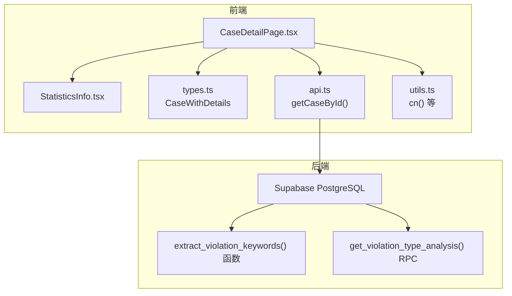
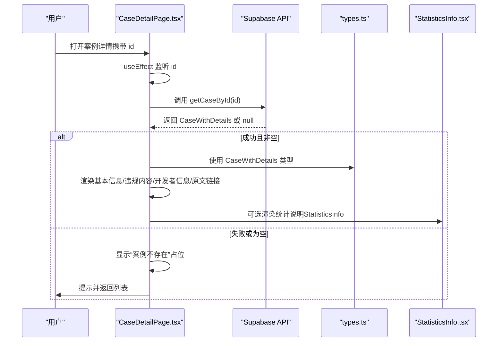
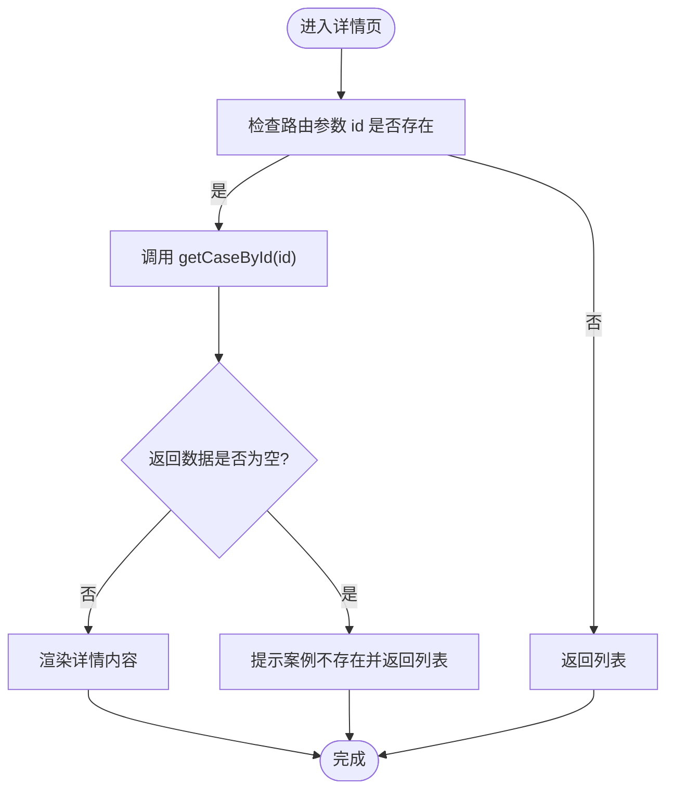
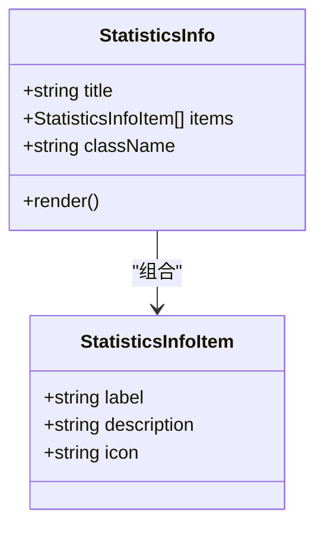
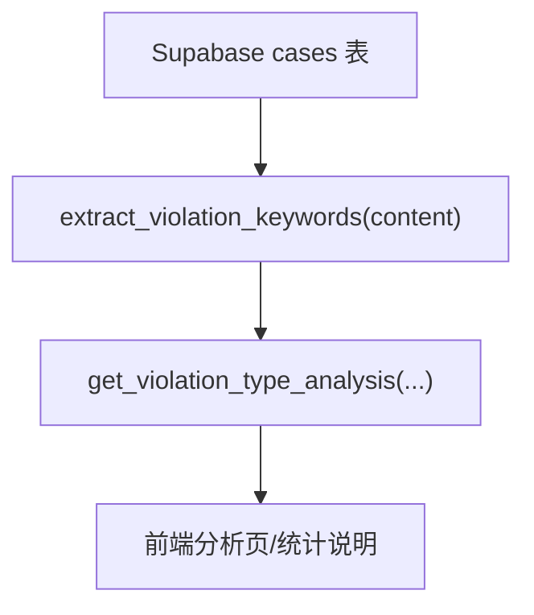
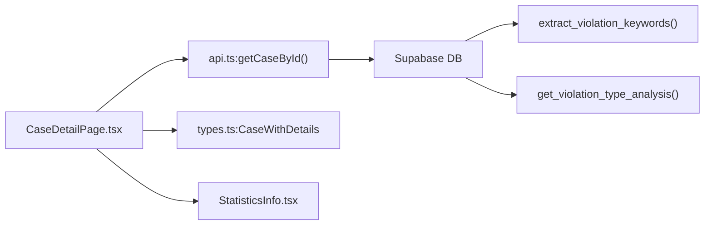

# 案例详情查看

<cite>
**本文引用的文件**
- [CaseDetailPage.tsx](file://src/pages/CaseDetailPage.tsx)
- [StatisticsInfo.tsx](file://src/components/common/StatisticsInfo.tsx)
- [types.ts](file://src/types/types.ts)
- [api.ts](file://src/db/api.ts)
- [utils.ts](file://src/lib/utils.ts)
- [UI优化说明.md](file://docs/UI_OPTIMIZATION_SPECIFICATION.md)
- [违规问题分析技术实现.md](file://docs/#U8fdd#U89c4#U95ee#U9898#U5206#U6790#U6280#U672f#U5b9e#U73b0.md)
- [违规分析RPC迁移说明.md](file://supabase/migrations/20251219000000_create_violation_analysis_rpc.sql)
- [关键词提取函数优化.md](file://supabase/migrations/20251219120000_optimize_violation_extraction.sql)
- [拆分首页图表RPC.md](file://supabase/migrations/20251220120000_split_home_charts_rpc.sql)
</cite>

## 目录
1. [简介](#简介)
2. [项目结构](#项目结构)
3. [核心组件](#核心组件)
4. [架构总览](#架构总览)
5. [详细组件分析](#详细组件分析)
6. [依赖关系分析](#依赖关系分析)
7. [性能考量](#性能考量)
8. [故障排查指南](#故障排查指南)
9. [结论](#结论)
10. [附录](#附录)

## 简介
本文件面向“案例详情查看”页面，系统化说明 CaseDetailPage.tsx 的数据结构、信息展示布局、违规内容分析与关键词提取、处罚结果字段的呈现逻辑、StatisticsInfo 组件在详情页中的集成方式、响应式设计实现细节，以及数据加载失败时的降级显示方案。文档同时结合后端 Supabase 的关键词提取与统计分析能力，帮助读者理解前端如何消费后端提供的结构化数据，并通过可视化组件进行信息说明。

## 项目结构
- 页面入口：CaseDetailPage.tsx
- 类型定义：CaseWithDetails（扩展 Case，包含关联部门与平台信息）
- 数据访问：api.ts 中的 getCaseById
- 可视化说明组件：StatisticsInfo.tsx
- 工具方法：utils.ts（通用工具函数）
- 后端支撑：Supabase 关键词提取函数与 RPC（用于违规类型分析）

**图示来源**
- [CaseDetailPage.tsx](file://src/pages/CaseDetailPage.tsx#L1-L256)
- [StatisticsInfo.tsx](file://src/components/common/StatisticsInfo.tsx#L1-L58)
- [types.ts](file://src/types/types.ts#L91-L100)
- [api.ts](file://src/db/api.ts#L584-L597)
- [违规分析RPC迁移说明.md](file://supabase/migrations/20251219000000_create_violation_analysis_rpc.sql#L94-L132)
- [关键词提取函数优化.md](file://supabase/migrations/20251219120000_optimize_violation_extraction.sql#L1-L139)

**章节来源**
- [CaseDetailPage.tsx](file://src/pages/CaseDetailPage.tsx#L1-L256)
- [types.ts](file://src/types/types.ts#L91-L100)
- [api.ts](file://src/db/api.ts#L584-L597)

## 核心组件
- 案例详情页面（CaseDetailPage.tsx）
  - 负责加载指定 id 的案例详情，渲染基本信息、违规内容、开发者信息、原文链接等，并提供字体缩放与分享能力。
  - 使用 CaseWithDetails 类型承载案例主数据及关联的监管机构与平台信息。
- 统计说明组件（StatisticsInfo.tsx）
  - 以卡片形式展示一组“说明项”，每项包含标签与描述，支持可选图标或序号。
  - 适合在详情页中补充“统计说明”“使用须知”等辅助信息。
- 类型定义（types.ts）
  - CaseWithDetails 扩展了 Case，新增 department 与 platform 字段，便于在详情页直接展示关联信息。
- 数据访问（api.ts）
  - getCaseById 提供按 id 查询案例详情的能力，返回 CaseWithDetails 或 null。
- 工具方法（utils.ts）
  - 提供 cn 合并类名等通用工具，详情页中用于样式合并。

**章节来源**
- [CaseDetailPage.tsx](file://src/pages/CaseDetailPage.tsx#L1-L256)
- [StatisticsInfo.tsx](file://src/components/common/StatisticsInfo.tsx#L1-L58)
- [types.ts](file://src/types/types.ts#L91-L100)
- [api.ts](file://src/db/api.ts#L584-L597)
- [utils.ts](file://src/lib/utils.ts#L1-L6)

## 架构总览
案例详情页面的数据流与交互如下：

**图示来源**
- [CaseDetailPage.tsx](file://src/pages/CaseDetailPage.tsx#L26-L122)
- [api.ts](file://src/db/api.ts#L584-L597)
- [types.ts](file://src/types/types.ts#L91-L100)
- [StatisticsInfo.tsx](file://src/components/common/StatisticsInfo.tsx#L1-L58)

## 详细组件分析

### 案例详情页面（CaseDetailPage.tsx）
- 数据结构
  - 使用 CaseWithDetails 作为页面状态，包含：
    - app_name、report_date、app_developer、violation_content、source_url
    - department（可选，来自关联表）、platform（可选，来自关联表）
- 信息展示布局
  - 顶部操作区：返回按钮、字体缩放（+/-）、分享菜单（微信/微博/QQ/复制链接）
  - 案例卡片：标题（应用名）、元信息（通报日期、监管部门、应用来源、原文链接）、开发者信息、违规内容
  - 底部返回按钮
- 违规内容分析与关键词提取
  - 前端直接展示 violation_content 字段内容（支持换行与预格式化）
  - 关键词提取由后端 Supabase 函数与 RPC 实现，前端可复用该能力在分析页或其他场景中进行统计与可视化
- 处罚结果字段
  - 在 CaseWithDetails 中未包含“处罚结果”字段；若需展示，请在后端扩展 cases 表并同步前端类型
- StatisticsInfo 组件集成
  - 可在详情页底部或侧边插入“统计说明”区块，用于解释违规类型分布、统计口径等
- 响应式设计
  - 使用 Tailwind 的 flex、gap、wrap 等布局属性，保证在小屏设备上信息自动换行与对齐
  - 元信息区域采用 flex-wrap 与 gap-4，确保在窄屏下仍可完整展示
- 错误处理与降级
  - 加载中：骨架屏
  - 无数据：显示“案例不存在”提示与返回按钮
  - 请求异常：Toast 提示并返回列表

**图示来源**
- [CaseDetailPage.tsx](file://src/pages/CaseDetailPage.tsx#L26-L122)

**章节来源**
- [CaseDetailPage.tsx](file://src/pages/CaseDetailPage.tsx#L1-L256)
- [types.ts](file://src/types/types.ts#L91-L100)
- [UI优化说明.md](file://docs/UI_OPTIMIZATION_SPECIFICATION.md#L167-L238)

### StatisticsInfo 组件（在详情页中的使用）
- 设计定位
  - 以卡片形式展示一组“说明项”，适合用于“统计说明”“使用须知”“数据口径”等辅助信息
- 组件特性
  - 支持自定义标题（默认“统计说明”）
  - 每项包含 label 与 description，可选 icon 或序号
  - 样式采用浅色背景与深色文字组合，标题栏与内容区对比清晰
- 在详情页中的建议用法
  - 在“违规内容”下方插入“违规类型分布说明”或“统计口径说明”
  - 若后端提供违规类型统计，可将 RPC 返回的类型-数量映射传入 items，形成可视化说明

**图示来源**
- [StatisticsInfo.tsx](file://src/components/common/StatisticsInfo.tsx#L1-L58)

**章节来源**
- [StatisticsInfo.tsx](file://src/components/common/StatisticsInfo.tsx#L1-L58)

### 违规内容分析与关键词提取（后端支撑）
- 关键词提取函数
  - Supabase 中的 extract_violation_keywords(content) 使用多条正则模式匹配常见违规问题，支持标准化、长度限制、去重与兜底策略
- 违规类型分析 RPC
  - get_violation_type_analysis(department_ids?, start_date?, end_date?) 返回违规类型的统计结果
- 前端消费建议
  - 详情页可直接展示 violation_content
  - 分析页可调用 RPC 获取违规类型分布，结合图表组件进行可视化

**图示来源**
- [违规分析RPC迁移说明.md](file://supabase/migrations/20251219000000_create_violation_analysis_rpc.sql#L94-L132)
- [关键词提取函数优化.md](file://supabase/migrations/20251219120000_optimize_violation_extraction.sql#L1-L139)
- [拆分首页图表RPC.md](file://supabase/migrations/20251220120000_split_home_charts_rpc.sql#L146-L175)
- [违规问题分析技术实现.md](file://docs/#U8fdd#U89c4#U95ee#U9898#U5206#U6790#U6280#U672f#U5b9e#U73b0.md#L7-L93)

**章节来源**
- [违规分析RPC迁移说明.md](file://supabase/migrations/20251219000000_create_violation_analysis_rpc.sql#L94-L132)
- [关键词提取函数优化.md](file://supabase/migrations/20251219120000_optimize_violation_extraction.sql#L1-L139)
- [拆分首页图表RPC.md](file://supabase/migrations/20251220120000_split_home_charts_rpc.sql#L146-L175)
- [违规问题分析技术实现.md](file://docs/#U8fdd#U89c4#U95ee#U9898#U5206#U6790#U6280#U672f#U5b9e#U73b0.md#L7-L93)

## 依赖关系分析
- 组件耦合
  - CaseDetailPage.tsx 依赖 api.ts 的 getCaseById，依赖 types.ts 的 CaseWithDetails 类型
  - 可选依赖 StatisticsInfo.tsx 进行说明性信息展示
- 外部依赖
  - 路由参数 useParams、导航 useNavigate
  - UI 组件库（Card、Button、DropdownMenu、Skeleton 等）
  - 通知组件（sonner toast）
- 数据流向
  - 前端通过 Supabase RPC/函数进行关键词提取与统计分析，详情页直接展示 violation_content

**图示来源**
- [CaseDetailPage.tsx](file://src/pages/CaseDetailPage.tsx#L1-L256)
- [api.ts](file://src/db/api.ts#L584-L597)
- [types.ts](file://src/types/types.ts#L91-L100)
- [StatisticsInfo.tsx](file://src/components/common/StatisticsInfo.tsx#L1-L58)
- [违规分析RPC迁移说明.md](file://supabase/migrations/20251219000000_create_violation_analysis_rpc.sql#L94-L132)
- [关键词提取函数优化.md](file://supabase/migrations/20251219120000_optimize_violation_extraction.sql#L1-L139)

**章节来源**
- [CaseDetailPage.tsx](file://src/pages/CaseDetailPage.tsx#L1-L256)
- [api.ts](file://src/db/api.ts#L584-L597)
- [types.ts](file://src/types/types.ts#L91-L100)
- [StatisticsInfo.tsx](file://src/components/common/StatisticsInfo.tsx#L1-L58)

## 性能考量
- 前端渲染
  - 使用骨架屏（Skeleton）在加载阶段提供占位，减少白屏时间
  - 文本渲染采用预格式化与换行保留，避免复杂 DOM 结构带来的重排
- 数据访问
  - getCaseById 为单条查询，避免不必要的全量数据拉取
- 可视化说明
  - StatisticsInfo 仅展示静态说明项，开销极低
- 关键词提取
  - 前端详情页直接展示 violation_content；如需统计分析，建议在分析页调用 RPC，避免详情页承担额外计算

[本节为通用指导，无需特定文件引用]

## 故障排查指南
- 案例不存在
  - 现象：显示“案例不存在”提示与返回按钮
  - 处理：确认 id 是否正确，检查后端是否存在对应记录
- 加载失败
  - 现象：Toast 提示“加载案例详情失败”，随后返回列表
  - 处理：检查网络请求、Supabase 连接与权限配置
- 原文链接无法打开
  - 现象：点击“查看原文链接”无响应或被拦截
  - 处理：确认 source_url 是否有效，浏览器是否拦截弹窗
- 分享功能
  - 微信分享：使用复制链接方式，提示用户在微信中粘贴分享
  - 其他平台：通过第三方分享页面打开

**章节来源**
- [CaseDetailPage.tsx](file://src/pages/CaseDetailPage.tsx#L39-L91)

## 结论
CaseDetailPage.tsx 以简洁清晰的布局呈现案例基本信息与违规内容，结合 StatisticsInfo 组件可灵活补充说明性信息。前后端协作通过 Supabase 的关键词提取与统计 RPC，为分析页提供数据基础。详情页本身聚焦于“展示”，在加载与错误处理方面具备良好的降级体验；如需可视化分析，建议在分析页中集成图表组件并调用后端 RPC。

[本节为总结性内容，无需特定文件引用]

## 附录

### 数据结构与字段说明
- CaseWithDetails
  - 包含：id、report_date、app_name、app_developer、department_id、platform_id、violation_content、source_url、created_at、updated_at、department（可选）、platform（可选）
- 违规内容字段
  - violation_content：主要违规内容（整合了原违规摘要与详细内容），详情页直接展示
- 处罚结果字段
  - 当前类型未包含“处罚结果”字段；如需展示，请在后端扩展 cases 表并同步前端类型

**章节来源**
- [types.ts](file://src/types/types.ts#L28-L39)
- [types.ts](file://src/types/types.ts#L91-L100)

### 响应式设计要点
- 使用 flex-wrap 与 gap-4，保证小屏设备信息换行与对齐
- 元信息区域统一使用图标与文本组合，提升可读性
- 卡片内边距与间距采用统一倍数，确保视觉一致性

**章节来源**
- [UI优化说明.md](file://docs/UI_OPTIMIZATION_SPECIFICATION.md#L329-L393)