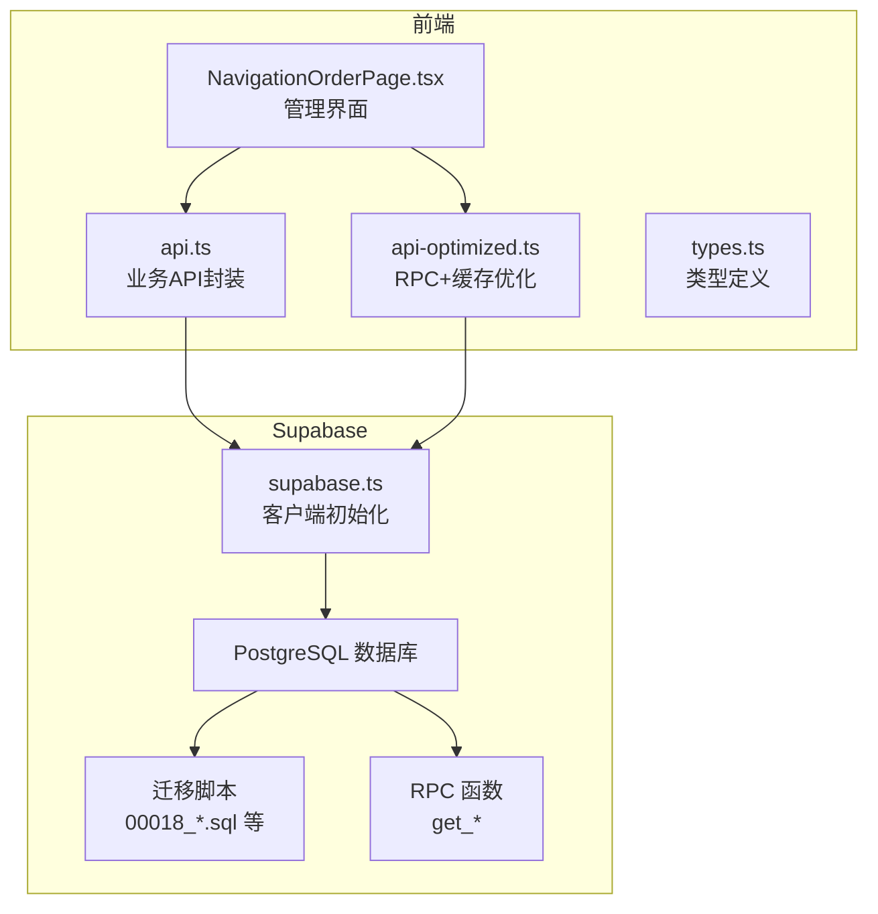
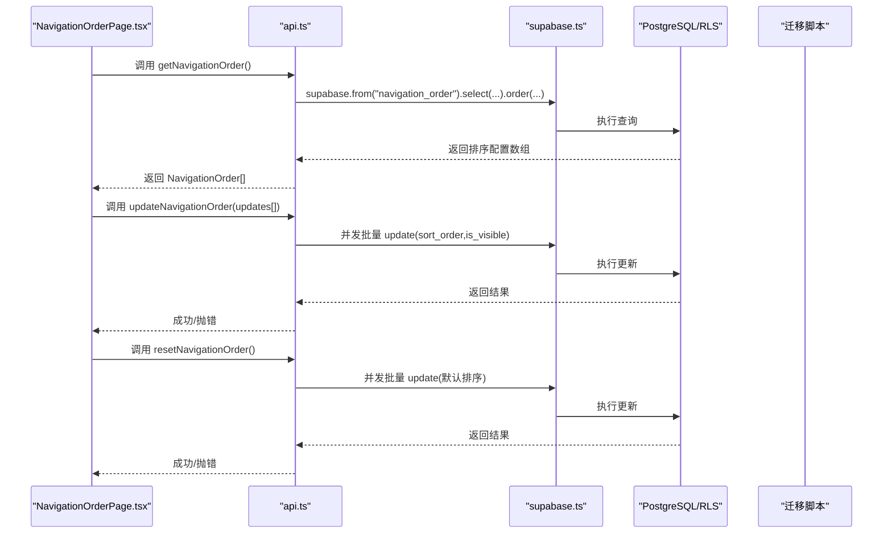
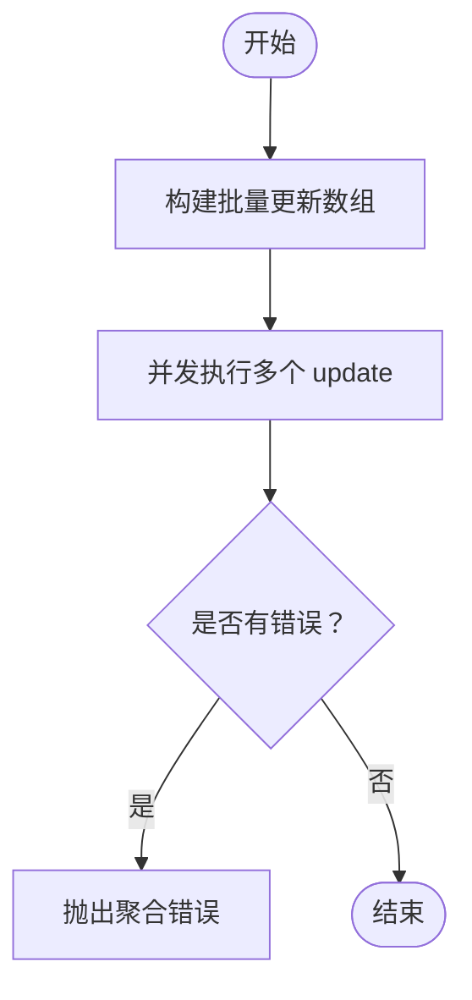
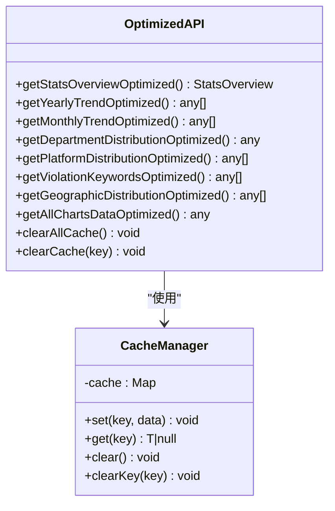
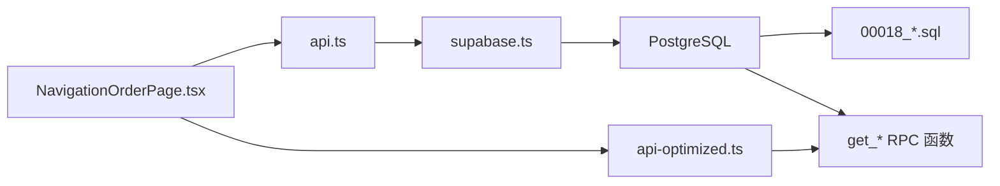

# API与数据持久化

<cite>
**本文引用的文件**
- [src/db/api.ts](file://src/db/api.ts)
- [src/db/api-optimized.ts](file://src/db/api-optimized.ts)
- [src/db/supabase.ts](file://src/db/supabase.ts)
- [src/types/types.ts](file://src/types/types.ts)
- [src/pages/admin/NavigationOrderPage.tsx](file://src/pages/admin/NavigationOrderPage.tsx)
- [supabase/migrations/00018_create_navigation_order_table.sql](file://supabase/migrations/00018_create_navigation_order_table.sql)
- [supabase/migrations/00019_add_get_available_years_function.sql](file://supabase/migrations/00019_add_get_available_years_function.sql)
- [supabase/migrations/00020_add_high_frequency_issues_function.sql](file://supabase/migrations/00020_add_high_frequency_issues_function.sql)
- [supabase/migrations/00021_add_high_frequency_issues_function_v2.sql](file://supabase/migrations/00021_add_high_frequency_issues_function_v2.sql)
- [docs/MIGRATION_EXECUTION_REPORT.md](file://docs/MIGRATION_EXECUTION_REPORT.md)
- [docs/COMPLETION_REPORT.md](file://docs/COMPLETION_REPORT.md)
</cite>

## 目录
1. [简介](#简介)
2. [项目结构](#项目结构)
3. [核心组件](#核心组件)
4. [架构总览](#架构总览)
5. [详细组件分析](#详细组件分析)
6. [依赖关系分析](#依赖关系分析)
7. [性能考量](#性能考量)
8. [故障排查指南](#故障排查指南)
9. [结论](#结论)
10. [附录](#附录)

## 简介
本文件聚焦于“模块控制API与数据持久化”的实现与交互流程，围绕导航模块排序配置（navigation_order 表）展开，系统性说明以下内容：
- getNavigationOrder、updateNavigationOrder、resetNavigationOrder 等API函数的实现细节、请求参数、响应格式与错误处理
- navigation_order 数据库表的结构设计、字段含义与约束
- Supabase 数据库迁移脚本的执行流程与版本控制策略
- 数据验证规则（排序号唯一性、范围校验等）
- API 调用的性能优化建议与缓存策略

## 项目结构
本项目采用前端与数据库分离的架构：
- 前端通过 Supabase 客户端发起请求，调用数据库函数或直接访问表
- 数据层通过 Supabase 的 RLS（行级安全）策略保障访问权限
- 迁移脚本集中管理数据库结构演进与函数创建

**图表来源**
- [src/pages/admin/NavigationOrderPage.tsx](file://src/pages/admin/NavigationOrderPage.tsx#L1-L296)
- [src/db/api.ts](file://src/db/api.ts#L2759-L2848)
- [src/db/api-optimized.ts](file://src/db/api-optimized.ts#L1-L275)
- [src/db/supabase.ts](file://src/db/supabase.ts#L1-L8)
- [supabase/migrations/00018_create_navigation_order_table.sql](file://supabase/migrations/00018_create_navigation_order_table.sql#L1-L83)

**章节来源**
- [src/db/supabase.ts](file://src/db/supabase.ts#L1-L8)
- [src/db/api.ts](file://src/db/api.ts#L2759-L2848)
- [src/db/api-optimized.ts](file://src/db/api-optimized.ts#L1-L275)
- [supabase/migrations/00018_create_navigation_order_table.sql](file://supabase/migrations/00018_create_navigation_order_table.sql#L1-L83)

## 核心组件
- Supabase 客户端初始化：负责创建 Supabase 客户端实例，供业务层调用
- API 层（api.ts）：封装导航模块排序相关 API，包括获取、批量更新、重置、可见性更新
- 优化 API 层（api-optimized.ts）：封装 RPC 调用与缓存，用于首页等高性能场景
- 类型定义（types.ts）：定义 NavigationOrder 等数据模型
- 管理页面（NavigationOrderPage.tsx）：提供可视化界面，驱动 API 调用与数据校验

**章节来源**
- [src/db/supabase.ts](file://src/db/supabase.ts#L1-L8)
- [src/db/api.ts](file://src/db/api.ts#L2759-L2848)
- [src/db/api-optimized.ts](file://src/db/api-optimized.ts#L1-L275)
- [src/types/types.ts](file://src/types/types.ts#L173-L184)
- [src/pages/admin/NavigationOrderPage.tsx](file://src/pages/admin/NavigationOrderPage.tsx#L1-L296)

## 架构总览
从前端到数据库的调用链路如下：
- 前端页面 NavigationOrderPage.tsx 调用 api.ts 中的 getNavigationOrder、updateNavigationOrder、resetNavigationOrder、updateNavigationVisibility
- api.ts 通过 supabase.ts 初始化的客户端访问 Supabase 数据库
- 数据库层面通过 RLS 策略控制访问权限，迁移脚本确保 navigation_order 表结构与索引存在
- 对于首页等高性能需求，使用 api-optimized.ts 的 RPC + 缓存策略

**图表来源**
- [src/pages/admin/NavigationOrderPage.tsx](file://src/pages/admin/NavigationOrderPage.tsx#L1-L296)
- [src/db/api.ts](file://src/db/api.ts#L2759-L2848)
- [src/db/supabase.ts](file://src/db/supabase.ts#L1-L8)
- [supabase/migrations/00018_create_navigation_order_table.sql](file://supabase/migrations/00018_create_navigation_order_table.sql#L1-L83)

## 详细组件分析

### 数据模型：NavigationOrder
- 字段定义与含义
  - id：主键（UUID）
  - module_key：模块标识（唯一）
  - module_name：模块名称
  - route_path：路由路径
  - sort_order：排序序号（整数）
  - is_visible：是否可见（布尔，默认 true）
  - created_at / updated_at：时间戳
- 约束与索引
  - module_key 唯一
  - 索引：sort_order、is_visible
  - RLS：所有人可读，仅管理员可写
- 初始数据
  - 包含默认模块（首页、案例查询、监管资讯、监管部门、趋势分析、问题分析）

**章节来源**
- [src/types/types.ts](file://src/types/types.ts#L173-L184)
- [supabase/migrations/00018_create_navigation_order_table.sql](file://supabase/migrations/00018_create_navigation_order_table.sql#L1-L83)

### API：getNavigationOrder
- 功能：按 sort_order 升序返回所有导航模块配置
- 请求参数：无
- 响应格式：NavigationOrder[]
- 错误处理：若数据库返回 error，则抛出错误
- 典型调用方：NavigationOrderPage.tsx 加载模块列表

**章节来源**
- [src/db/api.ts](file://src/db/api.ts#L2767-L2775)
- [src/pages/admin/NavigationOrderPage.tsx](file://src/pages/admin/NavigationOrderPage.tsx#L26-L38)

### API：updateNavigationOrder
- 功能：批量更新模块的 sort_order 与 is_visible
- 请求参数：Array<{ id: string; sort_order: number; is_visible: boolean }>
- 响应格式：void
- 错误处理：并发执行多个 update，若任一返回 error，则聚合错误并抛出
- 典型调用方：NavigationOrderPage.tsx 保存排序

**图表来源**
- [src/db/api.ts](file://src/db/api.ts#L2794-L2810)

**章节来源**
- [src/db/api.ts](file://src/db/api.ts#L2794-L2810)
- [src/pages/admin/NavigationOrderPage.tsx](file://src/pages/admin/NavigationOrderPage.tsx#L71-L99)

### API：resetNavigationOrder
- 功能：将模块排序重置为默认顺序，并确保所有模块可见
- 请求参数：无
- 响应格式：void
- 错误处理：并发执行多个 update，若任一返回 error，则聚合错误并抛出
- 典型调用方：NavigationOrderPage.tsx 恢复默认

**章节来源**
- [src/db/api.ts](file://src/db/api.ts#L2827-L2848)
- [src/pages/admin/NavigationOrderPage.tsx](file://src/pages/admin/NavigationOrderPage.tsx#L101-L113)

### API：updateNavigationVisibility
- 功能：更新单个模块的 is_visible
- 请求参数：id: string, is_visible: boolean
- 响应格式：void
- 错误处理：若数据库返回 error，则抛出

**章节来源**
- [src/db/api.ts](file://src/db/api.ts#L2815-L2822)
- [src/pages/admin/NavigationOrderPage.tsx](file://src/pages/admin/NavigationOrderPage.tsx#L51-L69)

### 前端校验与交互
- 排序号唯一性校验：前端在保存前对 editedModules 的 sort_order 去重判断，若重复则提示
- 排序号范围校验：输入框限制最小值为 1
- 可见性切换：实时调用 updateNavigationVisibility 并同步本地状态
- 保存与重置：分别调用 updateNavigationOrder 与 resetNavigationOrder

**章节来源**
- [src/pages/admin/NavigationOrderPage.tsx](file://src/pages/admin/NavigationOrderPage.tsx#L40-L113)

### RPC 与缓存优化（首页等高性能场景）
- 优化思路：通过后端 RPC 函数一次性返回聚合统计，前端使用内存缓存减少请求次数
- 缓存策略：统一的 CacheManager，5 分钟过期
- 调用函数：get_dashboard_stats、get_yearly_trend_stats、get_monthly_trend_stats、get_department_distribution_stats、get_platform_distribution_stats、get_violation_keywords_stats、get_geographic_distribution_stats
- 并发聚合：getAllChartsDataOptimized 并行拉取多类图表数据

**图表来源**
- [src/db/api-optimized.ts](file://src/db/api-optimized.ts#L1-L275)

**章节来源**
- [src/db/api-optimized.ts](file://src/db/api-optimized.ts#L1-L275)

## 依赖关系分析
- 前端页面依赖 API 层，API 层依赖 Supabase 客户端
- API 层依赖数据库表 navigation_order 与 RLS 策略
- 迁移脚本负责创建表、索引、RLS 策略与触发器
- RPC 函数用于高性能统计场景，与前端优化 API 层配合

**图表来源**
- [src/pages/admin/NavigationOrderPage.tsx](file://src/pages/admin/NavigationOrderPage.tsx#L1-L296)
- [src/db/api.ts](file://src/db/api.ts#L2759-L2848)
- [src/db/api-optimized.ts](file://src/db/api-optimized.ts#L1-L275)
- [src/db/supabase.ts](file://src/db/supabase.ts#L1-L8)
- [supabase/migrations/00018_create_navigation_order_table.sql](file://supabase/migrations/00018_create_navigation_order_table.sql#L1-L83)

**章节来源**
- [src/db/api.ts](file://src/db/api.ts#L2759-L2848)
- [src/db/api-optimized.ts](file://src/db/api-optimized.ts#L1-L275)
- [src/db/supabase.ts](file://src/db/supabase.ts#L1-L8)
- [supabase/migrations/00018_create_navigation_order_table.sql](file://supabase/migrations/00018_create_navigation_order_table.sql#L1-L83)

## 性能考量
- RPC + 缓存：通过 api-optimized.ts 的 RPC 调用与缓存，显著降低首页等场景的请求次数与延迟
- 并发批量更新：updateNavigationOrder 使用 Promise.all 并发更新，提高批量操作效率
- 数据库索引：navigation_order 表对 sort_order 与 is_visible 建有索引，有利于排序与筛选
- 前端校验：在保存前进行排序号唯一性与范围校验，避免无效请求
- Supabase 服务状态：当前文档中存在服务不可用的状态说明，需关注迁移与服务恢复进度

**章节来源**
- [src/db/api-optimized.ts](file://src/db/api-optimized.ts#L1-L275)
- [src/db/api.ts](file://src/db/api.ts#L2794-L2810)
- [supabase/migrations/00018_create_navigation_order_table.sql](file://supabase/migrations/00018_create_navigation_order_table.sql#L41-L44)
- [docs/COMPLETION_REPORT.md](file://docs/COMPLETION_REPORT.md#L400-L413)

## 故障排查指南
- 常见错误
  - 数据库返回 error：在 API 层会直接抛出，前端捕获后通过 toast 提示
  - 并发更新失败：updateNavigationOrder 会聚合错误消息并抛出
  - 服务不可用：当前存在 Supabase 服务不可用状态，迁移与函数测试受限
- 排查步骤
  - 检查前端页面是否捕获并提示错误
  - 在浏览器控制台查看 RPC 调用与网络请求
  - 确认 RLS 策略与权限：仅管理员可修改导航配置
  - 关注迁移执行报告与状态，等待服务恢复后再执行迁移

**章节来源**
- [src/db/api.ts](file://src/db/api.ts#L2794-L2810)
- [docs/COMPLETION_REPORT.md](file://docs/COMPLETION_REPORT.md#L400-L413)
- [docs/MIGRATION_EXECUTION_REPORT.md](file://docs/MIGRATION_EXECUTION_REPORT.md#L1-L357)

## 结论
- navigation_order 表为前端导航模块排序提供了稳定的数据持久化基础，具备完善的 RLS 策略与索引
- API 层提供了完整的 CRUD 与批量更新能力，并在前端页面实现了必要的数据校验
- 通过 RPC + 缓存的优化策略，有效提升了首页等高性能场景的用户体验
- 迁移脚本与 RPC 函数的演进体现了数据库结构与功能的持续优化，建议在服务恢复后尽快执行迁移并验证

## 附录

### Supabase 迁移与版本控制
- 迁移文件命名遵循顺序编号，确保执行顺序与版本演进
- 00018_create_navigation_order_table.sql：创建 navigation_order 表、索引、RLS 策略与触发器，并插入默认模块
- 00019_add_get_available_years_function.sql：添加 get_available_years RPC 函数
- 00020_add_high_frequency_issues_function.sql：添加 get_high_frequency_issues RPC 函数（v1）
- 00021_add_high_frequency_issues_function_v2.sql：更新 get_high_frequency_issues RPC 函数（v2）
- 迁移执行报告：记录了函数创建、测试与性能验证的完整过程

**章节来源**
- [supabase/migrations/00018_create_navigation_order_table.sql](file://supabase/migrations/00018_create_navigation_order_table.sql#L1-L83)
- [supabase/migrations/00019_add_get_available_years_function.sql](file://supabase/migrations/00019_add_get_available_years_function.sql#L1-L39)
- [supabase/migrations/00020_add_high_frequency_issues_function.sql](file://supabase/migrations/00020_add_high_frequency_issues_function.sql#L1-L88)
- [supabase/migrations/00021_add_high_frequency_issues_function_v2.sql](file://supabase/migrations/00021_add_high_frequency_issues_function_v2.sql#L1-L54)
- [docs/MIGRATION_EXECUTION_REPORT.md](file://docs/MIGRATION_EXECUTION_REPORT.md#L1-L357)

### 数据验证规则
- 排序号唯一性：前端在保存前对 sort_order 去重校验，避免重复
- 排序号范围：输入限制最小值为 1
- 可见性：is_visible 为布尔值，支持显示/隐藏控制
- 数据库约束：module_key 唯一，RLS 限制写入权限

**章节来源**
- [src/pages/admin/NavigationOrderPage.tsx](file://src/pages/admin/NavigationOrderPage.tsx#L40-L113)
- [supabase/migrations/00018_create_navigation_order_table.sql](file://supabase/migrations/00018_create_navigation_order_table.sql#L30-L40)