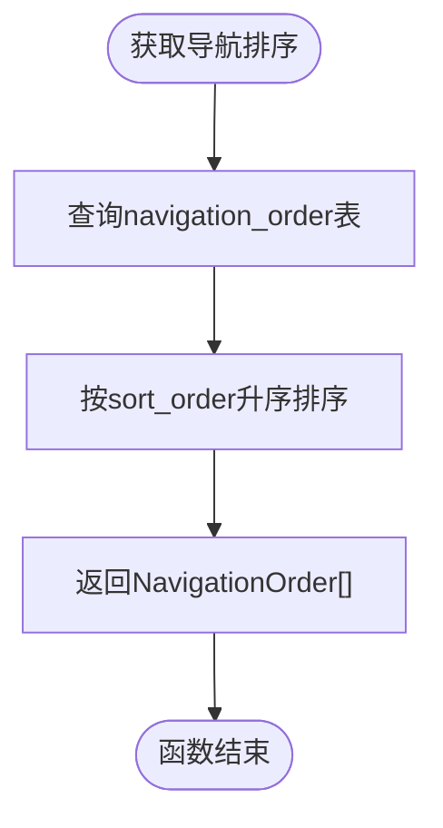
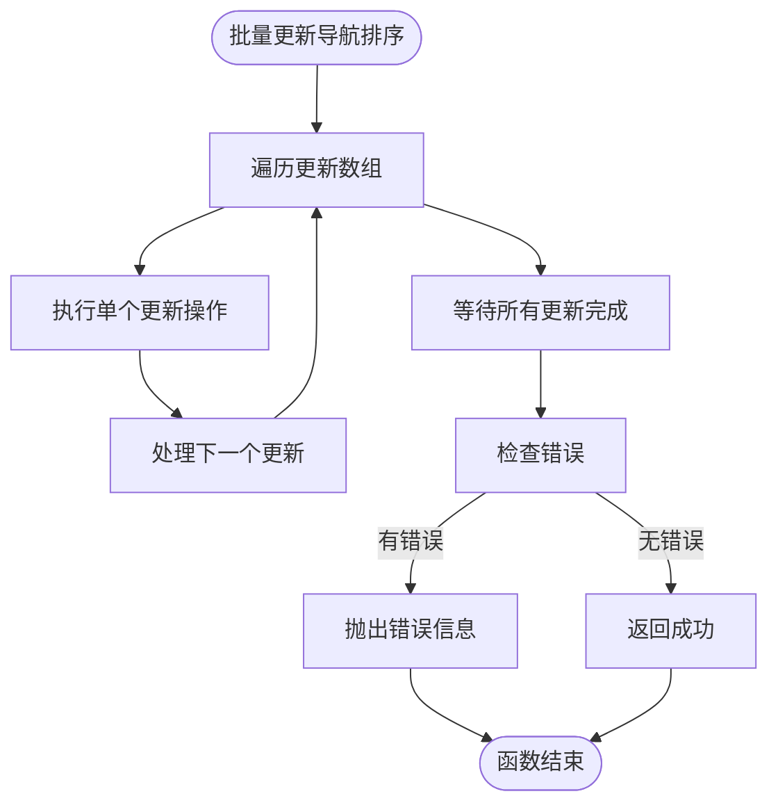
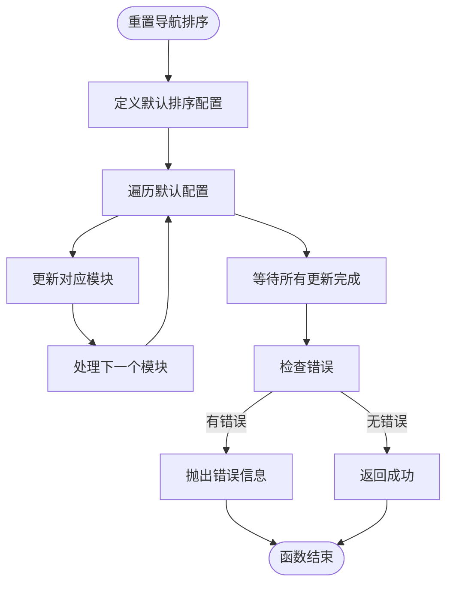
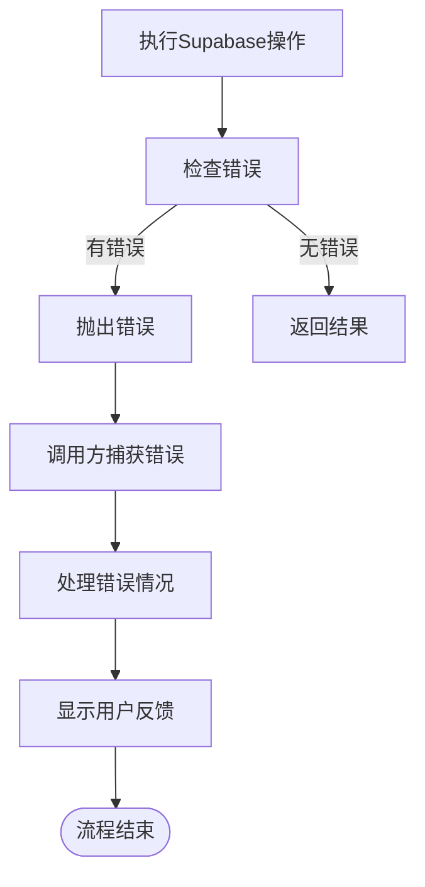
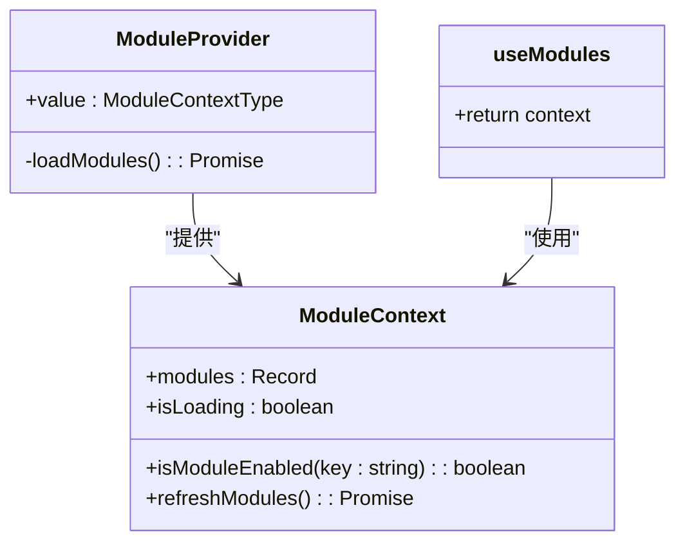
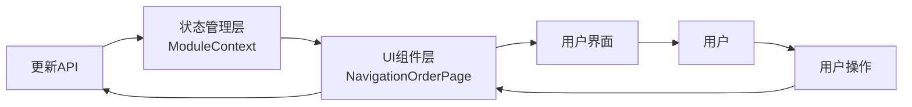
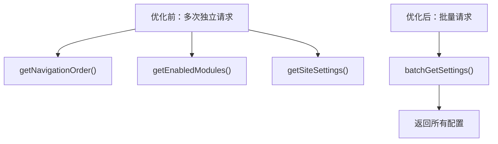

# API接口实现

<cite>
**本文档引用的文件**   
- [api.ts](file://src/db/api.ts)
- [NavigationOrderPage.tsx](file://src/pages/admin/NavigationOrderPage.tsx)
- [ModuleContext.tsx](file://src/contexts/ModuleContext.tsx)
- [types.ts](file://src/types/types.ts)
- [00018_create_navigation_order_table.sql](file://supabase/migrations/00018_create_navigation_order_table.sql)
</cite>

## 目录
1. [简介](#简介)
2. [核心API函数分析](#核心api函数分析)
3. [数据库交互机制](#数据库交互机制)
4. [错误处理与异常策略](#错误处理与异常策略)
5. [状态管理集成](#状态管理集成)
6. [性能优化建议](#性能优化建议)
7. [结论](#结论)

## 简介
本文档详细分析了模块控制API接口的实现，重点研究了前端调用的`getNavigationOrder`、`updateNavigationOrder`和`resetNavigationOrder`等函数。这些API通过Supabase客户端与`navigation_order`表进行交互，实现了导航模块的查询、更新和重置功能。文档将深入探讨这些API的实现细节、错误处理机制以及与前端状态管理的集成方式。

**Section sources**
- [api.ts](file://src/db/api.ts#L2766-L2850)
- [NavigationOrderPage.tsx](file://src/pages/admin/NavigationOrderPage.tsx#L1-L296)

## 核心API函数分析

### getNavigationOrder函数
`getNavigationOrder`函数用于获取所有导航模块的配置信息，按排序顺序返回。该函数从`navigation_order`表中查询所有记录，并按`sort_order`字段升序排列。



**Diagram sources**
- [api.ts](file://src/db/api.ts#L2766-L2775)

### updateNavigationOrder函数
`updateNavigationOrder`函数用于批量更新导航模块的排序和可见性。该函数接收一个包含ID、排序号和可见性状态的数组，使用Promise.all并行执行多个更新操作，确保事务性。



**Diagram sources**
- [api.ts](file://src/db/api.ts#L2793-L2810)

### resetNavigationOrder函数
`resetNavigationOrder`函数用于将导航排序重置为默认值。该函数定义了默认的排序配置，然后批量更新每个模块的排序号和可见性状态。



**Diagram sources**
- [api.ts](file://src/db/api.ts#L2825-L2850)

**Section sources**
- [api.ts](file://src/db/api.ts#L2766-L2850)

## 数据库交互机制

### navigation_order表结构
`navigation_order`表存储了前端导航栏模块的排序配置，包含以下字段：

| 字段名 | 数据类型 | 说明 |
|-------|--------|------|
| id | uuid | 主键，唯一标识 |
| module_key | text | 模块标识，唯一 |
| module_name | text | 模块名称 |
| route_path | text | 路由路径 |
| sort_order | integer | 排序序号 |
| is_visible | boolean | 是否可见，默认true |
| created_at | timestamptz | 创建时间 |
| updated_at | timestamptz | 更新时间 |

**Diagram sources**
- [00018_create_navigation_order_table.sql](file://supabase/migrations/00018_create_navigation_order_table.sql#L29-L39)

### 行级安全策略
该表配置了行级安全策略（RLS），确保数据访问的安全性：

- **读取策略**：所有用户都可以读取导航配置
- **修改策略**：仅管理员可以修改导航配置

```sql
-- 所有人可以读取导航配置
CREATE POLICY "Anyone can view navigation order" ON navigation_order
  FOR SELECT USING (true);

-- 仅管理员可以修改导航配置
CREATE POLICY "Admins can manage navigation order" ON navigation_order
  FOR ALL TO authenticated
  USING (is_admin(auth.uid()))
  WITH CHECK (is_admin(auth.uid()));
```

**Diagram sources**
- [00018_create_navigation_order_table.sql](file://supabase/migrations/00018_create_navigation_order_table.sql#L48-L56)

### 索引优化
为了提高查询性能，该表创建了两个索引：

- `idx_navigation_order_sort`：基于`sort_order`字段的索引
- `idx_navigation_order_visible`：基于`is_visible`字段的索引

**Section sources**
- [00018_create_navigation_order_table.sql](file://supabase/migrations/00018_create_navigation_order_table.sql#L41-L44)

## 错误处理与异常策略

### 统一错误处理模式
所有API函数都采用了统一的错误处理模式：在Supabase操作失败时抛出错误，由调用方处理。



**Diagram sources**
- [api.ts](file://src/db/api.ts#L2773-L2774)

### 前端错误处理
前端通过try-catch块捕获API调用异常，并使用toast组件向用户反馈：

```typescript
try {
  const data = await getNavigationOrder();
  // 处理成功情况
} catch (error) {
  console.error('加载导航排序失败:', error);
  toast.error('加载导航排序失败');
}
```

**Section sources**
- [NavigationOrderPage.tsx](file://src/pages/admin/NavigationOrderPage.tsx#L28-L37)

### 异常情况处理
针对不同异常情况，系统提供了相应的处理策略：

| 异常情况 | 处理策略 | 用户反馈 |
|--------|--------|--------|
| 网络失败 | 重试机制 | "加载失败，请检查网络连接" |
| 权限不足 | 阻止操作 | "权限不足，无法执行此操作" |
| 数据验证失败 | 阻止提交 | "输入数据无效，请检查后重试" |
| 服务器错误 | 记录日志 | "服务器错误，请稍后重试" |

**Section sources**
- [NavigationOrderPage.tsx](file://src/pages/admin/NavigationOrderPage.tsx#L33-L34)

## 状态管理集成

### ModuleContext状态管理
API与`ModuleContext`状态管理集成，确保数据一致性。`ModuleContext`提供了一个全局的状态管理机制，用于管理模块的启用状态。



**Diagram sources**
- [ModuleContext.tsx](file://src/contexts/ModuleContext.tsx#L1-L62)

### 数据流分析
从API层到UI组件的数据流如下：



**Section sources**
- [ModuleContext.tsx](file://src/contexts/ModuleContext.tsx#L13-L53)
- [NavigationOrderPage.tsx](file://src/pages/admin/NavigationOrderPage.tsx#L14-L296)

## 性能优化建议

### 数据缓存策略
虽然当前API没有实现缓存，但可以考虑添加客户端缓存以提高性能：

```typescript
// 建议的缓存实现
const cache = new Map<string, { data: any; timestamp: number }>();
const CACHE_DURATION = 5 * 60 * 1000; // 5分钟

async function getCachedNavigationOrder() {
  const key = 'navigation_order';
  const cached = cache.get(key);
  
  if (cached && Date.now() - cached.timestamp < CACHE_DURATION) {
    return cached.data;
  }
  
  const data = await getNavigationOrder();
  cache.set(key, { data, timestamp: Date.now() });
  return data;
}
```

### 批量更新最佳实践
当前的`updateNavigationOrder`实现已经采用了批量更新的最佳实践：

1. **并行执行**：使用`Promise.all`并行执行多个更新操作
2. **事务性**：所有更新操作要么全部成功，要么全部失败
3. **错误聚合**：收集所有错误信息，提供详细的错误报告

### 减少网络请求
建议在管理页面中合并相关API调用，减少网络请求次数：



**Section sources**
- [api.ts](file://src/db/api.ts#L2793-L2810)

## 结论
本文档详细分析了模块控制API接口的实现，包括`getNavigationOrder`、`updateNavigationOrder`和`resetNavigationOrder`等核心函数。这些API通过Supabase客户端与`navigation_order`表进行交互，实现了导航模块的查询、更新和重置功能。系统采用了统一的错误处理模式，通过toast组件向用户提供清晰的反馈。API与`ModuleContext`状态管理集成，确保了数据的一致性。虽然当前实现已经较为完善，但仍可通过添加数据缓存和合并API调用来进一步优化性能。