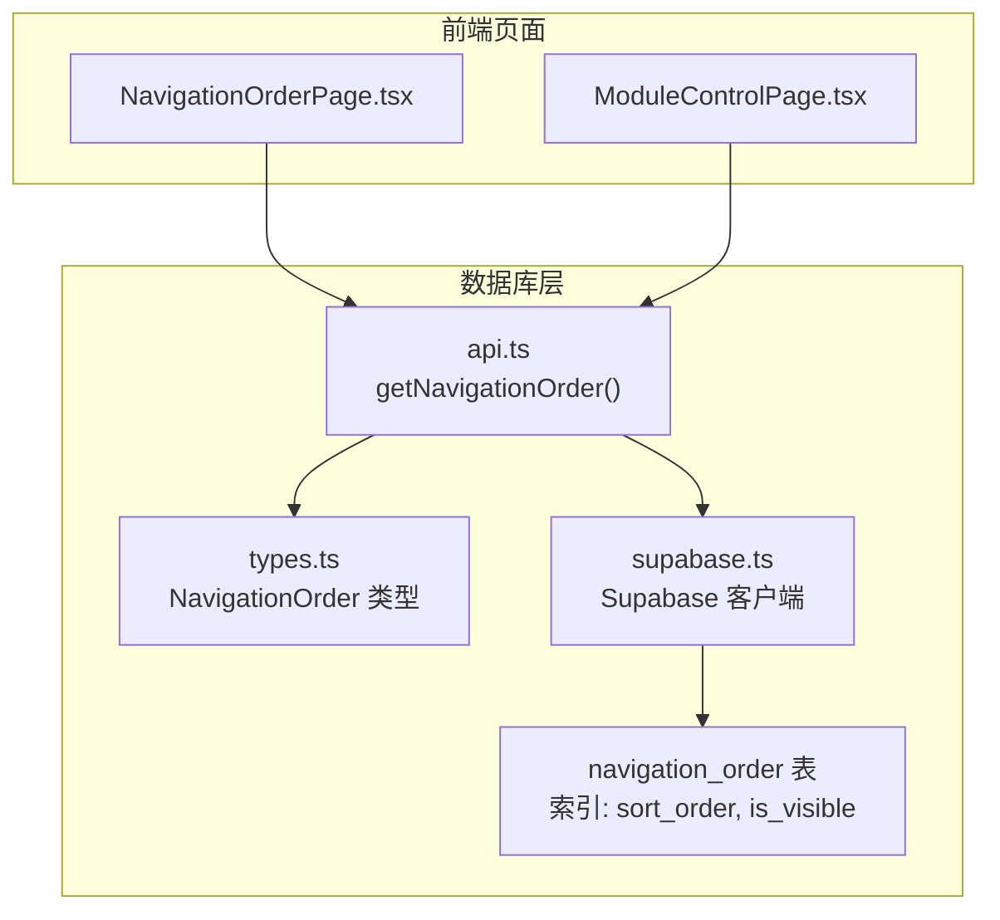
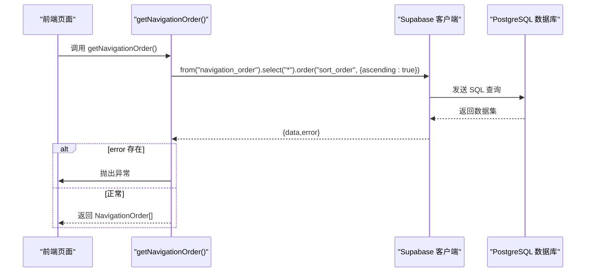
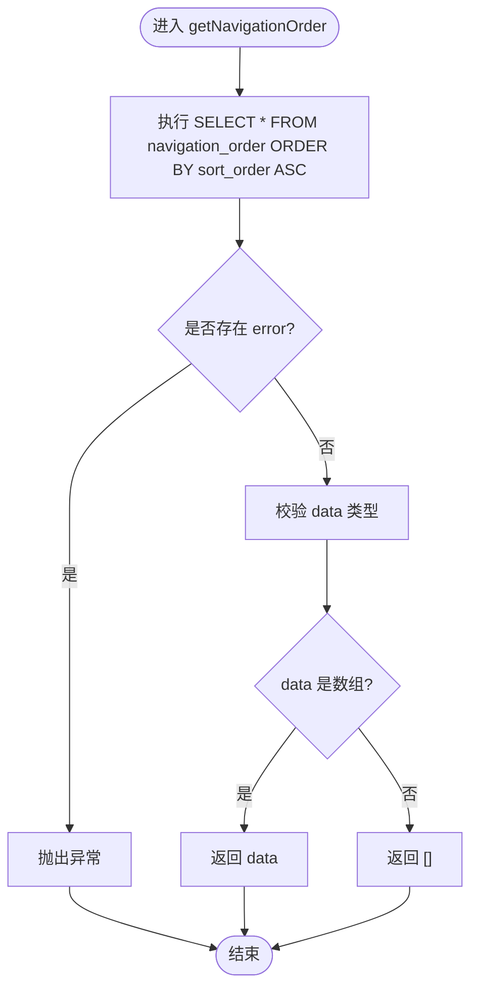
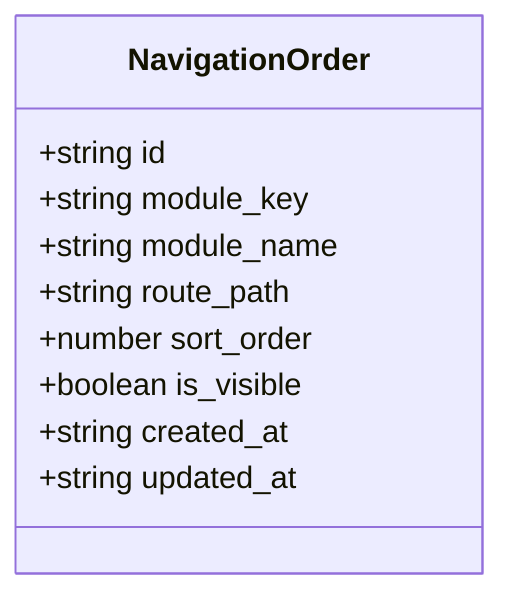
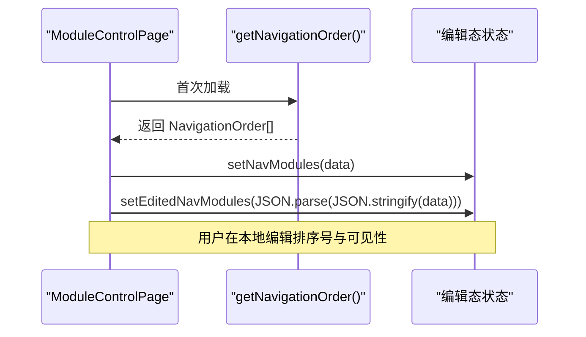
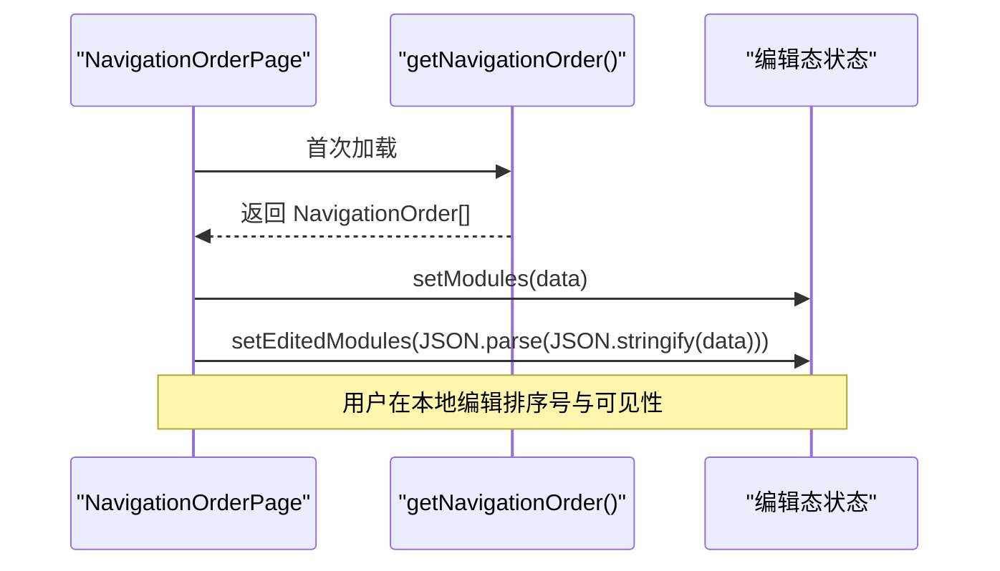
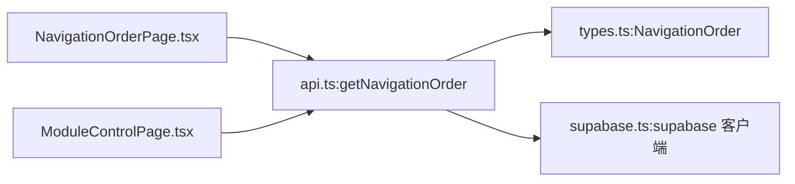

# getNavigationOrder API

<cite>
**本文引用的文件**
- [api.ts](file://src/db/api.ts)
- [types.ts](file://src/types/types.ts)
- [NavigationOrderPage.tsx](file://src/pages/admin/NavigationOrderPage.tsx)
- [ModuleControlPage.tsx](file://src/pages/admin/ModuleControlPage.tsx)
- [supabase.ts](file://src/db/supabase.ts)
- [00018_create_navigation_order_table.sql](file://supabase/migrations/00018_create_navigation_order_table.sql)
</cite>

## 目录
1. [简介](#简介)
2. [项目结构](#项目结构)
3. [核心组件](#核心组件)
4. [架构总览](#架构总览)
5. [详细组件分析](#详细组件分析)
6. [依赖关系分析](#依赖关系分析)
7. [性能考量](#性能考量)
8. [故障排查指南](#故障排查指南)
9. [结论](#结论)

## 简介
本文件聚焦于 getNavigationOrder API 的实现与使用，详细说明其如何通过 Supabase 客户端从 navigation_order 表中查询导航排序数据，并按 sort_order 升序排列；解释错误处理机制（查询失败时抛出异常）；描述返回数据结构 NavigationOrder 类型及其在 ModuleControlPage 中的使用场景（数据加载后如何初始化编辑状态）；最后给出性能优化建议，包括数据库索引与查询优化方向。

## 项目结构
- getNavigationOrder 位于数据库 API 层，封装对 Supabase 的查询逻辑。
- 类型定义 NavigationOrder 在类型文件中声明，确保前后端一致的数据契约。
- 前端页面 NavigationOrderPage 与 ModuleControlPage 通过调用 getNavigationOrder 实现导航排序的可视化管理与编辑。
- Supabase 客户端在 supabase.ts 中初始化，供 API 层使用。
- 数据库 schema 由 migration 文件定义，包含 navigation_order 表、索引与 RLS 策略。

图表来源
- [api.ts](file://src/db/api.ts#L2764-L2775)
- [types.ts](file://src/types/types.ts#L173-L184)
- [supabase.ts](file://src/db/supabase.ts#L1-L8)
- [00018_create_navigation_order_table.sql](file://supabase/migrations/00018_create_navigation_order_table.sql#L29-L46)

章节来源
- [api.ts](file://src/db/api.ts#L2764-L2775)
- [types.ts](file://src/types/types.ts#L173-L184)
- [supabase.ts](file://src/db/supabase.ts#L1-L8)
- [00018_create_navigation_order_table.sql](file://supabase/migrations/00018_create_navigation_order_table.sql#L29-L46)

## 核心组件
- getNavigationOrder：从 navigation_order 表查询全部记录并按 sort_order 升序排序，若存在错误则抛出异常，否则返回数组。
- NavigationOrder 类型：定义 navigation_order 表的字段集合，作为 API 返回值的数据契约。
- Supabase 客户端：提供与数据库交互的能力，getNavigationOrder 通过 supabase.from(...).select(...).order(...) 执行查询。
- 前端页面：
  - NavigationOrderPage：首次挂载时调用 getNavigationOrder，将返回数据深拷贝到编辑态状态，以便用户进行排序号与可见性的本地编辑。
  - ModuleControlPage：同样在挂载时调用 getNavigationOrder，初始化导航模块列表与编辑态。

章节来源
- [api.ts](file://src/db/api.ts#L2764-L2775)
- [types.ts](file://src/types/types.ts#L173-L184)
- [NavigationOrderPage.tsx](file://src/pages/admin/NavigationOrderPage.tsx#L22-L38)
- [ModuleControlPage.tsx](file://src/pages/admin/ModuleControlPage.tsx#L28-L45)

## 架构总览
下图展示了 getNavigationOrder 的调用链路与数据流向。

图表来源
- [api.ts](file://src/db/api.ts#L2764-L2775)
- [supabase.ts](file://src/db/supabase.ts#L1-L8)

## 详细组件分析

### getNavigationOrder 实现机制
- 查询目标：navigation_order 表
- 查询动作：SELECT *
- 排序规则：按 sort_order 升序排列
- 错误处理：若返回 error，则直接抛出；否则返回 data（若 data 非数组则返回空数组）
- 返回类型：Promise<NavigationOrder[]>

图表来源
- [api.ts](file://src/db/api.ts#L2764-L2775)

章节来源
- [api.ts](file://src/db/api.ts#L2764-L2775)

### 返回数据结构：NavigationOrder
- 字段定义：id、module_key、module_name、route_path、sort_order、is_visible、created_at、updated_at
- 用途：承载导航模块的排序与可见性配置，供前端渲染与编辑

图表来源
- [types.ts](file://src/types/types.ts#L173-L184)

章节来源
- [types.ts](file://src/types/types.ts#L173-L184)

### 在 ModuleControlPage 中的使用场景
- 生命周期：组件挂载时调用 getNavigationOrder
- 初始化编辑状态：将返回数据深拷贝到编辑态状态，以便用户在本地修改排序号与可见性，而不直接写回源数据
- 保存流程：前端校验排序号唯一性后，调用批量更新接口提交更改

图表来源
- [ModuleControlPage.tsx](file://src/pages/admin/ModuleControlPage.tsx#L28-L45)

章节来源
- [ModuleControlPage.tsx](file://src/pages/admin/ModuleControlPage.tsx#L28-L45)

### 在 NavigationOrderPage 中的使用场景
- 生命周期：组件挂载时调用 getNavigationOrder
- 初始化编辑状态：将返回数据深拷贝到编辑态状态，支持排序号与可见性的本地编辑
- 保存流程：前端校验排序号唯一性后，调用批量更新接口提交更改；同时提供“恢复默认”能力

图表来源
- [NavigationOrderPage.tsx](file://src/pages/admin/NavigationOrderPage.tsx#L22-L38)

章节来源
- [NavigationOrderPage.tsx](file://src/pages/admin/NavigationOrderPage.tsx#L22-L38)

## 依赖关系分析
- getNavigationOrder 依赖 Supabase 客户端进行数据库访问
- 返回值 NavigationOrder 类型由类型文件定义，保证前后端一致性
- 前端页面通过调用 getNavigationOrder 实现导航排序的可视化管理

图表来源
- [api.ts](file://src/db/api.ts#L2764-L2775)
- [types.ts](file://src/types/types.ts#L173-L184)
- [supabase.ts](file://src/db/supabase.ts#L1-L8)
- [NavigationOrderPage.tsx](file://src/pages/admin/NavigationOrderPage.tsx#L22-L38)
- [ModuleControlPage.tsx](file://src/pages/admin/ModuleControlPage.tsx#L28-L45)

章节来源
- [api.ts](file://src/db/api.ts#L2764-L2775)
- [types.ts](file://src/types/types.ts#L173-L184)
- [supabase.ts](file://src/db/supabase.ts#L1-L8)
- [NavigationOrderPage.tsx](file://src/pages/admin/NavigationOrderPage.tsx#L22-L38)
- [ModuleControlPage.tsx](file://src/pages/admin/ModuleControlPage.tsx#L28-L45)

## 性能考量
- 数据库索引
  - 已存在的索引：sort_order、is_visible
  - 作用：提升 ORDER BY sort_order 与 WHERE is_visible 查询的性能
- 查询优化建议
  - 若仅需可见模块的排序数据，可改用 getVisibleNavigationOrder，减少不必要的数据传输与前端过滤
  - 若模块数量较多，可在前端对排序号进行唯一性校验时避免重复请求，减少网络往返
  - 对于频繁读取的场景，可考虑缓存最近一次查询结果，结合页面生命周期进行失效控制
- 数据库层面
  - 确保 sort_order 字段为整数且非空，避免排序异常
  - 如需支持多租户或动态权限，可结合 RLS 策略进行过滤（当前 migration 已允许所有人读取）

章节来源
- [00018_create_navigation_order_table.sql](file://supabase/migrations/00018_create_navigation_order_table.sql#L41-L46)
- [api.ts](file://src/db/api.ts#L2764-L2775)

## 故障排查指南
- 查询失败抛出异常
  - 现象：调用 getNavigationOrder 时发生错误，函数会直接抛出 error
  - 处理：前端页面在调用处捕获异常并提示用户，同时保持加载状态退出
- 数据为空或非数组
  - 现象：data 非数组时返回空数组
  - 处理：前端应兼容空数组场景，避免渲染异常
- 权限问题
  - 现象：RLS 策略限制导致读取失败
  - 处理：确认用户认证状态与角色权限，确保具备读取 navigation_order 的权限
- 建议的日志与监控
  - 在调用前后记录关键信息（如模块数量、耗时），便于定位性能瓶颈
  - 对异常进行分类统计，区分网络错误、权限错误与业务错误

章节来源
- [api.ts](file://src/db/api.ts#L2764-L2775)
- [NavigationOrderPage.tsx](file://src/pages/admin/NavigationOrderPage.tsx#L26-L38)
- [ModuleControlPage.tsx](file://src/pages/admin/ModuleControlPage.tsx#L32-L45)
- [00018_create_navigation_order_table.sql](file://supabase/migrations/00018_create_navigation_order_table.sql#L48-L57)

## 结论
getNavigationOrder API 通过 Supabase 客户端对 navigation_order 表执行 SELECT 查询并按 sort_order 升序排序，错误时抛出异常，正常时返回 NavigationOrder 数组。前端页面在挂载时调用该 API，并将返回数据深拷贝到编辑态状态，从而实现导航排序的可视化管理与本地编辑。数据库层面已建立必要的索引与 RLS 策略，建议在业务场景中结合可见性过滤与前端缓存进一步优化性能与用户体验。