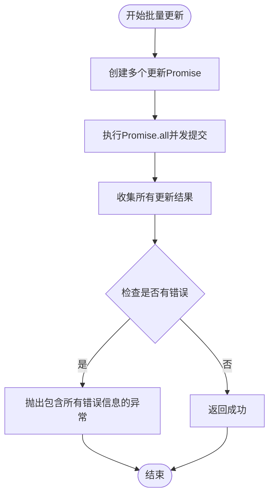
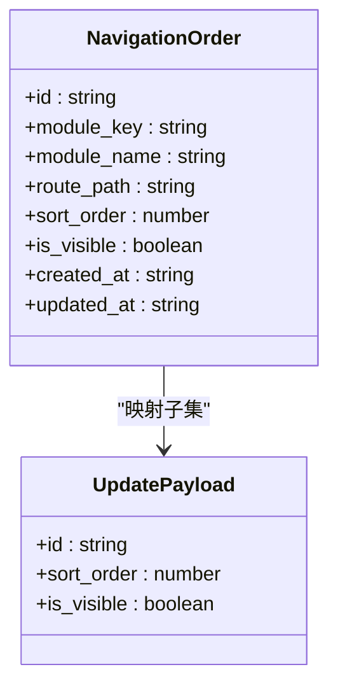
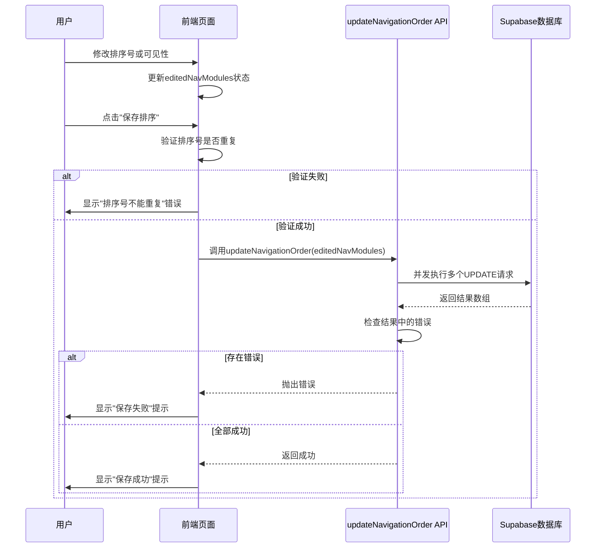

# updateNavigationOrder API

<cite>
**本文档引用的文件**   
- [api.ts](file://src/db/api.ts#L2793-L2810)
- [ModuleControlPage.tsx](file://src/pages/admin/ModuleControlPage.tsx#L70-L89)
- [NavigationOrderPage.tsx](file://src/pages/admin/NavigationOrderPage.tsx#L80-L98)
- [types.ts](file://src/types/types.ts#L173-L183)
- [00018_create_navigation_order_table.sql](file://supabase/migrations/00018_create_navigation_order_table.sql#L29-L39)
</cite>

## 目录
1. [简介](#简介)
2. [核心功能与实现机制](#核心功能与实现机制)
3. [参数类型定义与前端映射](#参数类型定义与前端映射)
4. [调用流程分析](#调用流程分析)
5. [事务性保证策略](#事务性保证策略)
6. [使用建议与最佳实践](#使用建议与最佳实践)

## 简介
`updateNavigationOrder` API 是一个用于批量更新导航模块排序和可见性状态的核心接口。该接口通过 Supabase 数据库操作，支持管理员在后台管理系统中调整前端导航栏的显示顺序和模块可见性。其设计目标是确保多条更新操作能够高效、一致地提交到数据库，并在发生部分失败时提供清晰的错误反馈。

**Section sources**
- [api.ts](file://src/db/api.ts#L2793-L2810)

## 核心功能与实现机制
`updateNavigationOrder` 函数实现了对 `navigation_order` 表中多个记录的并发更新。其核心机制基于 `Promise.all`，将多个独立的更新操作并行提交至 Supabase，从而显著提升批量更新的性能。

该函数接收一个包含多个更新对象的数组作为参数，每个对象包含 `id`、`sort_order` 和 `is_visible` 三个字段。函数内部通过 `map` 方法为每个更新对象创建一个对应的 Supabase 更新请求，并将这些请求封装为 Promise 数组。随后，使用 `Promise.all` 并发执行所有请求，并等待它们全部完成。

**Diagram sources**
- [api.ts](file://src/db/api.ts#L2795-L2809)

**Section sources**
- [api.ts](file://src/db/api.ts#L2793-L2810)

## 参数类型定义与前端映射
`updateNavigationOrder` 的参数类型在代码中被明确定义为 `Array<{ id: string; sort_order: number; is_visible: boolean }>`。这一结构与前端编辑状态直接对应，确保了数据的一致性和可预测性。

在前端，`NavigationOrder` 接口（定义于 `types.ts`）描述了导航模块的完整数据结构，包括 `id`、`module_key`、`module_name`、`route_path`、`sort_order`、`is_visible` 等字段。当用户在 `ModuleControlPage` 或 `NavigationOrderPage` 中修改排序号或可见性开关时，这些更改会实时反映在 `editedNavModules` 状态数组中。

当用户点击“保存”按钮时，前端会从 `editedNavModules` 数组中提取 `id`、`sort_order` 和 `is_visible` 三个字段，构建出符合 API 要求的更新数组，并将其作为参数传递给 `updateNavigationOrder` 函数。

**Diagram sources**
- [types.ts](file://src/types/types.ts#L173-L183)
- [api.ts](file://src/db/api.ts#L2793-L2794)

**Section sources**
- [types.ts](file://src/types/types.ts#L173-L183)
- [api.ts](file://src/db/api.ts#L2793-L2794)

## 调用流程分析
`updateNavigationOrder` API 主要在两个管理页面中被调用：`ModuleControlPage` 和 `NavigationOrderPage`。这两个页面的调用流程高度相似，均遵循“加载数据 -> 编辑状态 -> 验证 -> 保存”的模式。

以 `ModuleControlPage` 为例，其调用流程如下：
1.  页面加载时，通过 `getNavigationOrder` 获取当前所有导航模块的配置。
2.  用户通过输入框修改 `sort_order` 或通过开关切换 `is_visible` 状态，这些更改会更新 `editedNavModules` 状态。
3.  当用户点击“保存排序”按钮时，触发 `handleSaveNavOrder` 函数。
4.  该函数首先执行前端验证，检查排序号是否重复。
5.  验证通过后，直接调用 `updateNavigationOrder(editedNavModules)` 提交更新。
6.  如果更新成功，则同步本地状态并显示成功提示；如果失败，则捕获异常并显示错误提示。

**Diagram sources**
- [ModuleControlPage.tsx](file://src/pages/admin/ModuleControlPage.tsx#L70-L89)
- [api.ts](file://src/db/api.ts#L2793-L2810)

**Section sources**
- [ModuleControlPage.tsx](file://src/pages/admin/ModuleControlPage.tsx#L70-L89)

## 事务性保证策略
尽管 `updateNavigationOrder` 使用 `Promise.all` 进行并发操作，而非数据库层面的原子事务，但它通过一种应用层的“伪事务”策略来保证数据的一致性。

其核心策略是“全成功或全失败”：
1.  **并发执行**：所有更新操作通过 `Promise.all` 并行提交，以提高效率。
2.  **结果收集**：`Promise.all` 会返回一个包含所有更新结果的对象数组，每个结果都包含可能的 `error` 字段。
3.  **错误检查**：函数会遍历所有结果，使用 `filter` 方法筛选出包含 `error` 的结果。
4.  **一致性保证**：如果发现任何一个更新操作失败（即 `errors.length > 0`），函数会立即抛出一个包含所有错误信息的异常。这意味着，即使部分更新已经成功写入数据库，整个操作也会被视为失败。

这种策略确保了从客户端的角度来看，更新操作是原子的：要么所有更改都生效，要么都不生效。虽然数据库中可能已存在部分成功写入的数据，但由于前端在失败后不会更新本地状态，用户感知到的仍然是“未保存”的状态，从而避免了数据不一致的问题。

**Section sources**
- [api.ts](file://src/db/api.ts#L2803-L2809)

## 使用建议与最佳实践
为了确保 `updateNavigationOrder` API 的稳定和可靠使用，提出以下建议：

### 处理部分更新失败
由于该 API 采用“全成功或全失败”策略，一旦发生错误，整个批量操作都会失败。因此，前端应：
- **提供详细的错误信息**：捕获并解析 API 抛出的错误消息，向用户展示具体是哪些模块的更新失败了。
- **实现重试机制**：在用户修正错误后，允许重新提交整个更新请求。
- **考虑降级方案**：在极端情况下，可以考虑将批量更新拆分为单个更新，但这会牺牲性能。

### 前端验证的必要性
在调用 API 之前，进行充分的前端验证至关重要：
- **排序号唯一性**：如 `ModuleControlPage` 所示，必须在提交前检查 `sort_order` 是否重复。这不仅能提升用户体验（即时反馈），还能避免不必要的数据库操作。
- **输入有效性**：确保 `sort_order` 为正整数，`id` 不为空等。
- **网络状态检查**：在提交前确认网络连接正常，以减少因网络问题导致的失败。

**Section sources**
- [ModuleControlPage.tsx](file://src/pages/admin/ModuleControlPage.tsx#L73-L78)
- [api.ts](file://src/db/api.ts#L2806-L2808)