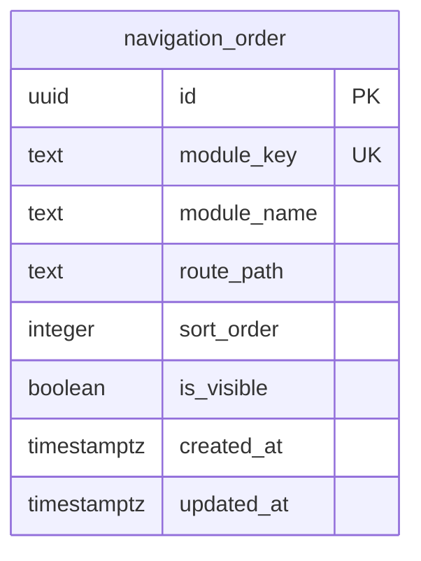
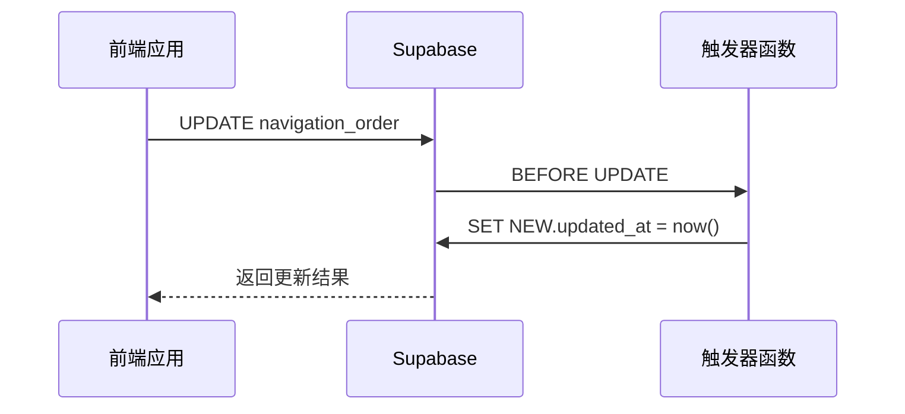
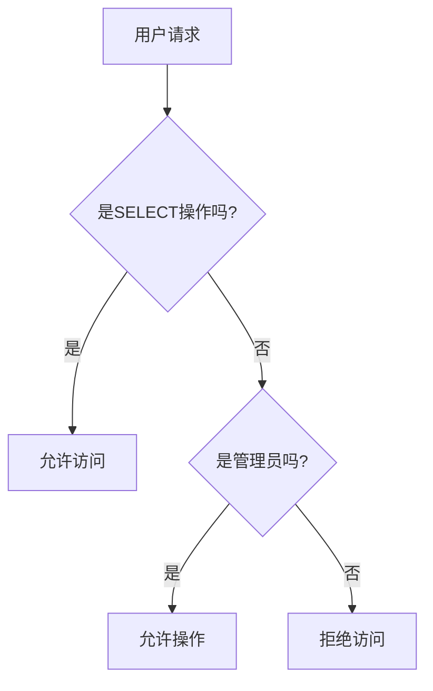
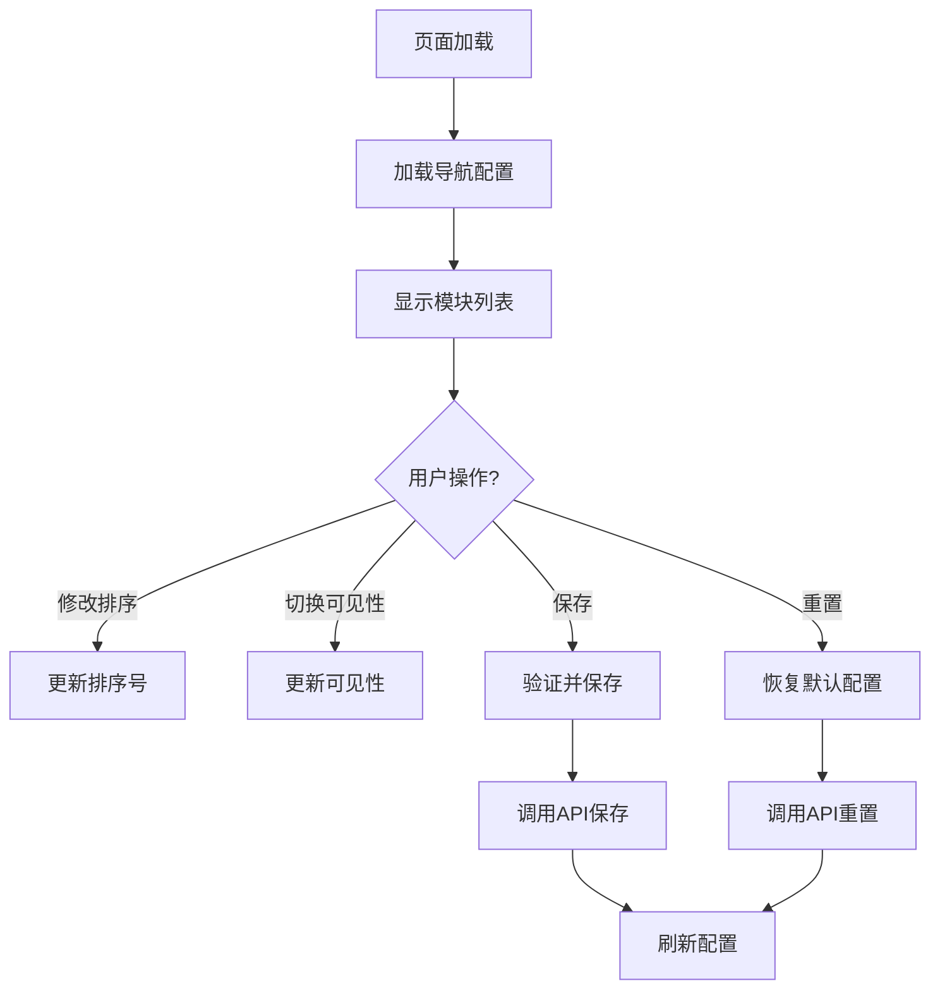
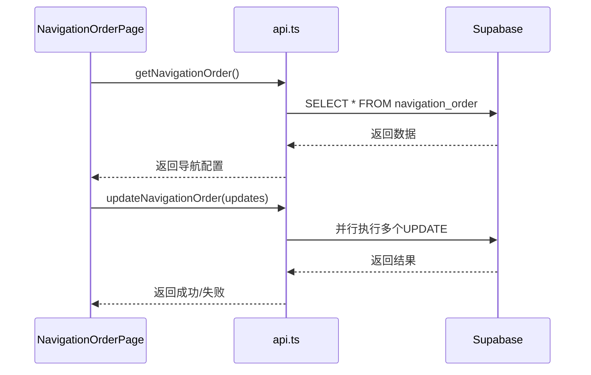
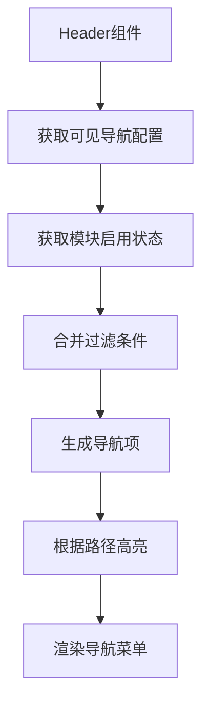
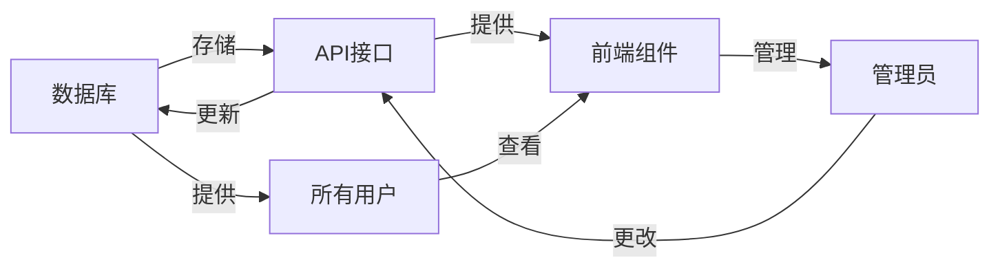

# 导航顺序表迁移

<cite>
**本文档引用的文件**  
- [00018_create_navigation_order_table.sql](file://supabase/migrations/00018_create_navigation_order_table.sql)
- [NavigationOrderPage.tsx](file://src/pages/admin/NavigationOrderPage.tsx)
- [api.ts](file://src/db/api.ts)
- [types.ts](file://src/types/types.ts)
- [Header.tsx](file://src/components/common/Header.tsx)
- [ModuleContext.tsx](file://src/contexts/ModuleContext.tsx)
</cite>

## 目录
1. [简介](#简介)
2. [数据库迁移脚本分析](#数据库迁移脚本分析)
3. [核心数据结构与字段设计](#核心数据结构与字段设计)
4. [触发器与时间戳更新机制](#触发器与时间戳更新机制)
5. [行级安全策略配置](#行级安全策略配置)
6. [前端管理界面实现](#前端管理界面实现)
7. [前端API交互逻辑](#前端api交互逻辑)
8. [导航菜单渲染机制](#导航菜单渲染机制)
9. [系统集成与业务流程](#系统集成与业务流程)
10. [结论](#结论)

## 简介
本技术文档深入解析`00018_create_navigation_order_table.sql`迁移脚本的技术实现。该脚本创建了`navigation_order`表，用于持久化管理前端导航菜单的排序配置。文档将详细说明该表的结构设计、安全策略、触发器机制，以及如何通过`NavigationOrderPage`组件实现管理后台的导航排序功能。

## 数据库迁移脚本分析

`00018_create_navigation_order_table.sql`迁移脚本的主要功能是创建`navigation_order`表来存储前端导航栏模块的排序配置。该表支持管理员通过管理后台调整模块的显示顺序和可见性状态。

脚本首先创建`navigation_order`表，包含`id`、`module_key`、`module_name`、`route_path`、`sort_order`、`is_visible`、`created_at`和`updated_at`等字段。其中`module_key`字段具有唯一约束，确保每个模块标识的唯一性。

脚本还创建了两个索引：`idx_navigation_order_sort`用于加速按排序号查询，`idx_navigation_order_visible`用于加速按可见性查询。这些索引优化了前端获取导航配置时的查询性能。

此外，脚本插入了默认的导航模块配置，包括首页、案例查询、监管资讯、监管部门、趋势分析和问题分析等模块，按照预设的顺序初始化。

**Section sources**
- [00018_create_navigation_order_table.sql](file://supabase/migrations/00018_create_navigation_order_table.sql#L29-L66)

## 核心数据结构与字段设计

`navigation_order`表的设计旨在持久化管理导航菜单的排序配置。表中各字段的设计意图如下：

`id`字段作为主键，使用UUID生成唯一标识符，确保每条记录的唯一性。`module_key`字段作为模块的唯一标识，具有唯一约束，防止重复的模块标识。`module_name`字段存储模块的显示名称，`route_path`字段存储模块的路由路径。

`sort_order`字段是排序的关键依据，存储整数类型的排序序号。数字越小表示越靠前显示。该字段的设计允许管理员通过输入数字来精确控制模块的显示位置。

`is_visible`字段是布尔类型，用于控制模块的显示/隐藏状态。默认值为true，表示模块默认可见。`created_at`和`updated_at`字段存储记录的创建时间和更新时间，用于审计和调试。

**Diagram sources**
- [00018_create_navigation_order_table.sql](file://supabase/migrations/00018_create_navigation_order_table.sql#L30-L38)

**Section sources**
- [00018_create_navigation_order_table.sql](file://supabase/migrations/00018_create_navigation_order_table.sql#L30-L38)
- [types.ts](file://src/types/types.ts#L174-L182)

## 触发器与时间戳更新机制

迁移脚本实现了`update_navigation_order_updated_at`触发器函数，用于自动更新`updated_at`字段。该机制确保每次记录被修改时，`updated_at`字段都会自动更新为当前时间。

触发器函数`update_navigation_order_updated_at`是一个PL/pgSQL函数，其执行逻辑如下：在`BEFORE UPDATE`触发时，将`NEW.updated_at`设置为当前时间`now()`，然后返回修改后的记录。这种设计避免了前端需要手动设置更新时间的复杂性。

触发器`trigger_update_navigation_order_updated_at`在`navigation_order`表的每次更新操作前触发，执行`update_navigation_order_updated_at`函数。这种自动化的时间戳管理机制确保了数据的一致性和完整性。

**Diagram sources**
- [00018_create_navigation_order_table.sql](file://supabase/migrations/00018_create_navigation_order_table.sql#L69-L82)

**Section sources**
- [00018_create_navigation_order_table.sql](file://supabase/migrations/00018_create_navigation_order_table.sql#L69-L82)

## 行级安全策略配置

`navigation_order`表配置了行级安全（RLS）策略，以控制不同用户角色的访问权限。这些安全策略确保了数据的安全性和访问控制。

表启用了行级安全，定义了两个策略：`Anyone can view navigation order`和`Admins can manage navigation order`。第一个策略允许所有用户读取导航配置，使用`FOR SELECT USING (true)`条件，表示任何人都可以查看。

第二个策略限制了修改权限，仅允许管理员用户进行所有操作（INSERT、UPDATE、DELETE）。该策略使用`is_admin(auth.uid())`函数检查当前用户是否为管理员。`USING`条件用于SELECT、UPDATE和DELETE操作的权限检查，`WITH CHECK`条件用于INSERT和UPDATE操作的数据验证。

这种安全策略设计确保了导航配置的公开可读性，同时保护了配置的修改权限，防止非管理员用户篡改导航顺序。

**Diagram sources**
- [00018_create_navigation_order_table.sql](file://supabase/migrations/00018_create_navigation_order_table.sql#L46-L56)

**Section sources**
- [00018_create_navigation_order_table.sql](file://supabase/migrations/00018_create_navigation_order_table.sql#L46-L56)

## 前端管理界面实现

`NavigationOrderPage`组件实现了管理后台的导航排序功能，提供了一个直观的界面供管理员调整导航模块的顺序和可见性。

组件使用React Hooks管理状态，包括`modules`（当前导航配置）、`editedModules`（编辑中的配置）、`loading`（加载状态）等。页面初始化时通过`loadNavigationOrder`函数加载当前的导航配置。

界面提供了排序号输入框、可见性开关和操作按钮。排序号输入框允许管理员输入数字来调整模块的显示位置，可见性开关使用Eye和EyeOff图标直观地表示模块的显示/隐藏状态。

组件还实现了保存、取消和重置功能。保存功能会检查排序号是否重复，确保数据的完整性。重置功能可以恢复到默认的排序配置。这些功能通过调用后端API实现，确保了前后端的数据同步。

**Diagram sources**
- [NavigationOrderPage.tsx](file://src/pages/admin/NavigationOrderPage.tsx#L14-L295)

**Section sources**
- [NavigationOrderPage.tsx](file://src/pages/admin/NavigationOrderPage.tsx#L14-L295)

## 前端API交互逻辑

前端通过`api.ts`文件中的API函数与后端进行交互，实现了导航配置的读取和更新功能。这些API函数封装了Supabase客户端的调用，提供了类型安全的接口。

`getNavigationOrder`函数用于获取所有导航模块配置，按`sort_order`升序排列。`getVisibleNavigationOrder`函数则只获取可见的模块配置，用于前端导航菜单的渲染。

`updateNavigationOrder`函数批量更新导航模块的排序和可见性，使用Promise.all并行执行多个更新操作，提高了性能。`updateNavigationVisibility`函数专门用于更新单个模块的可见性，提供了更细粒度的控制。

`resetNavigationOrder`函数用于重置导航排序为默认值，通过更新预设的排序配置来实现。这些API函数都包含了错误处理机制，确保在操作失败时能够正确抛出异常。

**Diagram sources**
- [api.ts](file://src/db/api.ts#L2766-L2850)

**Section sources**
- [api.ts](file://src/db/api.ts#L2766-L2850)

## 导航菜单渲染机制

前端导航菜单的渲染机制结合了`navigation_order`表的配置和`ModuleContext`的状态管理。`Header`组件负责渲染导航菜单，从多个数据源获取信息。

`Header`组件通过`getVisibleNavigationOrder`获取可见的导航模块配置，并根据`ModuleContext`中的模块启用状态进一步过滤。这种双重过滤机制确保了只有启用且可见的模块才会显示在导航菜单中。

组件使用`location.pathname`来确定当前激活的导航项，并应用相应的样式。移动端使用Sheet组件提供响应式菜单，确保在不同设备上的良好用户体验。

`ModuleContext`提供了`isModuleEnabled`函数，用于检查模块是否启用。这个上下文在应用启动时加载模块设置，并提供刷新功能，确保模块状态的实时性。

**Diagram sources**
- [Header.tsx](file://src/components/common/Header.tsx#L20-L262)
- [ModuleContext.tsx](file://src/contexts/ModuleContext.tsx#L1-L61)

**Section sources**
- [Header.tsx](file://src/components/common/Header.tsx#L20-L262)
- [ModuleContext.tsx](file://src/contexts/ModuleContext.tsx#L1-L61)

## 系统集成与业务流程

导航排序功能的实现涉及多个组件的协同工作，形成了完整的业务流程。从数据库迁移、API接口到前端界面，各部分紧密集成。

当管理员访问`NavigationOrderPage`时，页面加载当前的导航配置。管理员可以调整排序号或切换可见性，这些更改在本地状态中暂存。点击保存时，前端验证排序号的唯一性，然后调用`updateNavigationOrder`API。

API将更新请求发送到Supabase，触发数据库的更新操作。`update_navigation_order_updated_at`触发器自动更新`updated_at`字段。行级安全策略确保只有管理员才能执行此操作。

其他用户访问网站时，`Header`组件获取最新的导航配置，按照`sort_order`排序并渲染导航菜单。这种设计实现了配置的集中管理和全局一致性。

**Diagram sources**
- [00018_create_navigation_order_table.sql](file://supabase/migrations/00018_create_navigation_order_table.sql)
- [api.ts](file://src/db/api.ts)
- [NavigationOrderPage.tsx](file://src/pages/admin/NavigationOrderPage.tsx)
- [Header.tsx](file://src/components/common/Header.tsx)

**Section sources**
- [00018_create_navigation_order_table.sql](file://supabase/migrations/00018_create_navigation_order_table.sql)
- [api.ts](file://src/db/api.ts)
- [NavigationOrderPage.tsx](file://src/pages/admin/NavigationOrderPage.tsx)
- [Header.tsx](file://src/components/common/Header.tsx)

## 结论
`00018_create_navigation_order_table.sql`迁移脚本成功实现了导航菜单排序配置的持久化管理。通过精心设计的表结构、触发器机制和安全策略，该功能为管理员提供了灵活的导航管理能力。

`sort_order`字段作为排序依据，`module_key`的唯一约束确保了模块标识的唯一性，`is_visible`字段提供了显示/隐藏控制。触发器自动维护`updated_at`字段，简化了时间戳管理。

前端`NavigationOrderPage`组件提供了直观的管理界面，结合API函数实现了完整的CRUD操作。`Header`组件利用这些配置动态渲染导航菜单，实现了配置的全局一致性。

该迁移脚本和相关组件的实现，不仅满足了导航排序的基本需求，还通过行级安全策略确保了数据安全，为系统的可维护性和可扩展性奠定了基础。