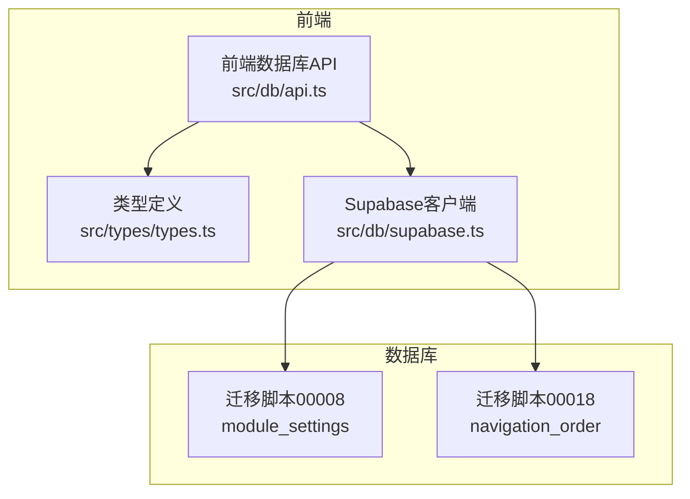
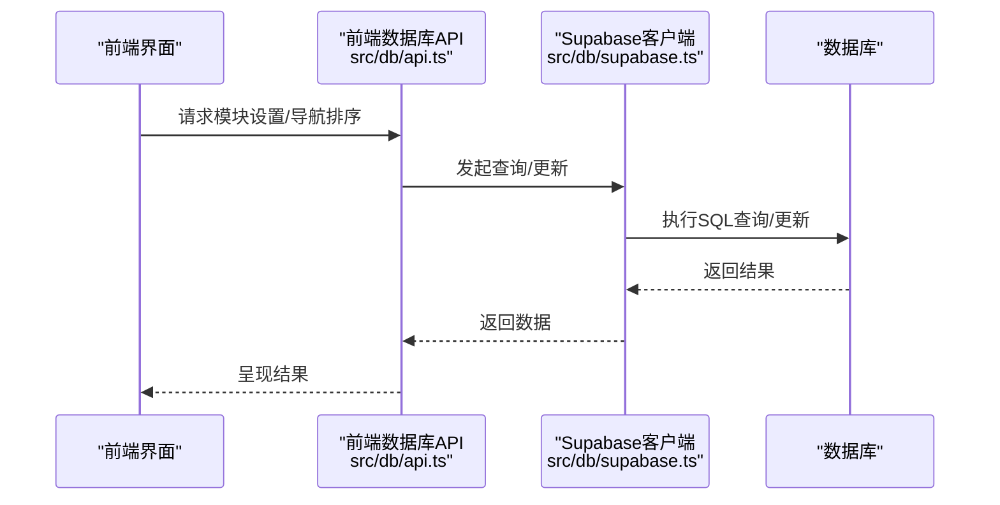
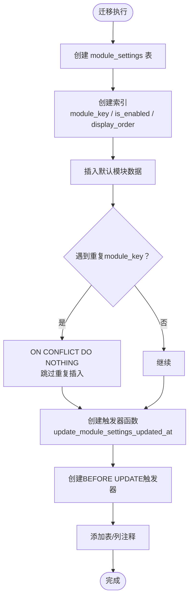
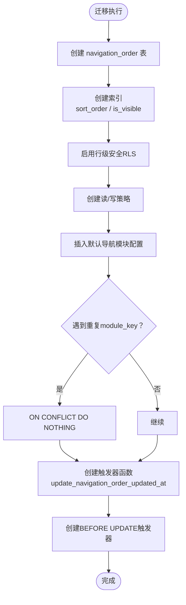
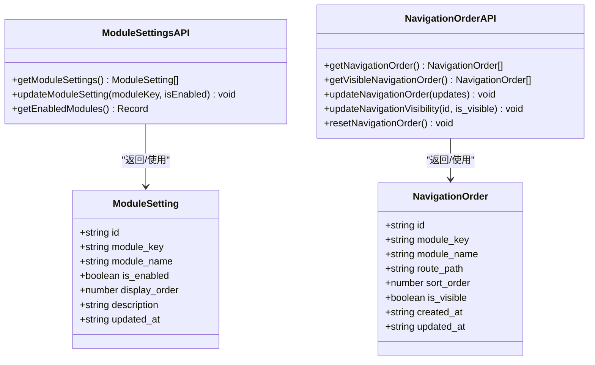
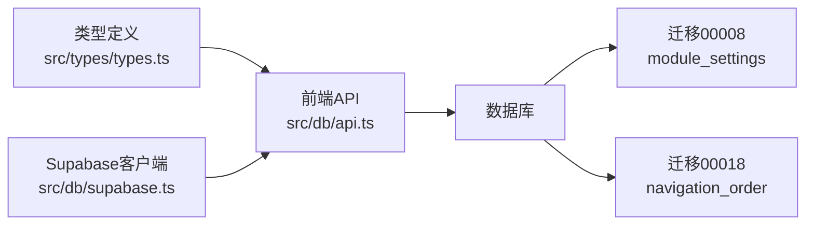

# 数据库迁移管理

<cite>
**本文引用的文件**
- [00008_create_module_settings.sql](file://supabase/migrations/00008_create_module_settings.sql)
- [00018_create_navigation_order_table.sql](file://supabase/migrations/00018_create_navigation_order_table.sql)
- [api.ts](file://src/db/api.ts)
- [types.ts](file://src/types/types.ts)
- [supabase.ts](file://src/db/supabase.ts)
</cite>

## 目录
1. [简介](#简介)
2. [项目结构](#项目结构)
3. [核心组件](#核心组件)
4. [架构总览](#架构总览)
5. [详细组件分析](#详细组件分析)
6. [依赖关系分析](#依赖关系分析)
7. [性能考量](#性能考量)
8. [故障排查指南](#故障排查指南)
9. [结论](#结论)
10. [附录](#附录)

## 简介
本文件聚焦于两个关键数据库迁移脚本：00008_create_module_settings.sql 与 00018_create_navigation_order_table.sql。目标是系统化说明这两个迁移的执行流程、表结构设计、索引与安全策略（RLS）、触发器实现，以及如何通过 ON CONFLICT 子句保证初始数据的幂等插入；同时解释触发器函数如何自动维护 updated_at 时间戳，并给出迁移版本控制策略与团队协作建议。

## 项目结构
- 迁移脚本位于 supabase/migrations 目录，分别负责“模块设置表”和“导航模块排序配置表”的创建与初始化。
- 前端通过 src/db/api.ts 中的数据库访问函数与后端交互，使用 src/db/supabase.ts 提供的 Supabase 客户端进行查询与更新。
- 类型定义位于 src/types/types.ts，明确 module_settings 与 navigation_order 的字段结构，便于前后端一致性。

图示来源
- [api.ts](file://src/db/api.ts#L2535-L2596)
- [types.ts](file://src/types/types.ts#L81-L90)
- [supabase.ts](file://src/db/supabase.ts#L1-L8)
- [00008_create_module_settings.sql](file://supabase/migrations/00008_create_module_settings.sql#L30-L78)
- [00018_create_navigation_order_table.sql](file://supabase/migrations/00018_create_navigation_order_table.sql#L29-L83)

章节来源
- [api.ts](file://src/db/api.ts#L2535-L2596)
- [types.ts](file://src/types/types.ts#L81-L90)
- [supabase.ts](file://src/db/supabase.ts#L1-L8)
- [00008_create_module_settings.sql](file://supabase/migrations/00008_create_module_settings.sql#L30-L78)
- [00018_create_navigation_order_table.sql](file://supabase/migrations/00018_create_navigation_order_table.sql#L29-L83)

## 核心组件
- 模块设置表（module_settings）
  - 用途：前台功能模块可见性与显示顺序控制。
  - 关键字段：id、module_key（唯一）、module_name、is_enabled、display_order、description、updated_at。
  - 初始数据：包含案例查询、监管资讯、监管部门、趋势分析、问题分析五个模块。
  - 触发器：自动更新 updated_at。
- 导航模块排序配置表（navigation_order）
  - 用途：前端导航栏模块的排序与可见性控制。
  - 关键字段：id、module_key（唯一）、module_name、route_path、sort_order、is_visible、created_at、updated_at。
  - 安全策略：启用 RLS，允许所有人读取，仅管理员可写。
  - 初始数据：默认包含首页、案例查询、监管资讯、监管部门、趋势分析、问题分析六个模块。
  - 触发器：自动更新 updated_at。

章节来源
- [00008_create_module_settings.sql](file://supabase/migrations/00008_create_module_settings.sql#L30-L78)
- [00018_create_navigation_order_table.sql](file://supabase/migrations/00018_create_navigation_order_table.sql#L29-L83)

## 架构总览
从前端到数据库的典型调用链如下：前端通过 Supabase 客户端调用后端 API，API 再访问对应表，迁移脚本确保表结构、索引、RLS 与触发器在数据库侧正确存在。

图示来源
- [api.ts](file://src/db/api.ts#L2535-L2596)
- [supabase.ts](file://src/db/supabase.ts#L1-L8)

## 详细组件分析

### 组件A：模块设置表（module_settings）
- 表结构与索引
  - 主键：id（UUID，自动生成）。
  - 唯一约束：module_key。
  - 索引：module_key、is_enabled、display_order。
  - 字段含义：模块标识、显示名称、启用状态、显示顺序、描述、更新时间。
- 初始数据与幂等插入
  - 迁移脚本通过 INSERT ... ON CONFLICT (module_key) DO NOTHING 实现幂等插入，避免重复数据。
- 触发器与时间戳
  - 触发器函数在每次 UPDATE 前将 updated_at 设置为当前时间，确保审计与排序一致性。
- 安全策略
  - 未启用 RLS，允许所有用户读取模块设置（满足前台展示需求）。

图示来源
- [00008_create_module_settings.sql](file://supabase/migrations/00008_create_module_settings.sql#L30-L78)

章节来源
- [00008_create_module_settings.sql](file://supabase/migrations/00008_create_module_settings.sql#L30-L78)

### 组件B：导航模块排序配置表（navigation_order）
- 表结构与索引
  - 主键：id（UUID，自动生成）。
  - 唯一约束：module_key。
  - 索引：sort_order、is_visible。
  - 字段含义：模块标识、名称、路由路径、排序序号、可见性、创建/更新时间。
- 安全策略（RLS）
  - 启用 RLS。
  - 读策略：所有人可读（FOR SELECT USING (true)）。
  - 写策略：仅认证用户且具备管理员权限方可写（FOR ALL TO authenticated USING (is_admin(auth.uid())) WITH CHECK (is_admin(auth.uid()))）。
- 初始数据与幂等插入
  - 迁移脚本通过 INSERT ... ON CONFLICT (module_key) DO NOTHING 实现幂等插入。
- 触发器与时间戳
  - 触发器函数在每次 UPDATE 前将 updated_at 设置为当前时间。

图示来源
- [00018_create_navigation_order_table.sql](file://supabase/migrations/00018_create_navigation_order_table.sql#L29-L83)

章节来源
- [00018_create_navigation_order_table.sql](file://supabase/migrations/00018_create_navigation_order_table.sql#L29-L83)

### 组件C：前端API与类型映射
- 类型定义
  - ModuleSetting：对应 module_settings 的字段集合。
  - NavigationOrder：对应 navigation_order 的字段集合。
- 前端API
  - 模块设置相关：getModuleSettings、updateModuleSetting、getEnabledModules。
  - 导航排序相关：getNavigationOrder、getVisibleNavigationOrder、updateNavigationOrder、updateNavigationVisibility、resetNavigationOrder。
- 数据流
  - 前端通过 Supabase 客户端调用上述函数，函数内部使用 supabase.from(table).select/update 等方法访问数据库。
  - 迁移脚本确保表结构、索引、RLS、触发器在数据库侧就绪，前端 API 与之匹配。

图示来源
- [types.ts](file://src/types/types.ts#L81-L90)
- [types.ts](file://src/types/types.ts#L173-L184)
- [api.ts](file://src/db/api.ts#L2535-L2596)
- [api.ts](file://src/db/api.ts#L2762-L2851)

章节来源
- [types.ts](file://src/types/types.ts#L81-L90)
- [types.ts](file://src/types/types.ts#L173-L184)
- [api.ts](file://src/db/api.ts#L2535-L2596)
- [api.ts](file://src/db/api.ts#L2762-L2851)

## 依赖关系分析
- 前端依赖
  - Supabase 客户端：提供数据库访问能力。
  - 类型定义：确保前后端字段一致。
  - API 函数：封装数据库操作，提供稳定的接口。
- 数据库依赖
  - 迁移脚本：定义表结构、索引、RLS、触发器与初始数据。
  - 触发器函数：统一维护 updated_at，保证审计与排序一致性。
- 外部依赖
  - Supabase 认证与授权：is_admin(auth.uid()) 用于管理员权限判断。

图示来源
- [types.ts](file://src/types/types.ts#L81-L90)
- [api.ts](file://src/db/api.ts#L2535-L2596)
- [supabase.ts](file://src/db/supabase.ts#L1-L8)
- [00008_create_module_settings.sql](file://supabase/migrations/00008_create_module_settings.sql#L30-L78)
- [00018_create_navigation_order_table.sql](file://supabase/migrations/00018_create_navigation_order_table.sql#L29-L83)

章节来源
- [types.ts](file://src/types/types.ts#L81-L90)
- [api.ts](file://src/db/api.ts#L2535-L2596)
- [supabase.ts](file://src/db/supabase.ts#L1-L8)
- [00008_create_module_settings.sql](file://supabase/migrations/00008_create_module_settings.sql#L30-L78)
- [00018_create_navigation_order_table.sql](file://supabase/migrations/00018_create_navigation_order_table.sql#L29-L83)

## 性能考量
- 索引设计
  - module_settings：对 module_key、is_enabled、display_order 建立索引，有利于按启用状态与显示顺序查询。
  - navigation_order：对 sort_order、is_visible 建立索引，支持导航排序与可见性过滤。
- 查询模式
  - 前端常用排序与过滤（如 display_order、sort_order、is_enabled/is_visible），索引可显著降低查询成本。
- 触发器开销
  - 触发器函数简单地更新 updated_at，开销极低，但可带来一致的时间戳维护。
- 幂等插入
  - 使用 ON CONFLICT DO NOTHING，避免重复插入带来的写放大与锁竞争。

章节来源
- [00008_create_module_settings.sql](file://supabase/migrations/00008_create_module_settings.sql#L41-L44)
- [00018_create_navigation_order_table.sql](file://supabase/migrations/00018_create_navigation_order_table.sql#L41-L43)
- [api.ts](file://src/db/api.ts#L2535-L2596)
- [api.ts](file://src/db/api.ts#L2762-L2851)

## 故障排查指南
- 重复数据问题
  - 现象：初始数据重复插入导致异常。
  - 解决：确认迁移脚本使用了 ON CONFLICT (module_key) DO NOTHING，确保幂等。
- 权限不足
  - 现象：更新 navigation_order 报权限错误。
  - 解决：确认用户已认证且具备管理员权限（is_admin(auth.uid())），RLS 策略限制仅管理员可写。
- 触发器未生效
  - 现象：更新记录后 updated_at 未变化。
  - 解决：检查触发器是否存在（BEFORE UPDATE），确认触发器函数已创建并绑定。
- 查询性能差
  - 现象：按显示顺序或可见性查询较慢。
  - 解决：确认索引已创建并生效；必要时重建索引或调整查询条件。

章节来源
- [00008_create_module_settings.sql](file://supabase/migrations/00008_create_module_settings.sql#L53-L70)
- [00018_create_navigation_order_table.sql](file://supabase/migrations/00018_create_navigation_order_table.sql#L45-L67)
- [api.ts](file://src/db/api.ts#L2762-L2851)

## 结论
- 两个迁移脚本分别建立了模块设置与导航排序配置的核心表，提供了完善的索引、RLS 安全策略与触发器机制。
- 通过 ON CONFLICT DO NOTHING 实现初始数据的幂等插入，确保多次执行迁移的安全性。
- 触发器函数统一维护 updated_at，保障审计与排序一致性。
- 前端 API 与类型定义清晰，配合迁移脚本形成完整的数据层闭环。

## 附录

### 迁移版本控制与团队协作建议
- 版本命名规范
  - 使用递增数字前缀（如 00008、00018），确保执行顺序明确。
- 幂等性原则
  - 所有 DDL/DML 操作应具备幂等性，优先使用 IF NOT EXISTS、ON CONFLICT DO NOTHING 等机制。
- RLS 策略最小权限
  - 对公开读取的数据（如 module_settings）保持宽松策略；对敏感或管理类数据（如 navigation_order）严格限制。
- 触发器与审计
  - 统一使用触发器维护 updated_at，减少业务代码分散逻辑。
- 团队协作
  - 迁移脚本需通过代码评审，确保索引、RLS、触发器与业务需求一致。
  - 在合并前先在测试环境执行迁移，验证查询与权限。
  - 记录迁移影响范围与回滚步骤，便于问题定位与恢复。