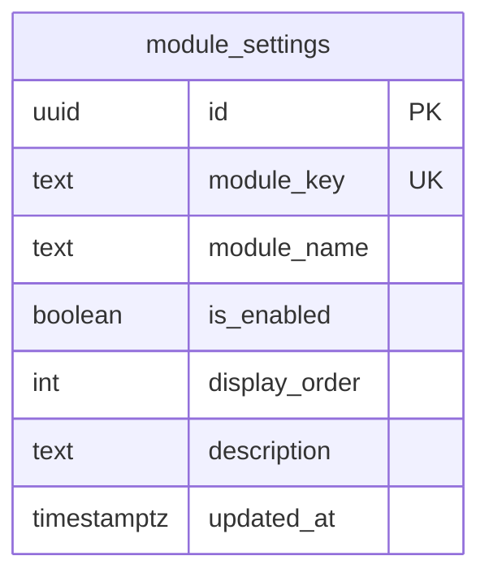
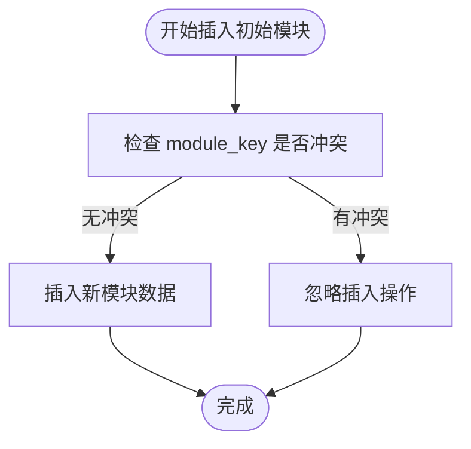
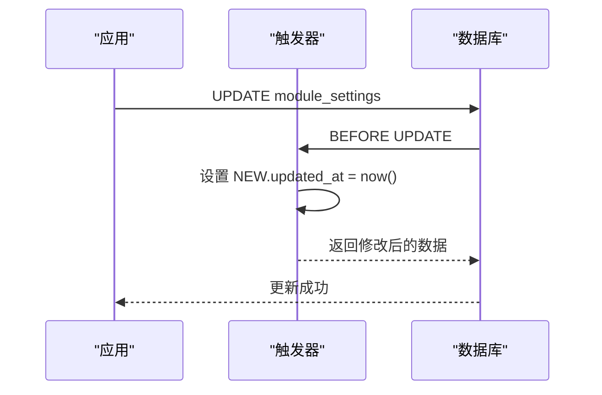
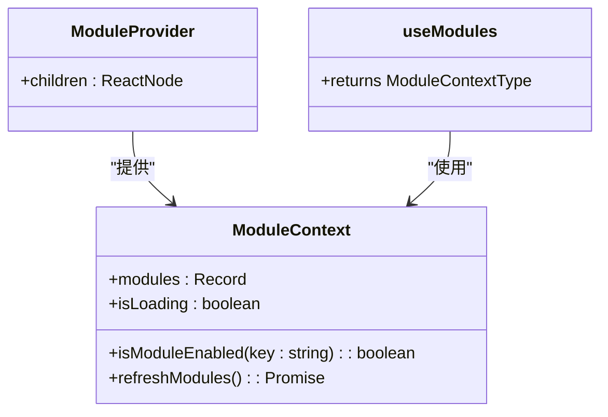
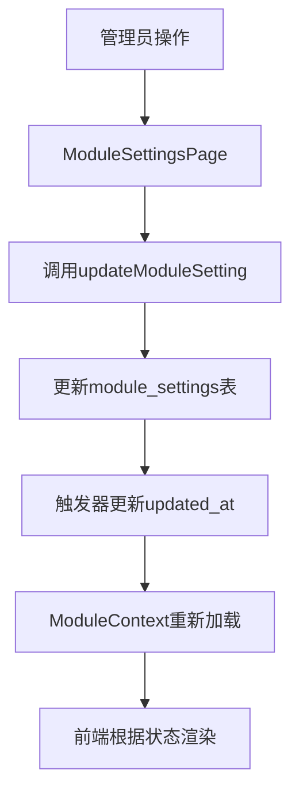

# 模块设置表迁移

<cite>
**本文档引用的文件**  
- [00008_create_module_settings.sql](file://supabase/migrations/00008_create_module_settings.sql)
- [ModuleContext.tsx](file://src/contexts/ModuleContext.tsx)
- [api.ts](file://src/db/api.ts)
- [ModuleSettingsPage.tsx](file://src/pages/admin/ModuleSettingsPage.tsx)
- [types.ts](file://src/types/types.ts)
</cite>

## 目录
1. [迁移脚本概述](#迁移脚本概述)
2. [表结构设计](#表结构设计)
3. [行级安全策略](#行级安全策略)
4. [初始数据插入机制](#初始数据插入机制)
5. [更新时间戳触发器](#更新时间戳触发器)
6. [前端模块控制集成](#前端模块控制集成)
7. [模块控制功能流程](#模块控制功能流程)

## 迁移脚本概述

`00008_create_module_settings.sql`迁移脚本用于创建`module_settings`表，以支持系统的模块控制功能。该脚本通过创建表结构、插入初始数据、配置触发器等方式，实现了对前台功能模块可见性与启用状态的集中管理。脚本设计考虑了幂等性、数据完整性与性能优化，确保在多次执行时不会产生数据冲突。

**Section sources**
- [00008_create_module_settings.sql](file://supabase/migrations/00008_create_module_settings.sql#L1-L78)

## 表结构设计

`module_settings`表定义了以下字段：

- `id`：UUID类型，主键，使用`gen_random_uuid()`函数自动生成
- `module_key`：文本类型，唯一且非空，作为模块的唯一标识符
- `module_name`：文本类型，非空，表示模块的显示名称
- `is_enabled`：布尔类型，默认值为true，表示模块是否启用
- `display_order`：整数类型，默认值为0，用于控制模块的显示顺序
- `description`：文本类型，可为空，描述模块的功能
- `updated_at`：时间戳类型，默认值为`now()`，记录最后更新时间

表结构设计支持模块的动态控制，通过`is_enabled`字段实现模块的启用/禁用，通过`display_order`字段控制显示顺序，满足了前端模块管理的需求。

**Diagram sources **
- [00008_create_module_settings.sql](file://supabase/migrations/00008_create_module_settings.sql#L31-L39)

**Section sources**
- [00008_create_module_settings.sql](file://supabase/migrations/00008_create_module_settings.sql#L31-L39)
- [types.ts](file://src/types/types.ts#L81-L89)

## 行级安全策略

该迁移脚本未启用行级安全（RLS），因为模块设置是公开的配置信息，需要被所有用户读取。根据脚本注释，安全策略设计为"允许所有用户读取模块设置（前台需要）"，这与系统的访问需求一致。模块设置数据不包含敏感信息，因此不需要复杂的访问控制。

**Section sources**
- [00008_create_module_settings.sql](file://supabase/migrations/00008_create_module_settings.sql#L14-L16)

## 初始数据插入机制

脚本通过`INSERT INTO ... ON CONFLICT DO NOTHING`语句插入5个默认模块的初始配置：

- 案例查询模块
- 监管资讯模块
- 监管部门模块
- 趋势分析模块
- 问题分析模块

`ON CONFLICT (module_key) DO NOTHING`子句确保了迁移的幂等性。当重复执行迁移时，如果`module_key`已存在，则忽略插入操作，避免了数据冲突。这种设计允许在不同环境中安全地重复应用迁移，确保了数据的一致性和可靠性。

**Diagram sources **
- [00008_create_module_settings.sql](file://supabase/migrations/00008_create_module_settings.sql#L47-L53)

**Section sources**
- [00008_create_module_settings.sql](file://supabase/migrations/00008_create_module_settings.sql#L47-L53)

## 更新时间戳触发器

脚本创建了`update_module_settings_updated_at`函数和相应的触发器，用于自动更新`updated_at`字段：

1. 创建`update_module_settings_updated_at`函数，将`NEW.updated_at`设置为当前时间
2. 创建`trigger_update_module_settings_updated_at`触发器，在每次更新前执行该函数

这种设计确保了每次修改模块设置时，`updated_at`字段都能自动更新，无需在应用代码中手动维护。触发器的使用提高了数据的一致性和完整性。

**Diagram sources **
- [00008_create_module_settings.sql](file://supabase/migrations/00008_create_module_settings.sql#L56-L69)

**Section sources**
- [00008_create_module_settings.sql](file://supabase/migrations/00008_create_module_settings.sql#L56-L69)

## 前端模块控制集成

`ModuleContext.tsx`使用`getEnabledModules`函数从`module_settings`表获取模块状态，并通过React Context提供给整个应用。当模块状态改变时，前端会重新加载模块配置，确保状态同步。

**Diagram sources **
- [ModuleContext.tsx](file://src/contexts/ModuleContext.tsx#L1-L62)
- [api.ts](file://src/db/api.ts#L2570-L2596)

**Section sources**
- [ModuleContext.tsx](file://src/contexts/ModuleContext.tsx#L1-L62)
- [api.ts](file://src/db/api.ts#L2570-L2596)

## 模块控制功能流程

模块控制功能通过前后端协作实现：

1. 管理员在`ModuleSettingsPage`页面通过开关控制模块状态
2. 前端调用`updateModuleSetting` API更新数据库
3. 数据库触发器自动更新`updated_at`字段
4. 前端`ModuleContext`重新加载模块状态
5. 应用根据新的模块状态渲染界面

这种设计实现了模块状态的集中管理，支持动态启用/禁用功能模块，提高了系统的灵活性和可维护性。

**Diagram sources **
- [ModuleSettingsPage.tsx](file://src/pages/admin/ModuleSettingsPage.tsx#L1-L167)
- [api.ts](file://src/db/api.ts#L2554-L2569)

**Section sources**
- [ModuleSettingsPage.tsx](file://src/pages/admin/ModuleSettingsPage.tsx#L1-L167)
- [api.ts](file://src/db/api.ts#L2554-L2569)