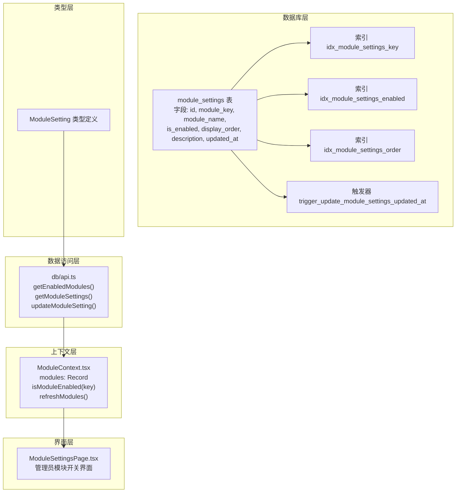
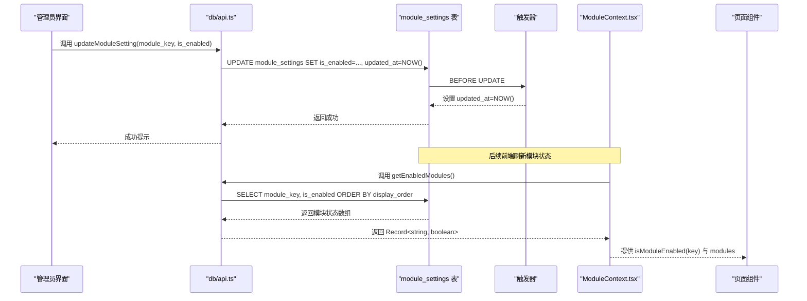
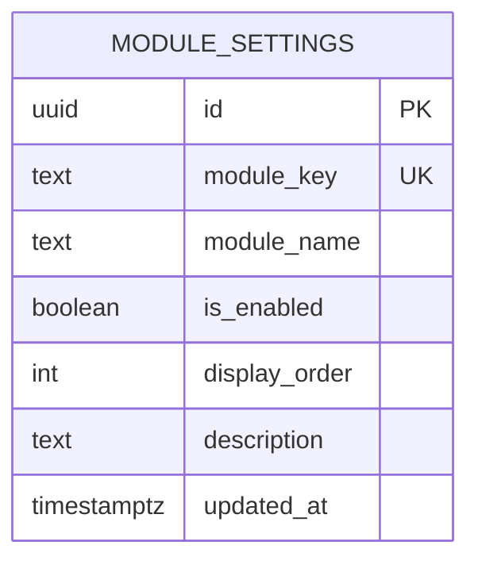
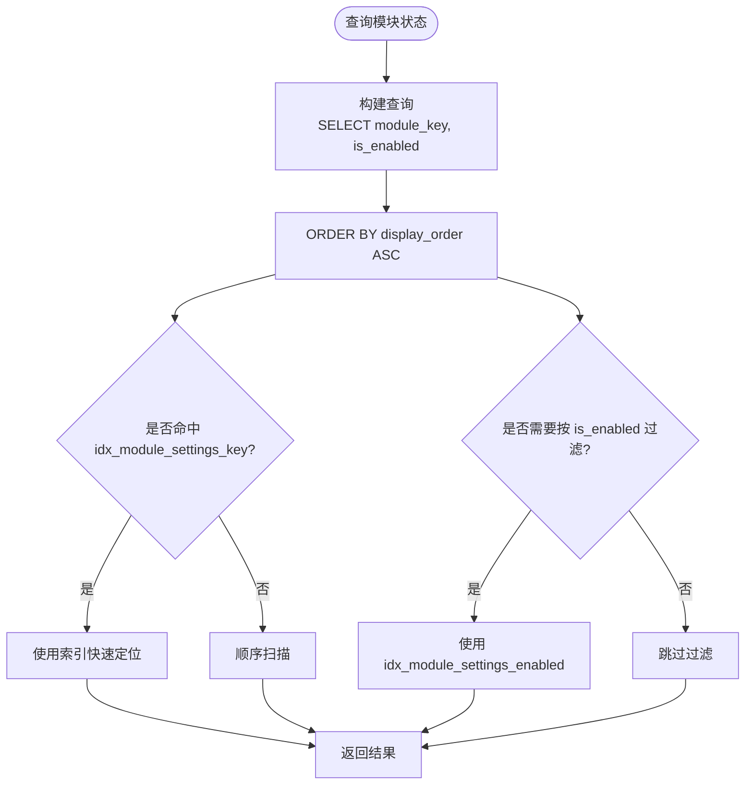
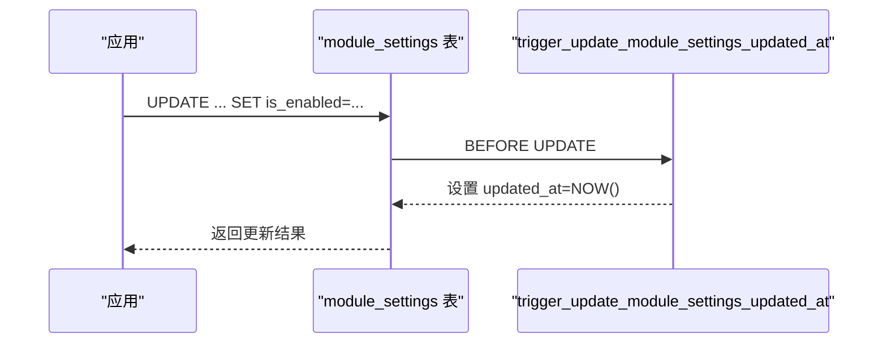
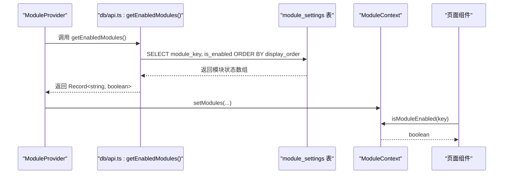
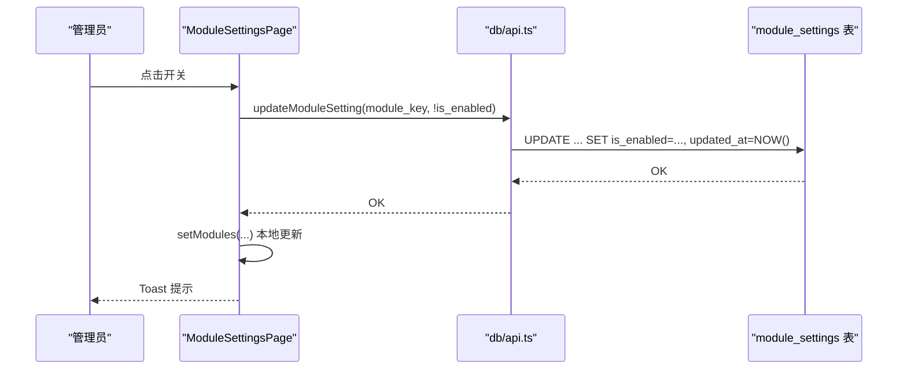
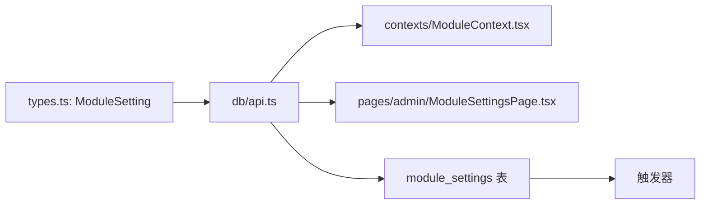

# module_settings表设计

<cite>
**本文引用的文件**
- [supabase/migrations/00008_create_module_settings.sql](file://supabase/migrations/00008_create_module_settings.sql)
- [src/db/api.ts](file://src/db/api.ts)
- [src/contexts/ModuleContext.tsx](file://src/contexts/ModuleContext.tsx)
- [src/types/types.ts](file://src/types/types.ts)
- [src/pages/admin/ModuleSettingsPage.tsx](file://src/pages/admin/ModuleSettingsPage.tsx)
</cite>

## 目录
1. [简介](#简介)
2. [项目结构](#项目结构)
3. [核心组件](#核心组件)
4. [架构总览](#架构总览)
5. [详细组件分析](#详细组件分析)
6. [依赖分析](#依赖分析)
7. [性能考虑](#性能考虑)
8. [故障排查指南](#故障排查指南)
9. [结论](#结论)

## 简介
本文件围绕 module_settings 表进行系统化数据模型文档化，重点阐述其作为“功能模块开关”的核心作用。该表承载模块的启用/禁用控制与显示顺序控制，支撑前端模块状态管理与后台配置界面。本文将从表结构、字段语义、索引优化、触发器自动维护、表注释文档化，以及前端如何通过 ModuleContext.tsx 读取数据实现模块状态管理等方面进行全面解析，并提供 ER 图与流程图帮助理解。

## 项目结构
module_settings 表由 Supabase 迁移脚本创建，前端通过数据库 API 读取模块状态，再由上下文提供给各页面组件使用。关键文件如下：
- 数据库层：迁移脚本定义表结构、索引与触发器
- 类型层：定义 ModuleSetting 类型，确保前后端一致
- 数据访问层：提供获取启用模块与更新模块状态的 API
- 上下文层：提供模块状态的全局管理与刷新能力
- 界面层：管理员页面用于可视化编辑模块开关

**图表来源**
- [supabase/migrations/00008_create_module_settings.sql](file://supabase/migrations/00008_create_module_settings.sql#L30-L78)
- [src/db/api.ts](file://src/db/api.ts#L2570-L2596)
- [src/contexts/ModuleContext.tsx](file://src/contexts/ModuleContext.tsx#L1-L62)
- [src/pages/admin/ModuleSettingsPage.tsx](file://src/pages/admin/ModuleSettingsPage.tsx#L1-L167)

**章节来源**
- [supabase/migrations/00008_create_module_settings.sql](file://supabase/migrations/00008_create_module_settings.sql#L30-L78)
- [src/db/api.ts](file://src/db/api.ts#L2570-L2596)
- [src/contexts/ModuleContext.tsx](file://src/contexts/ModuleContext.tsx#L1-L62)
- [src/types/types.ts](file://src/types/types.ts#L81-L89)
- [src/pages/admin/ModuleSettingsPage.tsx](file://src/pages/admin/ModuleSettingsPage.tsx#L1-L167)

## 核心组件
- 表结构与字段
  - id：UUID 主键，自动生成
  - module_key：文本，唯一且非空，模块唯一标识符
  - module_name：文本，非空，模块显示名称
  - is_enabled：布尔，默认 true，模块是否启用
  - display_order：整数，默认 0，模块显示顺序
  - description：文本，模块功能描述
  - updated_at：时间戳，默认当前时间，最后更新时间
- 索引
  - idx_module_settings_key：加速按 module_key 查询
  - idx_module_settings_enabled：加速按启用状态过滤
  - idx_module_settings_order：加速按显示顺序排序
- 触发器
  - update_module_settings_updated_at：在更新时自动维护 updated_at
- 注释
  - 表注释：前台功能模块可见性控制表
  - 字段注释：模块唯一标识符、模块显示名称、模块是否启用、模块显示顺序、模块功能描述、最后更新时间

**章节来源**
- [supabase/migrations/00008_create_module_settings.sql](file://supabase/migrations/00008_create_module_settings.sql#L30-L78)
- [src/types/types.ts](file://src/types/types.ts#L81-L89)

## 架构总览
module_settings 在系统中的职责是“模块开关与排序”的集中配置中心。前端通过数据库 API 读取模块状态，上下文将其转换为键值对（module_key -> is_enabled），供各页面按需判断模块是否可用；管理员通过管理界面切换 is_enabled，后端写入数据库并触发 updated_at 自动更新。

**图表来源**
- [src/pages/admin/ModuleSettingsPage.tsx](file://src/pages/admin/ModuleSettingsPage.tsx#L35-L63)
- [src/db/api.ts](file://src/db/api.ts#L2570-L2596)
- [supabase/migrations/00008_create_module_settings.sql](file://supabase/migrations/00008_create_module_settings.sql#L55-L70)
- [src/contexts/ModuleContext.tsx](file://src/contexts/ModuleContext.tsx#L13-L61)

## 详细组件分析

### 数据模型与字段语义
- module_key
  - 业务含义：模块唯一标识符，用于前端判断模块是否启用
  - 约束：唯一、非空
  - 用途：作为前端模块状态字典的键
- module_name
  - 业务含义：模块显示名称，用于界面展示
  - 约束：非空
- is_enabled
  - 业务含义：模块是否启用
  - 约束：布尔，默认 true
  - 控制点：管理员界面可切换；前端默认启用兜底
- display_order
  - 业务含义：模块显示顺序
  - 约束：整数，默认 0
  - 控制点：数据库按升序排序，决定前端渲染顺序
- description
  - 业务含义：模块功能描述
- updated_at
  - 业务含义：最后更新时间
  - 维护：触发器自动更新

**图表来源**
- [supabase/migrations/00008_create_module_settings.sql](file://supabase/migrations/00008_create_module_settings.sql#L30-L39)

**章节来源**
- [supabase/migrations/00008_create_module_settings.sql](file://supabase/migrations/00008_create_module_settings.sql#L30-L39)
- [src/types/types.ts](file://src/types/types.ts#L81-L89)

### 索引与性能优化
- idx_module_settings_key
  - 用途：按 module_key 查询模块状态
  - 场景：前端按 module_key 判断模块是否启用
- idx_module_settings_enabled
  - 用途：按 is_enabled 过滤启用模块
  - 场景：后台统计启用模块数量、筛选可见模块
- idx_module_settings_order
  - 用途：按 display_order 排序
  - 场景：前端按顺序渲染模块卡片

**图表来源**
- [supabase/migrations/00008_create_module_settings.sql](file://supabase/migrations/00008_create_module_settings.sql#L41-L44)
- [src/db/api.ts](file://src/db/api.ts#L2570-L2576)

**章节来源**
- [supabase/migrations/00008_create_module_settings.sql](file://supabase/migrations/00008_create_module_settings.sql#L41-L44)
- [src/db/api.ts](file://src/db/api.ts#L2570-L2576)

### 触发器与 updated_at 自动维护
- 触发器逻辑：在 UPDATE 前将 updated_at 设为当前时间
- 作用：保证每次修改模块状态都会更新时间戳，便于审计与缓存失效

**图表来源**
- [supabase/migrations/00008_create_module_settings.sql](file://supabase/migrations/00008_create_module_settings.sql#L55-L70)

**章节来源**
- [supabase/migrations/00008_create_module_settings.sql](file://supabase/migrations/00008_create_module_settings.sql#L55-L70)

### 表注释与文档化
- 表注释：前台功能模块可见性控制表
- 字段注释：模块唯一标识符、模块显示名称、模块是否启用、模块显示顺序、模块功能描述、最后更新时间
- 价值：统一团队对表用途与字段含义的理解，降低沟通成本

**章节来源**
- [supabase/migrations/00008_create_module_settings.sql](file://supabase/migrations/00008_create_module_settings.sql#L71-L78)

### 前端模块状态管理（ModuleContext.tsx）
- 数据来源：调用 getEnabledModules() 获取模块状态数组，转换为 Record<string, boolean>
- 默认行为：若加载失败，使用默认值（所有模块启用）
- 使用方式：isModuleEnabled(key) 判断模块是否启用；refreshModules() 刷新状态
- 渲染：页面组件根据 isModuleEnabled(key) 决定是否渲染对应模块

**图表来源**
- [src/contexts/ModuleContext.tsx](file://src/contexts/ModuleContext.tsx#L13-L61)
- [src/db/api.ts](file://src/db/api.ts#L2570-L2596)

**章节来源**
- [src/contexts/ModuleContext.tsx](file://src/contexts/ModuleContext.tsx#L1-L62)
- [src/db/api.ts](file://src/db/api.ts#L2570-L2596)

### 管理员界面（ModuleSettingsPage.tsx）
- 加载模块：getModuleSettings() 返回完整模块配置（含描述、启用状态等）
- 切换模块：handleToggleModule() 调用 updateModuleSetting() 更新 is_enabled
- 本地状态：更新成功后立即更新本地模块列表，避免等待刷新
- 反馈：Toast 提示操作结果

**图表来源**
- [src/pages/admin/ModuleSettingsPage.tsx](file://src/pages/admin/ModuleSettingsPage.tsx#L35-L63)
- [src/db/api.ts](file://src/db/api.ts#L2570-L2596)
- [supabase/migrations/00008_create_module_settings.sql](file://supabase/migrations/00008_create_module_settings.sql#L55-L70)

**章节来源**
- [src/pages/admin/ModuleSettingsPage.tsx](file://src/pages/admin/ModuleSettingsPage.tsx#L1-L167)
- [src/db/api.ts](file://src/db/api.ts#L2570-L2596)

## 依赖分析
- 类型依赖：ModuleSetting 类型定义确保前后端一致
- 数据访问依赖：getEnabledModules() 与 getModuleSettings() 依赖 Supabase 查询
- 触发器依赖：updated_at 字段依赖触发器自动维护
- 上下文依赖：ModuleContext 依赖数据库 API 返回的状态字典

**图表来源**
- [src/types/types.ts](file://src/types/types.ts#L81-L89)
- [src/db/api.ts](file://src/db/api.ts#L2570-L2596)
- [src/contexts/ModuleContext.tsx](file://src/contexts/ModuleContext.tsx#L1-L62)
- [src/pages/admin/ModuleSettingsPage.tsx](file://src/pages/admin/ModuleSettingsPage.tsx#L1-L167)
- [supabase/migrations/00008_create_module_settings.sql](file://supabase/migrations/00008_create_module_settings.sql#L55-L70)

**章节来源**
- [src/types/types.ts](file://src/types/types.ts#L81-L89)
- [src/db/api.ts](file://src/db/api.ts#L2570-L2596)
- [src/contexts/ModuleContext.tsx](file://src/contexts/ModuleContext.tsx#L1-L62)
- [src/pages/admin/ModuleSettingsPage.tsx](file://src/pages/admin/ModuleSettingsPage.tsx#L1-L167)
- [supabase/migrations/00008_create_module_settings.sql](file://supabase/migrations/00008_create_module_settings.sql#L55-L70)

## 性能考虑
- 索引选择
  - idx_module_settings_key：按模块键查询，适合前端按 module_key 判断启用状态
  - idx_module_settings_enabled：按启用状态过滤，适合后台统计与筛选
  - idx_module_settings_order：按显示顺序排序，适合前端渲染
- 查询模式
  - getEnabledModules() 使用 ORDER BY display_order，配合 idx_module_settings_order
  - getModuleSettings() 返回完整配置，适合管理界面展示
- 触发器开销
  - 触发器仅在 UPDATE 时执行，开销极低，但能保证 updated_at 一致性

[本节为通用性能建议，无需特定文件来源]

## 故障排查指南
- 前端无法加载模块状态
  - 检查 getEnabledModules() 是否抛错并回退默认值
  - 检查网络与 Supabase 连接
- 管理员界面开关无效
  - 检查 updateModuleSetting() 是否成功返回
  - 检查数据库是否存在对应 module_key
- 模块顺序异常
  - 检查 display_order 是否正确更新
  - 检查 ORDER BY display_order 是否生效
- updated_at 未更新
  - 确认触发器已创建并生效
  - 确认执行的是 UPDATE 操作

**章节来源**
- [src/db/api.ts](file://src/db/api.ts#L2570-L2596)
- [src/contexts/ModuleContext.tsx](file://src/contexts/ModuleContext.tsx#L23-L46)
- [src/pages/admin/ModuleSettingsPage.tsx](file://src/pages/admin/ModuleSettingsPage.tsx#L35-L63)
- [supabase/migrations/00008_create_module_settings.sql](file://supabase/migrations/00008_create_module_settings.sql#L55-L70)

## 结论
module_settings 表通过简洁而明确的字段设计，实现了“模块开关与显示顺序”的集中控制。配合索引与触发器，既满足前端按需查询与渲染，又保障数据一致性与可维护性。前端通过 ModuleContext.tsx 将模块状态抽象为键值对，简化了各页面的模块可见性判断；管理员界面则提供了直观的开关操作与即时反馈。整体设计在可扩展性、可维护性与性能之间取得良好平衡。