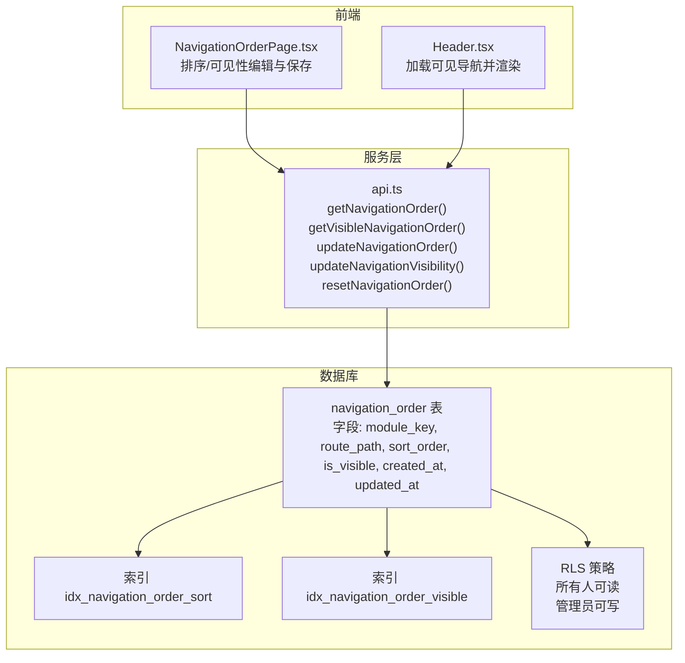
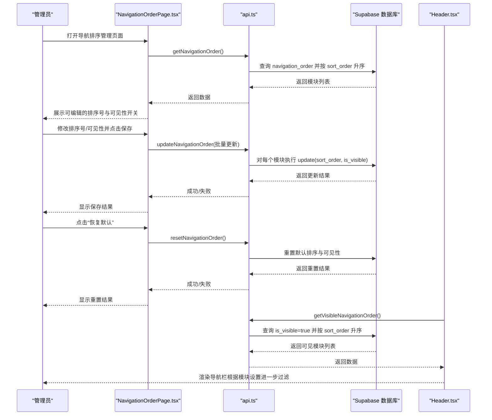
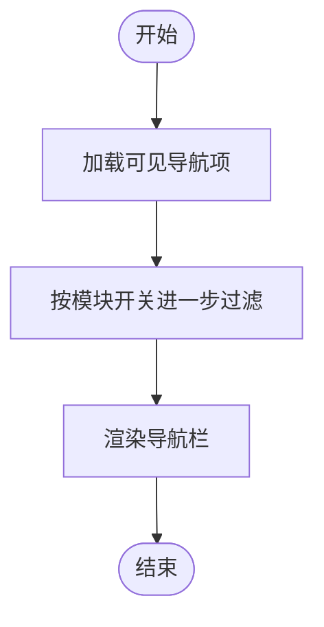
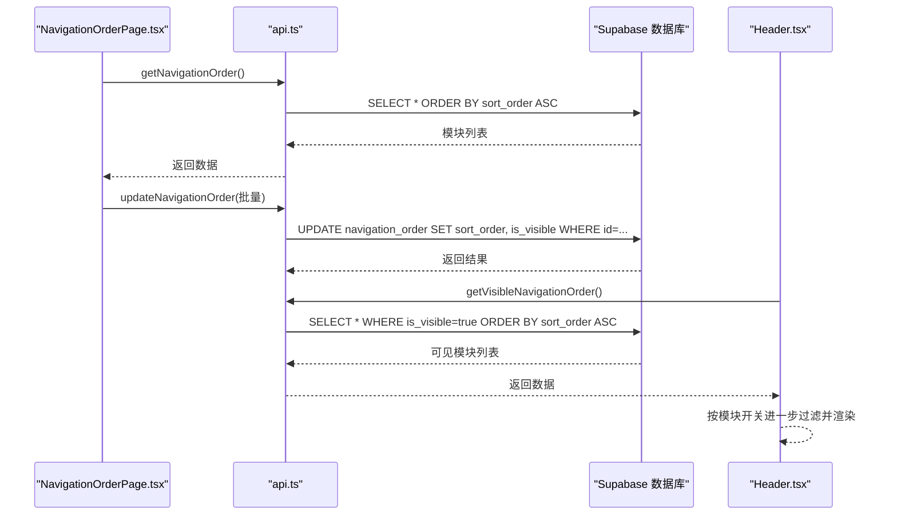
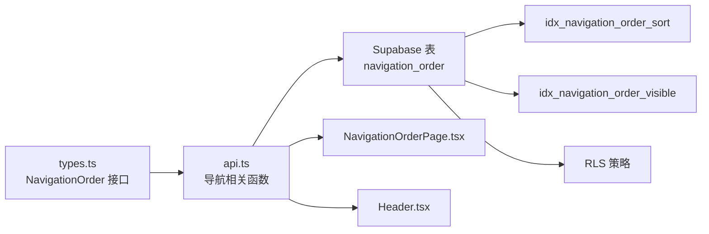

# navigation_order表设计

<cite>
**本文引用的文件**
- [00018_create_navigation_order_table.sql](file://supabase/migrations/00018_create_navigation_order_table.sql)
- [NavigationOrderPage.tsx](file://src/pages/admin/NavigationOrderPage.tsx)
- [Header.tsx](file://src/components/common/Header.tsx)
- [api.ts](file://src/db/api.ts)
- [types.ts](file://src/types/types.ts)
</cite>

## 目录
1. [简介](#简介)
2. [项目结构](#项目结构)
3. [核心组件](#核心组件)
4. [架构总览](#架构总览)
5. [详细组件分析](#详细组件分析)
6. [依赖关系分析](#依赖关系分析)
7. [性能考量](#性能考量)
8. [故障排查指南](#故障排查指南)
9. [结论](#结论)

## 简介
本文件围绕 navigation_order 表进行系统化数据模型文档编制，重点阐述其作为导航栏排序与显示控制的核心作用。文档覆盖字段业务语义与约束、排序与可见性管理机制、索引的性能优化、行级安全策略（RLS）以及触发器自动维护 updated_at 的机制；同时结合前端页面 NavigationOrderPage.tsx 与 Header.tsx 的集成流程，说明从前端到数据库的完整数据流与控制闭环。

## 项目结构
- 数据层：Supabase 数据库迁移脚本创建 navigation_order 表，并启用 RLS 与索引。
- 前端层：NavigationOrderPage.tsx 提供导航排序与可见性管理界面；Header.tsx 在运行时读取可见导航项并渲染导航栏。
- 服务层：src/db/api.ts 封装导航相关查询与更新接口，提供排序读取、可见性读取、批量更新、重置默认等能力。

图表来源
- [00018_create_navigation_order_table.sql](file://supabase/migrations/00018_create_navigation_order_table.sql#L29-L83)
- [NavigationOrderPage.tsx](file://src/pages/admin/NavigationOrderPage.tsx#L1-L296)
- [Header.tsx](file://src/components/common/Header.tsx#L1-L263)
- [api.ts](file://src/db/api.ts#L2762-L2851)

章节来源
- [00018_create_navigation_order_table.sql](file://supabase/migrations/00018_create_navigation_order_table.sql#L29-L83)
- [NavigationOrderPage.tsx](file://src/pages/admin/NavigationOrderPage.tsx#L1-L296)
- [Header.tsx](file://src/components/common/Header.tsx#L1-L263)
- [api.ts](file://src/db/api.ts#L2762-L2851)

## 核心组件
- 表结构与字段
  - id：主键，UUID，默认随机生成。
  - module_key：模块标识，唯一，用于定位导航项。
  - module_name：模块名称，用于 UI 展示。
  - route_path：路由路径，用于导航跳转。
  - sort_order：排序序号，整型，数值越小越靠前。
  - is_visible：是否可见，布尔，默认 true。
  - created_at / updated_at：时间戳，默认当前时间。
- 索引
  - idx_navigation_order_sort：加速按排序序号查询。
  - idx_navigation_order_visible：加速按可见性过滤。
- RLS 策略
  - 选择访问：所有人可读取。
  - 修改访问：仅管理员可写入。
- 触发器
  - update_navigation_order_updated_at：在更新时自动维护 updated_at 字段。

章节来源
- [00018_create_navigation_order_table.sql](file://supabase/migrations/00018_create_navigation_order_table.sql#L29-L83)
- [types.ts](file://src/types/types.ts#L173-L183)

## 架构总览
以下序列图展示了“前端编辑导航排序与可见性”到“数据库持久化”的完整流程，以及“运行时渲染导航栏”的读取流程。

图表来源
- [NavigationOrderPage.tsx](file://src/pages/admin/NavigationOrderPage.tsx#L26-L113)
- [api.ts](file://src/db/api.ts#L2762-L2851)
- [Header.tsx](file://src/components/common/Header.tsx#L66-L80)

## 详细组件分析

### 数据模型与字段语义
- module_key
  - 业务含义：导航模块的唯一标识，用于定位与匹配模块。
  - 约束：唯一非空。
  - 用途：前端根据 module_key 决定是否显示模块（例如首页始终显示，其他模块受模块开关控制）。
- route_path
  - 业务含义：模块对应的前端路由路径。
  - 约束：非空。
  - 用途：Header.tsx 中作为 Link 的 to 参数，实现导航跳转。
- sort_order
  - 业务含义：排序序号，数值越小越靠前。
  - 约束：整型，非负（前端校验最小为 1）。
  - 用途：前端按 sort_order 升序渲染；数据库按 sort_order 升序查询。
- is_visible
  - 业务含义：是否在导航栏中显示。
  - 约束：布尔，默认 true。
  - 用途：Header.tsx 读取可见导航项；前端页面可单独切换某模块可见性。

章节来源
- [00018_create_navigation_order_table.sql](file://supabase/migrations/00018_create_navigation_order_table.sql#L29-L44)
- [types.ts](file://src/types/types.ts#L173-L183)
- [Header.tsx](file://src/components/common/Header.tsx#L66-L80)

### 排序与可见性管理机制
- 排序管理
  - 读取：getNavigationOrder() 按 sort_order 升序返回全部模块。
  - 编辑：NavigationOrderPage.tsx 支持直接修改排序号，保存时会校验排序号唯一性。
  - 批量更新：updateNavigationOrder() 以事务方式批量更新排序与可见性。
- 可见性管理
  - 读取：getVisibleNavigationOrder() 仅返回 is_visible=true 的模块。
  - 编辑：updateNavigationVisibility() 单条更新可见性。
  - 运行时过滤：Header.tsx 在拿到可见模块后，还会根据模块开关进一步过滤（如首页始终显示，其他模块需满足 isModuleEnabled(module_key)）。

图表来源
- [Header.tsx](file://src/components/common/Header.tsx#L66-L80)

章节来源
- [api.ts](file://src/db/api.ts#L2762-L2851)
- [NavigationOrderPage.tsx](file://src/pages/admin/NavigationOrderPage.tsx#L40-L113)
- [Header.tsx](file://src/components/common/Header.tsx#L66-L80)

### 索引的性能优化作用
- idx_navigation_order_sort
  - 用途：加速按 sort_order 升序查询与排序。
  - 影响：getNavigationOrder() 与 getVisibleNavigationOrder() 的排序查询受益明显。
- idx_navigation_order_visible
  - 用途：加速按 is_visible=true 过滤。
  - 影响：getVisibleNavigationOrder() 的过滤查询受益明显。

章节来源
- [00018_create_navigation_order_table.sql](file://supabase/migrations/00018_create_navigation_order_table.sql#L41-L44)
- [api.ts](file://src/db/api.ts#L2762-L2851)

### 行级安全策略（RLS）配置
- 读取权限：所有人可读取导航配置（选择访问策略允许）。
- 修改权限：仅管理员可修改导航配置（使用 is_admin(auth.uid()) 进行授权）。
- 实施位置：在创建表后启用 RLS，并分别创建“可读”和“可写”策略。

章节来源
- [00018_create_navigation_order_table.sql](file://supabase/migrations/00018_create_navigation_order_table.sql#L45-L57)

### 触发器自动维护 updated_at
- 触发器逻辑：在每次 UPDATE 之前，将 updated_at 设置为当前时间。
- 作用：保证每次修改都会更新时间戳，便于审计与缓存失效策略。

章节来源
- [00018_create_navigation_order_table.sql](file://supabase/migrations/00018_create_navigation_order_table.sql#L68-L83)

### 前端集成：NavigationOrderPage.tsx 与 Header.tsx
- NavigationOrderPage.tsx
  - 加载：首次加载调用 getNavigationOrder()，按排序号升序展示。
  - 编辑：支持修改排序号与可见性；保存前校验排序号唯一性；调用 updateNavigationOrder() 批量更新。
  - 重置：调用 resetNavigationOrder() 将排序恢复为默认顺序。
- Header.tsx
  - 加载：调用 getVisibleNavigationOrder() 获取可见模块，再根据模块开关进一步过滤。
  - 渲染：按 route_path 生成导航链接，高亮当前路由。

图表来源
- [NavigationOrderPage.tsx](file://src/pages/admin/NavigationOrderPage.tsx#L26-L113)
- [api.ts](file://src/db/api.ts#L2762-L2851)
- [Header.tsx](file://src/components/common/Header.tsx#L66-L80)

章节来源
- [NavigationOrderPage.tsx](file://src/pages/admin/NavigationOrderPage.tsx#L1-L296)
- [Header.tsx](file://src/components/common/Header.tsx#L1-L263)
- [api.ts](file://src/db/api.ts#L2762-L2851)

## 依赖关系分析
- 表依赖
  - navigation_order 表依赖 Supabase 的 RLS 与触发器机制。
  - 索引依赖于 sort_order 与 is_visible 字段的查询模式。
- 前端依赖
  - NavigationOrderPage.tsx 依赖 api.ts 的 getNavigationOrder()/updateNavigationOrder()/resetNavigationOrder()。
  - Header.tsx 依赖 api.ts 的 getVisibleNavigationOrder() 与模块开关上下文。
- 类型依赖
  - types.ts 中定义 NavigationOrder 接口，确保前后端字段一致性。

图表来源
- [types.ts](file://src/types/types.ts#L173-L183)
- [api.ts](file://src/db/api.ts#L2762-L2851)
- [00018_create_navigation_order_table.sql](file://supabase/migrations/00018_create_navigation_order_table.sql#L29-L83)
- [NavigationOrderPage.tsx](file://src/pages/admin/NavigationOrderPage.tsx#L1-L296)
- [Header.tsx](file://src/components/common/Header.tsx#L1-L263)

章节来源
- [types.ts](file://src/types/types.ts#L173-L183)
- [api.ts](file://src/db/api.ts#L2762-L2851)
- [00018_create_navigation_order_table.sql](file://supabase/migrations/00018_create_navigation_order_table.sql#L29-L83)
- [NavigationOrderPage.tsx](file://src/pages/admin/NavigationOrderPage.tsx#L1-L296)
- [Header.tsx](file://src/components/common/Header.tsx#L1-L263)

## 性能考量
- 查询路径
  - getNavigationOrder()：按 sort_order 升序，索引 idx_navigation_order_sort 可显著提升排序效率。
  - getVisibleNavigationOrder()：按 is_visible=true 过滤后再按 sort_order 升序，索引 idx_navigation_order_visible 有助于过滤阶段提速。
- 批量更新
  - updateNavigationOrder() 使用 Promise.all 并发更新多个模块，减少往返次数，提高吞吐。
- RLS 与触发器
  - RLS 在服务端强制权限控制，避免前端绕过；触发器确保 updated_at 自动更新，降低应用层复杂度。

章节来源
- [api.ts](file://src/db/api.ts#L2762-L2851)
- [00018_create_navigation_order_table.sql](file://supabase/migrations/00018_create_navigation_order_table.sql#L41-L57)

## 故障排查指南
- 保存失败
  - 现象：点击保存后报错。
  - 排查：
    - 检查排序号是否重复（前端保存前会校验），若重复请修正。
    - 检查网络请求与 Supabase 返回的错误信息。
    - 确认当前用户角色为管理员，否则 RLS 会拒绝写入。
- 可见性切换无效
  - 现象：切换 is_visible 后未生效。
  - 排查：
    - 确认 updateNavigationVisibility() 已被调用并返回成功。
    - 确认 Header.tsx 正在使用 getVisibleNavigationOrder() 并正确渲染。
- 导航栏不显示某些模块
  - 现象：模块未出现在导航栏。
  - 排查：
    - 确认 is_visible=true 且模块开关 isModuleEnabled(module_key)=true。
    - 确认 sort_order 合法且未被其他模块占用。
- 重置失败
  - 现象：点击“恢复默认”后仍无变化。
  - 排查：
    - 检查 resetNavigationOrder() 的并发更新结果，确认无错误返回。
    - 确认默认模块键值存在且未被删除。

章节来源
- [NavigationOrderPage.tsx](file://src/pages/admin/NavigationOrderPage.tsx#L71-L113)
- [api.ts](file://src/db/api.ts#L2762-L2851)
- [Header.tsx](file://src/components/common/Header.tsx#L66-L80)

## 结论
navigation_order 表通过明确的字段语义与严格的约束，实现了导航栏的排序与可见性集中管理。配合索引、RLS 与触发器，系统在性能、安全性与易用性之间取得平衡。前端页面 NavigationOrderPage.tsx 与 Header.tsx 分别承担“编辑与持久化”和“读取与渲染”的职责，形成完整的控制闭环。建议在后续迭代中持续关注排序号唯一性校验与可见性过滤策略的一致性，确保用户体验与数据一致性。