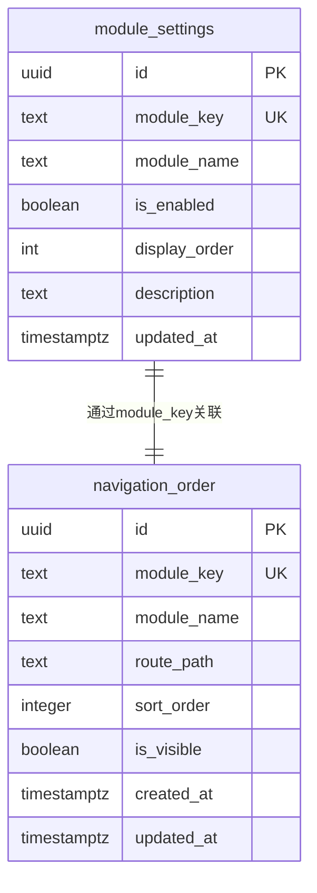

# 数据模型设计

<cite>
**本文档引用的文件**  
- [00008_create_module_settings.sql](file://supabase/migrations/00008_create_module_settings.sql)
- [00018_create_navigation_order_table.sql](file://supabase/migrations/00018_create_navigation_order_table.sql)
- [ModuleSettingsPage.tsx](file://src/pages/admin/ModuleSettingsPage.tsx)
- [NavigationOrderPage.tsx](file://src/pages/admin/NavigationOrderPage.tsx)
- [api.ts](file://src/db/api.ts)
- [types.ts](file://src/types/types.ts)
- [Header.tsx](file://src/components/common/Header.tsx)
</cite>

## 目录
1. [模块控制功能概述](#模块控制功能概述)
2. [module_settings表结构设计](#module_settings表结构设计)
3. [navigation_order表结构设计](#navigation_order表结构设计)
4. [数据模型差异分析](#数据模型差异分析)
5. [数据库ER图](#数据库er图)
6. [索引策略与性能优化](#索引策略与性能优化)

## 模块控制功能概述

本系统通过`module_settings`和`navigation_order`两张数据表实现模块控制功能，分别负责功能启用控制和UI展示控制。`module_settings`表作为功能模块的开关核心，控制各模块是否启用；`navigation_order`表则负责导航栏的排序和显示控制，实现UI层面的灵活配置。这两张表共同构成了系统的模块控制体系，为管理员提供了灵活的功能管理能力。

**Section sources**
- [00008_create_module_settings.sql](file://supabase/migrations/00008_create_module_settings.sql)
- [00018_create_navigation_order_table.sql](file://supabase/migrations/00018_create_navigation_order_table.sql)

## module_settings表结构设计

`module_settings`表是功能模块控制的核心表，用于管理各功能模块的启用状态和基本配置。该表通过`is_enabled`字段实现功能开关控制，通过`display_order`字段控制模块的显示顺序。

### 字段设计与业务含义

| 字段名 | 数据类型 | 约束条件 | 业务含义 |
|--------|--------|--------|--------|
| id | uuid | 主键，自动生成 | 记录唯一标识符 |
| module_key | text | 唯一，非空 | 模块唯一标识符，作为系统内部引用的键值 |
| module_name | text | 非空 | 模块显示名称，用于前端展示 |
| is_enabled | boolean | 默认true，非空 | 模块是否启用，true表示启用，false表示禁用 |
| display_order | int | 默认0，非空 | 模块显示顺序，数值越小越靠前 |
| description | text | 可为空 | 模块功能描述，用于说明模块用途 |
| updated_at | timestamptz | 默认now()，非空 | 最后更新时间，自动更新 |

### 字段约束条件与业务规则

- **module_key**: 作为模块的唯一标识符，必须保证全局唯一，且不能为空。该字段采用小写字母和下划线命名规范，如`cases`、`news`、`departments`等。
- **is_enabled**: 作为功能开关的核心字段，默认值为true，表示新模块默认启用。该字段的变更会直接影响前端功能的可见性。
- **display_order**: 控制模块在相关界面的显示顺序，数值越小排序越靠前。默认值为0，管理员可根据需要调整。
- **updated_at**: 通过触发器自动更新，确保每次记录修改时都能准确记录更新时间。

该表的设计体现了功能控制的核心思想：通过简单的布尔值开关实现功能的启用与禁用，为系统提供了灵活的功能管理能力。

**Section sources**
- [00008_create_module_settings.sql](file://supabase/migrations/00008_create_module_settings.sql)
- [ModuleSettingsPage.tsx](file://src/pages/admin/ModuleSettingsPage.tsx)

## navigation_order表结构设计

`navigation_order`表专门用于管理前端导航栏的排序和显示控制，与`module_settings`表形成互补关系。该表更侧重于UI展示层面的控制，允许管理员精细调整导航栏的布局。

### 字段设计与业务含义

| 字段名 | 数据类型 | 约束条件 | 业务含义 |
|--------|--------|--------|--------|
| id | uuid | 主键，自动生成 | 记录唯一标识符 |
| module_key | text | 唯一，非空 | 模块标识符，关联到具体功能模块 |
| module_name | text | 非空 | 模块显示名称，用于导航栏展示 |
| route_path | text | 非空 | 路由路径，点击导航项时跳转的URL |
| sort_order | integer | 非空 | 排序序号，决定导航项的显示顺序 |
| is_visible | boolean | 默认true，非空 | 是否可见，控制导航项的显示与隐藏 |
| created_at | timestamptz | 默认now() | 创建时间 |
| updated_at | timestamptz | 默认now() | 更新时间，自动更新 |

### 字段约束条件与业务规则

- **sort_order**: 排序序号字段，数值越小排序越靠前。该字段允许管理员灵活调整导航栏中各模块的显示顺序，实现个性化的导航布局。
- **is_visible**: 可见性控制字段，与`module_settings`表中的`is_enabled`字段形成双重控制机制。即使模块已启用，也可通过此字段控制其在导航栏的显示状态。
- **route_path**: 存储各模块的路由路径，确保导航点击能够正确跳转到对应页面。

该表的设计体现了UI控制的灵活性：管理员可以在不改变功能启用状态的情况下，仅调整导航栏的显示顺序和可见性，满足不同场景下的展示需求。

**Section sources**
- [00018_create_navigation_order_table.sql](file://supabase/migrations/00018_create_navigation_order_table.sql)
- [NavigationOrderPage.tsx](file://src/pages/admin/NavigationOrderPage.tsx)

## 数据模型差异分析

`module_settings`和`navigation_order`两张表虽然都涉及模块控制，但在设计目标和应用场景上存在显著差异，体现了功能控制与UI控制的分离设计思想。

### 设计差异对比

| 对比维度 | module_settings表 | navigation_order表 |
|---------|------------------|-------------------|
| **核心功能** | 功能启用控制 | UI展示控制 |
| **控制粒度** | 功能级开关 | 展示级开关 |
| **影响范围** | 功能可用性 | 导航栏布局 |
| **主要字段** | is_enabled, display_order | sort_order, is_visible |
| **安全策略** | 无RLS，公开可读 | RLS控制，仅管理员可修改 |
| **使用场景** | 控制模块是否可用 | 控制导航栏排序和显示 |

### 功能定位差异

`module_settings`表作为功能模块的"总开关"，其`is_enabled`字段决定了模块的基本可用性。当某个模块被禁用时，该模块的所有功能都将不可访问，无论其在导航栏中的显示状态如何。这种设计确保了功能的安全性和可控性。

相比之下，`navigation_order`表更侧重于用户体验的优化。其`is_visible`字段仅控制模块在导航栏中的显示状态，不影响模块本身的功能可用性。例如，管理员可以暂时隐藏某个模块的导航入口，但仍保留其功能可用性，便于后续重新启用。

### 协同工作机制

两张表通过`module_key`字段建立关联，形成协同工作机制。前端在渲染导航栏时，会同时查询两张表的数据：

1. 首先从`navigation_order`表获取所有导航配置，按`sort_order`排序
2. 然后结合`module_settings`表的`is_enabled`状态进行过滤
3. 最终只显示`is_enabled`为true且`is_visible`为true的模块

这种双重控制机制为系统提供了极大的灵活性：管理员既可以全局禁用某个功能模块，也可以仅调整其在导航栏的展示方式，满足不同管理需求。

**Section sources**
- [api.ts](file://src/db/api.ts)
- [Header.tsx](file://src/components/common/Header.tsx)

## 数据库ER图



**Diagram sources**
- [00008_create_module_settings.sql](file://supabase/migrations/00008_create_module_settings.sql)
- [00018_create_navigation_order_table.sql](file://supabase/migrations/00018_create_navigation_order_table.sql)

## 索引策略与性能优化

为确保模块控制功能的高效运行，系统在两张表上建立了针对性的索引策略，优化查询性能。

### 索引设计

```sql
-- module_settings表索引
CREATE INDEX IF NOT EXISTS idx_module_settings_key ON module_settings(module_key);
CREATE INDEX IF NOT EXISTS idx_module_settings_enabled ON module_settings(is_enabled);
CREATE INDEX IF NOT EXISTS idx_module_settings_order ON module_settings(display_order);

-- navigation_order表索引
CREATE INDEX IF NOT EXISTS idx_navigation_order_sort ON navigation_order(sort_order);
CREATE INDEX IF NOT EXISTS idx_navigation_order_visible ON navigation_order(is_visible);
```

### 索引使用场景

- **idx_module_settings_key**: 用于根据`module_key`快速查找特定模块的设置，如`updateModuleSetting`函数中根据模块键更新状态。
- **idx_module_settings_enabled**: 优化启用状态的查询性能，支持快速筛选启用的模块。
- **idx_module_settings_order**: 支持按显示顺序排序查询，确保模块按预设顺序展示。
- **idx_navigation_order_sort**: 为核心功能索引，确保导航栏能按`sort_order`高效排序。
- **idx_navigation_order_visible**: 优化可见性筛选性能，快速获取可见的导航项。

### 性能优化考虑

1. **查询优化**: 前端在加载导航栏时，会同时使用`sort_order`和`is_visible`索引，确保导航项能快速按序加载。
2. **更新效率**: 更新操作通过`module_key`索引定位记录，避免全表扫描，提高更新效率。
3. **复合查询**: 系统通过组合使用多个索引，支持复杂的查询场景，如"获取启用且可见的模块并按顺序排列"。

这些索引设计充分考虑了实际使用场景，确保了模块控制功能在各种操作下的高性能表现。

**Section sources**
- [00008_create_module_settings.sql](file://supabase/migrations/00008_create_module_settings.sql)
- [00018_create_navigation_order_table.sql](file://supabase/migrations/00018_create_navigation_order_table.sql)
- [api.ts](file://src/db/api.ts)