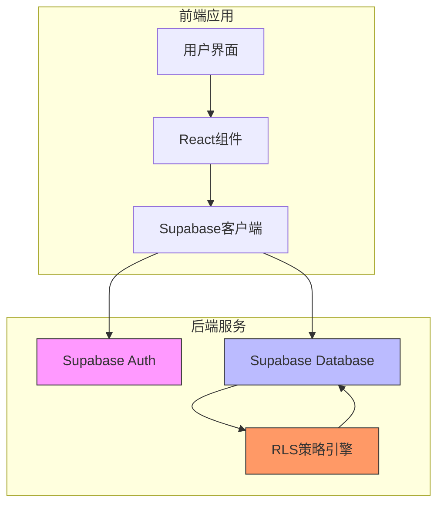
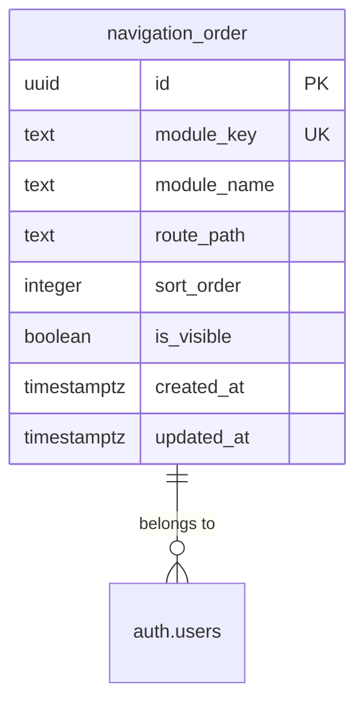
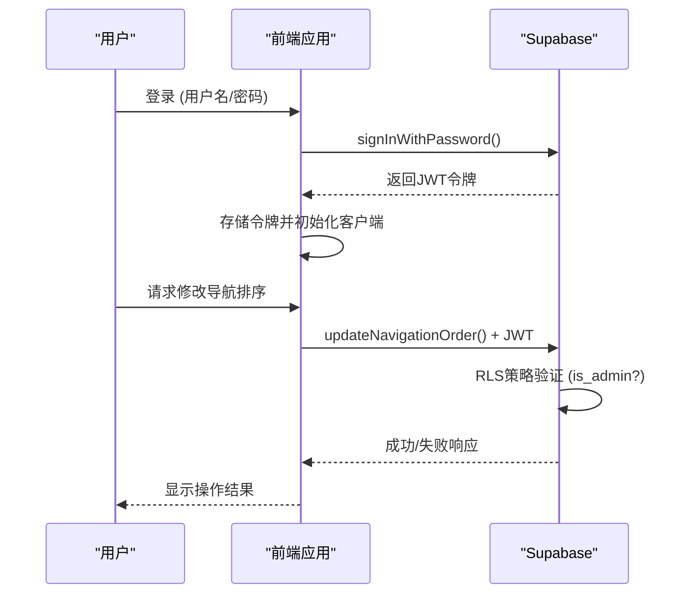

# API安全策略

<cite>
**本文档引用文件**   
- [00001_create_initial_schema.sql](file://supabase/migrations/00001_create_initial_schema.sql)
- [00003_create_footer_settings_table.sql](file://supabase/migrations/00003_create_footer_settings_table.sql)
- [00008_create_module_settings.sql](file://supabase/migrations/00008_create_module_settings.sql)
- [00018_create_navigation_order_table.sql](file://supabase/migrations/00018_create_navigation_order_table.sql)
- [api.ts](file://src/db/api.ts)
- [ModuleSettingsPage.tsx](file://src/pages/admin/ModuleSettingsPage.tsx)
- [NavigationOrderPage.tsx](file://src/pages/admin/NavigationOrderPage.tsx)
- [supabase.ts](file://src/db/supabase.ts)
</cite>

## 目录
1. [引言](#引言)
2. [核心安全架构](#核心安全架构)
3. [关键表的行级安全策略](#关键表的行级安全策略)
4. [Supabase RLS策略语法详解](#supabase-rls策略语法详解)
5. [前端API调用与后端安全协同](#前端api调用与后端安全协同)
6. [错误处理与权限验证机制](#错误处理与权限验证机制)
7. [RLS策略测试方法与工具](#rls策略测试方法与工具)
8. [结论](#结论)

## 引言
本文档详细阐述了合规通平台的API安全策略，重点介绍后端行级安全（Row Level Security, RLS）策略的配置与实现。文档将深入解析在`navigation_order`、`module_settings`等关键表上如何设置RLS策略，确保只有管理员角色才能执行修改操作。同时，文档将说明Supabase策略的SQL语法、前端API调用如何与后端RLS策略协同工作，以及相关的错误处理和测试方法。

## 核心安全架构
本系统采用Supabase作为后端服务，其核心安全架构基于行级安全（RLS）策略。系统定义了两种用户角色：普通用户（`user`）和管理员（`admin`）。通过RLS策略，系统能够精确控制不同角色对数据库表的访问权限，实现数据层面的安全隔离。



**图表来源**
- [supabase.ts](file://src/db/supabase.ts#L1-L8)
- [00001_create_initial_schema.sql](file://supabase/migrations/00001_create_initial_schema.sql#L86-L87)

## 关键表的行级安全策略

### navigation_order 表安全策略
`navigation_order`表用于存储前端导航栏模块的排序配置。其RLS策略设计如下：
- **读取权限**：所有用户（包括未认证用户）均可读取导航配置，以确保前端页面能正确显示导航栏。
- **写入权限**：仅管理员角色可对表进行插入、更新、删除操作。

该策略通过`is_admin(auth.uid())`函数判断当前用户是否为管理员，确保了配置的安全性。



**图表来源**
- [00018_create_navigation_order_table.sql](file://supabase/migrations/00018_create_navigation_order_table.sql#L29-L39)
- [00018_create_navigation_order_table.sql](file://supabase/migrations/00018_create_navigation_order_table.sql#L48-L56)

### module_settings 表安全策略
`module_settings`表用于管理平台各功能模块的启用状态。根据项目需求，该表**未启用RLS**，因为模块设置信息被视为公开的配置信息，需要被所有用户读取以正确渲染前端界面。

**重要说明**：尽管该表未启用RLS，但其管理功能（如启用/禁用模块）仅在管理员后台提供，通过前端路由和组件访问控制来实现安全隔离。

**本节来源**
- [00008_create_module_settings.sql](file://supabase/migrations/00008_create_module_settings.sql#L14-L16)
- [00008_create_module_settings.sql](file://supabase/migrations/00008_create_module_settings.sql#L30-L39)

## Supabase RLS策略语法详解

### RLS策略基本语法
Supabase的RLS策略使用标准的SQL `CREATE POLICY`语句创建。其基本语法结构如下：
```sql
CREATE POLICY "策略名称"
ON 表名
FOR 操作类型
TO 角色
USING (条件表达式)
WITH CHECK (条件表达式);
```

### 权限判断函数
系统定义了`is_admin(uid)`辅助函数，用于判断指定用户ID是否为管理员。该函数通过查询`profiles`表中的`role`字段来实现。

```sql
CREATE OR REPLACE FUNCTION is_admin(uid uuid)
RETURNS boolean LANGUAGE sql SECURITY DEFINER AS $$
  SELECT EXISTS (
    SELECT 1 FROM profiles p
    WHERE p.id = uid AND p.role = 'admin'::user_role
  );
$$;
```

### 典型策略示例
以下是在`navigation_order`表上创建的管理员管理策略：
```sql
CREATE POLICY "Admins can manage navigation order" ON navigation_order
  FOR ALL TO authenticated
  USING (is_admin(auth.uid()))
  WITH CHECK (is_admin(auth.uid()));
```
- **FOR ALL**：适用于INSERT、UPDATE、DELETE所有操作。
- **TO authenticated**：策略应用于所有已认证的用户。
- **USING**：定义读取和删除操作的权限检查条件。
- **WITH CHECK**：定义插入和更新操作的权限检查条件。

**本节来源**
- [00001_create_initial_schema.sql](file://supabase/migrations/00001_create_initial_schema.sql#L180-L187)
- [00018_create_navigation_order_table.sql](file://supabase/migrations/00018_create_navigation_order_table.sql#L52-L56)

## 前端API调用与后端安全协同

### API调用流程
前端通过`@supabase/supabase-js`客户端库与后端进行交互。当用户登录后，客户端会自动管理认证令牌（JWT），并在每次API请求中将其发送至后端。



**图表来源**
- [supabase.ts](file://src/db/supabase.ts#L7)
- [NavigationOrderPage.tsx](file://src/pages/admin/NavigationOrderPage.tsx#L71-L90)
- [00018_create_navigation_order_table.sql](file://supabase/migrations/00018_create_navigation_order_table.sql#L52-L56)

### 关键API函数
前端通过`api.ts`文件中的函数与后端交互，例如：
- `getNavigationOrder()`: 读取导航配置。
- `updateNavigationOrder(updates)`: 更新导航排序，此操作受RLS保护。
- `getModuleSettings()`: 读取模块设置。
- `updateModuleSetting(moduleKey, isEnabled)`: 更新模块状态。

这些函数在调用时会自动携带用户的认证信息，由后端RLS策略进行最终的权限校验。

**本节来源**
- [api.ts](file://src/db/api.ts#L2527-L2577)
- [NavigationOrderPage.tsx](file://src/pages/admin/NavigationOrderPage.tsx#L10-L11)
- [ModuleSettingsPage.tsx](file://src/pages/admin/ModuleSettingsPage.tsx#L2-L3)

## 错误处理与权限验证机制

### 前端错误处理
前端在调用API时，通过`try-catch`捕获错误，并使用`sonner`库向用户展示友好的错误提示。例如，在`NavigationOrderPage.tsx`中，当保存排序失败时，会显示“保存导航排序失败”的提示。

### 后端权限验证
后端的权限验证完全由Supabase的RLS引擎在数据库层面完成。当一个不具备权限的用户尝试执行操作时，数据库会直接返回`403 Forbidden`错误，该错误会逐层传递到前端。

### 安全最佳实践
1. **最小权限原则**：为每个角色分配完成其工作所需的最小权限。
2. **默认拒绝**：RLS策略默认拒绝所有操作，仅通过显式创建的策略来授予特定权限。
3. **避免前端信任**：绝不依赖前端代码来执行安全检查，所有关键权限验证必须在后端完成。

**本节来源**
- [NavigationOrderPage.tsx](file://src/pages/admin/NavigationOrderPage.tsx#L94-L96)
- [ModuleSettingsPage.tsx](file://src/pages/admin/ModuleSettingsPage.tsx#L58-L60)
- [00001_create_initial_schema.sql](file://supabase/migrations/00001_create_initial_schema.sql#L69-L75)

## RLS策略测试方法与工具

### 测试方法
1. **管理员用户测试**：使用管理员账户登录，验证是否能成功执行读写操作。
2. **普通用户测试**：使用普通用户账户登录，验证是否能读取数据但无法修改。
3. **未认证用户测试**：在未登录状态下，验证是否能读取公开数据（如导航配置）。

### 测试工具
- **Supabase Dashboard**：直接在Supabase控制台中使用不同的用户身份执行SQL查询，验证策略效果。
- **Postman/curl**：构造带有不同认证令牌的HTTP请求，测试API端点。
- **前端应用**：通过实际使用管理员和普通用户账户操作应用，进行端到端测试。

### 自动化测试
项目中包含`test-api.ts`等测试脚本，可用于自动化测试API功能，未来可扩展以包含安全策略的验证。

**本节来源**
- [test-api.ts](file://test-api.ts#L1-L31)
- [NavigationOrderPage.tsx](file://src/pages/admin/NavigationOrderPage.tsx)
- [LoginPage.tsx](file://src/pages/LoginPage.tsx)

## 结论
本文档详细介绍了合规通平台的API安全策略。通过在关键表上配置Supabase RLS策略，系统实现了严格的权限控制，确保了只有管理员才能修改敏感配置。前端API调用与后端RLS策略紧密结合，形成了一个安全可靠的访问控制体系。建议在后续开发中，对所有新创建的表都进行安全评估，并根据需要启用RLS策略，以持续保障系统的安全性。