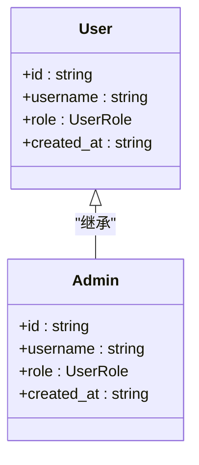
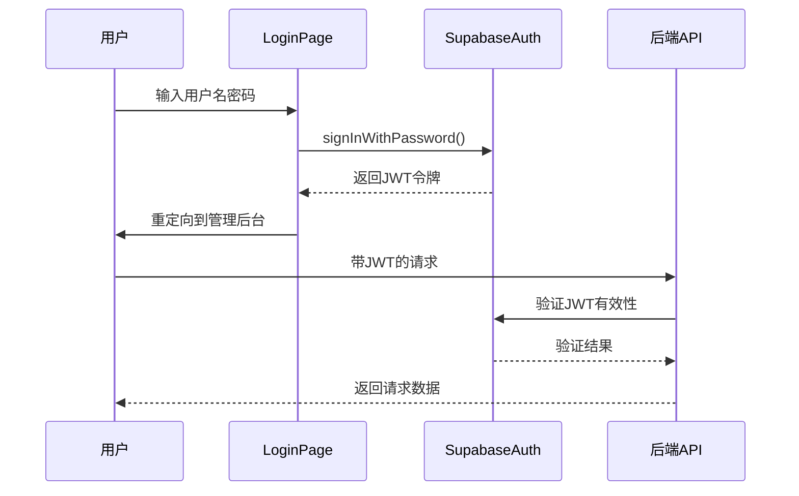
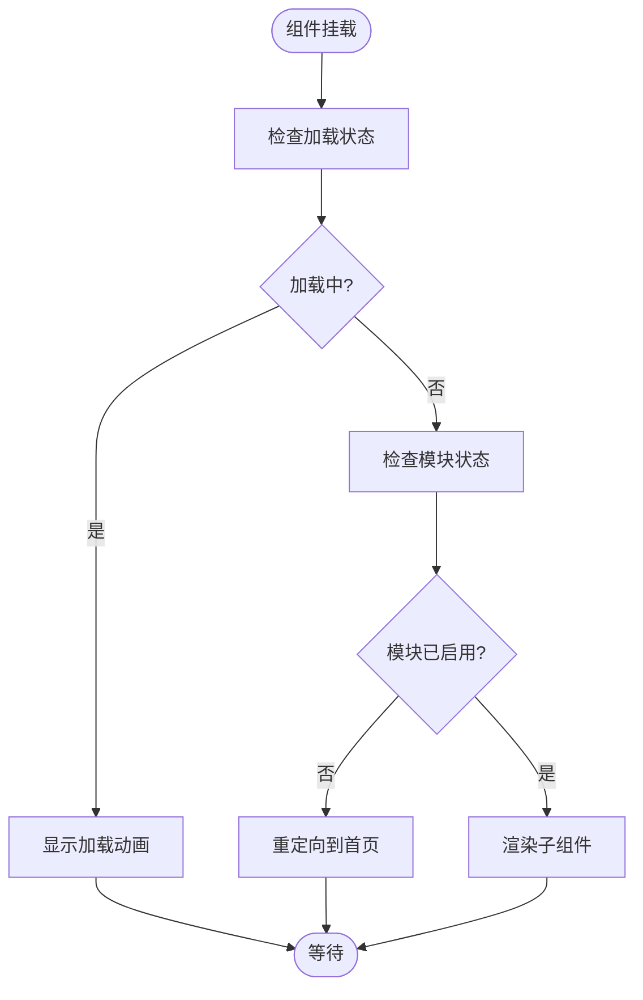
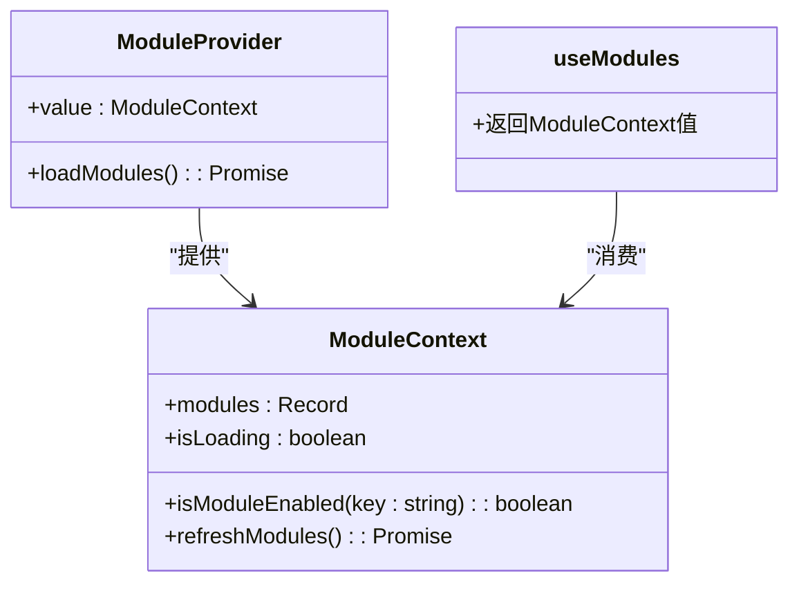
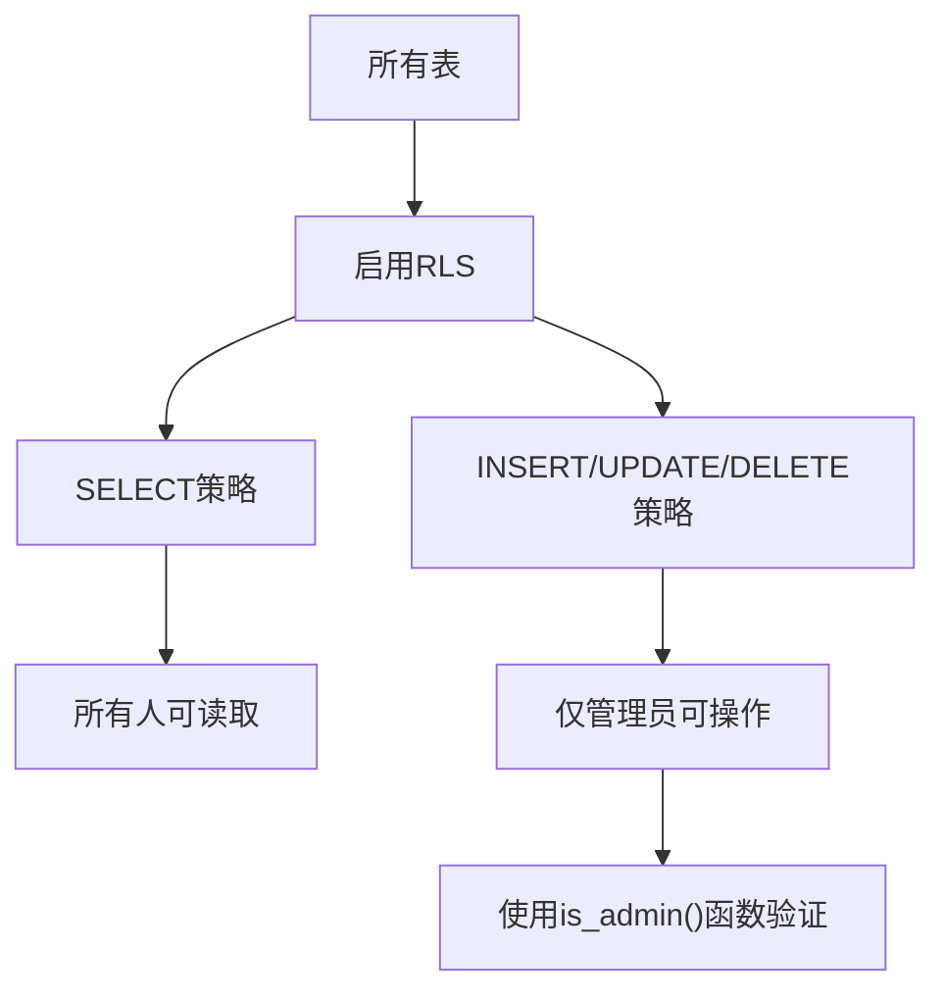
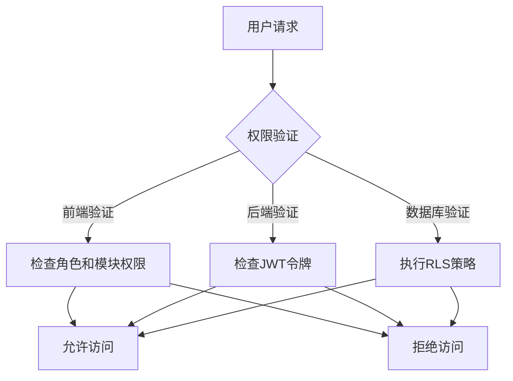

# 权限控制策略

<cite>
**本文档引用的文件**  
- [ProtectedModuleRoute.tsx](file://src/components/common/ProtectedModuleRoute.tsx)
- [ModuleContext.tsx](file://src/contexts/ModuleContext.tsx)
- [ModuleControlPage.tsx](file://src/pages/admin/ModuleControlPage.tsx)
- [routes.tsx](file://src/routes.tsx)
- [api.ts](file://src/db/api.ts)
- [types.ts](file://src/types/types.ts)
- [LoginPage.tsx](file://src/pages/LoginPage.tsx)
- [supabase.ts](file://src/db/supabase.ts)
- [00001_create_initial_schema.sql](file://supabase/migrations/00001_create_initial_schema.sql)
- [00018_create_navigation_order_table.sql](file://supabase/migrations/00018_create_navigation_order_table.sql)
- [00014_create_site_settings_table.sql](file://supabase/migrations/00014_create_site_settings_table.sql)
- [00003_create_footer_settings_table.sql](file://supabase/migrations/00003_create_footer_settings_table.sql)
</cite>

## 目录
1. [引言](#引言)
2. [权限分级设计](#权限分级设计)
3. [身份验证流程](#身份验证流程)
4. [模块访问控制机制](#模块访问控制机制)
5. [API层行级安全(RLS)策略](#api层行级安全rls策略)
6. [安全最佳实践](#安全最佳实践)
7. [结论](#结论)

## 引言

本系统采用多层次的权限控制体系，确保不同角色用户只能访问其授权范围内的功能和数据。系统通过JWT令牌进行身份验证，结合前端路由保护、上下文状态管理和数据库行级安全（RLS）策略，构建了完整的安全防护体系。管理员权限分为超级管理员和普通管理员，能够精确控制模块配置、页面访问和数据操作权限。

## 权限分级设计

系统定义了两种用户角色：`user`（普通用户）和`admin`（管理员）。管理员拥有对系统配置和数据管理的完全访问权限，而普通用户仅能查看公开数据。



**Diagram sources**  
- [types.ts](file://src/types/types.ts#L7-L12)

## 身份验证流程

系统使用Supabase Auth进行身份验证，采用JWT令牌机制。用户登录时，系统验证用户名和密码，生成JWT令牌并存储在客户端。后续请求通过该令牌进行身份验证。



**Section sources**  
- [LoginPage.tsx](file://src/pages/LoginPage.tsx#L17-L51)
- [supabase.ts](file://src/db/supabase.ts#L4-L7)

## 模块访问控制机制

系统通过`ProtectedModuleRoute`组件实现模块级别的访问控制。该组件结合`ModuleContext`上下文，根据模块配置动态控制页面访问权限。

### ProtectedModuleRoute组件分析

`ProtectedModuleRoute`是一个高阶组件，用于包装需要权限控制的页面。它通过`useModules`钩子获取模块启用状态，并在模块未启用时重定向到首页。



**Diagram sources**  
- [ProtectedModuleRoute.tsx](file://src/components/common/ProtectedModuleRoute.tsx#L10-L27)
- [ModuleContext.tsx](file://src/contexts/ModuleContext.tsx#L40-L42)

### ModuleContext上下文分析

`ModuleContext`提供模块状态管理功能，包括模块启用状态查询、状态刷新和加载状态。它在应用启动时从数据库加载模块配置，并提供给所有子组件使用。



**Diagram sources**  
- [ModuleContext.tsx](file://src/contexts/ModuleContext.tsx#L4-L53)

### 路由配置分析

系统在`routes.tsx`中定义了所有路由，通过`ProtectedModuleRoute`包装需要权限控制的页面，并设置`moduleKey`属性来指定模块标识。

```mermaid
flowchart TB
subgraph "公开路由"
Home["首页 /"]
Login["登录 /login"]
end
subgraph "受保护路由"
Cases["案例查询 /cases"]
News["监管资讯 /news"]
Departments["监管部门 /departments"]
Trends["趋势分析 /trend-analysis"]
Issues["问题分析 /violation-analysis"]
end
Cases --> ProtectedModuleRoute : "moduleKey=cases"
News --> ProtectedModuleRoute : "moduleKey=news"
Departments --> ProtectedModuleRoute : "moduleKey=departments"
Trends --> ProtectedModuleRoute : "moduleKey=trends"
Issues --> ProtectedModuleRoute : "moduleKey=issues"
ProtectedModuleRoute --> ModuleContext : "查询模块状态"
```

**Diagram sources**  
- [routes.tsx](file://src/routes.tsx#L44-L107)

## API层行级安全(RLS)策略

系统在Supabase数据库层面实现了行级安全（RLS）策略，确保只有授权用户才能修改特定配置。RLS策略通过SQL定义，对不同表设置不同的访问控制规则。

### 导航排序表RLS策略

`navigation_order`表的RLS策略允许所有用户读取导航配置，但只有管理员可以修改。

```sql
-- 启用RLS
ALTER TABLE navigation_order ENABLE ROW LEVEL SECURITY;

-- 所有人可以读取导航配置
CREATE POLICY "Anyone can view navigation order" ON navigation_order
  FOR SELECT USING (true);

-- 仅管理员可以修改导航配置
CREATE POLICY "Admins can manage navigation order" ON navigation_order
  FOR ALL TO authenticated
  USING (is_admin(auth.uid()))
  WITH CHECK (is_admin(auth.uid()));
```

**Diagram sources**  
- [00018_create_navigation_order_table.sql](file://supabase/migrations/00018_create_navigation_order_table.sql#L45-L56)

### 网站设置表RLS策略

`site_settings`表的RLS策略允许所有用户读取配置，但只有管理员可以修改。

```sql
-- 启用行级安全
ALTER TABLE site_settings ENABLE ROW LEVEL SECURITY;

-- 所有用户可读取配置（用于前台展示）
CREATE POLICY "Anyone can view site settings"
  ON site_settings FOR SELECT
  USING (true);

-- 仅管理员可更新配置
CREATE POLICY "Only admins can update site settings"
  ON site_settings FOR UPDATE
  TO authenticated
  USING (is_admin(auth.uid()))
  WITH CHECK (is_admin(auth.uid()));
```

**Diagram sources**  
- [00014_create_site_settings_table.sql](file://supabase/migrations/00014_create_site_settings_table.sql#L53-L72)

### 页脚设置表RLS策略

`footer_settings`表的RLS策略区分了公开和私有配置，管理员可以管理所有配置。

```sql
-- 启用RLS
ALTER TABLE footer_settings ENABLE ROW LEVEL SECURITY;

-- 所有人可以读取启用的配置
CREATE POLICY "所有人可以读取启用的页脚配置"
ON footer_settings FOR SELECT
TO public
USING (is_active = true);

-- 管理员可以查看所有配置
CREATE POLICY "管理员可以查看所有页脚配置"
ON footer_settings FOR SELECT
TO authenticated
USING (
  EXISTS (
    SELECT 1 FROM profiles
    WHERE profiles.id = auth.uid() AND profiles.role = 'admin'::user_role
  )
);
```

**Diagram sources**  
- [00003_create_footer_settings_table.sql](file://supabase/migrations/00003_create_footer_settings_table.sql#L41-L58)

### 通用RLS策略模式

系统对所有管理配置表采用了统一的RLS策略模式：



**Diagram sources**  
- [00001_create_initial_schema.sql](file://supabase/migrations/00001_create_initial_schema.sql#L233-L270)

## 安全最佳实践

系统实施了多项安全最佳实践，防止常见的安全漏洞。

### CSRF攻击防护

系统使用Supabase Auth的JWT令牌机制，天然具备CSRF防护能力。每个请求都包含JWT令牌作为身份验证凭证，无法被跨站请求伪造。

### XSS注入防护

系统在前端使用React框架，自动对动态内容进行HTML转义。对于需要渲染HTML内容的场景，使用安全的DOM操作方法，并对输入内容进行严格验证。

### 权限提升漏洞防护

系统通过以下措施防止权限提升漏洞：
1. 服务端验证：所有敏感操作都在服务端验证用户权限
2. 最小权限原则：用户只能访问其角色允许的资源
3. RLS策略：数据库层面强制执行访问控制



**Section sources**  
- [ProtectedModuleRoute.tsx](file://src/components/common/ProtectedModuleRoute.tsx)
- [api.ts](file://src/db/api.ts)
- [supabase.ts](file://src/db/supabase.ts)

## 结论

本系统的权限控制策略采用了多层次的安全防护体系，从前端路由保护到后端API验证，再到数据库行级安全，构建了完整的安全防线。通过清晰的权限分级设计，系统能够有效区分超级管理员和普通管理员的操作权限，确保只有授权用户才能修改关键配置。同时，系统实施了多项安全最佳实践，有效防范CSRF、XSS和权限提升等常见安全漏洞，保障了系统的安全性和数据的完整性。