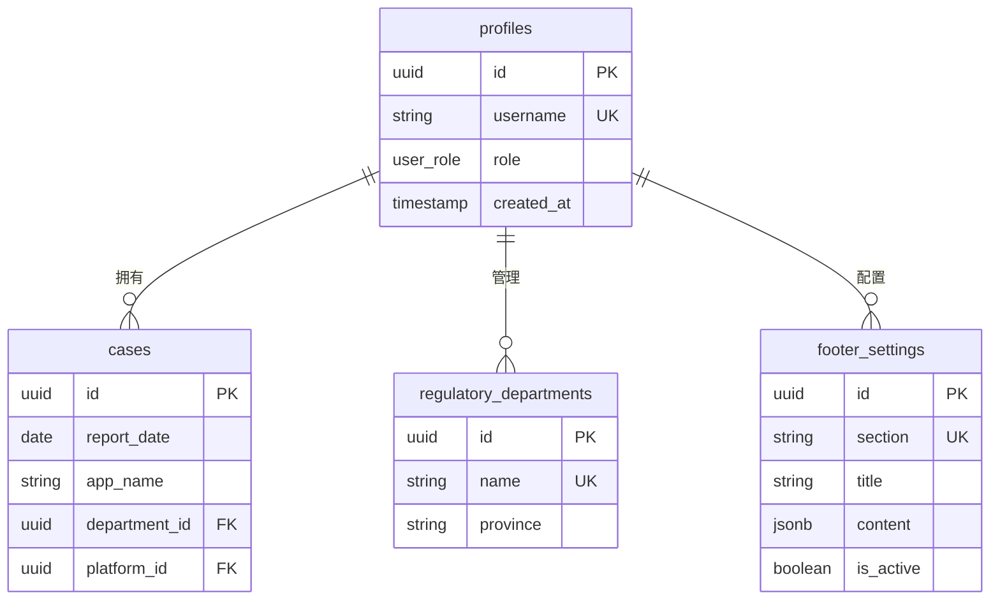
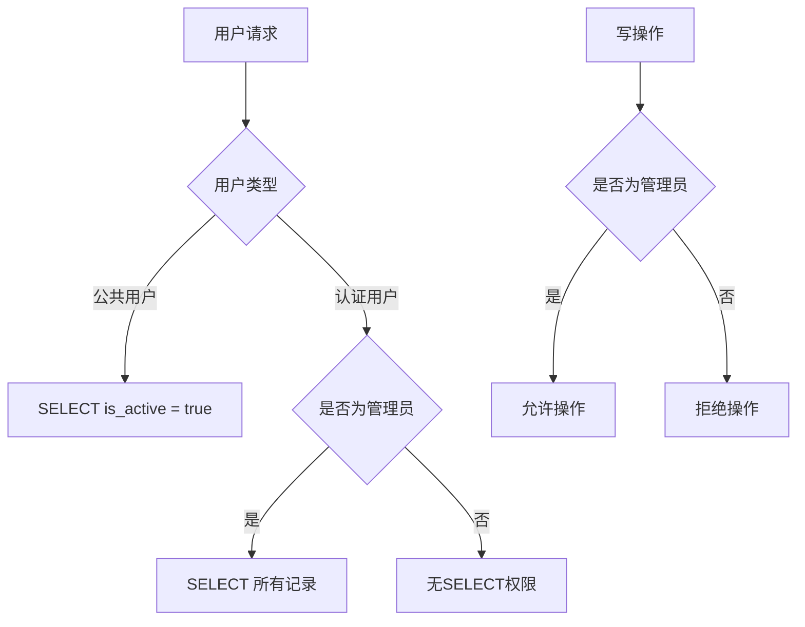

# 权限模型设计

<cite>
**本文档引用文件**  
- [00001_create_initial_schema.sql](file://supabase/migrations/00001_create_initial_schema.sql)
- [00003_create_footer_settings_table.sql](file://supabase/migrations/00003_create_footer_settings_table.sql)
- [types.ts](file://src/types/types.ts)
- [api.ts](file://src/db/api.ts)
- [UsersPage.tsx](file://src/pages/admin/UsersPage.tsx)
- [LoginPage.tsx](file://src/pages/LoginPage.tsx)
</cite>

## 目录
1. [引言](#引言)
2. [角色权限分级体系](#角色权限分级体系)
3. [RLS策略配置](#rls策略配置)
4. [权限模型ER图](#权限模型er图)
5. [认证流程与JWT令牌](#认证流程与jwt令牌)
6. [总结](#总结)

## 引言
本文档详细说明基于Supabase RLS（行级安全）的权限控制体系，涵盖角色权限分级、RLS策略配置、认证流程等核心内容。系统通过Supabase的RLS机制实现细粒度的数据访问控制，确保不同角色用户只能访问其权限范围内的数据。

**Section sources**
- [00001_create_initial_schema.sql](file://supabase/migrations/00001_create_initial_schema.sql)

## 角色权限分级体系
系统采用两级角色权限模型，通过`profiles`表中的`role`字段实现用户角色管理。

### 角色定义
系统定义了两种用户角色：
- **user**（普通用户）：具有基本的数据读取权限
- **admin**（管理员）：具有完整的数据管理权限

### profiles表结构
`profiles`表是用户角色管理的核心，其主要字段包括：
- `id`：用户ID，引用`auth.users`表
- `username`：用户名
- `role`：用户角色，使用`user_role`枚举类型
- `created_at`：创建时间

### 角色分配机制
系统通过触发器函数`handle_new_user()`实现自动角色分配：
1. 当用户完成邮箱验证后，触发该函数
2. 从邮箱地址中提取用户名（去除`@miaoda.com`后缀）
3. **第一个注册的用户自动分配为admin角色**
4. 后续注册用户默认分配为user角色

### 前端角色管理
管理员可通过用户管理界面修改用户角色。`UsersPage.tsx`组件提供了角色管理功能，通过调用`updateUserRole` API实现角色变更。



**Diagram sources**
- [00001_create_initial_schema.sql](file://supabase/migrations/00001_create_initial_schema.sql)
- [00003_create_footer_settings_table.sql](file://supabase/migrations/00003_create_footer_settings_table.sql)

**Section sources**
- [00001_create_initial_schema.sql](file://supabase/migrations/00001_create_initial_schema.sql)
- [types.ts](file://src/types/types.ts)
- [UsersPage.tsx](file://src/pages/admin/UsersPage.tsx)

## RLS策略配置
系统采用Supabase的行级安全（RLS）策略实现细粒度的访问控制。

### is_admin()自定义函数
`is_admin()`函数是权限验证的核心，用于判断用户是否为管理员：

```sql
CREATE OR REPLACE FUNCTION is_admin(uid uuid)
RETURNS boolean LANGUAGE sql SECURITY DEFINER AS $$
  SELECT EXISTS (
    SELECT 1 FROM profiles p
    WHERE p.id = uid AND p.role = 'admin'::user_role
  );
$$;
```

该函数通过查询`profiles`表，检查指定用户ID的角色是否为`admin`。

### 数据表RLS策略

#### cases表
- **SELECT**：所有用户可查看
- **INSERT/UPDATE/DELETE**：仅管理员可操作
- 策略名称："所有人可查看案例"、"管理员可管理案例"

#### regulatory_departments表
- **SELECT**：所有用户可查看
- **INSERT/UPDATE/DELETE**：仅管理员可操作
- 策略名称："所有人可查看监管部门"、"管理员可管理监管部门"

#### footer_settings表
该表具有更复杂的RLS策略：
- **SELECT**：
  - 公共用户：只能读取`is_active = true`的配置
  - 认证用户：管理员可以查看所有配置
- **INSERT/UPDATE/DELETE**：仅管理员可操作
- 策略使用`EXISTS`子查询验证管理员身份



**Diagram sources**
- [00001_create_initial_schema.sql](file://supabase/migrations/00001_create_initial_schema.sql)
- [00003_create_footer_settings_table.sql](file://supabase/migrations/00003_create_footer_settings_table.sql)

**Section sources**
- [00001_create_initial_schema.sql](file://supabase/migrations/00001_create_initial_schema.sql)
- [00003_create_footer_settings_table.sql](file://supabase/migrations/00003_create_footer_settings_table.sql)
- [api.ts](file://src/db/api.ts)

## 权限模型ER图
以下是系统的权限模型实体关系图：

```mermaid
erDiagram
auth_users ||--|| profiles : "一对一"
profiles ||--o{ cases : "创建"
profiles ||--o{ regulatory_departments : "管理"
profiles ||--o{ footer_settings : "配置"
profiles ||--o{ frontend_config : "配置"
profiles ||--o{ static_content : "管理"
cases ||--o{ regulatory_departments : "所属"
cases ||--o{ app_platforms : "发布于"
auth_users {
uuid id PK
string email UK
timestamptz confirmed_at
}
profiles {
uuid id PK FK
string username UK
user_role role
timestamp created_at
}
cases {
uuid id PK
date report_date
string app_name
string app_developer
uuid department_id FK
uuid platform_id FK
text violation_content
string source_url
timestamp created_at
timestamp updated_at
}
regulatory_departments {
uuid id PK
string name UK
string province
string city
timestamp created_at
}
app_platforms {
uuid id PK
string name UK
timestamp created_at
}
footer_settings {
uuid id PK
string section UK
string title
jsonb content
int display_order
boolean is_active
timestamp created_at
timestamp updated_at
}
frontend_config {
uuid id PK
string module_key UK
string module_name
boolean is_visible
int sort_order
timestamp updated_at
}
static_content {
uuid id PK
string content_key UK
string content_name
text content_html
timestamp updated_at
}
```

**Diagram sources**
- [00001_create_initial_schema.sql](file://supabase/migrations/00001_create_initial_schema.sql)
- [00003_create_footer_settings_table.sql](file://supabase/migrations/00003_create_footer_settings_table.sql)

## 认证流程与JWT令牌
系统采用Supabase的认证机制，通过JWT令牌传递角色声明。

### 认证流程
1. 用户在登录页面输入用户名和密码
2. 系统将用户名转换为邮箱格式（`username@miaoda.com`）
3. 调用Supabase的`signInWithPassword`进行认证
4. 认证成功后，Supabase返回包含用户信息的JWT令牌

### JWT令牌角色声明
JWT令牌中包含用户角色信息，通过以下方式实现：
1. `profiles`表中的`role`字段存储用户角色
2. RLS策略中的`is_admin()`函数通过`auth.uid()`获取当前用户ID
3. 根据用户ID查询`profiles`表获取角色信息

### 前端认证处理
前端通过监听认证状态变化来管理用户会话：

```typescript
useEffect(() => {
  loadProfile();
  
  const { data: { subscription } } = supabase.auth.onAuthStateChange((_event, session) => {
    if (session) {
      loadProfile();
    } else {
      setProfile(null);
    }
  });

  return () => {
    subscription.unsubscribe();
  };
}, []);
```

该机制确保用户登录状态变化时，前端能及时更新用户信息和界面显示。

**Section sources**
- [LoginPage.tsx](file://src/pages/LoginPage.tsx)
- [00001_create_initial_schema.sql](file://supabase/migrations/00001_create_initial_schema.sql)

## 总结
本权限模型设计基于Supabase RLS实现了安全可靠的访问控制体系：
1. 采用两级角色权限模型（user/admin），满足基本的权限分级需求
2. 通过`is_admin()`函数实现高效的管理员身份验证
3. 为不同数据表配置了适当的RLS策略，确保数据安全
4. 利用JWT令牌在认证流程中传递角色声明
5. 特殊处理`footer_settings`表，支持公共读取和管理员管理

该设计既保证了系统的安全性，又提供了良好的管理灵活性，为平台的稳定运行提供了坚实的基础。