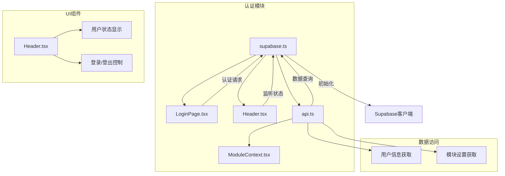
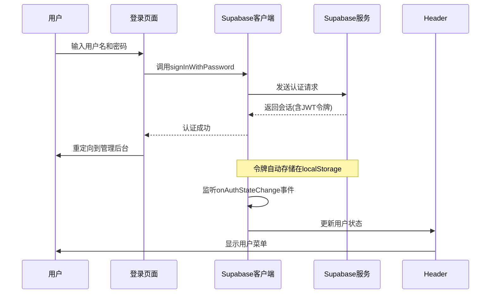
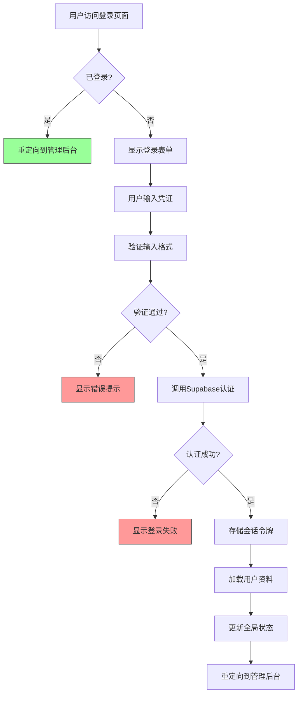
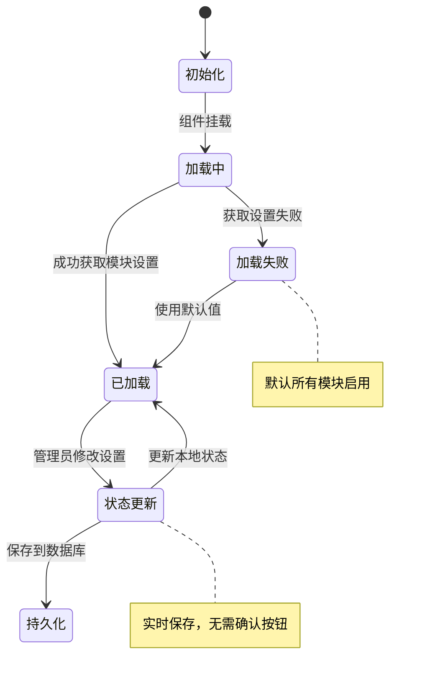
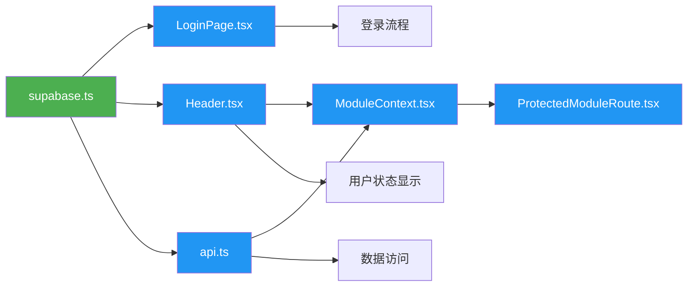

# 令牌管理

<cite>
**本文档引用文件**  
- [supabase.ts](file://src/db/supabase.ts)
- [LoginPage.tsx](file://src/pages/LoginPage.tsx)
- [Header.tsx](file://src/components/common/Header.tsx)
- [api.ts](file://src/db/api.ts)
- [ModuleContext.tsx](file://src/contexts/ModuleContext.tsx)
</cite>

## 目录
1. [简介](#简介)
2. [项目结构](#项目结构)
3. [核心组件](#核心组件)
4. [架构概述](#架构概述)
5. [详细组件分析](#详细组件分析)
6. [依赖分析](#依赖分析)
7. [性能考虑](#性能考虑)
8. [故障排除指南](#故障排除指南)
9. [结论](#结论)
10. [附录](#附录)（如有必要）

## 简介
本文档详细说明了系统中JWT令牌的生成、存储和刷新机制。系统采用Supabase认证服务来管理用户身份验证，通过标准化的流程处理访问令牌和刷新令牌。前端使用React框架实现用户界面，结合Supabase客户端库完成认证功能。当用户登录时，系统会生成JWT访问令牌和刷新令牌，这些令牌用于后续的API请求身份验证。系统实现了自动令牌刷新策略，确保用户在令牌过期后仍能保持登录状态，同时通过合理的错误处理机制应对认证失败的情况。

## 项目结构
本项目采用模块化结构，将不同功能的组件分离到各自的目录中。认证相关功能主要分布在`src/db`和`src/pages`目录下，其中`supabase.ts`文件负责初始化Supabase客户端，`LoginPage.tsx`实现登录界面，而认证状态的管理和监听则分散在各个需要验证用户身份的组件中。



**图表来源**  
- [supabase.ts](file://src/db/supabase.ts#L2-L8)
- [LoginPage.tsx](file://src/pages/LoginPage.tsx#L1-L102)
- [Header.tsx](file://src/components/common/Header.tsx#L1-L263)

**章节来源**
- [supabase.ts](file://src/db/supabase.ts#L1-L8)
- [LoginPage.tsx](file://src/pages/LoginPage.tsx#L1-L102)

## 核心组件
系统的核心认证组件包括Supabase客户端初始化、登录页面实现、用户状态管理和导航组件。Supabase客户端通过环境变量配置连接到后端服务，提供统一的认证接口。登录页面收集用户凭证并调用Supabase的认证API，而Header组件则负责显示用户状态并提供登出功能。ModuleContext组件管理模块的启用状态，依赖于用户的认证状态来决定哪些功能对用户可见。

**章节来源**
- [supabase.ts](file://src/db/supabase.ts#L2-L8)
- [LoginPage.tsx](file://src/pages/LoginPage.tsx#L11-L102)
- [Header.tsx](file://src/components/common/Header.tsx#L20-L263)
- [ModuleContext.tsx](file://src/contexts/ModuleContext.tsx#L1-L62)

## 架构概述
系统的认证架构基于Supabase的JWT认证机制，前端通过Supabase客户端与后端进行交互。当用户访问登录页面时，输入用户名和密码后，系统会调用Supabase的`signInWithPassword`方法进行认证。认证成功后，Supabase会返回包含访问令牌和刷新令牌的会话对象，这些令牌自动存储在浏览器的本地存储中。系统通过监听认证状态变化来更新UI，确保用户界面反映当前的登录状态。



**图表来源**  
- [LoginPage.tsx](file://src/pages/LoginPage.tsx#L36-L44)
- [supabase.ts](file://src/db/supabase.ts#L7)
- [Header.tsx](file://src/components/common/Header.tsx#L35-L45)

## 详细组件分析

### 认证流程分析
系统的认证流程从用户在登录页面输入凭证开始，经过Supabase客户端与后端服务的交互，最终完成用户状态的更新和界面的重定向。

#### 认证状态管理
```mermaid
classDiagram
class SupabaseAuth {
+onAuthStateChange(event, session) Subscription
+signInWithPassword(credentials) Session
+signOut() void
+getUser() User
}
class Header {
-profile : Profile | null
-loadProfile() void
-handleLogout() void
}
class ModuleContext {
-modules : Record~string, boolean~
-isLoading : boolean
-isModuleEnabled(key) boolean
-refreshModules() Promise~void~
}
SupabaseAuth --> Header : 监听状态变化
SupabaseAuth --> ModuleContext : 提供用户身份
Header --> ModuleContext : 获取模块状态
SupabaseAuth ..> "localStorage" : 自动存储令牌
```

**图表来源**  
- [Header.tsx](file://src/components/common/Header.tsx#L34-L45)
- [ModuleContext.tsx](file://src/contexts/ModuleContext.tsx#L1-L62)
- [supabase.ts](file://src/db/supabase.ts#L7)

#### 登录流程实现


**图表来源**  
- [LoginPage.tsx](file://src/pages/LoginPage.tsx#L17-L51)
- [Header.tsx](file://src/components/common/Header.tsx#L48-L55)
- [api.ts](file://src/db/api.ts#L32-L44)

**章节来源**
- [LoginPage.tsx](file://src/pages/LoginPage.tsx#L11-L102)
- [Header.tsx](file://src/components/common/Header.tsx#L20-L263)

### 模块控制分析
模块控制功能依赖于用户的认证状态和角色权限，只有管理员才能访问和修改模块设置。

#### 模块状态管理


**图表来源**  
- [ModuleContext.tsx](file://src/contexts/ModuleContext.tsx#L23-L34)
- [api.ts](file://src/db/api.ts#L214-L229)
- [ProtectedModuleRoute.tsx](file://src/components/common/ProtectedModuleRoute.tsx#L10-L28)

**章节来源**
- [ModuleContext.tsx](file://src/contexts/ModuleContext.tsx#L1-L62)
- [ProtectedModuleRoute.tsx](file://src/components/common/ProtectedModuleRoute.tsx#L1-L28)

## 依赖分析
系统各组件之间的依赖关系清晰，形成了一个以Supabase认证服务为核心的架构。Supabase客户端作为基础服务，被多个组件依赖用于用户认证和数据访问。Header组件依赖于认证状态来决定显示登录按钮还是用户菜单，同时依赖ModuleContext来获取模块的可见性设置。ModuleContext组件依赖于Supabase的认证状态来确定当前用户，并根据用户角色决定可访问的模块。



**图表来源**  
- [supabase.ts](file://src/db/supabase.ts#L7)
- [LoginPage.tsx](file://src/pages/LoginPage.tsx#L3)
- [Header.tsx](file://src/components/common/Header.tsx#L14)
- [api.ts](file://src/db/api.ts#L1)
- [ModuleContext.tsx](file://src/contexts/ModuleContext.tsx#L2)

**章节来源**
- [supabase.ts](file://src/db/supabase.ts#L1-L8)
- [LoginPage.tsx](file://src/pages/LoginPage.tsx#L1-L102)
- [Header.tsx](file://src/components/common/Header.tsx#L1-L263)
- [api.ts](file://src/db/api.ts#L1-L200)
- [ModuleContext.tsx](file://src/contexts/ModuleContext.tsx#L1-L62)

## 性能考虑
系统在认证和模块控制方面考虑了性能优化。ModuleContext组件在应用启动时一次性加载所有模块设置，避免了频繁的数据库查询。通过使用React的context机制，模块状态可以高效地传递给所有子组件，而无需通过props逐层传递。认证状态的监听采用事件驱动模式，只有在状态变化时才更新UI，减少了不必要的渲染。此外，系统遵循了项目规范中的性能优化原则，如使用`React.memo`和`useMemo`来优化组件渲染性能。

## 故障排除指南
当遇到认证或模块控制相关问题时，可以按照以下步骤进行排查：

1. **检查环境变量**：确保`.env`文件中的`VITE_SUPABASE_URL`和`VITE_SUPABASE_ANON_KEY`正确配置
2. **验证网络连接**：确认前端应用能够访问Supabase服务
3. **检查用户角色**：确认用户具有正确的角色权限（admin/user）
4. **查看浏览器控制台**：检查是否有JavaScript错误或网络请求失败
5. **验证模块设置**：通过数据库直接检查`module_settings`表中的配置

**章节来源**
- [Project-Rules.md](file://Project-Rules.md#L46-L60)
- [supabase.ts](file://src/db/supabase.ts#L4-L5)
- [Header.tsx](file://src/components/common/Header.tsx#L82-L92)

## 结论
本系统通过Supabase认证服务实现了安全可靠的用户身份验证机制。JWT令牌的生成、存储和刷新由Supabase客户端自动管理，前端只需关注用户界面和状态更新。模块控制功能与认证系统紧密结合，确保只有授权用户才能访问和修改系统设置。整体架构清晰，组件职责分明，遵循了项目的技术规范和安全要求。