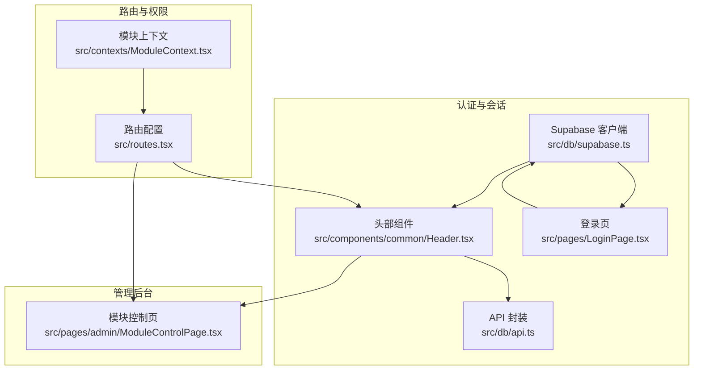
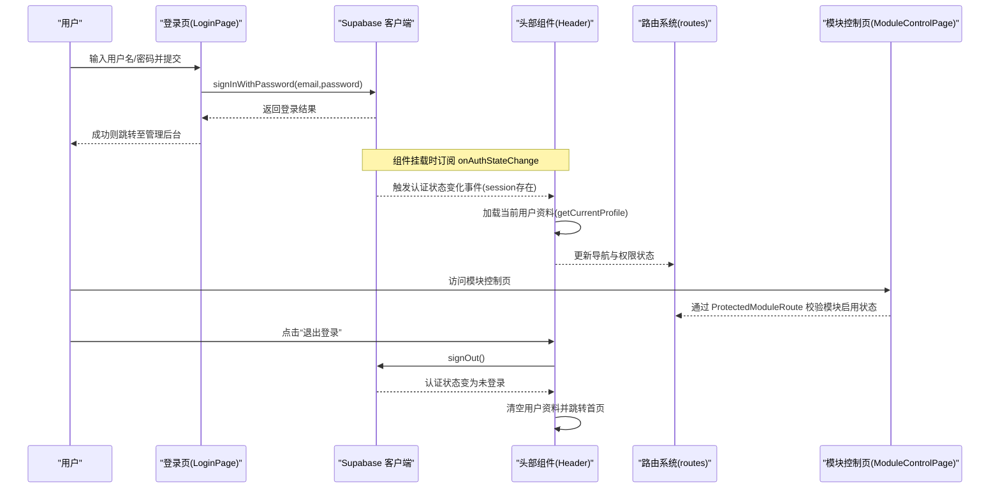
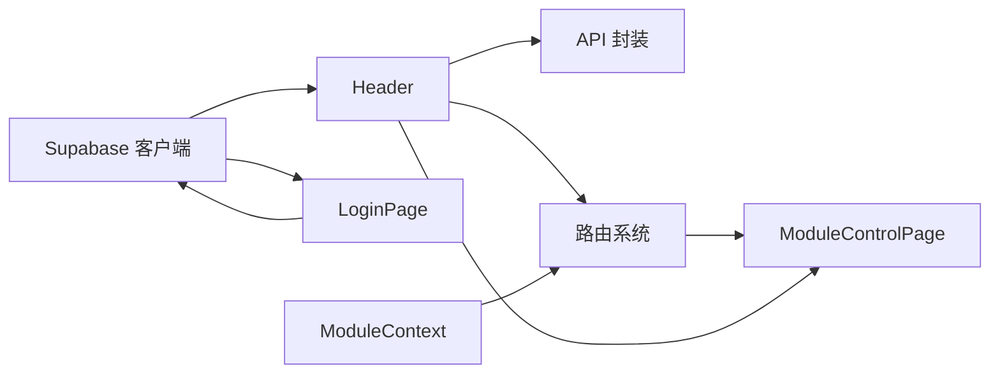

# 会话控制

<cite>
**本文引用的文件**
- [src/db/supabase.ts](file://src/db/supabase.ts)
- [src/components/common/Header.tsx](file://src/components/common/Header.tsx)
- [src/pages/LoginPage.tsx](file://src/pages/LoginPage.tsx)
- [src/pages/admin/ModuleControlPage.tsx](file://src/pages/admin/ModuleControlPage.tsx)
- [src/routes.tsx](file://src/routes.tsx)
- [src/contexts/ModuleContext.tsx](file://src/contexts/ModuleContext.tsx)
- [src/db/api.ts](file://src/db/api.ts)
- [docs/AUTH_UX_OPTIMIZATION_GUIDE.md](file://docs/AUTH_UX_OPTIMIZATION_GUIDE.md)
</cite>

## 目录
1. [简介](#简介)
2. [项目结构](#项目结构)
3. [核心组件](#核心组件)
4. [架构总览](#架构总览)
5. [详细组件分析](#详细组件分析)
6. [依赖关系分析](#依赖关系分析)
7. [性能考量](#性能考量)
8. [故障排查指南](#故障排查指南)
9. [结论](#结论)

## 简介
本文件围绕“会话控制”主题，系统梳理用户会话的创建、维护与销毁流程，重点说明 ModuleControlPage 如何通过 Supabase 的 onAuthStateChange 监听器实现认证状态的实时同步；并覆盖登录后会话初始化、会话超时处理机制、主动退出时的会话清理流程。同时提供状态持久化、跨标签页同步与会话恢复策略的实践建议与可视化图示，帮助开发者与运维人员快速理解与落地。

## 项目结构
与会话控制直接相关的模块与文件如下：
- Supabase 客户端初始化：src/db/supabase.ts
- 认证状态监听与退出登录：src/components/common/Header.tsx
- 登录页面与登录流程：src/pages/LoginPage.tsx
- 管理后台模块控制页面：src/pages/admin/ModuleControlPage.tsx
- 路由与权限控制：src/routes.tsx
- 模块启用状态上下文：src/contexts/ModuleContext.tsx
- 用户信息与配置读取 API：src/db/api.ts
- 认证状态监听与 UX 优化文档：docs/AUTH_UX_OPTIMIZATION_GUIDE.md

图表来源
- [src/db/supabase.ts](file://src/db/supabase.ts#L1-L8)
- [src/components/common/Header.tsx](file://src/components/common/Header.tsx#L1-L120)
- [src/pages/LoginPage.tsx](file://src/pages/LoginPage.tsx#L1-L102)
- [src/db/api.ts](file://src/db/api.ts#L1-L60)
- [src/routes.tsx](file://src/routes.tsx#L1-L207)
- [src/contexts/ModuleContext.tsx](file://src/contexts/ModuleContext.tsx#L1-L62)
- [src/pages/admin/ModuleControlPage.tsx](file://src/pages/admin/ModuleControlPage.tsx#L1-L120)

章节来源
- [src/db/supabase.ts](file://src/db/supabase.ts#L1-L8)
- [src/components/common/Header.tsx](file://src/components/common/Header.tsx#L1-L120)
- [src/pages/LoginPage.tsx](file://src/pages/LoginPage.tsx#L1-L102)
- [src/db/api.ts](file://src/db/api.ts#L1-L60)
- [src/routes.tsx](file://src/routes.tsx#L1-L207)
- [src/contexts/ModuleContext.tsx](file://src/contexts/ModuleContext.tsx#L1-L62)
- [src/pages/admin/ModuleControlPage.tsx](file://src/pages/admin/ModuleControlPage.tsx#L1-L120)

## 核心组件
- Supabase 客户端：负责与 Supabase 后端通信，提供认证、数据库与存储能力。
- Header 组件：在挂载时订阅 onAuthStateChange，登录后加载用户资料，退出后清空用户资料。
- LoginPage：接收用户名/密码，调用 Supabase 登录接口，登录成功后跳转管理后台。
- ModuleControlPage：管理后台页面之一，展示导航排序与可见性，不直接参与会话监听。
- 路由系统：通过 ProtectedModuleRoute 与 requireAuth/requireAdmin 控制访问权限。
- ModuleContext：提供模块启用状态，供路由与页面判断是否可访问。

章节来源
- [src/db/supabase.ts](file://src/db/supabase.ts#L1-L8)
- [src/components/common/Header.tsx](file://src/components/common/Header.tsx#L1-L120)
- [src/pages/LoginPage.tsx](file://src/pages/LoginPage.tsx#L1-L102)
- [src/pages/admin/ModuleControlPage.tsx](file://src/pages/admin/ModuleControlPage.tsx#L1-L120)
- [src/routes.tsx](file://src/routes.tsx#L1-L207)
- [src/contexts/ModuleContext.tsx](file://src/contexts/ModuleContext.tsx#L1-L62)

## 架构总览
下面以序列图展示一次完整的会话生命周期：登录、会话初始化、状态监听、退出与清理。

图表来源
- [src/pages/LoginPage.tsx](file://src/pages/LoginPage.tsx#L1-L102)
- [src/components/common/Header.tsx](file://src/components/common/Header.tsx#L1-L120)
- [src/routes.tsx](file://src/routes.tsx#L1-L207)
- [src/pages/admin/ModuleControlPage.tsx](file://src/pages/admin/ModuleControlPage.tsx#L1-L120)
- [src/db/api.ts](file://src/db/api.ts#L1-L60)

## 详细组件分析

### Supabase 客户端与 onAuthStateChange 监听
- Supabase 客户端初始化：在 db/supabase.ts 中创建 Supabase 客户端实例，供全局使用。
- Header 组件在挂载时订阅 onAuthStateChange，当 session 存在时加载用户资料，否则清空用户资料，并在组件卸载时取消订阅，防止内存泄漏。
- 文档中明确展示了监听实现与清理订阅的模式，便于在其他组件复用。

章节来源
- [src/db/supabase.ts](file://src/db/supabase.ts#L1-L8)
- [src/components/common/Header.tsx](file://src/components/common/Header.tsx#L1-L120)
- [docs/AUTH_UX_OPTIMIZATION_GUIDE.md](file://docs/AUTH_UX_OPTIMIZATION_GUIDE.md#L100-L132)

### 登录流程与会话初始化
- LoginPage 接收用户名与密码，将用户名转换为邮箱后调用 Supabase 登录接口。
- 登录成功后跳转管理后台，此时 Header 订阅的 onAuthStateChange 会触发，加载用户资料并更新导航状态。
- API 层提供 getCurrentProfile，封装 getUser 与 profiles 查询，保证用户资料的稳定获取。

章节来源
- [src/pages/LoginPage.tsx](file://src/pages/LoginPage.tsx#L1-L102)
- [src/components/common/Header.tsx](file://src/components/common/Header.tsx#L1-L120)
- [src/db/api.ts](file://src/db/api.ts#L1-L60)

### 会话维护与跨标签页同步
- onAuthStateChange 是 Supabase 提供的全局认证状态监听器，会在浏览器任意标签页发生登录/登出时触发。
- Header 组件作为全局导航组件，订阅该事件并在各标签页间保持一致的用户状态显示与导航行为。
- 由于 Header 在挂载时订阅且在卸载时取消，避免了重复订阅导致的状态不同步问题。

章节来源
- [src/components/common/Header.tsx](file://src/components/common/Header.tsx#L1-L120)
- [docs/AUTH_UX_OPTIMIZATION_GUIDE.md](file://docs/AUTH_UX_OPTIMIZATION_GUIDE.md#L100-L132)

### 主动退出与会话清理
- Header 提供“退出登录”入口，调用 Supabase 的 signOut，清空本地用户资料，跳转首页并提示成功。
- 退出后 onAuthStateChange 会触发“未登录”分支，Header 清空 profile，导航菜单回到未登录态。
- 该流程确保会话在多标签页内同步清理，避免出现“已退出但界面仍显示已登录”的异常。

章节来源
- [src/components/common/Header.tsx](file://src/components/common/Header.tsx#L1-L120)

### 会话超时处理机制
- 仓库中未发现显式的会话超时轮询或刷新逻辑。onAuthStateChange 仅响应登录/登出事件，不会自动刷新过期会话。
- 若需实现会话超时自动登出，可在 onAuthStateChange 的“有 session”分支中增加令牌有效性校验与刷新策略（例如：调用 Supabase 的会话刷新接口或在本地维护过期时间），并在过期时触发 signOut 并提示用户重新登录。
- 该策略属于扩展建议，非当前仓库实现。

章节来源
- [src/components/common/Header.tsx](file://src/components/common/Header.tsx#L1-L120)

### ModuleControlPage 的会话控制要点
- ModuleControlPage 本身不直接监听认证状态，其职责是管理导航模块的排序与可见性。
- 由于 Header 订阅了 onAuthStateChange，因此在登录状态下，ModuleControlPage 会继承到正确的导航与权限状态（受路由与模块上下文影响）。
- 该页面的会话控制主要体现在：在登录后才可访问管理后台；在退出后自动跳转首页，无法继续访问管理后台页面。

章节来源
- [src/pages/admin/ModuleControlPage.tsx](file://src/pages/admin/ModuleControlPage.tsx#L1-L120)
- [src/routes.tsx](file://src/routes.tsx#L1-L207)
- [src/contexts/ModuleContext.tsx](file://src/contexts/ModuleContext.tsx#L1-L62)

### 路由与权限控制对会话的影响
- routes.tsx 中为管理后台路由设置了 requireAuth 与 requireAdmin，结合 ProtectedModuleRoute 与 ModuleContext，确保只有登录且具备管理员角色的用户才能访问管理后台页面。
- ModuleControlPage 作为管理后台子页面，同样受上述保护。

章节来源
- [src/routes.tsx](file://src/routes.tsx#L1-L207)
- [src/contexts/ModuleContext.tsx](file://src/contexts/ModuleContext.tsx#L1-L62)

## 依赖关系分析
- Header 依赖 Supabase 客户端进行认证状态监听与退出登录；依赖 API 层获取用户资料；依赖 ModuleContext 获取模块启用状态。
- LoginPage 依赖 Supabase 客户端进行登录；依赖路由进行跳转。
- ModuleControlPage 依赖路由与模块上下文进行权限与可见性控制。
- 路由系统通过 ProtectedModuleRoute 与 ModuleContext 协作，实现模块级别的访问控制。

图表来源
- [src/db/supabase.ts](file://src/db/supabase.ts#L1-L8)
- [src/components/common/Header.tsx](file://src/components/common/Header.tsx#L1-L120)
- [src/pages/LoginPage.tsx](file://src/pages/LoginPage.tsx#L1-L102)
- [src/db/api.ts](file://src/db/api.ts#L1-L60)
- [src/routes.tsx](file://src/routes.tsx#L1-L207)
- [src/contexts/ModuleContext.tsx](file://src/contexts/ModuleContext.tsx#L1-L62)
- [src/pages/admin/ModuleControlPage.tsx](file://src/pages/admin/ModuleControlPage.tsx#L1-L120)

章节来源
- [src/db/supabase.ts](file://src/db/supabase.ts#L1-L8)
- [src/components/common/Header.tsx](file://src/components/common/Header.tsx#L1-L120)
- [src/pages/LoginPage.tsx](file://src/pages/LoginPage.tsx#L1-L102)
- [src/db/api.ts](file://src/db/api.ts#L1-L60)
- [src/routes.tsx](file://src/routes.tsx#L1-L207)
- [src/contexts/ModuleContext.tsx](file://src/contexts/ModuleContext.tsx#L1-L62)
- [src/pages/admin/ModuleControlPage.tsx](file://src/pages/admin/ModuleControlPage.tsx#L1-L120)

## 性能考量
- 认证状态监听：onAuthStateChange 仅在登录/登出事件触发，开销极低；注意在组件卸载时取消订阅，避免重复订阅导致的内存泄漏与重复渲染。
- 用户资料加载：Header 在登录后加载用户资料，建议在高频场景下引入轻量缓存（例如内存缓存）以减少重复查询。
- 路由守卫：ProtectedModuleRoute 与 ModuleContext 的组合在加载中显示加载态，避免白屏与闪烁。
- 登录页：登录成功后立即跳转，减少不必要的 UI 渲染。

[本节为通用指导，无需列出具体文件来源]

## 故障排查指南
- 登录后仍显示“登录”按钮
  - 检查 Header 是否正确订阅 onAuthStateChange，确认组件已挂载且未提前卸载。
  - 确认 getCurrentProfile 能够返回用户资料，若失败请检查 Supabase 配置与网络。
- 退出登录后界面未更新
  - 确认 Header 的 handleLogout 是否调用了 signOut 并清空了 profile。
  - 确认 onAuthStateChange 的“未登录”分支已被触发。
- 多标签页状态不一致
  - 确保 Header 在每个标签页都订阅了 onAuthStateChange，且未重复订阅。
  - 避免在多个组件中各自订阅同一事件而未统一管理。
- 会话超时未自动登出
  - 当前仓库未实现会话超时自动登出逻辑，如需此能力，应在 onAuthStateChange 的“有 session”分支中加入令牌有效性校验与刷新策略。

章节来源
- [src/components/common/Header.tsx](file://src/components/common/Header.tsx#L1-L120)
- [src/pages/LoginPage.tsx](file://src/pages/LoginPage.tsx#L1-L102)
- [src/db/api.ts](file://src/db/api.ts#L1-L60)

## 结论
本项目通过 Supabase 的 onAuthStateChange 实现了会话的实时同步与一致性：登录后自动加载用户资料，退出后统一清理状态。Header 作为全局导航组件承担了会话状态的核心维护职责；路由与模块上下文共同保障了管理后台页面的访问安全。对于会话超时，当前仓库未实现自动登出逻辑，建议在“有 session”分支中增加令牌有效性校验与刷新策略，以满足更严格的会话安全需求。