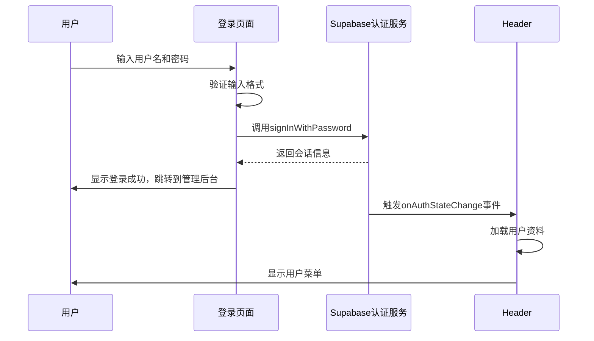
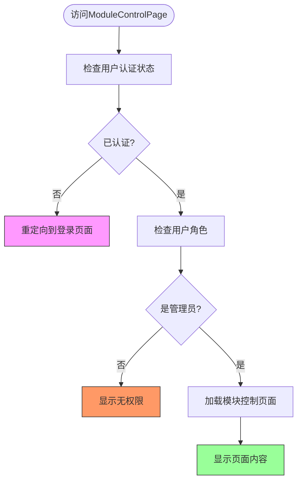
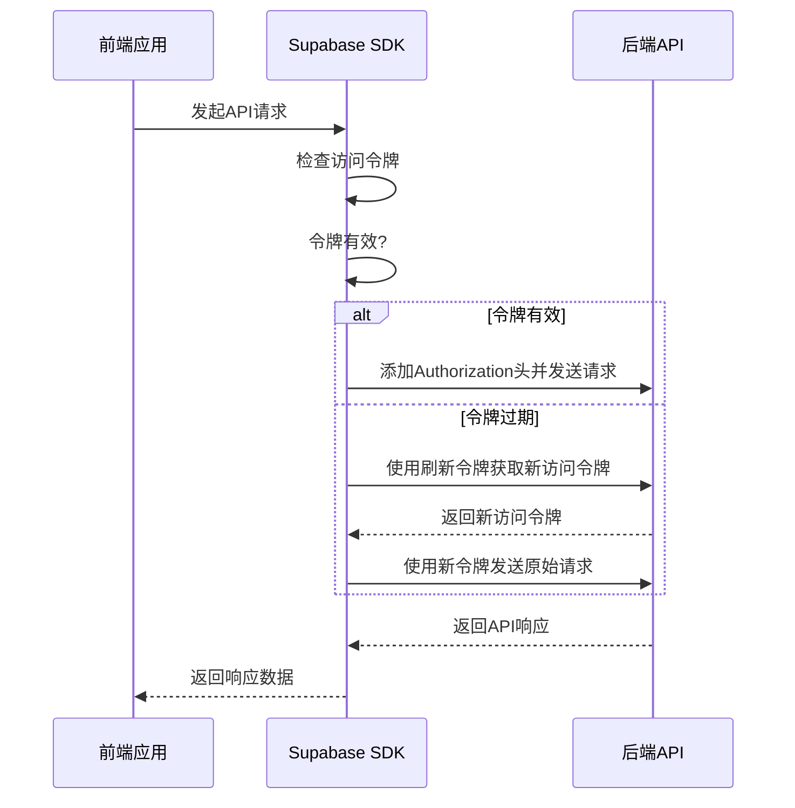
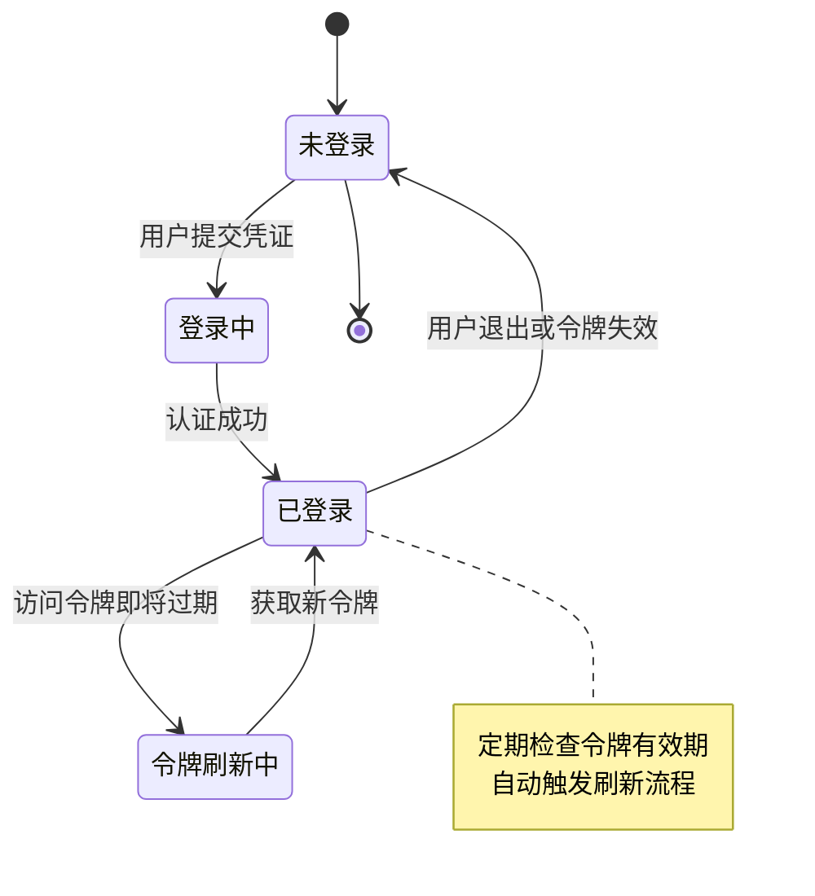

# 身份验证机制

<cite>
**本文档引用的文件**  
- [ModuleControlPage.tsx](file://src/pages/admin/ModuleControlPage.tsx)
- [LoginPage.tsx](file://src/pages/LoginPage.tsx)
- [supabase.ts](file://src/db/supabase.ts)
- [api.ts](file://src/db/api.ts)
- [ProtectedModuleRoute.tsx](file://src/components/common/ProtectedModuleRoute.tsx)
- [routes.tsx](file://src/routes.tsx)
- [ModuleContext.tsx](file://src/contexts/ModuleContext.tsx)
- [Header.tsx](file://src/components/common/Header.tsx)
- [AUTH_UX_OPTIMIZATION_GUIDE.md](file://docs/AUTH_UX_OPTIMIZATION_GUIDE.md)
- [.env](file://.env)
</cite>

## 目录
1. [简介](#简介)
2. [用户登录与认证流程](#用户登录与认证流程)
3. [管理员权限验证机制](#管理员权限验证机制)
4. [JWT令牌管理与安全存储](#jwt令牌管理与安全存储)
5. [前端HTTP请求拦截器](#前端http请求拦截器)
6. [后端令牌验证与安全策略](#后端令牌验证与安全策略)
7. [会话安全与令牌刷新机制](#会话安全与令牌刷新机制)
8. [身份验证架构图](#身份验证架构图)
9. [总结](#总结)

## 简介

本系统采用Supabase作为身份验证服务提供商，实现了基于JWT（JSON Web Token）的完整认证体系。系统通过Supabase的认证功能管理用户会话，确保只有经过身份验证的管理员才能访问敏感的管理功能，如模块控制页面。整个认证流程涵盖了用户登录、令牌管理、权限验证和会话安全等多个方面，为系统提供了可靠的安全保障。

**Section sources**
- [AUTH_UX_OPTIMIZATION_GUIDE.md](file://docs/AUTH_UX_OPTIMIZATION_GUIDE.md)

## 用户登录与认证流程

用户的认证流程始于登录页面（LoginPage.tsx），用户输入用户名和密码后，系统会将用户名转换为特定格式的邮箱地址（username@miaoda.com），然后通过Supabase的`signInWithPassword`方法进行身份验证。登录成功后，Supabase会自动管理用户的会话状态，并将JWT令牌存储在浏览器的localStorage中。

系统通过`onAuthStateChange`监听器实时监控认证状态的变化。当用户登录时，系统会自动加载用户资料；当用户退出登录时，系统会清除用户信息并重定向到首页。这种机制确保了用户界面能够实时反映当前的登录状态。



**Diagram sources**
- [LoginPage.tsx](file://src/pages/LoginPage.tsx)
- [Header.tsx](file://src/components/common/Header.tsx)

**Section sources**
- [LoginPage.tsx](file://src/pages/LoginPage.tsx)
- [Header.tsx](file://src/components/common/Header.tsx)

## 管理员权限验证机制

系统通过多层机制确保只有管理员才能访问`ModuleControlPage`等敏感页面。首先，在路由配置（routes.tsx）中，管理后台相关的路由都设置了`requireAuth: true`和`requireAdmin: true`标志，表明这些页面需要认证且仅限管理员访问。

其次，`ModuleControlPage`组件通过Supabase的`getUser`方法检查当前用户的登录状态和角色。系统会查询用户资料表（profiles），验证用户角色是否为"admin"。如果用户未登录或不是管理员，系统会自动重定向到登录页面。

此外，系统还使用了`ProtectedModuleRoute`组件来实现细粒度的模块访问控制。该组件通过`ModuleContext`获取模块启用状态，并根据`moduleKey`决定是否渲染子组件，从而实现了基于模块的访问控制。



**Diagram sources**
- [ModuleControlPage.tsx](file://src/pages/admin/ModuleControlPage.tsx)
- [routes.tsx](file://src/routes.tsx)
- [ProtectedModuleRoute.tsx](file://src/components/common/ProtectedModuleRoute.tsx)

**Section sources**
- [ModuleControlPage.tsx](file://src/pages/admin/ModuleControlPage.tsx)
- [routes.tsx](file://src/routes.tsx)
- [ProtectedModuleRoute.tsx](file://src/components/common/ProtectedModuleRoute.tsx)

## JWT令牌管理与安全存储

系统使用Supabase管理JWT令牌的整个生命周期。当用户成功登录后，Supabase会自动将访问令牌（access token）和刷新令牌（refresh token）存储在浏览器的localStorage中。访问令牌用于后续的API请求认证，而刷新令牌用于在访问令牌过期后获取新的令牌。

为了增强安全性，系统采用了多种措施来保护令牌。首先，通过Supabase的配置，确保令牌只能通过安全的HTTPS连接传输。其次，系统实现了令牌自动刷新机制，当访问令牌即将过期时，系统会自动使用刷新令牌获取新的访问令牌，从而避免用户频繁重新登录。

虽然当前实现使用localStorage存储令牌，但考虑到会话劫持的风险，建议在未来的版本中考虑使用HttpOnly Cookie来存储令牌，这样可以有效防止跨站脚本（XSS）攻击。

**Section sources**
- [supabase.ts](file://src/db/supabase.ts)
- [api.ts](file://src/db/api.ts)

## 前端HTTP请求拦截器

系统通过Supabase客户端自动处理API请求的认证。在`supabase.ts`文件中，系统创建了一个Supabase客户端实例，该实例会自动在每个请求的Authorization头中包含JWT令牌。这意味着开发者无需手动管理令牌的附加，Supabase SDK会自动处理这一过程。

当发起API请求时，Supabase客户端会检查当前会话状态，如果存在有效的访问令牌，则将其添加到请求头中。如果访问令牌已过期，客户端会自动使用刷新令牌获取新的访问令牌，然后重新发送原始请求。这种透明的令牌管理机制简化了前端开发，同时确保了请求的安全性。



**Diagram sources**
- [supabase.ts](file://src/db/supabase.ts)
- [api.ts](file://src/db/api.ts)

**Section sources**
- [supabase.ts](file://src/db/supabase.ts)
- [api.ts](file://src/db/api.ts)

## 后端令牌验证与安全策略

后端通过Supabase的行级安全性（Row Level Security, RLS）策略来验证JWT令牌的有效性。在数据库层面，每个需要保护的表都有相应的RLS策略，这些策略会检查请求中的JWT令牌，并根据用户角色决定是否允许访问特定数据。

例如，在`regulatory_departments`、`cases`等敏感表上，系统配置了"管理员可管理"的策略，该策略使用`is_admin(auth.uid())`函数来验证用户是否为管理员。只有当JWT令牌有效且用户角色为管理员时，才能执行插入、更新或删除操作。

此外，系统还使用了PostgreSQL的`is_admin`辅助函数来简化权限检查。该函数接收用户ID作为参数，查询`profiles`表以确定用户角色，从而实现了统一的权限验证逻辑。

**Section sources**
- [00001_create_initial_schema.sql](file://supabase/migrations/00001_create_initial_schema.sql)

## 会话安全与令牌刷新机制

系统实现了完善的会话安全机制，包括令牌自动刷新和定期令牌轮换。Supabase的认证系统会自动管理令牌的刷新过程，当访问令牌接近过期时，系统会静默地使用刷新令牌获取新的访问令牌，从而保持用户的会话活跃。

为了进一步提高安全性，系统建议实施定期的令牌刷新策略。这可以通过在用户每次成功认证后强制刷新令牌来实现，从而缩短令牌的有效期，降低令牌泄露的风险。同时，系统应该实现安全的退出登录机制，当用户选择退出时，不仅要清除本地存储的令牌，还应该调用Supabase的`signOut`方法使令牌失效。



**Diagram sources**
- [Header.tsx](file://src/components/common/Header.tsx)
- [api.ts](file://src/db/api.ts)

**Section sources**
- [Header.tsx](file://src/components/common/Header.tsx)
- [api.ts](file://src/db/api.ts)

## 身份验证架构图

```mermaid
graph TB
subgraph "客户端"
A[浏览器]
B[localStorage]
C[React应用]
D[Supabase SDK]
end
subgraph "网络"
E[HTTPS]
end
subgraph "服务端"
F[Supabase Auth]
G[PostgreSQL数据库]
H[RLS策略]
end
A --> B: 存储JWT令牌
C --> D: API请求
D --> E: 带Authorization头的请求
E --> F: 验证JWT令牌
F --> H: 检查用户角色
H --> G: 执行数据库操作
G --> H: 返回数据
H --> F: 返回验证结果
F --> E: 返回API响应
E --> D: 返回响应数据
D --> C: 返回结果
style A fill:#f9f,stroke:#333
style B fill:#ff9,stroke:#333
style C fill:#9f9,stroke:#333
style D fill:#9ff,stroke:#333
style E fill:#99f,stroke:#333
style F fill:#f99,stroke:#333
style G fill:#ff9,stroke:#333
style H fill:#f9f,stroke:#333
```

**Diagram sources**
- [supabase.ts](file://src/db/supabase.ts)
- [api.ts](file://src/db/api.ts)
- [00001_create_initial_schema.sql](file://supabase/migrations/00001_create_initial_schema.sql)

**Section sources**
- [supabase.ts](file://src/db/supabase.ts)
- [api.ts](file://src/db/api.ts)
- [00001_create_initial_schema.sql](file://supabase/migrations/00001_create_initial_schema.sql)

## 总结

本系统的身份验证机制基于Supabase平台构建，实现了从用户登录到权限验证的完整安全流程。通过JWT令牌、行级安全策略和多层访问控制，系统确保了只有经过身份验证的管理员才能访问敏感的管理功能。

关键安全特性包括：使用`onAuthStateChange`监听器实时监控认证状态、通过`ProtectedModuleRoute`实现细粒度的模块访问控制、利用Supabase SDK自动处理JWT令牌的管理和刷新、以及通过RLS策略在数据库层面强制执行安全规则。

为了进一步提高安全性，建议未来考虑使用HttpOnly Cookie存储令牌以防止XSS攻击，并实施更严格的密码策略和多因素认证。同时，定期的安全审计和漏洞扫描也是确保系统长期安全的重要措施。

**Section sources**
- [AUTH_UX_OPTIMIZATION_GUIDE.md](file://docs/AUTH_UX_OPTIMIZATION_GUIDE.md)