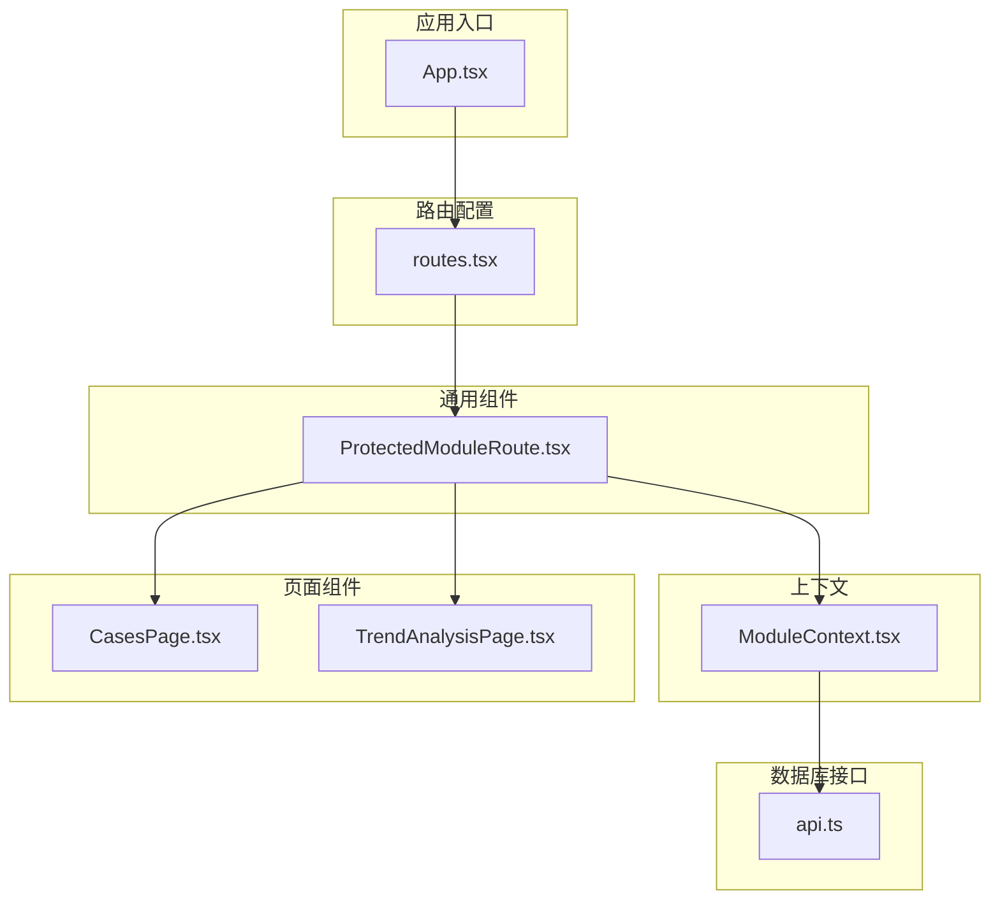
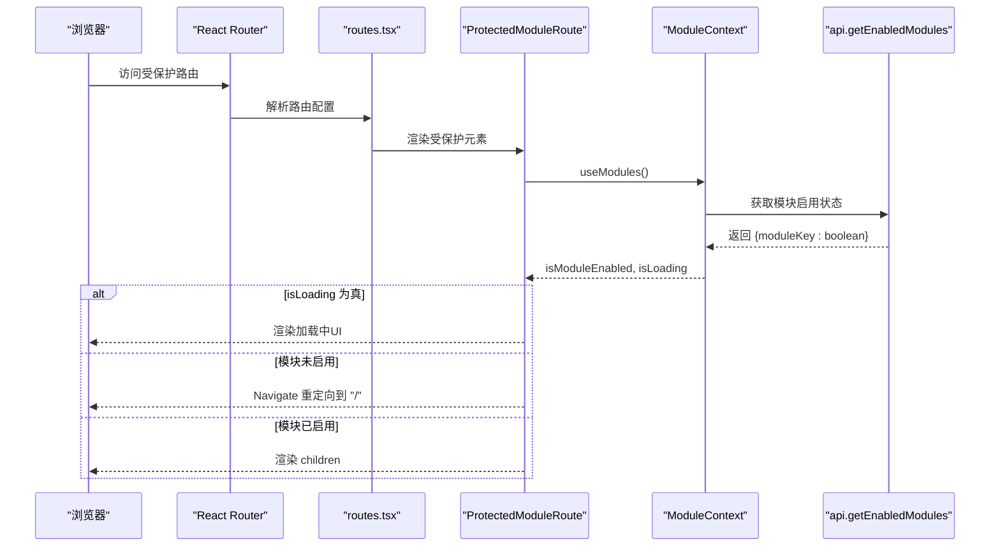
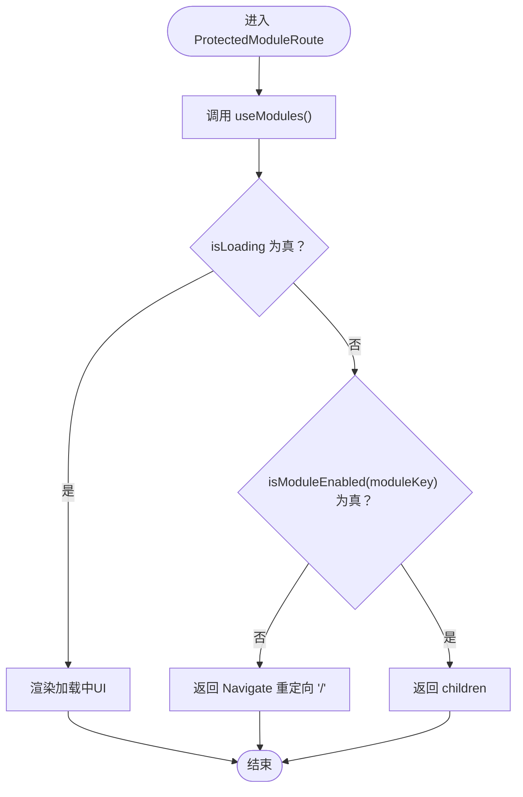
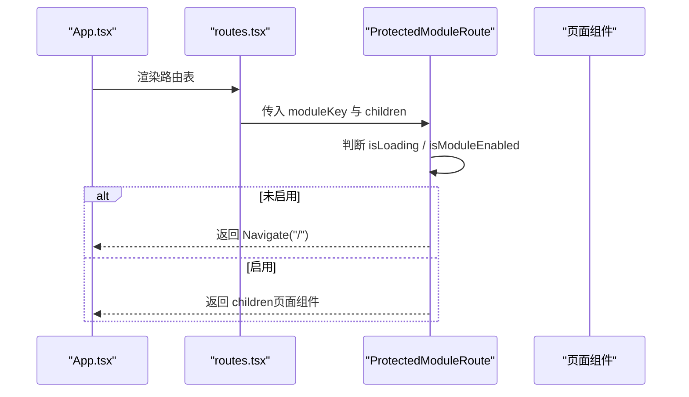
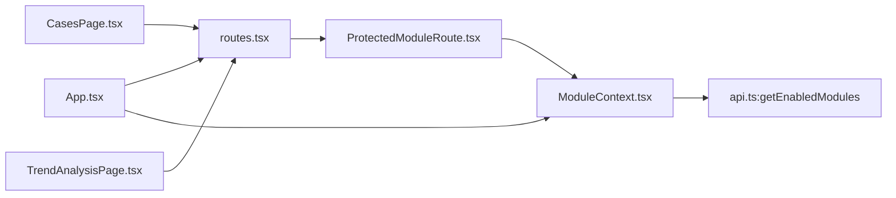

# ProtectedModuleRoute组件实现

<cite>
**本文引用的文件**
- [ProtectedModuleRoute.tsx](file://src/components/common/ProtectedModuleRoute.tsx)
- [ModuleContext.tsx](file://src/contexts/ModuleContext.tsx)
- [routes.tsx](file://src/routes.tsx)
- [App.tsx](file://src/App.tsx)
- [CasesPage.tsx](file://src/pages/CasesPage.tsx)
- [TrendAnalysisPage.tsx](file://src/pages/TrendAnalysisPage.tsx)
- [ModuleSettingsPage.tsx](file://src/pages/admin/ModuleSettingsPage.tsx)
- [api.ts](file://src/db/api.ts)
</cite>

## 目录
1. [简介](#简介)
2. [项目结构](#项目结构)
3. [核心组件](#核心组件)
4. [架构总览](#架构总览)
5. [详细组件分析](#详细组件分析)
6. [依赖关系分析](#依赖关系分析)
7. [性能考量](#性能考量)
8. [故障排查指南](#故障排查指南)
9. [结论](#结论)
10. [附录](#附录)

## 简介
本文件围绕 ProtectedModuleRoute 组件的实现进行系统化技术文档编写，重点说明其作为路由守卫的工作机制：如何通过 useModules Hook 获取全局模块状态，如何在加载中状态展示 UI，如何在模块未启用时使用 Navigate 组件进行无刷新重定向，以及 children 属性的渲染与条件渲染策略。同时提供在不同页面路由中的实际应用示例，并阐述错误处理与边界情况的应对策略。

## 项目结构
ProtectedModuleRoute 位于通用组件层，配合 ModuleContext 提供全局模块状态；路由配置集中于 routes.tsx，应用入口 App.tsx 注入 ModuleProvider 以提供上下文能力。页面组件如案例查询、趋势分析等通过 ProtectedModuleRoute 包裹实现模块级访问控制。



**图表来源**
- [App.tsx](file://src/App.tsx#L1-L33)
- [routes.tsx](file://src/routes.tsx#L1-L207)
- [ProtectedModuleRoute.tsx](file://src/components/common/ProtectedModuleRoute.tsx#L1-L29)
- [ModuleContext.tsx](file://src/contexts/ModuleContext.tsx#L1-L62)
- [api.ts](file://src/db/api.ts#L2568-L2586)

**章节来源**
- [App.tsx](file://src/App.tsx#L1-L33)
- [routes.tsx](file://src/routes.tsx#L1-L207)

## 核心组件
- ProtectedModuleRoute：路由守卫组件，负责根据模块启用状态决定是否渲染子组件或重定向。
- ModuleContext：提供 isModuleEnabled、isLoading、refreshModules 等能力，从数据库拉取模块启用状态。
- routes.tsx：集中定义路由与元素映射，其中多个页面路由通过 ProtectedModuleRoute 包裹。
- App.tsx：应用根组件，注入 ModuleProvider，确保上下文在整个应用可用。

**章节来源**
- [ProtectedModuleRoute.tsx](file://src/components/common/ProtectedModuleRoute.tsx#L1-L29)
- [ModuleContext.tsx](file://src/contexts/ModuleContext.tsx#L1-L62)
- [routes.tsx](file://src/routes.tsx#L1-L207)
- [App.tsx](file://src/App.tsx#L1-L33)

## 架构总览
ProtectedModuleRoute 的工作流如下：
- 组件挂载后调用 useModules 获取 isModuleEnabled 和 isLoading。
- 若 isLoading 为真，渲染加载中 UI（居中旋转指示器）。
- 若 isModuleEnabled(moduleKey) 为假，则返回 Navigate 重定向至首页。
- 否则渲染 children。



**图表来源**
- [ProtectedModuleRoute.tsx](file://src/components/common/ProtectedModuleRoute.tsx#L1-L29)
- [ModuleContext.tsx](file://src/contexts/ModuleContext.tsx#L1-L62)
- [api.ts](file://src/db/api.ts#L2568-L2586)
- [routes.tsx](file://src/routes.tsx#L33-L109)

## 详细组件分析

### ProtectedModuleRoute 组件
- 输入参数
  - moduleKey: string，用于标识目标模块键值。
  - children: ReactNode，被保护的页面组件。
- 内部逻辑
  - 调用 useModules 获取 isModuleEnabled 与 isLoading。
  - 加载中：返回居中旋转指示器的占位 UI。
  - 未启用：返回 Navigate 重定向首页。
  - 已启用：返回 children。
- 错误处理与边界
  - useModules 必须在 ModuleProvider 内使用，否则抛出错误。
  - isModuleEnabled 默认行为：若模块键不存在，默认视为启用。
  - 加载失败：ModuleContext 在加载异常时会记录错误并保持默认启用，避免阻塞页面。



**图表来源**
- [ProtectedModuleRoute.tsx](file://src/components/common/ProtectedModuleRoute.tsx#L1-L29)
- [ModuleContext.tsx](file://src/contexts/ModuleContext.tsx#L1-L62)

**章节来源**
- [ProtectedModuleRoute.tsx](file://src/components/common/ProtectedModuleRoute.tsx#L1-L29)
- [ModuleContext.tsx](file://src/contexts/ModuleContext.tsx#L1-L62)

### ModuleContext 与 useModules
- ModuleProvider
  - 初始化模块状态 modules 为固定键集合（cases、news、departments、trends、issues），默认均为启用。
  - 首次挂载时异步调用 getEnabledModules，将后端返回的启用状态合并到 modules。
  - isLoading 在加载期间为真，加载完成后为假。
  - isModuleEnabled(key)：若键存在返回对应布尔值，否则默认返回 true。
  - refreshModules：重新拉取启用状态。
- useModules：返回 Provider 中提供的上下文对象，若未在 Provider 内使用则抛错。

```mermaid
classDiagram
class ModuleProvider {
+modules : Record<string, boolean>
+isLoading : boolean
+loadModules()
+isModuleEnabled(key) : boolean
+refreshModules()
}
class useModules {
+调用 useContext(ModuleContext)
+返回 { modules, isModuleEnabled, refreshModules, isLoading }
}
ModuleProvider --> useModules : "提供上下文"
```

**图表来源**
- [ModuleContext.tsx](file://src/contexts/ModuleContext.tsx#L1-L62)

**章节来源**
- [ModuleContext.tsx](file://src/contexts/ModuleContext.tsx#L1-L62)

### 路由配置与应用
- App.tsx 注入 ModuleProvider，使整个应用具备模块状态上下文。
- routes.tsx 中多处路由通过 ProtectedModuleRoute 包裹页面组件，传入对应的 moduleKey：
  - 案例查询：moduleKey="cases"
  - 案例详情：moduleKey="cases"
  - 监管资讯：moduleKey="news"
  - 资讯详情：moduleKey="news"
  - 监管部门：moduleKey="departments"
  - 趋势分析：moduleKey="trends"
  - 问题分析：moduleKey="issues"



**图表来源**
- [App.tsx](file://src/App.tsx#L1-L33)
- [routes.tsx](file://src/routes.tsx#L33-L109)

**章节来源**
- [App.tsx](file://src/App.tsx#L1-L33)
- [routes.tsx](file://src/routes.tsx#L33-L109)

### 页面组件与受保护路由的关系
- 案例查询页面（CasesPage.tsx）：通过 ProtectedModuleRoute(moduleKey="cases") 保护，若模块关闭则无法访问。
- 趋势分析页面（TrendAnalysisPage.tsx）：通过 ProtectedModuleRoute(moduleKey="trends") 保护，若模块关闭则无法访问。
- 其他页面如新闻、部门、问题分析亦采用相同模式。

**章节来源**
- [routes.tsx](file://src/routes.tsx#L40-L109)
- [CasesPage.tsx](file://src/pages/CasesPage.tsx#L1-L537)
- [TrendAnalysisPage.tsx](file://src/pages/TrendAnalysisPage.tsx#L1-L678)

### 实际应用示例（代码路径）
- 案例查询保护配置
  - 路由配置：[routes.tsx](file://src/routes.tsx#L40-L59)
  - 页面组件：[CasesPage.tsx](file://src/pages/CasesPage.tsx#L1-L537)
- 趋势分析保护配置
  - 路由配置：[routes.tsx](file://src/routes.tsx#L90-L109)
  - 页面组件：[TrendAnalysisPage.tsx](file://src/pages/TrendAnalysisPage.tsx#L1-L678)
- 模块控制页面（后台）
  - 模块开关页面：[ModuleSettingsPage.tsx](file://src/pages/admin/ModuleSettingsPage.tsx#L1-L167)
  - 后端接口：[api.ts](file://src/db/api.ts#L2536-L2586)

**章节来源**
- [routes.tsx](file://src/routes.tsx#L40-L109)
- [CasesPage.tsx](file://src/pages/CasesPage.tsx#L1-L537)
- [TrendAnalysisPage.tsx](file://src/pages/TrendAnalysisPage.tsx#L1-L678)
- [ModuleSettingsPage.tsx](file://src/pages/admin/ModuleSettingsPage.tsx#L1-L167)
- [api.ts](file://src/db/api.ts#L2536-L2586)

## 依赖关系分析
- 组件耦合
  - ProtectedModuleRoute 依赖 useModules，间接依赖数据库接口 getEnabledModules。
  - routes.tsx 依赖 ProtectedModuleRoute 与各页面组件。
  - App.tsx 依赖 ModuleProvider，为整树提供上下文。
- 外部依赖
  - react-router-dom 的 Navigate 用于无刷新重定向。
  - 数据库接口 api.ts 提供 getEnabledModules 与模块设置 CRUD。



**图表来源**
- [ProtectedModuleRoute.tsx](file://src/components/common/ProtectedModuleRoute.tsx#L1-L29)
- [ModuleContext.tsx](file://src/contexts/ModuleContext.tsx#L1-L62)
- [api.ts](file://src/db/api.ts#L2568-L2586)
- [routes.tsx](file://src/routes.tsx#L33-L109)
- [App.tsx](file://src/App.tsx#L1-L33)
- [CasesPage.tsx](file://src/pages/CasesPage.tsx#L1-L537)
- [TrendAnalysisPage.tsx](file://src/pages/TrendAnalysisPage.tsx#L1-L678)

**章节来源**
- [ProtectedModuleRoute.tsx](file://src/components/common/ProtectedModuleRoute.tsx#L1-L29)
- [ModuleContext.tsx](file://src/contexts/ModuleContext.tsx#L1-L62)
- [routes.tsx](file://src/routes.tsx#L33-L109)
- [App.tsx](file://src/App.tsx#L1-L33)

## 性能考量
- 首次加载性能
  - ModuleContext 在首次挂载时发起一次 getEnabledModules 请求，isLoading 期间渲染轻量加载指示器，避免白屏。
- 渲染开销
  - ProtectedModuleRoute 仅做布尔判断与条件渲染，开销极低。
- 数据一致性
  - refreshModules 可在后台模块状态变更后手动刷新，保证前端状态与数据库一致。

[本节为通用性能讨论，无需具体文件分析]

## 故障排查指南
- 症状：页面空白或长时间加载
  - 可能原因：数据库请求失败导致 isLoading 持续为真。
  - 处理：检查网络与 Supabase 连接；确认 getEnabledModules 是否抛错；可在 ModuleContext 中增加更详细的错误提示。
- 症状：模块关闭仍可访问
  - 可能原因：moduleKey 与数据库中 module_key 不一致；或 isModuleEnabled 默认返回 true。
  - 处理：核对 routes.tsx 中的 moduleKey 与数据库模块键一致；确认数据库中 is_enabled 状态正确。
- 症状：useModules 报错
  - 可能原因：在 ModuleProvider 外部使用 useModules。
  - 处理：确保 App.tsx 中已包裹 ModuleProvider。

**章节来源**
- [ModuleContext.tsx](file://src/contexts/ModuleContext.tsx#L1-L62)
- [routes.tsx](file://src/routes.tsx#L33-L109)
- [App.tsx](file://src/App.tsx#L1-L33)

## 结论
ProtectedModuleRoute 通过 useModules 与 ModuleContext 实现了模块级路由守卫，具备加载中友好 UI、模块未启用时的无刷新重定向、以及 children 的条件渲染策略。结合后台模块控制页面，管理员可灵活启停模块，前端即时生效。整体设计简洁、可维护性强，适合扩展到更多模块场景。

[本节为总结性内容，无需具体文件分析]

## 附录

### API 定义（与模块相关）
- getEnabledModules：返回 { moduleKey: boolean }，用于前台判断模块是否启用。
- getModuleSettings / updateModuleSetting：后台模块设置管理接口。

**章节来源**
- [api.ts](file://src/db/api.ts#L2568-L2586)
- [api.ts](file://src/db/api.ts#L2536-L2566)