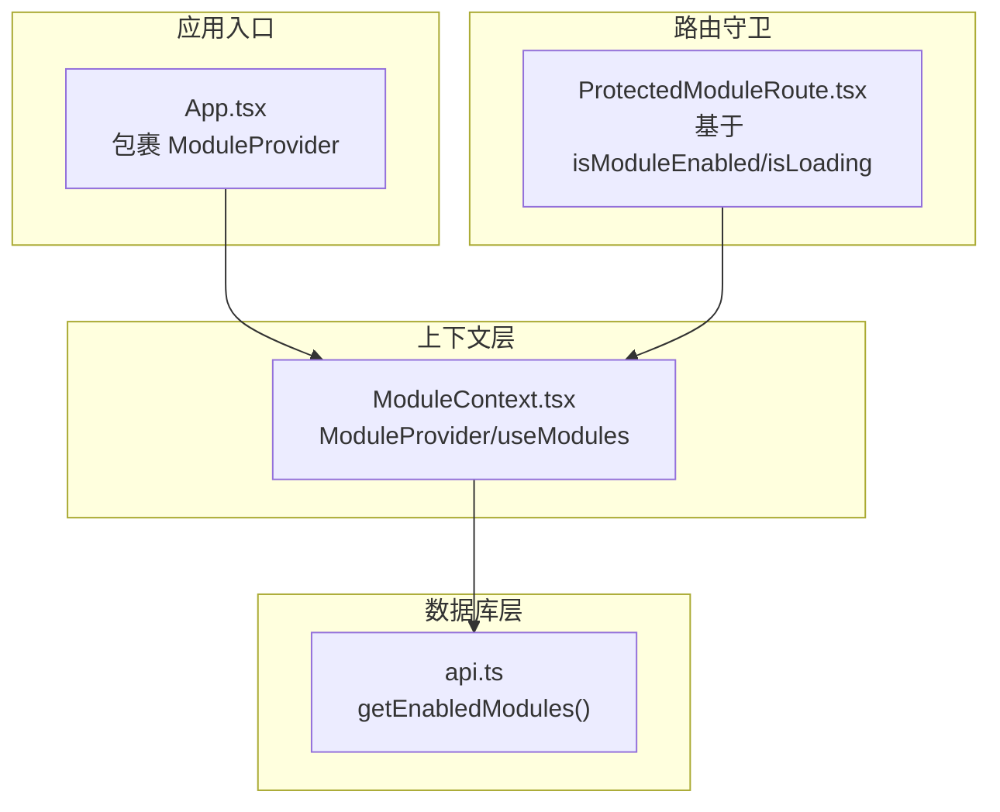
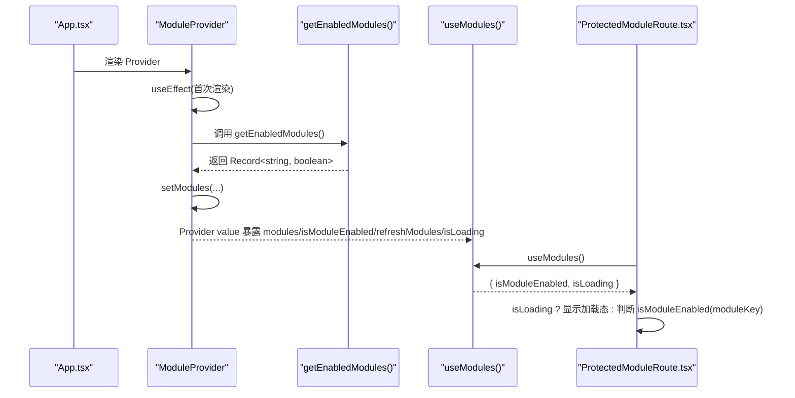
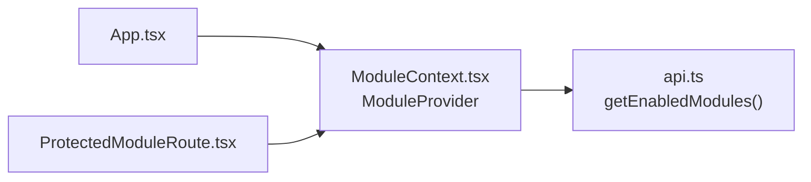

# 模块状态管理机制

<cite>
**本文引用的文件**
- [ModuleContext.tsx](file://src/contexts/ModuleContext.tsx)
- [App.tsx](file://src/App.tsx)
- [ProtectedModuleRoute.tsx](file://src/components/common/ProtectedModuleRoute.tsx)
- [api.ts](file://src/db/api.ts)
- [ModuleSettingsPage.tsx](file://src/pages/admin/ModuleSettingsPage.tsx)
</cite>

## 目录
1. [引言](#引言)
2. [项目结构](#项目结构)
3. [核心组件](#核心组件)
4. [架构总览](#架构总览)
5. [详细组件分析](#详细组件分析)
6. [依赖关系分析](#依赖关系分析)
7. [性能考量](#性能考量)
8. [故障排查指南](#故障排查指南)
9. [结论](#结论)

## 引言
本文件围绕模块状态管理进行深度技术文档梳理，重点解析 ModuleContext 的架构设计与实现细节，涵盖以下主题：
- ModuleProvider 如何通过 useState 和 useEffect 初始化并加载模块配置
- modules 状态对象的数据结构及其默认值设置
- isModuleEnabled 函数的键值查询逻辑与默认启用策略
- refreshModules 方法的异步刷新机制及其在配置更新后的调用流程
- isLoading 状态在 UI 渲染中的控制作用
- useModules 自定义 Hook 的上下文消费模式与错误边界处理
- 状态订阅机制的底层原理与性能优化建议

## 项目结构
ModuleContext 位于 contexts 层，作为全局状态容器，向上提供给路由守卫与业务组件消费；向下依赖数据库层接口获取模块启用状态；在应用入口处由 Provider 包裹，确保全站可用。

图表来源
- [App.tsx](file://src/App.tsx#L1-L32)
- [ModuleContext.tsx](file://src/contexts/ModuleContext.tsx#L1-L62)
- [api.ts](file://src/db/api.ts#L2570-L2596)
- [ProtectedModuleRoute.tsx](file://src/components/common/ProtectedModuleRoute.tsx#L1-L28)

章节来源
- [App.tsx](file://src/App.tsx#L1-L32)
- [ModuleContext.tsx](file://src/contexts/ModuleContext.tsx#L1-L62)

## 核心组件
- ModuleProvider：负责初始化模块状态、拉取启用配置、暴露 isModuleEnabled 与 refreshModules，并提供 isLoading 控制 UI。
- useModules：自定义 Hook，封装上下文消费与错误边界校验。
- ProtectedModuleRoute：路由守卫，基于 isModuleEnabled 与 isLoading 决定是否放行或展示加载态。
- getEnabledModules：数据库接口，从 module_settings 表读取模块启用状态并转换为 Record<string, boolean>。

章节来源
- [ModuleContext.tsx](file://src/contexts/ModuleContext.tsx#L1-L62)
- [ProtectedModuleRoute.tsx](file://src/components/common/ProtectedModuleRoute.tsx#L1-L28)
- [api.ts](file://src/db/api.ts#L2570-L2596)

## 架构总览
ModuleContext 将“模块启用状态”抽象为一个可订阅的状态源，供任意子树内的组件安全消费。其关键流程如下：
- 应用启动时，App.tsx 在根部注入 ModuleProvider
- ModuleProvider 首次渲染时触发 useEffect，调用 loadModules
- loadModules 调用 getEnabledModules，将返回的键值对写入 modules 状态
- isModuleEnabled(key) 以 modules[key] 为准，若不存在则回退为 true（默认启用）
- refreshModules 触发 loadModules，实现配置更新后的异步刷新
- isLoading 在请求期间为 true，请求结束（无论成功/失败）为 false，用于 UI 控制

图表来源
- [App.tsx](file://src/App.tsx#L1-L32)
- [ModuleContext.tsx](file://src/contexts/ModuleContext.tsx#L1-L62)
- [api.ts](file://src/db/api.ts#L2570-L2596)
- [ProtectedModuleRoute.tsx](file://src/components/common/ProtectedModuleRoute.tsx#L1-L28)

## 详细组件分析

### ModuleProvider：状态初始化与加载
- 状态结构
  - modules：Record<string, boolean>，键为模块标识（如 cases、news、departments、trends、issues），值为启用状态
  - isLoading：boolean，指示模块配置是否仍在加载中
- 默认值
  - 初始化时，modules 设置为一组内置默认键值，全部启用
- 生命周期
  - 首次渲染时执行 useEffect，触发 loadModules
- 加载流程
  - loadModules 中 setIsLoading(true)，调用 getEnabledModules，setModules，最后 setIsLoading(false)
  - 若数据库调用失败，控制台输出错误信息，但不会覆盖默认值（仍保持全部启用）
- 暴露能力
  - isModuleEnabled(key)：若 modules 中存在对应键则返回其布尔值，否则回退为 true（默认启用）
  - refreshModules()：再次调用 loadModules，实现配置更新后的异步刷新

章节来源
- [ModuleContext.tsx](file://src/contexts/ModuleContext.tsx#L1-L62)
- [api.ts](file://src/db/api.ts#L2570-L2596)

### useModules：上下文消费与错误边界
- 作用
  - 从 ModuleContext 中取出 modules、isModuleEnabled、refreshModules、isLoading
  - 若未在 ModuleProvider 下使用，抛出明确错误，避免误用
- 使用场景
  - 路由守卫：ProtectedModuleRoute 使用 isLoading 与 isModuleEnabled 控制放行
  - 业务组件：在渲染阶段根据 isModuleEnabled(key) 决定是否展示对应模块区域

章节来源
- [ModuleContext.tsx](file://src/contexts/ModuleContext.tsx#L1-L62)
- [ProtectedModuleRoute.tsx](file://src/components/common/ProtectedModuleRoute.tsx#L1-L28)

### ProtectedModuleRoute：基于模块启用状态的路由守卫
- 行为
  - isLoading 为真时，显示加载态（旋转指示器）
  - isLoading 为假时，调用 isModuleEnabled(moduleKey) 判断模块是否启用
  - 未启用则重定向至首页
  - 启用则渲染子节点
- 适用范围
  - 适用于需要按模块维度进行访问控制的页面

章节来源
- [ProtectedModuleRoute.tsx](file://src/components/common/ProtectedModuleRoute.tsx#L1-L28)

### isModuleEnabled：键值查询与默认启用策略
- 查询逻辑
  - 以 modules[key] 为优先
  - 若 modules 中不存在该键，则回退为 true（默认启用）
- 设计意图
  - 保证未知模块在数据库未返回时的安全启用，避免因缺省导致的功能不可用
  - 未知模块的启用状态可通过数据库配置逐步收敛

章节来源
- [ModuleContext.tsx](file://src/contexts/ModuleContext.tsx#L1-L62)

### refreshModules：异步刷新机制
- 触发时机
  - 管理端更新模块启用状态后，调用 refreshModules 重新拉取最新配置
- 实现
  - refreshModules 内部再次调用 loadModules，从而复用相同的加载与错误处理逻辑
- 适用场景
  - 管理后台切换模块开关后，需要即时生效的页面（如首页模块布局）

章节来源
- [ModuleContext.tsx](file://src/contexts/ModuleContext.tsx#L1-L62)

### isLoading：UI 渲染控制
- 作用
  - 在首次加载与刷新过程中，isLoading 为 true，用于显示加载态
  - 加载完成后（无论成功或失败）isLoading 变为 false，允许 UI 继续渲染
- 影响范围
  - 路由守卫：ProtectedModuleRoute 在 isLoading 为真时显示加载态
  - 业务组件：可根据 isLoading 控制骨架屏或占位符

章节来源
- [ModuleContext.tsx](file://src/contexts/ModuleContext.tsx#L1-L62)
- [ProtectedModuleRoute.tsx](file://src/components/common/ProtectedModuleRoute.tsx#L1-L28)

### 数据结构与复杂度
- modules：Record<string, boolean>
  - 读取复杂度：O(1)
  - 写入复杂度：O(n)（n 为模块数量，实际为一次整体替换）
- isModuleEnabled(key)：O(1)
- refreshModules/loadModules：O(n)（n 为模块数量，取决于数据库返回条目数）

章节来源
- [ModuleContext.tsx](file://src/contexts/ModuleContext.tsx#L1-L62)
- [api.ts](file://src/db/api.ts#L2570-L2596)

### 状态订阅机制与性能优化建议
- 订阅机制
  - Provider 通过 React Context 暴露 value，子树内任意组件均可通过 useModules 订阅
  - 由于 modules 是单一对象，useModules 返回的对象引用会随 Provider value 变更而变化，建议在组件内部按需解构或使用 useMemo 缓存
- 性能优化
  - 将 isModuleEnabled 与 refreshModules 作为稳定引用暴露，避免子组件不必要的重渲染
  - 对于高频渲染的组件，可将模块启用判断逻辑缓存（例如基于 key 的 memoization）
  - 在管理端更新模块状态后，仅在必要时调用 refreshModules，避免频繁刷新
  - 对于大型模块集合，考虑分页或懒加载策略（当前实现为一次性拉取）

章节来源
- [ModuleContext.tsx](file://src/contexts/ModuleContext.tsx#L1-L62)

## 依赖关系分析
- ModuleProvider 依赖数据库接口 getEnabledModules，后者从 module_settings 表读取模块启用状态并转换为 Record<string, boolean>
- 路由守卫 ProtectedModuleRoute 依赖 useModules，间接依赖 ModuleProvider
- 应用入口 App.tsx 依赖 ModuleProvider，确保全局可用

图表来源
- [App.tsx](file://src/App.tsx#L1-L32)
- [ModuleContext.tsx](file://src/contexts/ModuleContext.tsx#L1-L62)
- [api.ts](file://src/db/api.ts#L2570-L2596)
- [ProtectedModuleRoute.tsx](file://src/components/common/ProtectedModuleRoute.tsx#L1-L28)

章节来源
- [App.tsx](file://src/App.tsx#L1-L32)
- [ModuleContext.tsx](file://src/contexts/ModuleContext.tsx#L1-L62)
- [api.ts](file://src/db/api.ts#L2570-L2596)
- [ProtectedModuleRoute.tsx](file://src/components/common/ProtectedModuleRoute.tsx#L1-L28)

## 性能考量
- 状态粒度
  - modules 为整体对象，适合一次性拉取与更新；若模块数量增长，可考虑拆分或按需加载
- 渲染开销
  - isModuleEnabled 为 O(1) 查询，成本极低
  - Provider value 变更会导致订阅组件重渲染，建议在上层组件做必要的防抖与节流
- 错误恢复
  - 数据库失败时保留默认值，避免 UI 因缺省而中断；可在管理端提供手动刷新按钮以触发 refreshModules

[本节为通用指导，无需特定文件引用]

## 故障排查指南
- 症状：页面一直显示加载态
  - 可能原因：数据库接口 getEnabledModules 抛错且未正确处理
  - 排查步骤：检查网络请求与数据库连接；确认 API 返回结构符合预期
  - 相关实现参考：[ModuleContext.tsx](file://src/contexts/ModuleContext.tsx#L1-L62)、[api.ts](file://src/db/api.ts#L2570-L2596)
- 症状：路由守卫无法放行或反复跳转
  - 可能原因：isModuleEnabled(key) 返回 false 或 isLoading 一直为 true
  - 排查步骤：确认 module_key 是否存在于数据库；检查 refreshModules 是否被调用
  - 相关实现参考：[ProtectedModuleRoute.tsx](file://src/components/common/ProtectedModuleRoute.tsx#L1-L28)
- 症状：新增模块未生效
  - 可能原因：数据库未配置新模块键或 display_order 不正确
  - 排查步骤：在管理端确认模块键存在且 is_enabled 为 true；必要时触发刷新
  - 相关实现参考：[ModuleSettingsPage.tsx](file://src/pages/admin/ModuleSettingsPage.tsx#L1-L166)

章节来源
- [ModuleContext.tsx](file://src/contexts/ModuleContext.tsx#L1-L62)
- [api.ts](file://src/db/api.ts#L2570-L2596)
- [ProtectedModuleRoute.tsx](file://src/components/common/ProtectedModuleRoute.tsx#L1-L28)
- [ModuleSettingsPage.tsx](file://src/pages/admin/ModuleSettingsPage.tsx#L1-L166)

## 结论
ModuleContext 以简洁的上下文模型实现了模块启用状态的集中管理与订阅。其核心优势在于：
- 默认启用策略保障未知模块的可用性
- isModuleEnabled 提供 O(1) 查询能力
- refreshModules 支持配置更新后的即时生效
- isLoading 为 UI 提供清晰的加载控制信号

在实际工程中，建议结合业务规模对状态粒度与刷新策略进行权衡，并在管理端提供可控的刷新入口，以获得更好的用户体验与维护性。