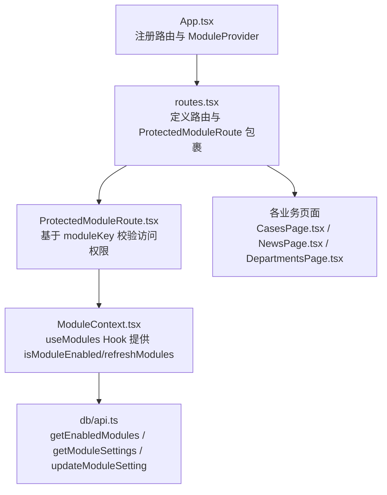
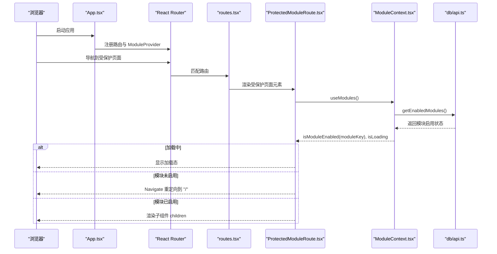
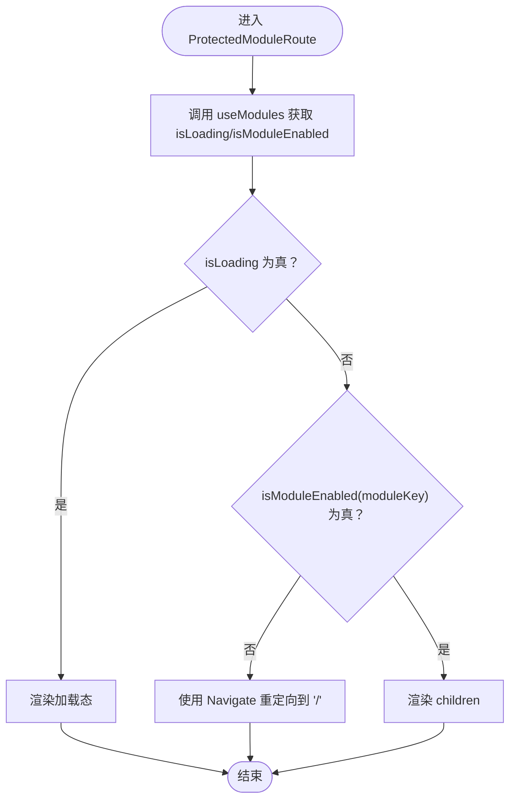
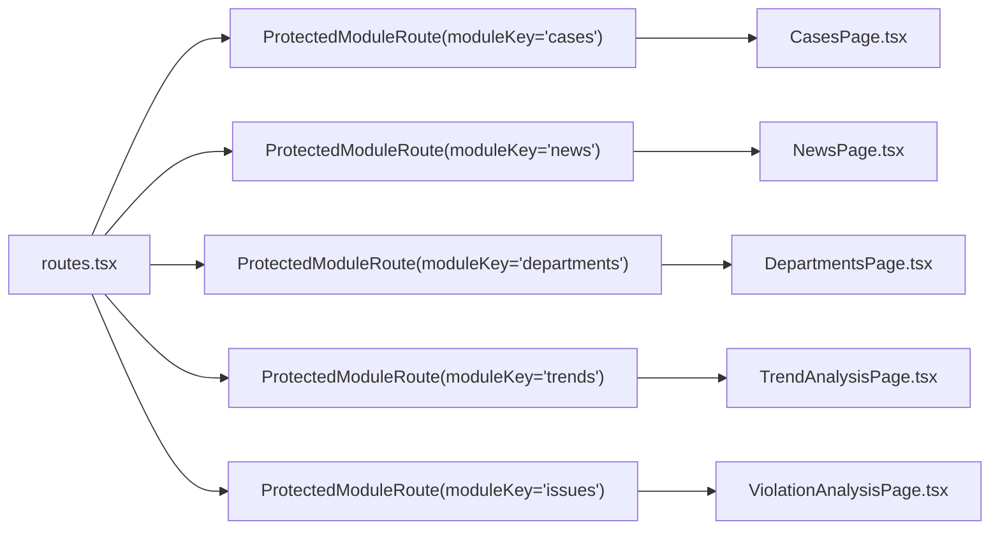
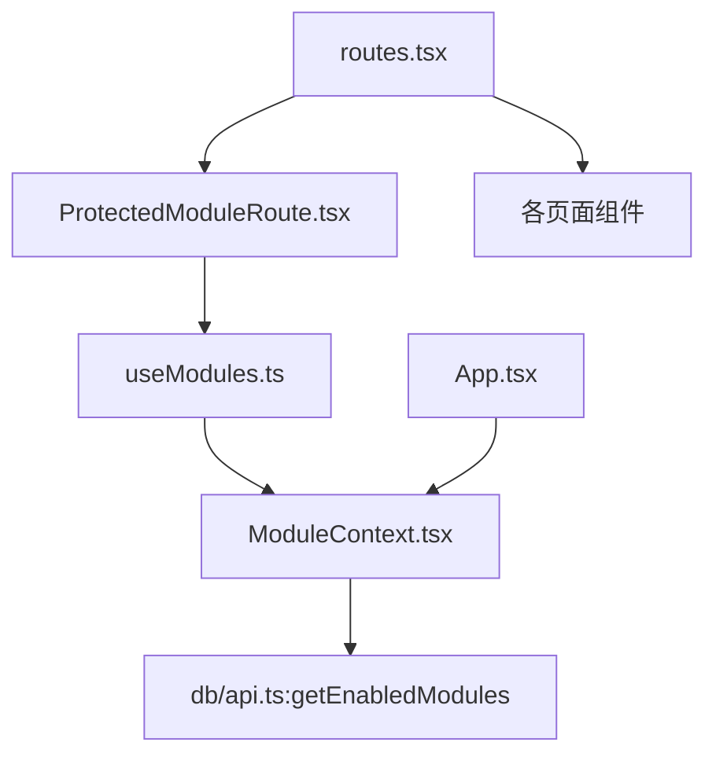

# 页面访问授权

<cite>
**本文引用的文件**
- [ProtectedModuleRoute.tsx](file://src/components/common/ProtectedModuleRoute.tsx)
- [ModuleContext.tsx](file://src/contexts/ModuleContext.tsx)
- [useModules.ts](file://src/hooks/useModules.ts)
- [routes.tsx](file://src/routes.tsx)
- [App.tsx](file://src/App.tsx)
- [ModuleSettingsPage.tsx](file://src/pages/admin/ModuleSettingsPage.tsx)
- [ModuleControlPage.tsx](file://src/pages/admin/ModuleControlPage.tsx)
- [api.ts](file://src/db/api.ts)
- [CasesPage.tsx](file://src/pages/CasesPage.tsx)
- [NewsPage.tsx](file://src/pages/NewsPage.tsx)
- [DepartmentsPage.tsx](file://src/pages/DepartmentsPage.tsx)
</cite>

## 目录
1. [简介](#简介)
2. [项目结构](#项目结构)
3. [核心组件](#核心组件)
4. [架构总览](#架构总览)
5. [详细组件分析](#详细组件分析)
6. [依赖关系分析](#依赖关系分析)
7. [性能考量](#性能考量)
8. [故障排查指南](#故障排查指南)
9. [结论](#结论)
10. [附录](#附录)

## 简介
本文件围绕“页面访问授权”主题，系统化说明 ProtectedModuleRoute 组件的实现原理与使用方式，解释其如何通过 useModules Hook 获取模块启用状态，并依据 moduleKey 判断当前用户是否具备访问特定页面的权限；当模块未启用时，组件如何使用 react-router-dom 的 Navigate 进行路由重定向。同时，文档阐述模块状态在 React Context 中的存储结构与更新机制，以及子组件如何订阅状态变化。最后，提供多个实际使用 ProtectedModuleRoute 的示例，覆盖不同模块的保护方式。

## 项目结构
- 应用入口在 App.tsx 中注册路由与 Provider，ProtectedModuleRoute 作为路由元素的包装器，用于保护受控模块页面。
- 路由定义集中在 routes.tsx，其中将各页面包裹在 ProtectedModuleRoute 下，并传入对应的 moduleKey。
- 模块状态通过 ModuleContext.tsx 管理，初始值来自数据库接口 getEnabledModules。
- 数据访问层位于 db/api.ts，提供 getEnabledModules、getModuleSettings、updateModuleSetting 等方法。



图表来源
- [App.tsx](file://src/App.tsx#L1-L33)
- [routes.tsx](file://src/routes.tsx#L1-L207)
- [ProtectedModuleRoute.tsx](file://src/components/common/ProtectedModuleRoute.tsx#L1-L29)
- [ModuleContext.tsx](file://src/contexts/ModuleContext.tsx#L1-L62)
- [api.ts](file://src/db/api.ts#L2570-L2596)

章节来源
- [App.tsx](file://src/App.tsx#L1-L33)
- [routes.tsx](file://src/routes.tsx#L1-L207)

## 核心组件
- ProtectedModuleRoute：用于保护页面，基于 moduleKey 判断模块是否启用，未启用则重定向至首页。
- ModuleContext：提供模块状态的全局上下文，包含 modules、isModuleEnabled、refreshModules、isLoading。
- useModules：自定义 Hook，封装对 ModuleContext 的访问，提供 isModuleEnabled 与刷新能力。
- routes：集中定义路由，将页面元素包裹在 ProtectedModuleRoute 下，传入对应 moduleKey。
- db/api：提供 getEnabledModules（前台模块启用状态）、getModuleSettings（后台模块设置）、updateModuleSetting（更新模块启用状态）等。

章节来源
- [ProtectedModuleRoute.tsx](file://src/components/common/ProtectedModuleRoute.tsx#L1-L29)
- [ModuleContext.tsx](file://src/contexts/ModuleContext.tsx#L1-L62)
- [routes.tsx](file://src/routes.tsx#L1-L207)
- [api.ts](file://src/db/api.ts#L2570-L2596)

## 架构总览
ProtectedModuleRoute 的工作流如下：
- 应用启动时，App.tsx 在顶层注入 ModuleProvider，使整个应用树可访问模块状态。
- routes.tsx 定义路由时，将页面元素包裹在 ProtectedModuleRoute 下，并传入 moduleKey。
- ProtectedModuleRoute 调用 useModules 获取 isModuleEnabled 与 isLoading。
- 若 isLoading 为真，渲染加载态；若模块未启用（isModuleEnabled(moduleKey) 为 false），使用 Navigate 重定向到根路径 "/"；否则渲染子组件 children。



图表来源
- [App.tsx](file://src/App.tsx#L1-L33)
- [routes.tsx](file://src/routes.tsx#L1-L207)
- [ProtectedModuleRoute.tsx](file://src/components/common/ProtectedModuleRoute.tsx#L1-L29)
- [ModuleContext.tsx](file://src/contexts/ModuleContext.tsx#L1-L62)
- [api.ts](file://src/db/api.ts#L2570-L2596)

## 详细组件分析

### ProtectedModuleRoute 组件
- 输入属性
  - children：要保护的页面元素
  - moduleKey：模块标识符，如 "cases"、"news"、"departments"、"trends"、"issues"
- 行为逻辑
  - 通过 useModules 获取 isLoading 与 isModuleEnabled
  - isLoading 为真时，渲染加载态（居中旋转指示器）
  - isModuleEnabled(moduleKey) 为假时，使用 Navigate 重定向到根路径 "/"
  - 否则渲染 children
- 错误处理
  - 当 getEnabledModules 抛错时，ModuleContext 内部会捕获并使用默认值（所有模块启用），保证组件可用性



图表来源
- [ProtectedModuleRoute.tsx](file://src/components/common/ProtectedModuleRoute.tsx#L1-L29)
- [ModuleContext.tsx](file://src/contexts/ModuleContext.tsx#L1-L62)

章节来源
- [ProtectedModuleRoute.tsx](file://src/components/common/ProtectedModuleRoute.tsx#L1-L29)

### ModuleContext 与 useModules
- ModuleContext 存储结构
  - modules：Record<string, boolean>，键为模块标识符，值为是否启用
  - isModuleEnabled(key)：若模块存在则返回对应布尔值，否则默认启用
  - refreshModules()：重新拉取模块启用状态
  - isLoading：模块状态加载中标志
- 初始化与更新
  - ModuleProvider 在挂载时调用 getEnabledModules，将返回的键值对设置为 modules，并在 finally 中关闭 isLoading
  - isModuleEnabled 默认启用策略：若数据库未返回某模块，则视为启用，避免误拦截
- useModules
  - 自定义 Hook，校验上下文是否存在，不存在时抛出错误，确保在 Provider 内使用

```mermaid
classDiagram
class ModuleContext {
+modules : Record<string, boolean>
+isModuleEnabled(key) : boolean
+refreshModules() : Promise<void>
+isLoading : boolean
}
class ModuleProvider {
+loadModules() : Promise<void>
+isModuleEnabled(key) : boolean
+refreshModules() : Promise<void>
}
class useModules {
+调用 useContext(ModuleContext)
+返回 : { modules, isModuleEnabled, refreshModules, isLoading }
}
ModuleProvider --> ModuleContext : "提供上下文"
useModules --> ModuleContext : "消费上下文"
```

图表来源
- [ModuleContext.tsx](file://src/contexts/ModuleContext.tsx#L1-L62)

章节来源
- [ModuleContext.tsx](file://src/contexts/ModuleContext.tsx#L1-L62)

### 路由与页面保护
- routes.tsx 中将各页面元素包裹在 ProtectedModuleRoute 下，并传入对应的 moduleKey
  - 案例查询：moduleKey="cases"
  - 资讯：moduleKey="news"
  - 监管部门：moduleKey="departments"
  - 趋势分析：moduleKey="trends"
  - 问题分析：moduleKey="issues"
- 未启用的模块将被重定向到首页，避免用户访问不可用页面



图表来源
- [routes.tsx](file://src/routes.tsx#L1-L207)

章节来源
- [routes.tsx](file://src/routes.tsx#L1-L207)

### 模块状态更新与后台管理
- 后台页面 ModuleSettingsPage.tsx 展示模块设置列表，支持切换 is_enabled
- 调用 db/api.ts 的 updateModuleSetting 更新数据库状态
- ModuleContext 的 refreshModules 可用于重新拉取最新状态（可在需要时手动调用）

章节来源
- [ModuleSettingsPage.tsx](file://src/pages/admin/ModuleSettingsPage.tsx#L1-L167)
- [api.ts](file://src/db/api.ts#L2536-L2565)
- [ModuleContext.tsx](file://src/contexts/ModuleContext.tsx#L1-L62)

### 实际使用示例（多模块保护）
以下示例展示如何在不同页面中使用 ProtectedModuleRoute 保护模块访问。示例均来自 routes.tsx 的路由定义，通过 moduleKey 指定模块标识符。

- 案例查询模块保护
  - 路由："/cases"
  - 保护方式：ProtectedModuleRoute(moduleKey="cases") 包裹 CasesPage
  - 适用场景：当 cases 模块未启用时，访问 "/cases" 将被重定向到 "/"
  - 示例路径：[routes.tsx](file://src/routes.tsx#L33-L60)

- 资讯模块保护
  - 路由："/news"
  - 保护方式：ProtectedModuleRoute(moduleKey="news") 包裹 NewsPage
  - 适用场景：当 news 模块未启用时，访问 "/news" 将被重定向到 "/"
  - 示例路径：[routes.tsx](file://src/routes.tsx#L60-L90)

- 监管部门模块保护
  - 路由："/departments"
  - 保护方式：ProtectedModuleRoute(moduleKey="departments") 包裹 DepartmentsPublicPage
  - 适用场景：当 departments 模块未启用时，访问 "/departments" 将被重定向到 "/"
  - 示例路径：[routes.tsx](file://src/routes.tsx#L80-L110)

- 趋势分析模块保护
  - 路由："/trend-analysis"
  - 保护方式：ProtectedModuleRoute(moduleKey="trends") 包裹 TrendAnalysisPage
  - 适用场景：当 trends 模块未启用时，访问 "/trend-analysis" 将被重定向到 "/"
  - 示例路径：[routes.tsx](file://src/routes.tsx#L90-L120)

- 问题分析模块保护
  - 路由："/violation-analysis"
  - 保护方式：ProtectedModuleRoute(moduleKey="issues") 包裹 ViolationAnalysisPage
  - 适用场景：当 issues 模块未启用时，访问 "/violation-analysis" 将被重定向到 "/"
  - 示例路径：[routes.tsx](file://src/routes.tsx#L100-L130)

章节来源
- [routes.tsx](file://src/routes.tsx#L1-L207)

## 依赖关系分析
- 组件耦合
  - ProtectedModuleRoute 依赖 useModules Hook，间接依赖 ModuleContext
  - ModuleContext 依赖 db/api.ts 的 getEnabledModules
  - routes.tsx 依赖 ProtectedModuleRoute 并传入 moduleKey
  - App.tsx 依赖 ModuleProvider，为整树提供模块状态
- 外部依赖
  - react-router-dom 的 Navigate 用于重定向
  - Supabase 数据库通过 db/api.ts 提供模块状态数据



图表来源
- [ProtectedModuleRoute.tsx](file://src/components/common/ProtectedModuleRoute.tsx#L1-L29)
- [ModuleContext.tsx](file://src/contexts/ModuleContext.tsx#L1-L62)
- [routes.tsx](file://src/routes.tsx#L1-L207)
- [App.tsx](file://src/App.tsx#L1-L33)
- [api.ts](file://src/db/api.ts#L2570-L2596)

章节来源
- [ProtectedModuleRoute.tsx](file://src/components/common/ProtectedModuleRoute.tsx#L1-L29)
- [ModuleContext.tsx](file://src/contexts/ModuleContext.tsx#L1-L62)
- [routes.tsx](file://src/routes.tsx#L1-L207)
- [App.tsx](file://src/App.tsx#L1-L33)
- [api.ts](file://src/db/api.ts#L2570-L2596)

## 性能考量
- 模块状态加载
  - ModuleProvider 在首次挂载时一次性拉取模块启用状态，避免频繁请求
  - isLoading 期间渲染轻量加载态，减少白屏时间
- 重定向开销
  - Navigate 重定向为客户端路由跳转，开销极低
- 默认启用策略
  - 当数据库返回异常时，默认启用所有模块，避免因网络或服务异常导致大面积不可访问

[本节为通用性能讨论，不直接分析具体文件]

## 故障排查指南
- 症状：页面一直显示加载态
  - 可能原因：getEnabledModules 请求失败或网络异常
  - 处理建议：检查网络与 Supabase 连接；确认 db/api.ts 的 getEnabledModules 是否抛错
  - 参考路径：[ModuleContext.tsx](file://src/contexts/ModuleContext.tsx#L1-L62)，[api.ts](file://src/db/api.ts#L2570-L2596)

- 症状：模块已启用但仍被重定向
  - 可能原因：moduleKey 与数据库中 module_key 不一致
  - 处理建议：核对 routes.tsx 中传入的 moduleKey 与数据库中 module_key 是否一致
  - 参考路径：[routes.tsx](file://src/routes.tsx#L1-L207)

- 症状：后台切换模块状态后前端未即时生效
  - 可能原因：未调用 refreshModules 或页面未重新渲染
  - 处理建议：在需要时调用 refreshModules 重新拉取模块状态
  - 参考路径：[ModuleContext.tsx](file://src/contexts/ModuleContext.tsx#L1-L62)

- 症状：组件未在 Provider 内使用 useModules
  - 可能原因：useModules 在 Provider 外使用
  - 处理建议：确保 ProtectedModuleRoute 处于 ModuleProvider 下方
  - 参考路径：[ModuleContext.tsx](file://src/contexts/ModuleContext.tsx#L1-L62)，[App.tsx](file://src/App.tsx#L1-L33)

章节来源
- [ModuleContext.tsx](file://src/contexts/ModuleContext.tsx#L1-L62)
- [routes.tsx](file://src/routes.tsx#L1-L207)
- [App.tsx](file://src/App.tsx#L1-L33)
- [api.ts](file://src/db/api.ts#L2570-L2596)

## 结论
ProtectedModuleRoute 通过 useModules Hook 与 ModuleContext 实现了模块级别的页面访问授权。其设计简洁、职责清晰：在加载阶段提供友好反馈，在权限不足时进行安全重定向。模块状态来源于数据库，支持后台动态开关，前台通过 Provider 全局共享。结合 routes.tsx 的路由配置，即可对多模块页面进行统一保护，提升系统的可维护性与安全性。

[本节为总结性内容，不直接分析具体文件]

## 附录
- 模块标识符对照
  - cases：案例查询
  - news：监管资讯
  - departments：监管部门
  - trends：趋势分析
  - issues：问题分析
- 相关页面
  - 案例查询页面：CasesPage.tsx
  - 资讯页面：NewsPage.tsx
  - 监管部门页面：DepartmentsPage.tsx

章节来源
- [routes.tsx](file://src/routes.tsx#L1-L207)
- [CasesPage.tsx](file://src/pages/CasesPage.tsx#L1-L537)
- [NewsPage.tsx](file://src/pages/NewsPage.tsx#L1-L175)
- [DepartmentsPage.tsx](file://src/pages/DepartmentsPage.tsx#L1-L240)