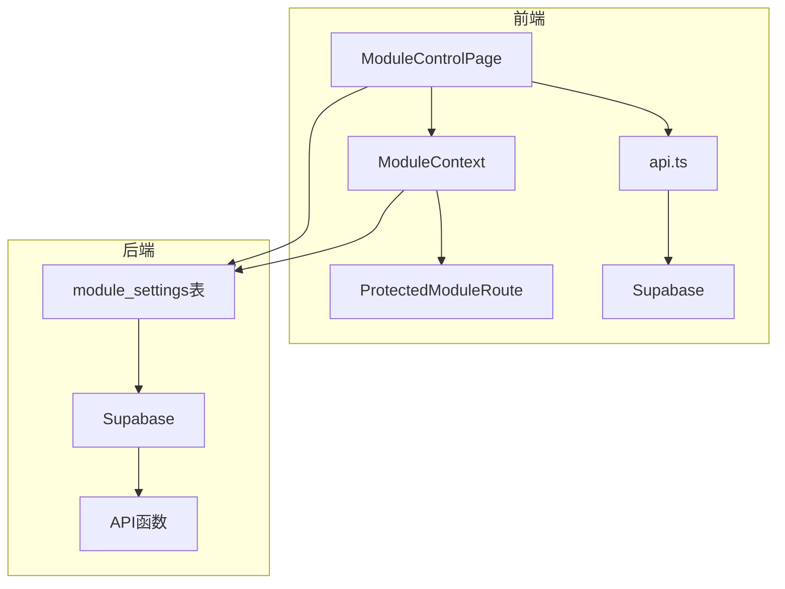
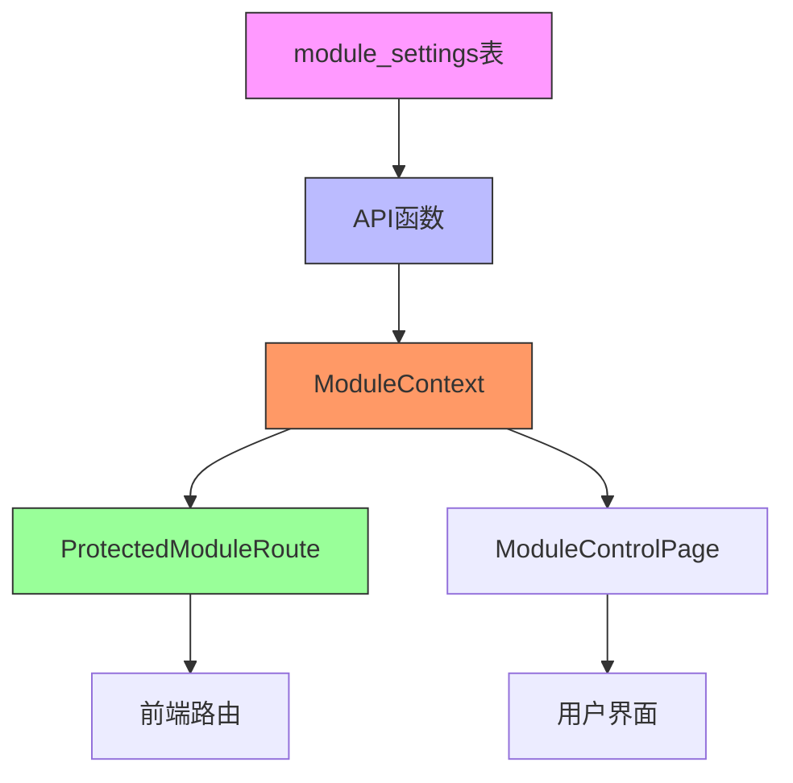
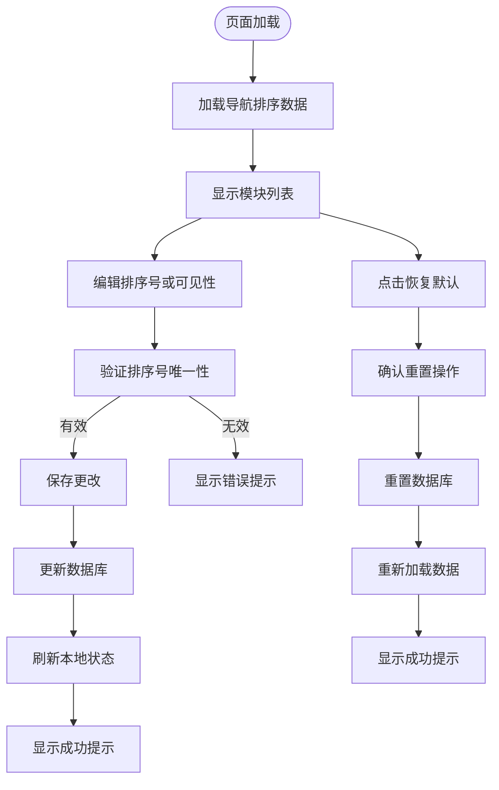
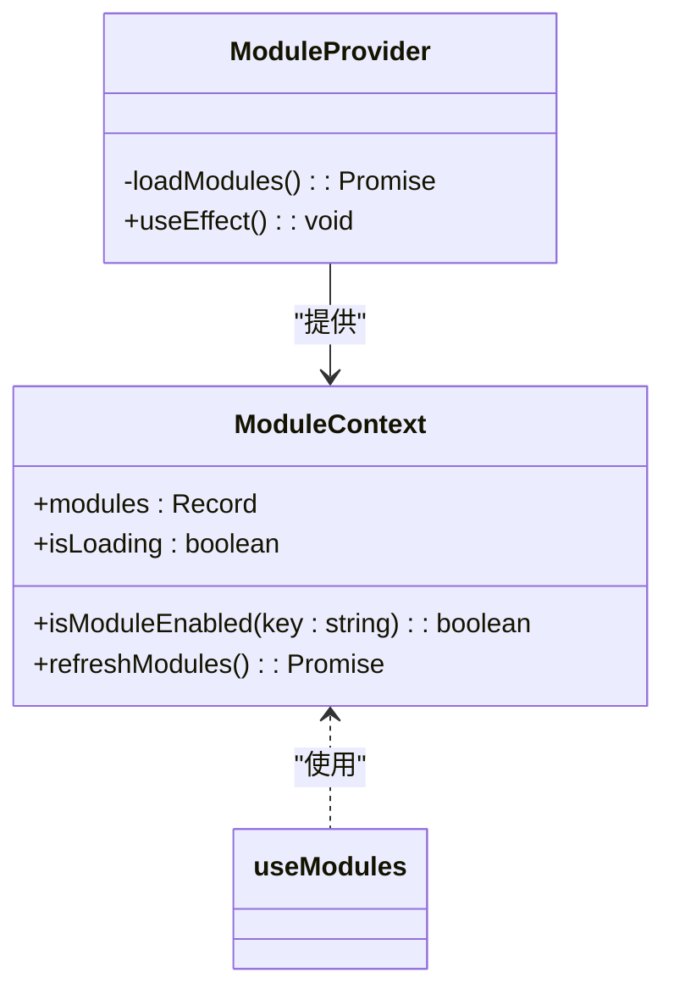
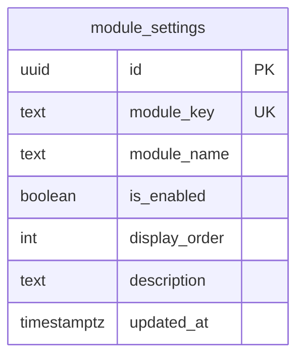
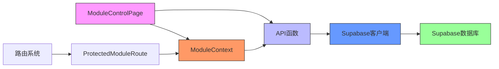

# 模块控制功能

<cite>
**本文档引用的文件**  
- [ModuleControlPage.tsx](file://src/pages/admin/ModuleControlPage.tsx)
- [ModuleContext.tsx](file://src/contexts/ModuleContext.tsx)
- [api.ts](file://src/db/api.ts)
- [types.ts](file://src/types/types.ts)
- [00008_create_module_settings.sql](file://supabase/migrations/00008_create_module_settings.sql)
- [ProtectedModuleRoute.tsx](file://src/components/common/ProtectedModuleRoute.tsx)
- [ModuleSettingsPage.tsx](file://src/pages/admin/ModuleSettingsPage.tsx)
- [routes.tsx](file://src/routes.tsx)
</cite>

## 目录
1. [简介](#简介)
2. [项目结构](#项目结构)
3. [核心组件](#核心组件)
4. [架构概述](#架构概述)
5. [详细组件分析](#详细组件分析)
6. [依赖分析](#依赖分析)
7. [性能考虑](#性能考虑)
8. [故障排除指南](#故障排除指南)
9. [结论](#结论)

## 简介
模块控制功能是系统管理后台的核心功能之一，允许管理员动态配置和管理前台功能模块的可见性和显示顺序。该功能通过数据库驱动的配置机制，实现了模块的启用/禁用、显示顺序调整等动态控制，同时确保只有管理员用户可以访问配置界面。系统通过ModuleContext实时响应配置变更并更新UI状态，确保用户界面的一致性和实时性。

## 项目结构
系统采用标准的React + TypeScript + Supabase技术栈，模块控制相关功能分布在多个目录中。核心配置页面位于`src/pages/admin/`目录下，上下文管理位于`src/contexts/`目录，数据库API位于`src/db/`目录，类型定义位于`src/types/`目录。数据库迁移文件位于`supabase/migrations/`目录，其中包含模块设置表的创建脚本。

**图表来源**  
- [ModuleControlPage.tsx](file://src/pages/admin/ModuleControlPage.tsx)
- [ModuleContext.tsx](file://src/contexts/ModuleContext.tsx)
- [00008_create_module_settings.sql](file://supabase/migrations/00008_create_module_settings.sql)

**本节来源**  
- [ModuleControlPage.tsx](file://src/pages/admin/ModuleControlPage.tsx)
- [ModuleContext.tsx](file://src/contexts/ModuleContext.tsx)
- [00008_create_module_settings.sql](file://supabase/migrations/00008_create_module_settings.sql)

## 核心组件
模块控制功能的核心组件包括ModuleControlPage（导航排序管理页面）、ModuleContext（模块状态上下文）和module_settings数据库表。ModuleControlPage提供用户界面用于调整导航模块的显示顺序和可见性，ModuleContext负责管理模块状态并在应用范围内共享，module_settings表存储模块的持久化配置。这些组件通过API函数相互连接，形成一个完整的配置管理系统。

**本节来源**  
- [ModuleControlPage.tsx](file://src/pages/admin/ModuleControlPage.tsx)
- [ModuleContext.tsx](file://src/contexts/ModuleContext.tsx)
- [00008_create_module_settings.sql](file://supabase/migrations/00008_create_module_settings.sql)

## 架构概述
系统采用分层架构设计，从数据库层到前端组件层形成清晰的数据流。数据库层的module_settings表存储模块配置，API层提供数据访问接口，Context层管理应用状态，组件层负责用户界面展示和交互。这种架构确保了配置变更的实时性和一致性，同时通过权限控制确保只有管理员可以修改配置。

**图表来源**  
- [ModuleContext.tsx](file://src/contexts/ModuleContext.tsx)
- [api.ts](file://src/db/api.ts)
- [00008_create_module_settings.sql](file://supabase/migrations/00008_create_module_settings.sql)
- [ProtectedModuleRoute.tsx](file://src/components/common/ProtectedModuleRoute.tsx)

## 详细组件分析

### ModuleControlPage 分析
ModuleControlPage是管理员用于管理导航模块显示顺序和可见性的用户界面。页面提供直观的列表视图，显示所有导航模块的当前排序号、模块名称、路由路径和可见性状态。用户可以通过输入框调整排序号，通过开关切换模块可见性，并通过操作按钮保存更改或恢复默认设置。

#### 用户界面和操作流程

**图表来源**  
- [ModuleControlPage.tsx](file://src/pages/admin/ModuleControlPage.tsx)

**本节来源**  
- [ModuleControlPage.tsx](file://src/pages/admin/ModuleControlPage.tsx)

### ModuleContext 分析
ModuleContext是React上下文对象，用于在应用范围内共享模块状态。它封装了模块状态管理逻辑，包括加载模块设置、检查模块是否启用、刷新模块状态等功能。组件通过useModules hook访问上下文，实现对模块状态的响应式访问。

#### 状态管理机制

**图表来源**  
- [ModuleContext.tsx](file://src/contexts/ModuleContext.tsx)

**本节来源**  
- [ModuleContext.tsx](file://src/contexts/ModuleContext.tsx)

### module_settings 表分析
module_settings表是模块配置的持久化存储，采用关系型数据库表结构存储模块的元数据和状态信息。表设计遵循规范化原则，包含模块标识、显示名称、启用状态、显示顺序等字段，并通过索引优化查询性能。

#### 数据库表结构

**图表来源**  
- [00008_create_module_settings.sql](file://supabase/migrations/00008_create_module_settings.sql)

**本节来源**  
- [00008_create_module_settings.sql](file://supabase/migrations/00008_create_module_settings.sql)

## 依赖分析
模块控制功能依赖于多个系统组件和外部服务。前端依赖React、TypeScript和Supabase客户端库，后端依赖Supabase数据库服务。功能组件之间存在明确的依赖关系：ModuleControlPage依赖ModuleContext和API函数，ModuleContext依赖API函数，API函数依赖Supabase客户端。

**图表来源**  
- [ModuleControlPage.tsx](file://src/pages/admin/ModuleControlPage.tsx)
- [ModuleContext.tsx](file://src/contexts/ModuleContext.tsx)
- [api.ts](file://src/db/api.ts)
- [supabase.ts](file://src/db/supabase.ts)

**本节来源**  
- [ModuleControlPage.tsx](file://src/pages/admin/ModuleControlPage.tsx)
- [ModuleContext.tsx](file://src/contexts/ModuleContext.tsx)
- [api.ts](file://src/db/api.ts)

## 性能考虑
模块控制功能在设计时考虑了性能优化。数据库层面通过创建索引优化查询性能，应用层面通过上下文管理避免重复请求。配置变更采用实时保存策略，避免批量操作的延迟。前端界面采用虚拟滚动和懒加载技术，确保在模块数量较多时仍能保持流畅的用户体验。

## 故障排除指南
当模块控制功能出现问题时，可按照以下步骤进行排查：首先检查管理员权限是否正确，其次验证数据库连接是否正常，然后确认API函数是否能正确访问。对于配置变更未生效的问题，检查浏览器缓存并尝试刷新页面。对于界面显示异常，查看浏览器控制台错误信息并检查网络请求状态。

**本节来源**  
- [ModuleContext.tsx](file://src/contexts/ModuleContext.tsx)
- [api.ts](file://src/db/api.ts)
- [ModuleControlPage.tsx](file://src/pages/admin/ModuleControlPage.tsx)

## 结论
模块控制功能通过数据库驱动的配置机制，实现了前台功能模块的动态管理。系统采用分层架构设计，确保了配置变更的实时性和一致性。权限控制机制保障了配置安全，只有管理员用户可以访问和修改模块设置。该功能为系统提供了灵活的配置管理能力，支持业务需求的变化和功能的迭代更新。