# 模块控制界面

<cite>
**本文档引用文件**  
- [ModuleControlPage.tsx](file://src/pages/admin/ModuleControlPage.tsx)
- [api.ts](file://src/db/api.ts)
- [types.ts](file://src/types/types.ts)
- [button.tsx](file://src/components/ui/button.tsx)
- [switch.tsx](file://src/components/ui/switch.tsx)
- [input.tsx](file://src/components/ui/input.tsx)
- [tailwind.config.js](file://tailwind.config.js)
- [use-toast.tsx](file://src/hooks/use-toast.tsx)
- [00018_create_navigation_order_table.sql](file://supabase/migrations/00018_create_navigation_order_table.sql)
</cite>

## 目录
1. [简介](#简介)
2. [用户界面布局](#用户界面布局)
3. [导航操作区域](#导航操作区域)
4. [导航模块列表](#导航模块列表)
5. [排序预览区域](#排序预览区域)
6. [界面状态管理](#界面状态管理)
7. [响应式设计与可访问性](#响应式设计与可访问性)
8. [数据结构与API](#数据结构与api)
9. [结论](#结论)

## 简介

模块控制界面是系统管理后台的核心功能之一，用于管理导航栏的显示顺序和可见性。该界面为管理员提供了直观的配置工具，可以灵活调整各个功能模块在导航栏中的位置和显示状态。通过本界面，管理员可以优化用户体验，确保重要功能模块能够被用户快速访问。

**Section sources**
- [ModuleControlPage.tsx](file://src/pages/admin/ModuleControlPage.tsx#L1-L274)

## 用户界面布局

模块控制界面采用现代化的卡片式布局，整体结构清晰，分为三个主要区域：页面标题区、操作按钮区和配置内容区。界面使用了响应式设计，能够在不同屏幕尺寸下保持良好的可用性。

整个界面容器使用了`container mx-auto px-4 py-8 max-w-6xl`的Tailwind CSS类，确保在不同屏幕尺寸下都有合适的边距和最大宽度。主要配置内容通过`space-y-6`类垂直排列，各卡片之间有适当的间距。

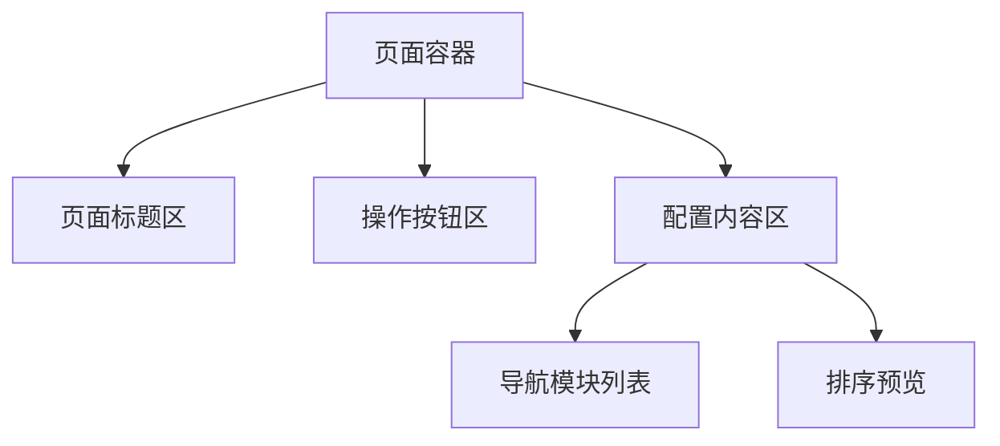

**Diagram sources**
- [ModuleControlPage.tsx](file://src/pages/admin/ModuleControlPage.tsx#L117-L272)

**Section sources**
- [ModuleControlPage.tsx](file://src/pages/admin/ModuleControlPage.tsx#L117-L272)
- [tailwind.config.js](file://tailwind.config.js#L1-L171)

## 导航操作区域

导航操作区域位于界面顶部，包含保存、取消和恢复默认三个核心操作按钮，以及状态提示信息。

### 操作按钮功能

操作区域使用了Card组件包裹，内部包含三个主要按钮：

- **保存排序按钮**：使用主色调，带有保存图标，用于提交当前的排序和可见性更改
- **取消修改按钮**：使用轮廓样式，用于放弃当前的所有更改
- **恢复默认按钮**：使用危险色调，带有重置图标，用于将导航配置恢复到系统默认状态

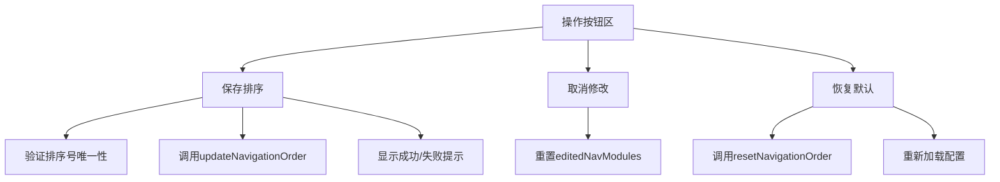

**Diagram sources**
- [ModuleControlPage.tsx](file://src/pages/admin/ModuleControlPage.tsx#L141-L179)

### 状态管理与交互逻辑

操作按钮的状态管理基于当前编辑状态与原始状态的比较：

- **保存按钮**：当`hasNavChanges`为true且不在保存状态时启用
- **取消按钮**：当有未保存的更改且不在保存状态时启用
- **恢复默认按钮**：在重置过程中显示加载状态

界面还包含一个状态提示，当存在未保存的更改时，会显示黄色警告信息"⚠️ 您有未保存的更改"。

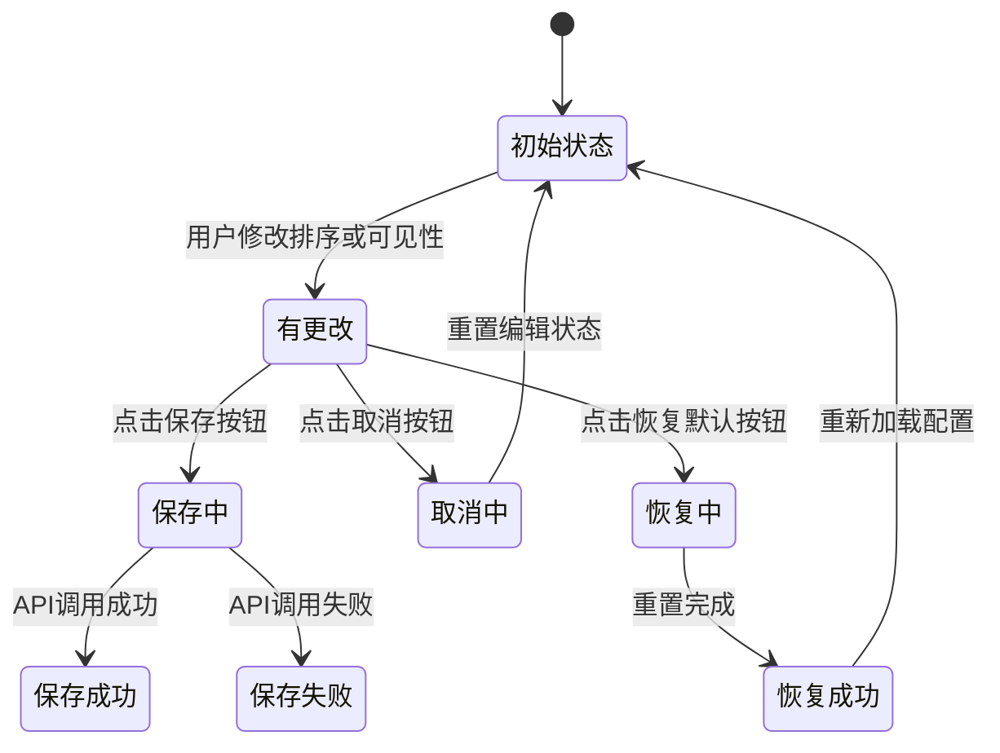

**Diagram sources**
- [ModuleControlPage.tsx](file://src/pages/admin/ModuleControlPage.tsx#L113-L114)
- [ModuleControlPage.tsx](file://src/pages/admin/ModuleControlPage.tsx#L69-L89)
- [ModuleControlPage.tsx](file://src/pages/admin/ModuleControlPage.tsx#L93-L104)

**Section sources**
- [ModuleControlPage.tsx](file://src/pages/admin/ModuleControlPage.tsx#L141-L179)
- [use-toast.tsx](file://src/hooks/use-toast.tsx#L68-L128)

## 导航模块列表

导航模块列表区域展示了所有可配置的导航模块，每个模块包含排序号输入框、模块名称、路由路径和可见性开关。

### 模块展示方式

模块列表使用Card组件包裹，每个模块项使用`flex items-center gap-4 p-4 border rounded-lg bg-card hover:bg-muted/50 transition-colors`类创建卡片式布局。列表支持加载状态显示，当数据加载时显示"加载中..."提示。

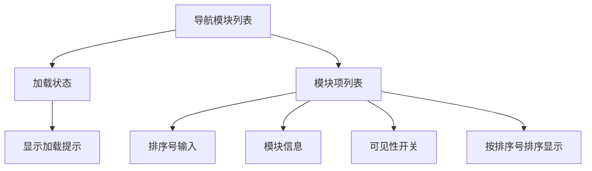

**Diagram sources**
- [ModuleControlPage.tsx](file://src/pages/admin/ModuleControlPage.tsx#L184-L240)

### 排序号输入框交互逻辑

排序号输入框使用`type="number"`属性，限制用户只能输入数字。通过`min="1"`属性确保输入值至少为1。输入框的交互逻辑如下：

- 监听`onChange`事件，获取用户输入值
- 验证输入值是否为有效数字且大于等于1
- 更新`editedNavModules`状态中对应模块的`sort_order`值
- 实时反映在排序预览区域

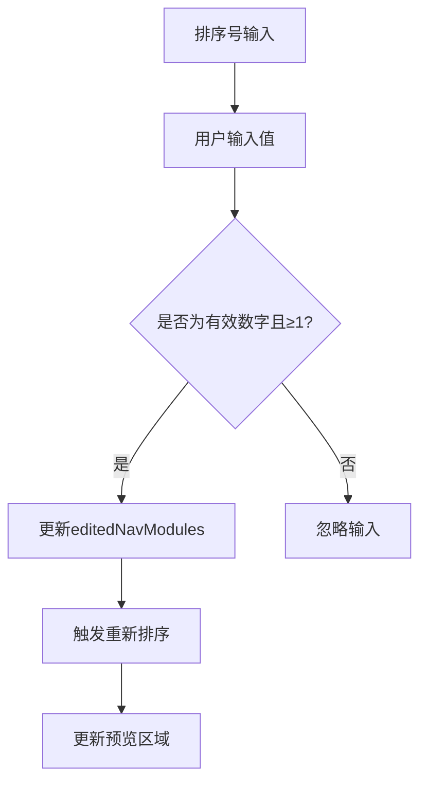

**Diagram sources**
- [ModuleControlPage.tsx](file://src/pages/admin/ModuleControlPage.tsx#L204-L211)
- [ModuleControlPage.tsx](file://src/pages/admin/ModuleControlPage.tsx#L47-L57)

### 模块名称与路由路径

每个模块项显示模块名称和路由路径信息：

- **模块名称**：以粗体显示，是模块的主要标识
- **路由路径**：以次要文本颜色显示，格式为"路由: {route_path}"
- **隐藏状态标识**：当模块不可见时，显示"已隐藏"标签

### 可见性开关交互逻辑

可见性开关使用Switch组件实现，其交互逻辑如下：

- 开关状态与模块的`is_visible`属性绑定
- 监听`onCheckedChange`事件，获取开关状态
- 更新`editedNavModules`状态中对应模块的`is_visible`值
- 实时反映在排序预览区域（仅显示可见模块）

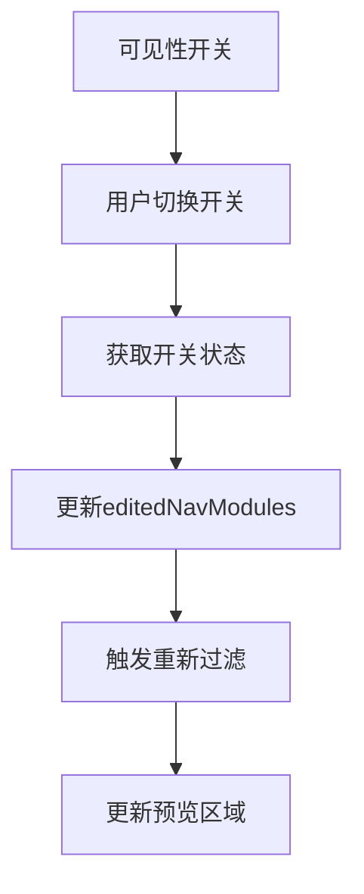

**Diagram sources**
- [ModuleControlPage.tsx](file://src/pages/admin/ModuleControlPage.tsx#L229-L235)
- [ModuleControlPage.tsx](file://src/pages/admin/ModuleControlPage.tsx#L59-L66)

**Section sources**
- [ModuleControlPage.tsx](file://src/pages/admin/ModuleControlPage.tsx#L196-L237)
- [switch.tsx](file://src/components/ui/switch.tsx#L1-L30)
- [input.tsx](file://src/components/ui/input.tsx#L1-L22)

## 排序预览区域

排序预览区域提供了一个实时的视觉反馈，展示当前配置下导航栏的实际显示效果。

### 实时预览机制

预览区域根据`editedNavModules`状态实时更新，其核心逻辑如下：

- 获取当前编辑的模块列表
- 按`sort_order`升序排序
- 过滤出`is_visible`为true的模块
- 在预览区域按顺序显示

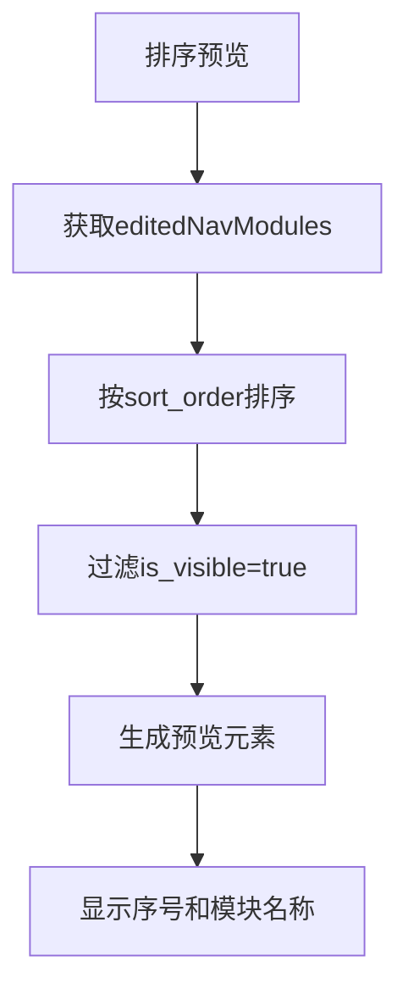

**Diagram sources**
- [ModuleControlPage.tsx](file://src/pages/admin/ModuleControlPage.tsx#L253-L263)

### 视觉效果设计

预览元素使用`px-4 py-2 rounded-md bg-primary/10 text-primary border border-primary/20`类创建，具有以下特点：

- 浅蓝色背景，提供良好的视觉区分
- 主色调文字，确保可读性
- 圆角边框，符合现代设计风格
- 包含序号标签，清晰显示排序位置

当没有可见模块时，显示"暂无可见的导航模块"的提示信息。

**Section sources**
- [ModuleControlPage.tsx](file://src/pages/admin/ModuleControlPage.tsx#L244-L268)

## 界面状态管理

模块控制界面实现了完整的状态管理机制，包括加载状态、保存状态和重置状态的UI反馈。

### 状态变量定义

界面使用了多个useState Hook来管理不同状态：

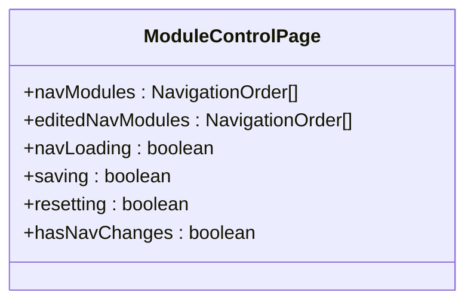

**Diagram sources**
- [ModuleControlPage.tsx](file://src/pages/admin/ModuleControlPage.tsx#L22-L26)

### 加载状态反馈

加载状态通过以下方式体现：

- 在模块列表区域显示"加载中..."文本
- 使用`navLoading`状态控制加载指示器
- 在`useEffect`中调用`loadNavigationOrder`初始化数据

### 保存状态反馈

保存状态提供多层次的反馈机制：

- **按钮状态**：保存按钮显示"保存中..."并禁用
- **表单验证**：检查排序号是否重复
- **API调用**：调用`updateNavigationOrder`更新数据
- **用户提示**：使用toast组件显示成功或失败信息

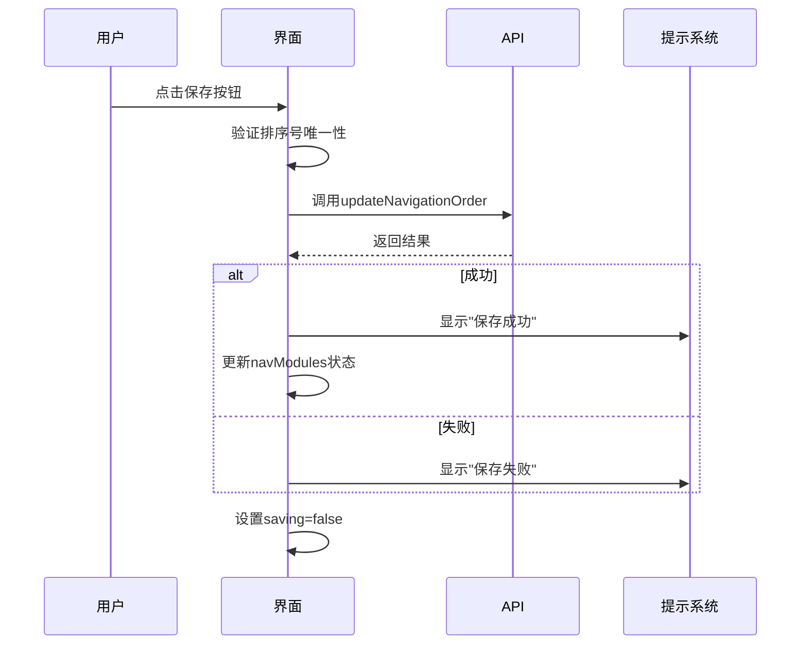

**Diagram sources**
- [ModuleControlPage.tsx](file://src/pages/admin/ModuleControlPage.tsx#L69-L89)
- [api.ts](file://src/db/api.ts#L2794-L2810)

### 重置状态反馈

重置状态的处理流程：

- 点击"恢复默认"按钮
- 调用`resetNavigationOrder`API
- 重新加载最新配置
- 显示成功提示

**Section sources**
- [ModuleControlPage.tsx](file://src/pages/admin/ModuleControlPage.tsx#L24-L26)
- [ModuleControlPage.tsx](file://src/pages/admin/ModuleControlPage.tsx#L69-L104)

## 响应式设计与可访问性

模块控制界面遵循响应式设计原则，并考虑了可访问性最佳实践。

### 响应式布局

界面使用Tailwind CSS的响应式类实现多设备适配：

- 使用`container`类确保内容在不同屏幕尺寸下的合适宽度
- 卡片布局在小屏幕上自动调整
- 按钮组使用`flex flex-wrap gap-3`实现换行

### 可访问性实践

界面实现了多项可访问性特性：

- **键盘导航**：所有交互元素支持Tab键导航
- **焦点管理**：按钮和输入框有清晰的焦点状态
- **ARIA标签**：使用适当的语义化HTML元素
- **对比度**：遵循WCAG标准，确保文字与背景的足够对比度
- **图标辅助**：重要操作配有图标，增强可识别性

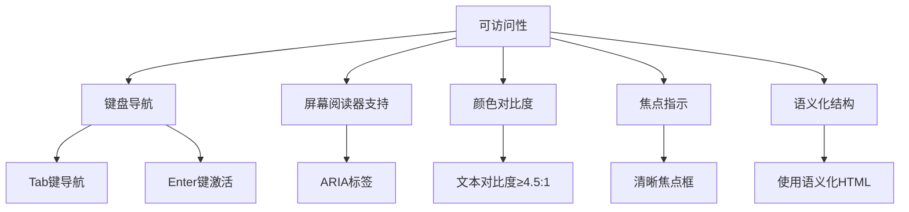

**Diagram sources**
- [tailwind.config.js](file://tailwind.config.js#L25-L85)
- [button.tsx](file://src/components/ui/button.tsx#L7-L35)

**Section sources**
- [tailwind.config.js](file://tailwind.config.js#L1-L171)
- [button.tsx](file://src/components/ui/button.tsx#L1-L58)

## 数据结构与API

模块控制界面的数据结构和API设计体现了前后端分离的架构思想。

### 数据模型

导航模块的数据结构定义在`types.ts`文件中：

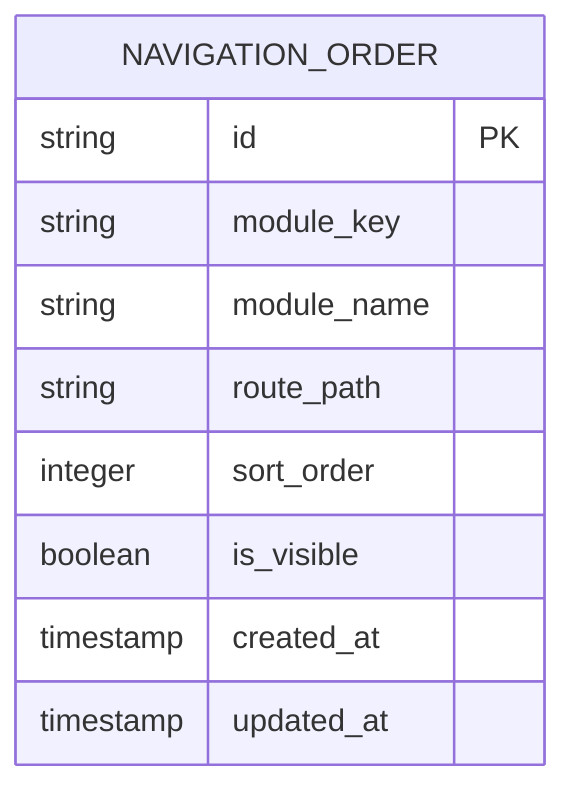

**Diagram sources**
- [types.ts](file://src/types/types.ts#L174-L183)
- [00018_create_navigation_order_table.sql](file://supabase/migrations/00018_create_navigation_order_table.sql#L1-L46)

### API接口

后端提供了三个核心API接口：

- `getNavigationOrder()`: 获取导航排序配置
- `updateNavigationOrder()`: 更新导航排序配置
- `resetNavigationOrder()`: 重置为默认排序

这些API通过Supabase与数据库交互，实现了数据的持久化存储。

**Section sources**
- [api.ts](file://src/db/api.ts#L2767-L2850)
- [types.ts](file://src/types/types.ts#L174-L183)

## 结论

模块控制界面是一个功能完整、用户体验良好的管理工具。通过清晰的布局设计、直观的交互逻辑和完善的反馈机制，为管理员提供了高效的导航配置能力。界面的状态管理严谨，数据流清晰，体现了良好的前端工程实践。响应式设计和可访问性考虑确保了界面在各种使用场景下的可用性。