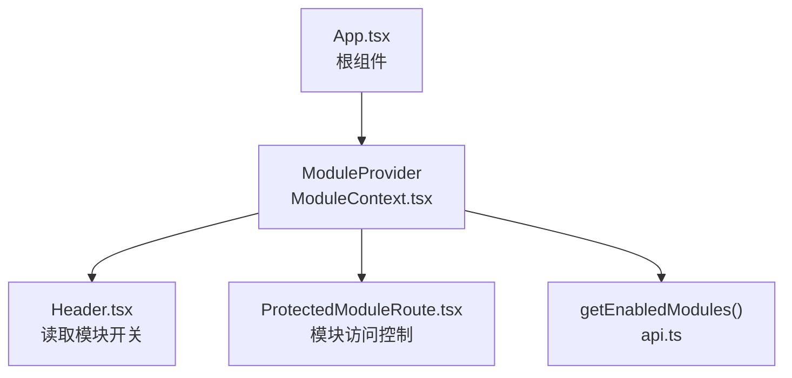
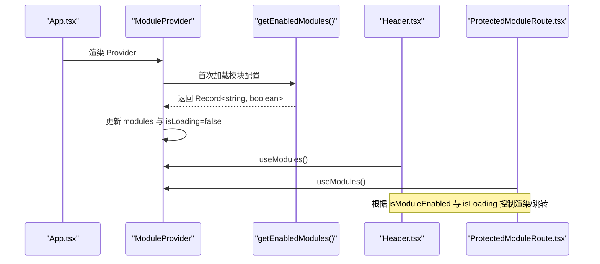
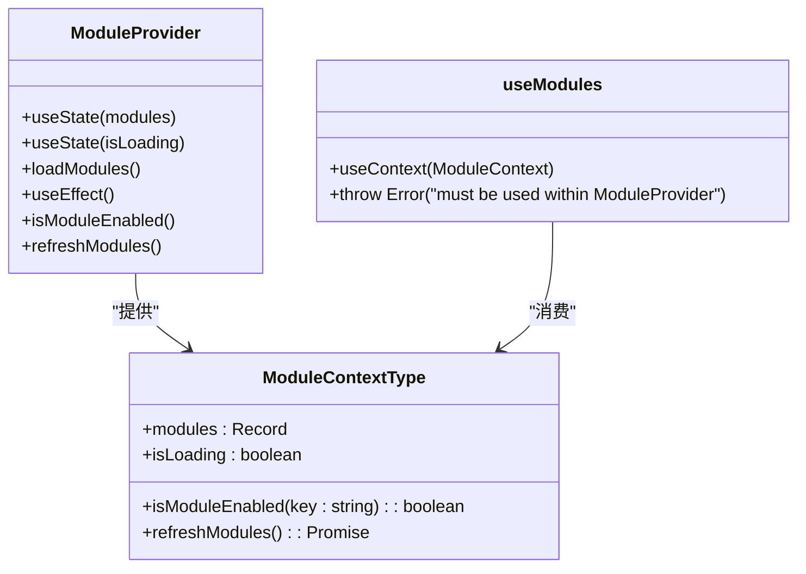
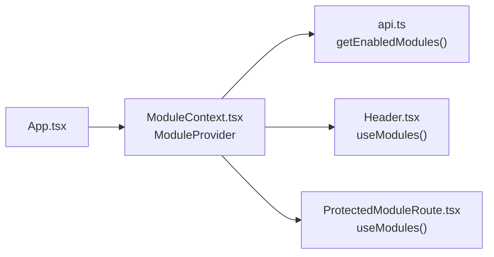

# 上下文定义与接口

<cite>
**本文引用的文件**
- [ModuleContext.tsx](file://src/contexts/ModuleContext.tsx)
- [App.tsx](file://src/App.tsx)
- [Header.tsx](file://src/components/common/Header.tsx)
- [ProtectedModuleRoute.tsx](file://src/components/common/ProtectedModuleRoute.tsx)
- [api.ts](file://src/db/api.ts)
- [types.ts](file://src/types/types.ts)
</cite>

## 目录
1. [引言](#引言)
2. [项目结构](#项目结构)
3. [核心组件](#核心组件)
4. [架构总览](#架构总览)
5. [详细组件分析](#详细组件分析)
6. [依赖分析](#依赖分析)
7. [性能考虑](#性能考虑)
8. [故障排查指南](#故障排查指南)
9. [结论](#结论)
10. [附录](#附录)

## 引言
本文件围绕 ModuleContext 的设计与实现进行系统化文档化，重点解析 ModuleContextType 接口的结构定义，包括：
- modules 记录对象：模块键到启用状态布尔值的映射
- isModuleEnabled 查询函数：根据模块键判断是否启用
- refreshModules 刷新函数：重新拉取后端模块配置
- isLoading 加载状态：指示模块配置是否正在加载

同时，本文将阐述 createContext 的初始化过程、undefined 默认值的处理策略、类型安全在上下文使用中的重要性，以及通过 TypeScript 确保类型一致性的方法，并给出接口定义的实际应用场景与类型推断示例。

## 项目结构
ModuleContext 位于 contexts 目录，作为全局模块开关的上下文提供者，贯穿应用的路由层与 UI 层使用。其典型使用路径如下：
- 在根组件中以 Provider 包裹整个应用树
- 在导航组件中读取模块开关并据此渲染菜单项
- 在受保护路由组件中根据模块开关进行访问控制

图表来源
- [App.tsx](file://src/App.tsx#L1-L33)
- [ModuleContext.tsx](file://src/contexts/ModuleContext.tsx#L1-L62)
- [Header.tsx](file://src/components/common/Header.tsx#L1-L263)
- [ProtectedModuleRoute.tsx](file://src/components/common/ProtectedModuleRoute.tsx#L1-L29)
- [api.ts](file://src/db/api.ts#L2570-L2596)

章节来源
- [App.tsx](file://src/App.tsx#L1-L33)
- [ModuleContext.tsx](file://src/contexts/ModuleContext.tsx#L1-L62)

## 核心组件
本节聚焦 ModuleContextType 接口与 Provider 的实现要点，帮助读者快速理解上下文的数据结构与行为。

- 接口定义（ModuleContextType）
  - modules: Record<string, boolean> —— 模块键到启用状态的映射
  - isModuleEnabled(key: string): boolean —— 查询某模块是否启用；未显式配置时默认启用
  - refreshModules(): Promise<void> —— 刷新模块配置，重新从后端拉取
  - isLoading: boolean —— 模块配置加载状态

- Provider 初始化流程
  - 初始状态：modules 使用默认值（内置模块键集合），isLoading 初始为 true
  - 首次挂载：useEffect 触发加载逻辑，调用 getEnabledModules 后更新 modules
  - 错误兜底：若拉取失败，控制台输出错误并保持默认值（所有模块启用）
  - 最终状态：isLoading 切换为 false

- Hook 使用约束
  - useModules 必须在 ModuleProvider 内部使用；否则抛出错误，避免运行时类型不一致

章节来源
- [ModuleContext.tsx](file://src/contexts/ModuleContext.tsx#L1-L62)

## 架构总览
ModuleContext 的工作流可概括为：Provider 在应用启动时拉取模块配置，随后向子组件暴露查询与刷新能力；UI 组件根据模块开关动态渲染或跳转，受保护路由在加载中时显示占位，在未启用时重定向首页。

图表来源
- [App.tsx](file://src/App.tsx#L1-L33)
- [ModuleContext.tsx](file://src/contexts/ModuleContext.tsx#L1-L62)
- [Header.tsx](file://src/components/common/Header.tsx#L1-L263)
- [ProtectedModuleRoute.tsx](file://src/components/common/ProtectedModuleRoute.tsx#L1-L29)
- [api.ts](file://src/db/api.ts#L2570-L2596)

## 详细组件分析

### ModuleContextType 接口与 Provider 实现
- 接口字段语义
  - modules：键为模块标识（如 cases、news、departments、trends、issues），值为布尔启用状态
  - isModuleEnabled：若模块键存在则返回对应状态，否则默认启用（保证新增模块不会被意外禁用）
  - refreshModules：封装加载逻辑，便于外部触发重新拉取
  - isLoading：用于 UI 层在首次加载时显示加载态或骨架屏

- Provider 初始化与错误兜底
  - 初始 modules 采用内置默认值，确保即使后端不可用也能维持可用体验
  - 加载失败时记录错误并保持默认值，避免因网络异常导致功能不可用
  - finally 中统一关闭加载态，保证 UI 不会一直停留在加载中

- 类型安全与默认值策略
  - 将 undefined 作为 createContext 的默认值，强制要求在 Provider 内部使用 useModules
  - isModuleEnabled 的默认启用策略，避免“未知模块”导致的误禁用

图表来源
- [ModuleContext.tsx](file://src/contexts/ModuleContext.tsx#L1-L62)

章节来源
- [ModuleContext.tsx](file://src/contexts/ModuleContext.tsx#L1-L62)

### createContext 初始化与 undefined 默认值处理
- 初始化策略
  - createContext 的泛型参数为 ModuleContextType | undefined，明确表示上下文初始可能为空
  - Provider 通过 value 将实际上下文对象注入到 React 上下文中

- 使用约束
  - useModules 在上下文为空时抛出错误，防止在 Provider 外部使用导致的类型不一致与运行时异常
  - App.tsx 将 Provider 放置在根路由外层，确保所有子组件均可访问

- 类型推断与最佳实践
  - 通过将 Provider 的 value 类型与 ModuleContextType 对齐，TypeScript 可在消费侧进行精确类型推断
  - 若未来扩展字段（如新增统计字段），只需在接口中添加，Provider 与 useModules 无需改动即可获得类型保障

章节来源
- [ModuleContext.tsx](file://src/contexts/ModuleContext.tsx#L1-L62)
- [App.tsx](file://src/App.tsx#L1-L33)

### 实际应用场景与类型推断示例
- 场景一：导航菜单渲染
  - Header.tsx 通过 useModules 获取 isModuleEnabled，结合后端可见导航配置，过滤出当前启用的模块并渲染菜单项
  - 类型推断：isModuleEnabled 返回 boolean，TypeScript 可在条件分支中正确推断分支类型

- 场景二：受保护路由
  - ProtectedModuleRoute.tsx 使用 isLoading 显示加载态，使用 isModuleEnabled 决定是否允许访问
  - 类型推断：isLoading 为 boolean，配合条件渲染，TS 可确保分支覆盖完整

- 场景三：模块开关刷新
  - Provider 暴露 refreshModules，可在管理后台切换模块开关后调用，重新拉取配置并更新 UI
  - 类型推断：refreshModules 返回 Promise<void>，调用方可 await 以等待刷新完成

章节来源
- [Header.tsx](file://src/components/common/Header.tsx#L1-L263)
- [ProtectedModuleRoute.tsx](file://src/components/common/ProtectedModuleRoute.tsx#L1-L29)
- [ModuleContext.tsx](file://src/contexts/ModuleContext.tsx#L1-L62)

## 依赖分析
ModuleContext 的关键依赖链路如下：
- Provider 依赖后端接口 getEnabledModules，后者从数据库表 module_settings 拉取模块键与启用状态
- UI 组件（Header、ProtectedModuleRoute）依赖 Provider 暴露的上下文值
- App.tsx 作为根组件负责包裹 Provider，确保上下文在整个应用树内可用

图表来源
- [App.tsx](file://src/App.tsx#L1-L33)
- [ModuleContext.tsx](file://src/contexts/ModuleContext.tsx#L1-L62)
- [Header.tsx](file://src/components/common/Header.tsx#L1-L263)
- [ProtectedModuleRoute.tsx](file://src/components/common/ProtectedModuleRoute.tsx#L1-L29)
- [api.ts](file://src/db/api.ts#L2570-L2596)

章节来源
- [App.tsx](file://src/App.tsx#L1-L33)
- [ModuleContext.tsx](file://src/contexts/ModuleContext.tsx#L1-L62)
- [api.ts](file://src/db/api.ts#L2570-L2596)

## 性能考虑
- 首次加载优化
  - Provider 在首次挂载时仅进行一次加载，避免重复请求
  - isLoading 用于 UI 占位，减少闪烁与不必要的重渲染

- 错误处理与回退
  - 后端请求失败时使用默认值（所有模块启用），避免阻塞用户体验
  - 控制台记录错误，便于定位问题

- 刷新策略
  - refreshModules 仅在需要时调用，避免频繁拉取造成资源浪费

[本节为通用建议，不直接分析具体文件]

## 故障排查指南
- 症状：在 Provider 外部使用 useModules 抛出错误
  - 原因：useModules 要求在 ModuleProvider 内部使用
  - 解决：确认 App.tsx 或父级组件已包裹 ModuleProvider

- 症状：模块开关未生效或全部显示
  - 原因：后端接口返回失败，Provider 使用默认值（所有模块启用）
  - 解决：检查数据库表 module_settings 是否存在有效记录；确认 getEnabledModules 请求是否成功

- 症状：受保护路由长时间处于加载态
  - 原因：isLoading 为 true，通常由首次加载未完成引起
  - 解决：等待加载完成；必要时调用 refreshModules 重新拉取

章节来源
- [ModuleContext.tsx](file://src/contexts/ModuleContext.tsx#L1-L62)
- [ProtectedModuleRoute.tsx](file://src/components/common/ProtectedModuleRoute.tsx#L1-L29)
- [api.ts](file://src/db/api.ts#L2570-L2596)

## 结论
ModuleContext 通过清晰的接口定义与严格的 Provider 使用约束，实现了模块开关的集中管理与类型安全。其默认启用策略与错误兜底机制提升了系统的鲁棒性；配合 isLoading 与 refreshModules，既保证了良好的用户体验，也便于后续扩展与维护。在实际开发中，应遵循 Provider 包裹与 useModules 使用规范，确保类型一致性与运行时稳定性。

[本节为总结性内容，不直接分析具体文件]

## 附录
- 相关类型定义参考
  - 模块设置类型：ModuleSetting（来自 types.ts），用于理解模块键与启用状态的数据库模型
  - 模块键集合：Provider 内置默认模块键包括 cases、news、departments、trends、issues

章节来源
- [types.ts](file://src/types/types.ts#L81-L89)
- [ModuleContext.tsx](file://src/contexts/ModuleContext.tsx#L1-L62)