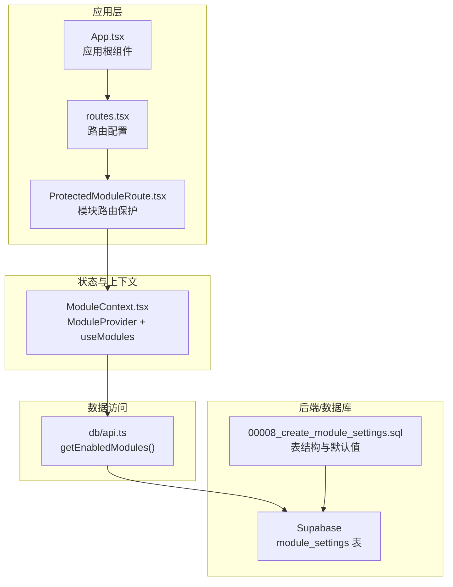
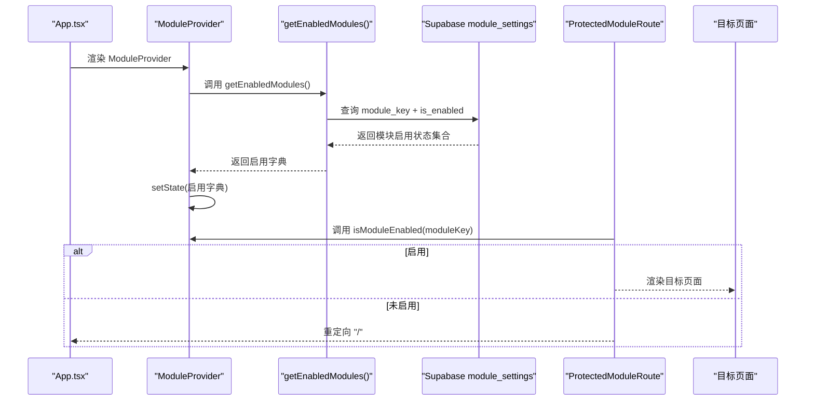
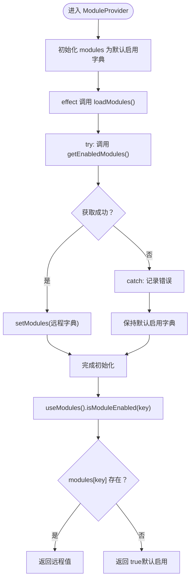
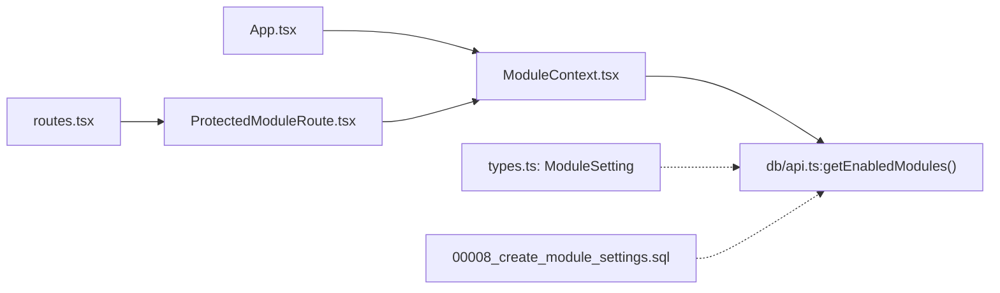

# 模块状态初始化

<cite>
**本文引用的文件**
- [src/App.tsx](file://src/App.tsx)
- [src/routes.tsx](file://src/routes.tsx)
- [src/contexts/ModuleContext.tsx](file://src/contexts/ModuleContext.tsx)
- [src/db/api.ts](file://src/db/api.ts)
- [src/types/types.ts](file://src/types/types.ts)
- [src/components/common/ProtectedModuleRoute.tsx](file://src/components/common/ProtectedModuleRoute.tsx)
- [supabase/migrations/00008_create_module_settings.sql](file://supabase/migrations/00008_create_module_settings.sql)
</cite>

## 目录
1. [简介](#简介)
2. [项目结构](#项目结构)
3. [核心组件](#核心组件)
4. [架构总览](#架构总览)
5. [详细组件分析](#详细组件分析)
6. [依赖关系分析](#依赖关系分析)
7. [性能考虑](#性能考虑)
8. [故障排查指南](#故障排查指南)
9. [结论](#结论)

## 简介
本文件聚焦于“模块状态初始化”机制，系统性解析 ModuleProvider 中 useState 如何设置初始模块状态，覆盖 cases、news、departments、trends 和 issues 等核心模块的默认启用状态；阐述远程配置加载失败时的容错策略与默认值回退；解释默认启用的设计动机与用户体验考量；并提供状态初始化的实现细节与常见问题排查方法。

## 项目结构
围绕模块状态初始化的关键文件组织如下：
- 应用入口与路由：App.tsx、routes.tsx
- 模块上下文：ModuleContext.tsx
- 数据访问层：db/api.ts（包含 getEnabledModules）
- 类型定义：types/types.ts（包含 ModuleSetting）
- 路由保护组件：ProtectedModuleRoute.tsx
- 数据库迁移：supabase/migrations/00008_create_module_settings.sql（定义模块设置表与默认启用）

图表来源
- [src/App.tsx](file://src/App.tsx#L1-L33)
- [src/routes.tsx](file://src/routes.tsx#L1-L120)
- [src/contexts/ModuleContext.tsx](file://src/contexts/ModuleContext.tsx#L1-L61)
- [src/db/api.ts](file://src/db/api.ts#L2571-L2596)
- [supabase/migrations/00008_create_module_settings.sql](file://supabase/migrations/00008_create_module_settings.sql#L1-L44)

章节来源
- [src/App.tsx](file://src/App.tsx#L1-L33)
- [src/routes.tsx](file://src/routes.tsx#L1-L120)

## 核心组件
- ModuleProvider：负责初始化模块状态、拉取远程配置、暴露 isModuleEnabled 与 refreshModules，并通过上下文向子树提供状态。
- useModules：自定义 Hook，封装上下文消费与错误边界。
- ProtectedModuleRoute：在渲染目标页面前检查模块是否启用，若未启用则重定向首页。
- getEnabledModules：从 Supabase 读取模块启用状态，异常时返回默认启用字典。
- ModuleSetting 类型：定义模块设置的字段结构（模块键、名称、启用状态、排序等）。

章节来源
- [src/contexts/ModuleContext.tsx](file://src/contexts/ModuleContext.tsx#L1-L61)
- [src/components/common/ProtectedModuleRoute.tsx](file://src/components/common/ProtectedModuleRoute.tsx#L1-L28)
- [src/db/api.ts](file://src/db/api.ts#L2571-L2596)
- [src/types/types.ts](file://src/types/types.ts#L81-L89)

## 架构总览
模块状态初始化的端到端流程如下：
- 应用启动时，App 将 ModuleProvider 作为根上下文容器挂载。
- ModuleProvider 在首次渲染时触发异步加载模块配置。
- getEnabledModules 从 Supabase 读取模块键与启用状态；若数据库异常，则返回默认启用字典。
- ModuleProvider 将远程结果或默认值写入本地状态，并暴露 isModuleEnabled 供各页面判断。
- 路由层通过 ProtectedModuleRoute 对目标模块进行启用校验，未启用则重定向首页。

图表来源
- [src/App.tsx](file://src/App.tsx#L1-L33)
- [src/contexts/ModuleContext.tsx](file://src/contexts/ModuleContext.tsx#L13-L53)
- [src/db/api.ts](file://src/db/api.ts#L2571-L2596)
- [src/components/common/ProtectedModuleRoute.tsx](file://src/components/common/ProtectedModuleRoute.tsx#L1-L28)

## 详细组件分析

### ModuleProvider 初始化与默认值设计
- 初始状态：useState 将 modules 初始化为包含 cases、news、departments、trends、issues 的布尔字典，全部设为 true。
- 异步加载：首次渲染时 useEffect 调用 loadModules，内部通过 getEnabledModules 获取远程配置。
- 错误回退：若 getEnabledModules 抛出异常，loadModules 捕获错误并保持 isLoading=false，但不更新 modules，从而维持默认启用字典。
- 默认启用策略：isModuleEnabled(key) 采用空值回退（??）策略，若远程未返回对应键，默认视为启用，确保系统可用性。

图表来源
- [src/contexts/ModuleContext.tsx](file://src/contexts/ModuleContext.tsx#L13-L47)
- [src/db/api.ts](file://src/db/api.ts#L2571-L2596)

章节来源
- [src/contexts/ModuleContext.tsx](file://src/contexts/ModuleContext.tsx#L13-L47)

### 远程配置加载失败的容错机制
- getEnabledModules 在数据库查询失败时，会返回一个包含五个核心模块键的默认启用字典，确保前端不会因网络或数据库异常而出现不可用状态。
- ModuleProvider 的 loadModules 在捕获异常后不更新状态，使默认启用字典得以保留，同时 isLoading 在 finally 中置为 false，避免 UI 长时间处于加载态。

章节来源
- [src/db/api.ts](file://src/db/api.ts#L2571-L2596)
- [src/contexts/ModuleContext.tsx](file://src/contexts/ModuleContext.tsx#L23-L33)

### 模块启用判断与路由保护
- ProtectedModuleRoute 在加载阶段若 isLoading 为真，显示加载指示；加载完成后根据 isModuleEnabled(moduleKey) 决定是否渲染目标页面或重定向首页。
- 这种设计保证了即使远程配置尚未就绪，也不会阻塞用户访问首页或其他非受保护页面。

章节来源
- [src/components/common/ProtectedModuleRoute.tsx](file://src/components/common/ProtectedModuleRoute.tsx#L1-L28)

### 数据模型与默认值来源
- 模块设置表 module_settings 的初始数据包含五个核心模块键（cases、news、departments、trends、issues），且默认 is_enabled 为 true。
- 这些默认值与前端默认启用字典保持一致，形成“前后端一致”的默认行为。

章节来源
- [supabase/migrations/00008_create_module_settings.sql](file://supabase/migrations/00008_create_module_settings.sql#L1-L44)
- [src/db/api.ts](file://src/db/api.ts#L2571-L2596)

## 依赖关系分析
- App.tsx 作为根组件，将 ModuleProvider 作为顶层容器，确保整个应用树都能访问模块状态。
- routes.tsx 将受保护模块路由包裹在 ProtectedModuleRoute 中，统一执行启用校验。
- ModuleContext.tsx 依赖 db/api.ts 的 getEnabledModules 实现远程配置读取。
- ProtectedModuleRoute 依赖 useModules Hook 获取 isModuleEnabled 与 isLoading。
- 类型定义 ModuleSetting 为模块设置的结构化表示。

图表来源
- [src/App.tsx](file://src/App.tsx#L1-L33)
- [src/routes.tsx](file://src/routes.tsx#L1-L120)
- [src/contexts/ModuleContext.tsx](file://src/contexts/ModuleContext.tsx#L1-L61)
- [src/db/api.ts](file://src/db/api.ts#L2571-L2596)
- [src/types/types.ts](file://src/types/types.ts#L81-L89)
- [supabase/migrations/00008_create_module_settings.sql](file://supabase/migrations/00008_create_module_settings.sql#L1-L44)

章节来源
- [src/App.tsx](file://src/App.tsx#L1-L33)
- [src/routes.tsx](file://src/routes.tsx#L1-L120)
- [src/contexts/ModuleContext.tsx](file://src/contexts/ModuleContext.tsx#L1-L61)
- [src/db/api.ts](file://src/db/api.ts#L2571-L2596)
- [src/types/types.ts](file://src/types/types.ts#L81-L89)
- [supabase/migrations/00008_create_module_settings.sql](file://supabase/migrations/00008_create_module_settings.sql#L1-L44)

## 性能考虑
- 初始渲染：useState 默认启用字典避免了首次渲染等待远程配置，减少白屏时间。
- 并发与重试：当前实现未内置重试逻辑；如需增强，可在 loadModules 中增加指数退避重试策略。
- 状态粒度：modules 为整包字典，isModuleEnabled 采用空值回退，避免逐项初始化带来的复杂度。
- 路由保护：ProtectedModuleRoute 在 isLoading 期间显示轻量加载指示，避免阻塞主流程。

[本节为通用建议，无需特定文件来源]

## 故障排查指南
- 症状：模块路由无法访问或跳转首页
  - 排查点：确认 ProtectedModuleRoute 的 moduleKey 与数据库中的 module_key 是否一致；检查 isModuleEnabled 返回值。
  - 参考路径：[src/components/common/ProtectedModuleRoute.tsx](file://src/components/common/ProtectedModuleRoute.tsx#L1-L28)
- 症状：页面长时间处于加载态
  - 排查点：确认 ModuleProvider 的 isLoading 是否在 finally 中置为 false；检查 getEnabledModules 是否抛出异常。
  - 参考路径：[src/contexts/ModuleContext.tsx](file://src/contexts/ModuleContext.tsx#L23-L33)
- 症状：远程配置未生效
  - 排查点：确认 Supabase 表 module_settings 的 is_enabled 字段是否正确更新；检查 getEnabledModules 的查询是否返回预期。
  - 参考路径：[src/db/api.ts](file://src/db/api.ts#L2571-L2596)、[supabase/migrations/00008_create_module_settings.sql](file://supabase/migrations/00008_create_module_settings.sql#L1-L44)
- 症状：默认启用与期望不符
  - 排查点：确认数据库初始数据与前端默认字典一致；核对 module_key 是否拼写正确。
  - 参考路径：[src/db/api.ts](file://src/db/api.ts#L2571-L2596)、[supabase/migrations/00008_create_module_settings.sql](file://supabase/migrations/00008_create_module_settings.sql#L1-L44)

章节来源
- [src/components/common/ProtectedModuleRoute.tsx](file://src/components/common/ProtectedModuleRoute.tsx#L1-L28)
- [src/contexts/ModuleContext.tsx](file://src/contexts/ModuleContext.tsx#L23-L33)
- [src/db/api.ts](file://src/db/api.ts#L2571-L2596)
- [supabase/migrations/00008_create_module_settings.sql](file://supabase/migrations/00008_create_module_settings.sql#L1-L44)

## 结论
- ModuleProvider 通过 useState 初始化核心模块的默认启用状态，确保系统在远程配置加载失败时仍可正常运行。
- getEnabledModules 在数据库异常时返回默认启用字典，配合 ModuleProvider 的错误捕获与空值回退策略，形成稳健的容错机制。
- 默认启用的设计兼顾业务连续性与用户体验，避免因配置缺失导致的功能不可用。
- 建议后续可引入重试与缓存策略，进一步提升稳定性与性能。