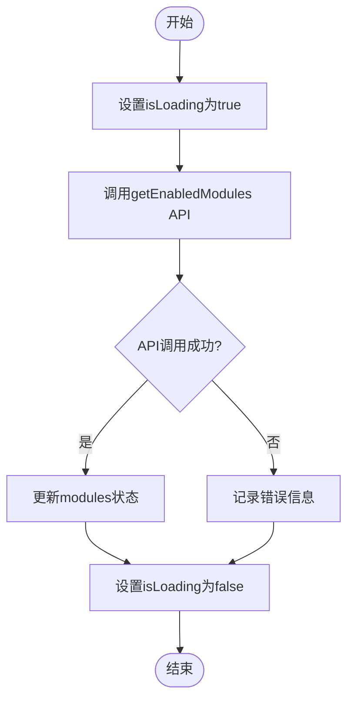
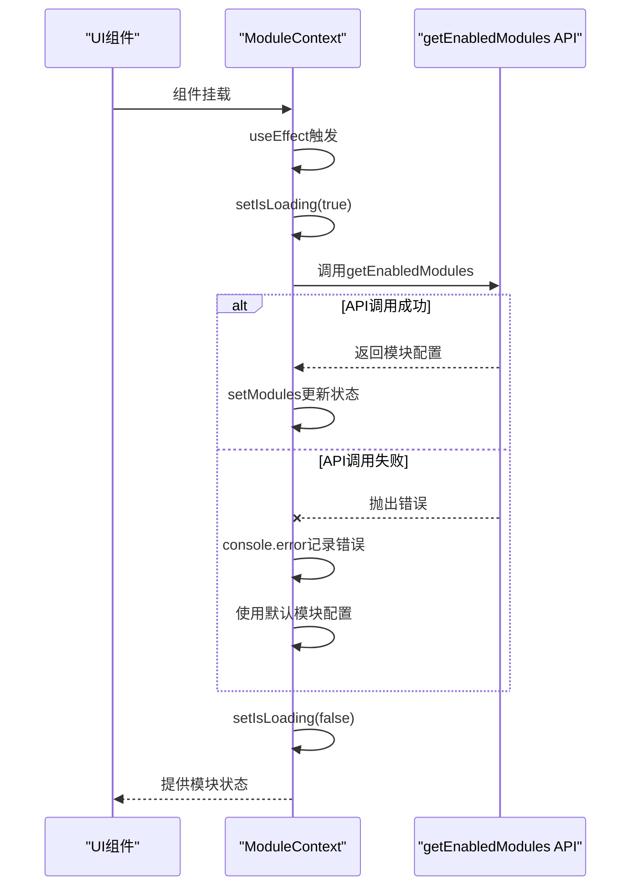

# 状态加载与同步

<cite>
**本文档引用的文件**   
- [ModuleContext.tsx](file://src/contexts/ModuleContext.tsx)
- [api.ts](file://src/db/api.ts)
- [ProtectedModuleRoute.tsx](file://src/components/common/ProtectedModuleRoute.tsx)
- [App.tsx](file://src/App.tsx)
</cite>

## 目录
1. [生命周期管理机制](#生命周期管理机制)
2. [loadModules异步函数执行流程](#loadmodules异步函数执行流程)
3. [isLoading状态在UI交互中的作用](#isloading状态在ui交互中的作用)
4. [错误处理机制与系统稳定性](#错误处理机制与系统稳定性)
5. [状态同步时序逻辑分析](#状态同步时序逻辑分析)
6. [网络异常调试策略](#网络异常调试策略)
7. [性能优化建议](#性能优化建议)

## 生命周期管理机制

`useEffect`在组件挂载时自动加载远程模块配置的生命周期管理机制通过`ModuleProvider`组件实现。该组件使用`useEffect`钩子在组件挂载时调用`loadModules`函数，从远程数据库获取模块配置。`useEffect`的依赖数组为空，确保该操作只在组件挂载时执行一次。

**Section sources**
- [ModuleContext.tsx](file://src/contexts/ModuleContext.tsx#L36-L38)

## loadModules异步函数执行流程

`loadModules`异步函数的执行流程包括设置加载状态、调用API、处理响应数据和错误恢复：

1. **设置加载状态**：调用`setIsLoading(true)`将`isLoading`状态设置为`true`
2. **调用API**：调用`getEnabledModules` API从数据库获取启用的模块列表
3. **处理响应数据**：将API返回的数据通过`setModules`更新到状态中
4. **错误恢复**：在`catch`块中记录错误，在`finally`块中将`isLoading`状态设置为`false`

**Diagram sources **
- [ModuleContext.tsx](file://src/contexts/ModuleContext.tsx#L23-L34)

**Section sources**
- [ModuleContext.tsx](file://src/contexts/ModuleContext.tsx#L23-L34)
- [api.ts](file://src/db/api.ts#L2570-L2596)

## isLoading状态在UI交互中的作用

`isLoading`状态在UI交互中起到关键作用，主要用于控制加载指示器的显示和隐藏。当`isLoading`为`true`时，显示加载动画；当为`false`时，显示实际内容或错误信息。在`ProtectedModuleRoute`组件中，`isLoading`状态用于在加载模块配置时显示加载指示器。

**Section sources**
- [ProtectedModuleRoute.tsx](file://src/components/common/ProtectedModuleRoute.tsx#L14-L19)

## 错误处理机制与系统稳定性

错误处理机制通过`try-catch-finally`结构实现，确保系统稳定性：

1. **错误捕获**：在`try`块中执行可能出错的异步操作
2. **错误记录**：在`catch`块中使用`console.error`记录错误信息
3. **降级处理**：当API调用失败时，使用默认值（所有模块启用）
4. **状态清理**：在`finally`块中重置`isLoading`状态，确保UI不会卡在加载状态

**Diagram sources **
- [ModuleContext.tsx](file://src/contexts/ModuleContext.tsx#L24-L33)

**Section sources**
- [ModuleContext.tsx](file://src/contexts/ModuleContext.tsx#L24-L33)

## 状态同步时序逻辑分析

状态同步的时序逻辑遵循严格的顺序：

1. 组件挂载时，`useEffect`触发`loadModules`函数
2. `loadModules`首先设置`isLoading`为`true`
3. 异步调用`getEnabledModules` API
4. 无论成功或失败，最终都将`isLoading`设置为`false`
5. 状态更新通过React的调度机制保证UI的及时更新

这种时序逻辑确保了状态的一致性和可预测性。

**Section sources**
- [ModuleContext.tsx](file://src/contexts/ModuleContext.tsx#L23-L38)

## 网络异常调试策略

针对网络异常情况，建议采用以下调试策略：

1. **日志监控**：检查`console.error`输出的错误信息
2. **网络检查**：使用浏览器开发者工具检查API请求状态
3. **降级验证**：确认在API失败时是否正确使用默认值
4. **状态跟踪**：监控`isLoading`状态的变化是否符合预期

**Section sources**
- [ModuleContext.tsx](file://src/contexts/ModuleContext.tsx#L29-L31)

## 性能优化建议

为提升性能，建议采取以下优化措施：

1. **缓存机制**：在客户端缓存模块配置，减少重复请求
2. **错误重试**：实现指数退避重试机制，提高网络不稳定时的成功率
3. **加载优化**：在加载期间显示骨架屏，提升用户体验
4. **代码分割**：按需加载模块相关代码，减少初始加载时间

**Section sources**
- [ModuleContext.tsx](file://src/contexts/ModuleContext.tsx#L23-L34)