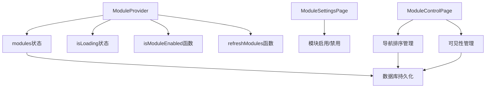
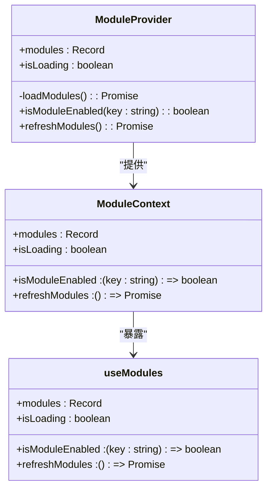
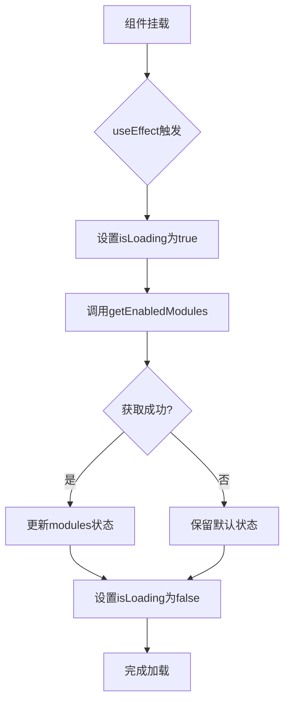
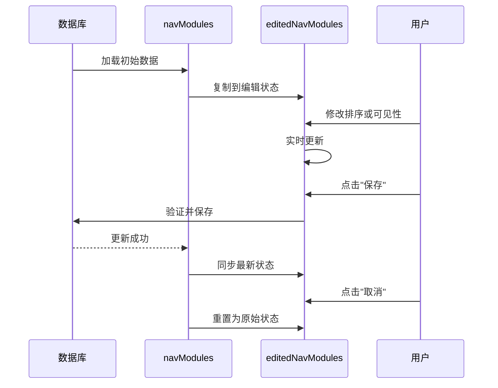

# 状态管理实现

<cite>
**本文档引用的文件**  
- [ModuleContext.tsx](file://src/contexts/ModuleContext.tsx)
- [ModuleSettingsPage.tsx](file://src/pages/admin/ModuleSettingsPage.tsx)
- [ModuleControlPage.tsx](file://src/pages/admin/ModuleControlPage.tsx)
- [api.ts](file://src/db/api.ts)
- [types.ts](file://src/types/types.ts)
- [00008_create_module_settings.sql](file://supabase/migrations/00008_create_module_settings.sql)
</cite>

## 目录
1. [模块状态管理核心机制](#模块状态管理核心机制)
2. [ModuleProvider中的状态管理](#moduleprovider中的状态管理)
3. [初始状态设置逻辑](#初始状态设置逻辑)
4. [useEffect生命周期管理](#useeffect生命周期管理)
5. [双状态模式设计分析](#双状态模式设计分析)

## 模块状态管理核心机制

本系统通过React Context API实现模块状态的全局管理，采用模块化设计模式，将模块状态管理与UI组件分离。系统核心状态管理机制基于`ModuleProvider`组件，通过`useState`和`useEffect`钩子实现状态的初始化、加载和更新。模块状态管理分为两个层面：全局模块启用状态管理（通过`ModuleContext`）和导航模块排序与可见性管理（通过`ModuleControlPage`）。

**模块状态管理架构图**

**图表来源**  
- [ModuleContext.tsx](file://src/contexts/ModuleContext.tsx#L14-L21)
- [ModuleSettingsPage.tsx](file://src/pages/admin/ModuleSettingsPage.tsx#L14-L15)
- [ModuleControlPage.tsx](file://src/pages/admin/ModuleControlPage.tsx#L22-L23)

## ModuleProvider中的状态管理

`ModuleProvider`组件是模块状态管理的核心，通过`useState`钩子管理两个关键状态：`modules`和`isLoading`。`modules`状态存储所有模块的启用状态，采用键值对形式（Record<string, boolean>），其中键为模块标识符，值为布尔值表示是否启用。`isLoading`状态用于控制加载状态的显示，确保在远程配置加载完成前提供良好的用户体验。

`ModuleProvider`通过`useContext`创建上下文，将模块状态和操作方法暴露给子组件。其返回值包含四个核心元素：`modules`（模块状态对象）、`isModuleEnabled`（模块状态检查函数）、`refreshModules`（状态刷新函数）和`isLoading`（加载状态）。这种设计模式实现了状态的封装和复用，使任何嵌套组件都能通过`useModules`钩子访问模块状态。

**状态管理组件关系图**

**图表来源**  
- [ModuleContext.tsx](file://src/contexts/ModuleContext.tsx#L4-L9)
- [ModuleContext.tsx](file://src/contexts/ModuleContext.tsx#L48-L52)

**本节来源**  
- [ModuleContext.tsx](file://src/contexts/ModuleContext.tsx#L13-L52)

## 初始状态设置逻辑

模块的初始状态设置遵循"默认启用，远程覆盖"的原则。在`ModuleProvider`中，`useState`钩子初始化了五个核心模块的默认启用状态：`cases`（案例）、`news`（资讯）、`departments`（部门）、`trends`（趋势）和`issues`（问题）。这些模块在初始化时均设置为`true`，确保系统在首次加载或配置获取失败时仍能正常运行。

初始状态的设置逻辑在`ModuleContext.tsx`文件中明确定义，这些模块对应系统的核心功能模块。这种设计确保了系统的健壮性，即使在无法连接远程数据库的情况下，用户仍能访问基本功能。模块的默认启用状态与数据库中的初始数据保持一致，通过`00008_create_module_settings.sql`迁移文件中的初始数据插入语句实现。

**核心模块默认状态表**
| 模块标识符 | 模块名称 | 默认状态 | 描述 |
|-----------|---------|---------|------|
| cases | 案例查询 | 启用 | 案例管理与查询功能 |
| news | 资讯查询 | 启用 | 监管资讯查询功能 |
| departments | 部门查询 | 启用 | 监管部门信息查询 |
| trends | 趋势分析 | 启用 | 通报趋势数据分析 |
| issues | 问题分析 | 启用 | 违规问题分析功能 |

**本节来源**  
- [ModuleContext.tsx](file://src/contexts/ModuleContext.tsx#L14-L20)
- [00008_create_module_settings.sql](file://supabase/migrations/00008_create_module_settings.sql#L19-L24)

## useEffect生命周期管理

`useEffect`钩子在组件挂载时自动加载远程模块配置，实现了模块状态的动态更新。该生命周期管理逻辑在`ModuleProvider`组件中定义，通过空依赖数组`[]`确保只在组件挂载时执行一次。`useEffect`调用`loadModules`异步函数，该函数负责从数据库获取最新的模块配置并更新本地状态。

`loadModules`函数的执行流程包含完整的错误处理机制：首先设置`isLoading`为`true`，然后尝试从`getEnabledModules` API获取远程配置，成功后更新`modules`状态，最后无论成功或失败都将`isLoading`设置为`false`。这种设计确保了加载过程的原子性和用户体验的连贯性。当获取远程配置失败时，系统会保留默认的初始状态，体现了"优雅降级"的设计理念。

**模块配置加载流程图**

**图表来源**  
- [ModuleContext.tsx](file://src/contexts/ModuleContext.tsx#L36-L38)
- [ModuleContext.tsx](file://src/contexts/ModuleContext.tsx#L23-L33)

**本节来源**  
- [ModuleContext.tsx](file://src/contexts/ModuleContext.tsx#L23-L38)

## 双状态模式设计分析

`ModuleControlPage`组件采用`navModules`和`editedNavModules`双状态模式，这种设计支持编辑-保存工作流并防止意外数据丢失。`navModules`代表从数据库加载的原始状态，作为"基准版本"；`editedNavModules`代表用户编辑过程中的临时状态，作为"工作副本"。这种分离的设计模式实现了数据的"暂存区"概念，类似于版本控制系统中的工作区与暂存区。

双状态模式的设计意图体现在多个方面：首先，它支持撤销操作，用户可以通过"取消修改"按钮将`editedNavModules`重置为`navModules`的值；其次，它实现了变更检测，通过比较两个状态的JSON字符串来判断是否有未保存的更改；最后，它确保了数据一致性，在保存前进行重复排序号的验证。这种模式有效防止了因页面刷新或意外关闭导致的数据丢失，提升了用户体验。

**双状态模式交互流程**

**图表来源**  
- [ModuleControlPage.tsx](file://src/pages/admin/ModuleControlPage.tsx#L22-L23)
- [ModuleControlPage.tsx](file://src/pages/admin/ModuleControlPage.tsx#L108-L109)
- [ModuleControlPage.tsx](file://src/pages/admin/ModuleControlPage.tsx#L113-L114)

**本节来源**  
- [ModuleControlPage.tsx](file://src/pages/admin/ModuleControlPage.tsx#L22-L27)
- [ModuleControlPage.tsx](file://src/pages/admin/ModuleControlPage.tsx#L108-L114)
- [ModuleControlPage.tsx](file://src/pages/admin/ModuleControlPage.tsx#L69-L89)