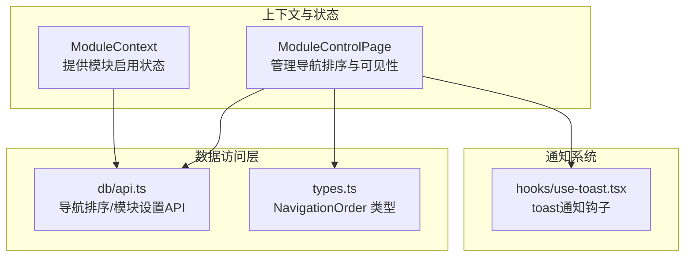
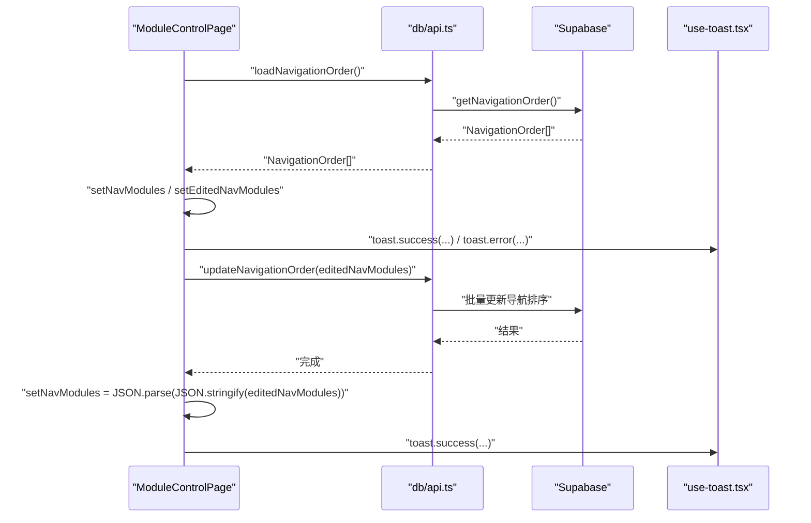
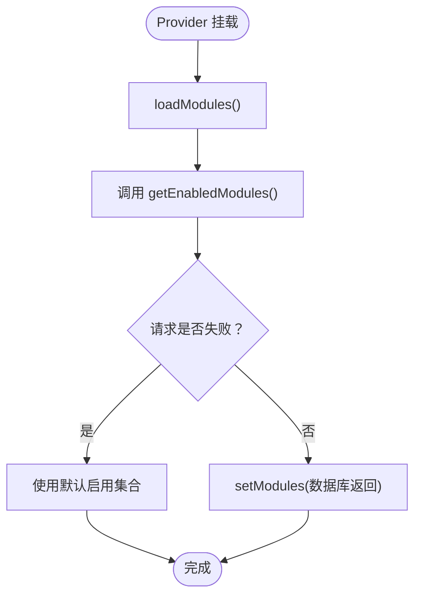
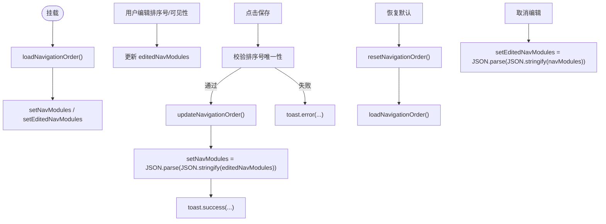
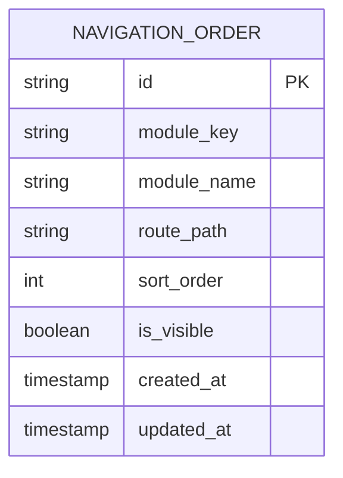
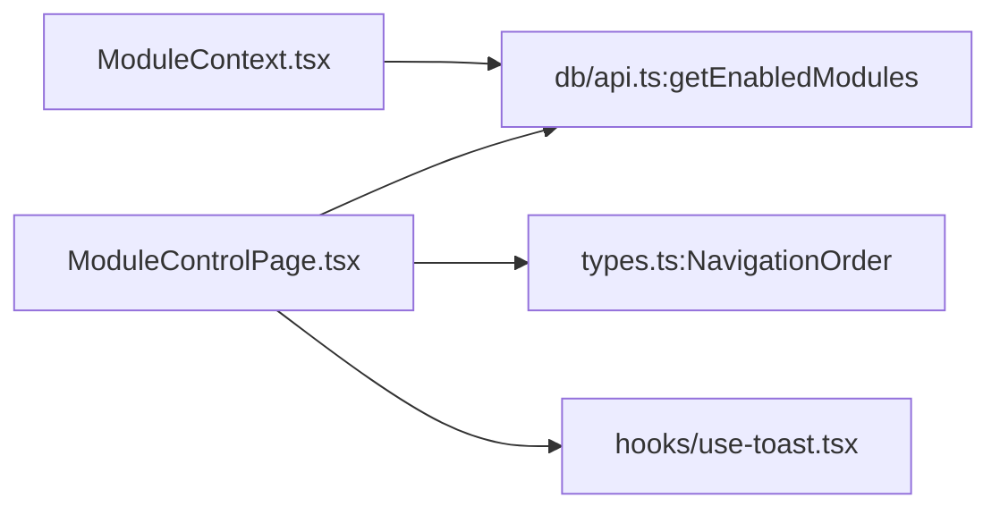

# 状态管理机制

<cite>
**本文引用的文件**
- [ModuleContext.tsx](file://src/contexts/ModuleContext.tsx)
- [ModuleControlPage.tsx](file://src/pages/admin/ModuleControlPage.tsx)
- [use-toast.tsx](file://src/hooks/use-toast.tsx)
- [api.ts](file://src/db/api.ts)
- [types.ts](file://src/types/types.ts)
</cite>

## 目录
1. [引言](#引言)
2. [项目结构](#项目结构)
3. [核心组件](#核心组件)
4. [架构总览](#架构总览)
5. [详细组件分析](#详细组件分析)
6. [依赖关系分析](#依赖关系分析)
7. [性能考量](#性能考量)
8. [故障排查指南](#故障排查指南)
9. [结论](#结论)

## 引言
本文件聚焦于模块控制状态管理，系统性解析以下主题：
- ModuleContext 的实现原理与使用方式
- ModuleContextType 接口定义的结构（模块配置、加载状态、更新函数等）
- Provider 组件如何封装状态逻辑并向子组件提供上下文
- ModuleControlPage 中 useState 与 useEffect 的使用，特别是 navModules、editedNavModules 等状态变量的初始化与更新机制
- 状态同步策略：如何确保 UI 状态与数据库状态保持一致
- 错误处理与用户反馈（toast 通知）的实现细节

## 项目结构
围绕“状态管理”这一目标，本文关注以下关键文件：
- 上下文与状态提供者：ModuleContext.tsx
- 管理页面与状态驱动流程：ModuleControlPage.tsx
- 数据访问层：db/api.ts（导航排序与模块设置的数据库读写）
- 类型定义：types.ts（NavigationOrder 等）
- 通知系统：hooks/use-toast.tsx

图表来源
- [ModuleContext.tsx](file://src/contexts/ModuleContext.tsx#L1-L62)
- [ModuleControlPage.tsx](file://src/pages/admin/ModuleControlPage.tsx#L1-L274)
- [api.ts](file://src/db/api.ts#L2571-L2770)
- [types.ts](file://src/types/types.ts#L173-L184)
- [use-toast.tsx](file://src/hooks/use-toast.tsx#L1-L189)

章节来源
- [ModuleContext.tsx](file://src/contexts/ModuleContext.tsx#L1-L62)
- [ModuleControlPage.tsx](file://src/pages/admin/ModuleControlPage.tsx#L1-L274)
- [api.ts](file://src/db/api.ts#L2571-L2770)
- [types.ts](file://src/types/types.ts#L173-L184)
- [use-toast.tsx](file://src/hooks/use-toast.tsx#L1-L189)

## 核心组件
- ModuleContextType 接口
  - 字段：modules（Record<string, boolean>）、isModuleEnabled（函数）、refreshModules（异步函数）、isLoading（布尔）
  - 作用：向子组件暴露模块启用状态、查询函数、刷新函数与加载状态
- ModuleProvider
  - 初始化 modules 为默认启用集合，并通过 useEffect 在挂载时拉取数据库中的启用状态
  - 提供 isModuleEnabled(key) 与 refreshModules() 两个辅助函数
  - 提供 isLoading 以反映加载状态
- useModules
  - 自定义 Hook，用于在子组件中消费上下文，若未包裹在 Provider 内则抛出错误

章节来源
- [ModuleContext.tsx](file://src/contexts/ModuleContext.tsx#L4-L11)
- [ModuleContext.tsx](file://src/contexts/ModuleContext.tsx#L13-L61)

## 架构总览
ModuleContext 作为全局状态提供者，负责模块启用状态的获取与刷新；ModuleControlPage 作为管理界面，负责导航排序与可见性的编辑、校验与持久化。两者通过 db/api.ts 的数据库接口进行交互，使用 toast 通知进行用户反馈。

图表来源
- [ModuleControlPage.tsx](file://src/pages/admin/ModuleControlPage.tsx#L28-L115)
- [api.ts](file://src/db/api.ts#L2767-L2810)
- [use-toast.tsx](file://src/hooks/use-toast.tsx#L1-L189)

## 详细组件分析

### ModuleContext 分析
- 设计要点
  - 使用 React Context 暴露模块启用状态与工具函数
  - 初始默认启用若干模块键，随后从数据库拉取真实状态
  - isModuleEnabled(key) 提供默认启用行为（未找到键时返回 true），保证健壮性
  - refreshModules() 封装重新加载逻辑，便于触发刷新
- 生命周期
  - useEffect 在组件挂载时调用 loadModules，首次加载启用状态
- 错误处理
  - 数据库请求失败时记录错误并保持默认启用状态，避免 UI 中断
- 性能与复杂度
  - modules 为键值对，查询 isModuleEnabled 为 O(1)
  - 刷新时整体为一次网络请求 + 状态更新

图表来源
- [ModuleContext.tsx](file://src/contexts/ModuleContext.tsx#L23-L34)
- [ModuleContext.tsx](file://src/contexts/ModuleContext.tsx#L36-L46)

章节来源
- [ModuleContext.tsx](file://src/contexts/ModuleContext.tsx#L13-L61)
- [api.ts](file://src/db/api.ts#L2571-L2596)

### ModuleControlPage 状态与生命周期分析
- 状态变量
  - navModules：来自数据库的导航模块列表（已排序）
  - editedNavModules：编辑态副本，用于实时编辑排序号与可见性
  - navLoading/saving/resetting：UI 加载与操作状态
- 生命周期与初始化
  - useEffect 在挂载时调用 loadNavigationOrder，拉取数据库数据并初始化两个状态副本
- 编辑与更新机制
  - handleSortOrderChange：更新 editedNavModules 中对应模块的 sort_order
  - handleNavVisibilityChange：更新 editedNavModules 中对应模块的 is_visible
  - handleSaveNavOrder：校验排序号唯一性，调用 updateNavigationOrder 持久化，成功后将 editedNavModules 同步回 navModules
  - handleResetNavOrder：调用 resetNavigationOrder 恢复默认排序，再重新加载
  - handleCancelNavEdit：取消编辑，将 editedNavModules 回滚到 navModules
- 状态同步策略
  - 采用“双副本”模式：navModules 作为数据库侧权威状态，editedNavModules 作为 UI 编辑态副本
  - 保存成功后，将 editedNavModules 深拷贝赋给 navModules，确保 UI 与数据库一致
  - 取消编辑时，同样深拷贝回滚，避免直接引用导致的意外共享
- 用户反馈
  - 使用 toast 进行错误与成功提示，覆盖加载失败、保存失败、重置失败、保存成功、恢复默认、取消修改等场景

图表来源
- [ModuleControlPage.tsx](file://src/pages/admin/ModuleControlPage.tsx#L28-L115)
- [api.ts](file://src/db/api.ts#L2767-L2810)

章节来源
- [ModuleControlPage.tsx](file://src/pages/admin/ModuleControlPage.tsx#L1-L274)
- [use-toast.tsx](file://src/hooks/use-toast.tsx#L1-L189)
- [api.ts](file://src/db/api.ts#L2767-L2810)

### 类型与数据模型
- NavigationOrder
  - 字段：id、module_key、module_name、route_path、sort_order、is_visible、created_at、updated_at
  - 用途：导航模块的排序与可见性配置
- ModuleContextType
  - 字段：modules、isModuleEnabled、refreshModules、isLoading
  - 用途：模块启用状态的上下文契约

图表来源
- [types.ts](file://src/types/types.ts#L173-L184)

章节来源
- [types.ts](file://src/types/types.ts#L173-L184)

### 错误处理与用户反馈
- ModuleContext
  - 数据库请求失败时记录错误并使用默认启用集合，避免 UI 抛错
- ModuleControlPage
  - 加载失败：toast.error('加载导航排序失败')
  - 保存失败：toast.error('保存导航排序失败')
  - 重置失败：toast.error('重置排序失败')
  - 保存成功：toast.success('导航排序保存成功')
  - 恢复默认：toast.success('已恢复默认排序')
  - 取消修改：toast.info('已取消修改')
- toast 通知机制
  - use-toast.tsx 实现了轻量级通知系统，支持添加、更新、关闭与移除通知
  - 通过内存状态与订阅者模式，实现跨组件的通知分发

章节来源
- [ModuleContext.tsx](file://src/contexts/ModuleContext.tsx#L23-L34)
- [ModuleControlPage.tsx](file://src/pages/admin/ModuleControlPage.tsx#L32-L115)
- [use-toast.tsx](file://src/hooks/use-toast.tsx#L1-L189)

## 依赖关系分析
- ModuleContext 依赖 db/api.ts 的 getEnabledModules，用于初始化模块启用状态
- ModuleControlPage 依赖 db/api.ts 的 getNavigationOrder、updateNavigationOrder、resetNavigationOrder，以及 types.ts 的 NavigationOrder 类型
- ModuleControlPage 依赖 hooks/use-toast.tsx 进行用户反馈

图表来源
- [ModuleContext.tsx](file://src/contexts/ModuleContext.tsx#L1-L62)
- [ModuleControlPage.tsx](file://src/pages/admin/ModuleControlPage.tsx#L1-L274)
- [api.ts](file://src/db/api.ts#L2571-L2770)
- [types.ts](file://src/types/types.ts#L173-L184)
- [use-toast.tsx](file://src/hooks/use-toast.tsx#L1-L189)

章节来源
- [ModuleContext.tsx](file://src/contexts/ModuleContext.tsx#L1-L62)
- [ModuleControlPage.tsx](file://src/pages/admin/ModuleControlPage.tsx#L1-L274)
- [api.ts](file://src/db/api.ts#L2571-L2770)
- [types.ts](file://src/types/types.ts#L173-L184)
- [use-toast.tsx](file://src/hooks/use-toast.tsx#L1-L189)

## 性能考量
- ModuleContext
  - modules 查询为 O(1)，isModuleEnabled 为常数时间
  - 首次加载仅一次网络请求，后续 refreshModules() 可按需触发
- ModuleControlPage
  - 编辑态使用浅拷贝映射更新，避免不必要的重渲染
  - 保存前进行排序号唯一性校验，减少无效网络请求
  - 使用深拷贝同步 navModules，避免引用共享导致的状态不一致
- toast 通知
  - use-toast.tsx 限制通知数量与过期时间，避免过多通知造成性能压力

[本节为通用指导，无需列出具体文件来源]

## 故障排查指南
- 模块启用状态不生效
  - 检查 ModuleContext 是否正确包裹在 Provider 下
  - 确认 db/api.ts 的 getEnabledModules 是否返回预期数据
  - 若数据库请求失败，确认默认启用集合是否被使用
- 导航排序保存失败
  - 检查排序号是否重复（保存前会进行唯一性校验）
  - 查看 toast 错误提示，定位具体失败原因
  - 确认 updateNavigationOrder 的批量更新是否全部成功
- 重置失败
  - 检查 resetNavigationOrder 的默认值是否正确写入
  - 查看 toast 错误提示，确认是否存在权限或约束问题
- 取消编辑后仍显示变化
  - 确认取消编辑时是否执行了深拷贝回滚
  - 检查 UI 是否直接使用了 navModules 引用而非副本

章节来源
- [ModuleContext.tsx](file://src/contexts/ModuleContext.tsx#L23-L34)
- [ModuleControlPage.tsx](file://src/pages/admin/ModuleControlPage.tsx#L68-L115)
- [api.ts](file://src/db/api.ts#L2767-L2810)
- [use-toast.tsx](file://src/hooks/use-toast.tsx#L1-L189)

## 结论
- ModuleContext 通过上下文提供模块启用状态与工具函数，具备默认启用兜底与加载状态反馈
- ModuleControlPage 采用“双副本”状态管理模式，确保 UI 编辑态与数据库权威态的清晰分离与安全同步
- 通过 db/api.ts 的统一数据访问与 toast 通知，实现了良好的用户体验与错误处理
- 建议在后续迭代中：
  - 对 ModuleContext 的刷新策略增加防抖与缓存
  - 对 ModuleControlPage 的保存流程增加更细粒度的错误分类与重试机制
  - 对导航排序的唯一性校验扩展到更广泛的边界情况（如空值、越界）