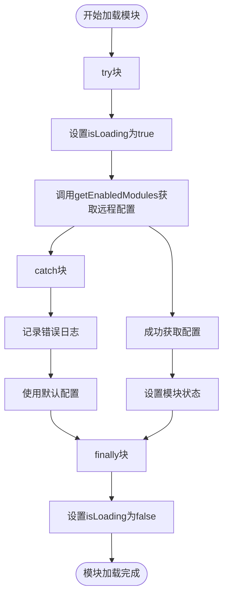
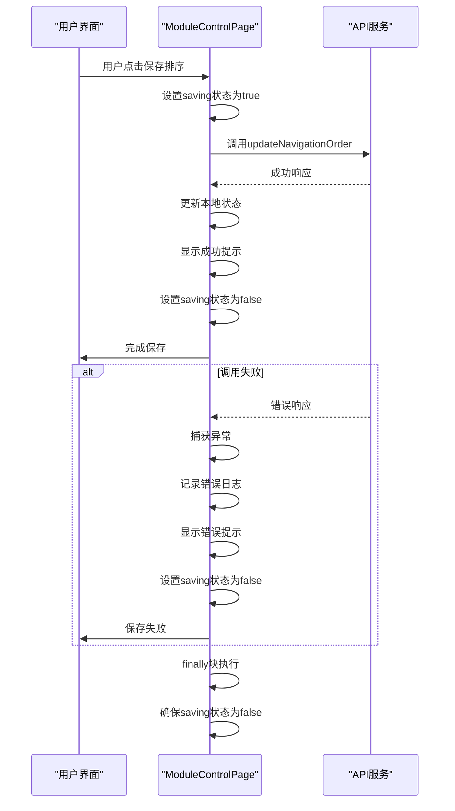
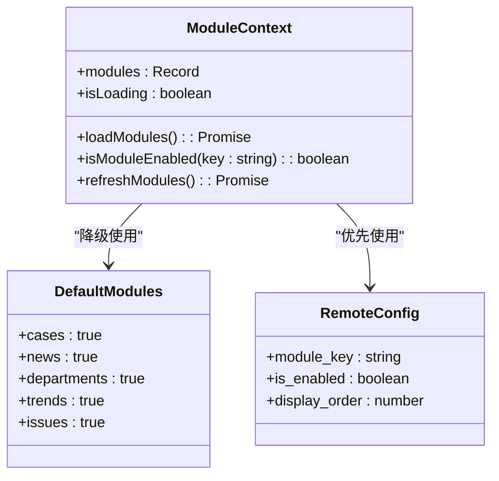

# 异常捕获与降级处理

<cite>
**本文档引用文件**  
- [ModuleContext.tsx](file://src/contexts/ModuleContext.tsx)
- [ModuleControlPage.tsx](file://src/pages/admin/ModuleControlPage.tsx)
- [api.ts](file://src/db/api.ts)
</cite>

## 目录
1. [引言](#引言)
2. [模块加载异常处理](#模块加载异常处理)
3. [API调用失败处理](#api调用失败处理)
4. [降级处理策略](#降级处理策略)
5. [加载状态管理](#加载状态管理)
6. [总结](#总结)

## 引言

本系统在模块控制功能中实现了完善的异常捕获与降级处理机制，确保在获取远程模块配置失败或API调用异常时，系统仍能保持基本功能可用。通过在关键位置使用try-catch-finally结构，系统能够优雅地处理各种异常情况，并提供良好的用户体验。

**Section sources**
- [ModuleContext.tsx](file://src/contexts/ModuleContext.tsx#L1-L20)
- [ModuleControlPage.tsx](file://src/pages/admin/ModuleControlPage.tsx#L1-L20)

## 模块加载异常处理

在`ModuleContext`中，系统通过`loadModules`函数加载模块配置，并使用try-catch结构捕获可能发生的异常：



当`getEnabledModules`调用失败时，系统会捕获异常并记录错误日志，但不会中断程序执行。此时系统会使用预设的默认值，确保所有核心模块（cases、news、departments、trends、issues）都处于启用状态。

```typescript
const loadModules = async () => {
  try {
    setIsLoading(true);
    const enabledModules = await getEnabledModules();
    setModules(enabledModules);
  } catch (error) {
    console.error('加载模块设置失败:', error);
    // 失败时使用默认值（所有模块启用）
  } finally {
    setIsLoading(false);
  }
};
```

**Diagram sources**
- [ModuleContext.tsx](file://src/contexts/ModuleContext.tsx#L23-L34)

**Section sources**
- [ModuleContext.tsx](file://src/contexts/ModuleContext.tsx#L23-L34)

## API调用失败处理

在`ModuleControlPage`中，系统对`updateNavigationOrder`等关键API调用进行了异常捕获处理：



具体实现如下：

```typescript
const handleSaveNavOrder = async () => {
  try {
    setSaving(true);
    await updateNavigationOrder(editedNavModules);
    setNavModules(JSON.parse(JSON.stringify(editedNavModules)));
    toast.success('导航排序保存成功');
  } catch (error) {
    console.error('保存导航排序失败:', error);
    toast.error('保存导航排序失败');
  } finally {
    setSaving(false);
  }
};
```

**Diagram sources**
- [ModuleControlPage.tsx](file://src/pages/admin/ModuleControlPage.tsx#L69-L90)

**Section sources**
- [ModuleControlPage.tsx](file://src/pages/admin/ModuleControlPage.tsx#L69-L90)

## 降级处理策略

系统采用了多层次的降级处理策略，确保在各种异常情况下仍能提供基本服务：

### 默认启用核心模块

当获取远程模块配置失败时，系统会自动启用所有核心模块作为降级策略：



在`getEnabledModules`函数中，当数据库查询失败时，会返回预设的默认值：

```typescript
if (error) {
  console.error('获取启用模块失败:', error);
  // 返回默认值，所有模块都启用
  return {
    cases: true,
    news: true,
    departments: true,
    trends: true,
    issues: true,
  };
}
```

这种设计确保了即使在最坏的情况下，系统的基本功能仍然可用，避免了因配置获取失败而导致整个系统不可用的情况。

**Diagram sources**
- [api.ts](file://src/db/api.ts#L2570-L2587)
- [ModuleContext.tsx](file://src/contexts/ModuleContext.tsx#L20-L21)

**Section sources**
- [api.ts](file://src/db/api.ts#L2570-L2587)

## 加载状态管理

系统通过精心设计的加载状态管理机制，确保用户界面能够准确反映当前的加载状态：

### try-catch-finally模式

在`ModuleContext`中，系统使用try-catch-finally模式来管理加载状态：


关键特性包括：
- **try块**：设置`isLoading`为`true`，开始加载过程
- **catch块**：捕获并处理异常，记录错误日志
- **finally块**：无论成功或失败，都设置`isLoading`为`false`

```typescript
const loadModules = async () => {
  try {
    setIsLoading(true);
    const enabledModules = await getEnabledModules();
    setModules(enabledModules);
  } catch (error) {
    console.error('加载模块设置失败:', error);
  } finally {
    setIsLoading(false);
  }
};
```

### finally块的重要性

`finally`块的使用是加载状态管理的关键，它确保了：
1. **状态一致性**：无论操作成功或失败，`isLoading`都会被正确重置
2. **防止死锁**：避免因异常导致加载状态一直保持为`true`
3. **用户体验**：确保用户界面不会卡在加载状态

这种设计模式也应用于其他需要加载状态管理的场景，如`loadNavigationOrder`函数：

```typescript
const loadNavigationOrder = async () => {
  try {
    setNavLoading(true);
    const data = await getNavigationOrder();
    setNavModules(data);
    setEditedNavModules(JSON.parse(JSON.stringify(data)));
  } catch (error) {
    console.error('加载导航排序失败:', error);
    toast.error('加载导航排序失败');
  } finally {
    setNavLoading(false);
  }
};
```

**Diagram sources**
- [ModuleContext.tsx](file://src/contexts/ModuleContext.tsx#L23-L34)
- [ModuleControlPage.tsx](file://src/pages/admin/ModuleControlPage.tsx#L33-L45)

**Section sources**
- [ModuleContext.tsx](file://src/contexts/ModuleContext.tsx#L23-L34)
- [ModuleControlPage.tsx](file://src/pages/admin/ModuleControlPage.tsx#L33-L45)

## 总结

本系统的异常捕获与降级处理机制体现了以下设计原则：

1. **容错性**：通过try-catch结构捕获异常，防止程序崩溃
2. **可用性**：在失败时使用默认值，确保系统基本功能可用
3. **用户体验**：通过加载状态管理和错误提示，提供良好的用户反馈
4. **健壮性**：使用finally块确保状态一致性，防止状态死锁

这些机制共同确保了系统在面对网络问题、数据库连接失败等异常情况时，仍能保持稳定运行，为用户提供可靠的服务。

**Section sources**
- [ModuleContext.tsx](file://src/contexts/ModuleContext.tsx)
- [ModuleControlPage.tsx](file://src/pages/admin/ModuleControlPage.tsx)
- [api.ts](file://src/db/api.ts)