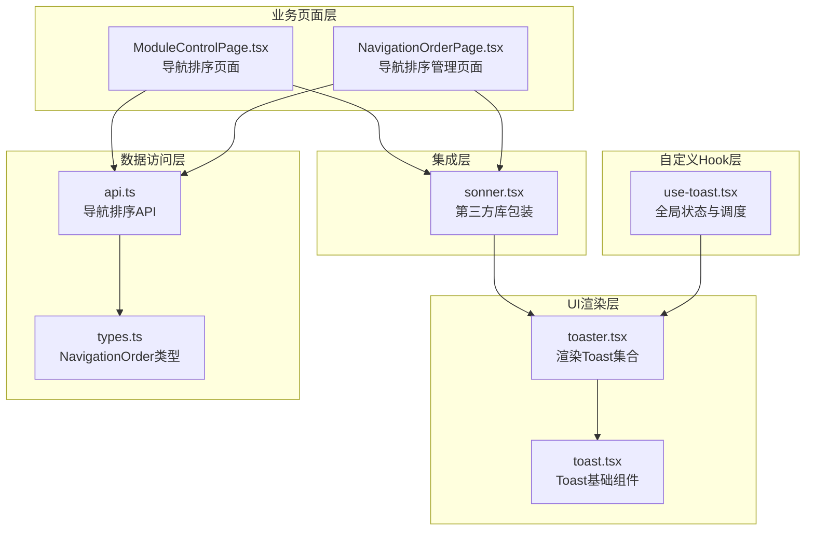
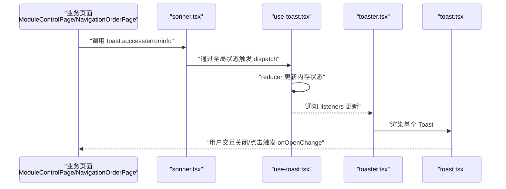
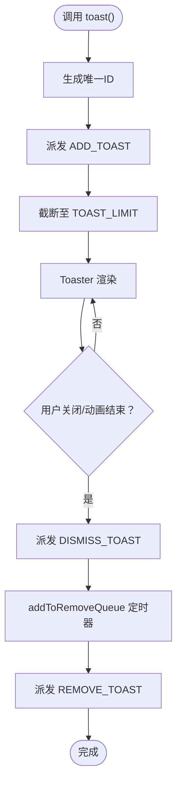
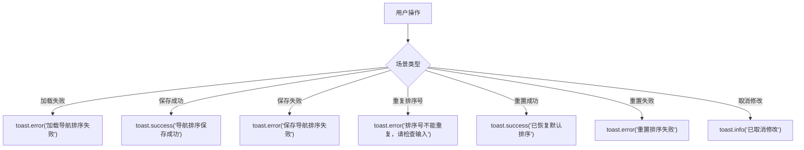
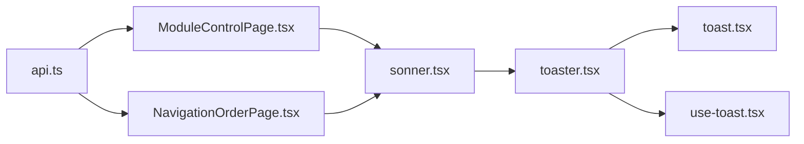

# 用户反馈与通知机制

<cite>
**本文引用的文件**
- [use-toast.tsx](file://src/hooks/use-toast.tsx)
- [sonner.tsx](file://src/components/ui/sonner.tsx)
- [toast.tsx](file://src/components/ui/toast.tsx)
- [toaster.tsx](file://src/components/ui/toaster.tsx)
- [ModuleControlPage.tsx](file://src/pages/admin/ModuleControlPage.tsx)
- [NavigationOrderPage.tsx](file://src/pages/admin/NavigationOrderPage.tsx)
- [api.ts](file://src/db/api.ts)
- [types.ts](file://src/types/types.ts)
</cite>

## 目录
1. [简介](#简介)
2. [项目结构](#项目结构)
3. [核心组件](#核心组件)
4. [架构总览](#架构总览)
5. [详细组件分析](#详细组件分析)
6. [依赖关系分析](#依赖关系分析)
7. [性能考量](#性能考量)
8. [故障排查指南](#故障排查指南)
9. [结论](#结论)

## 简介
本文件系统性地文档化系统中的用户反馈与通知机制，重点围绕基于 sonner 的 toast 组件集成，以及在 ModuleControlPage 中不同操作场景下的通知使用策略。文档还深入解析 use-toast.tsx 中自定义 Hook 的实现原理，包括状态管理、超时队列与动画控制，并说明如何通过 dispatch 模式实现跨组件的通知通信。

## 项目结构
通知体系由三层组成：
- 自定义 Hook 层：use-toast.tsx 提供全局状态与调度能力
- UI 渲染层：toaster.tsx 与 toast.tsx 将状态渲染为可交互的 toast 组件
- 集成层：sonner.tsx 包装第三方库，统一主题与样式
- 业务页面层：ModuleControlPage.tsx 与 NavigationOrderPage.tsx 在用户操作中触发 toast

图表来源
- [use-toast.tsx](file://src/hooks/use-toast.tsx#L1-L189)
- [toaster.tsx](file://src/components/ui/toaster.tsx#L1-L34)
- [toast.tsx](file://src/components/ui/toast.tsx#L1-L130)
- [sonner.tsx](file://src/components/ui/sonner.tsx#L1-L24)
- [ModuleControlPage.tsx](file://src/pages/admin/ModuleControlPage.tsx#L1-L274)
- [NavigationOrderPage.tsx](file://src/pages/admin/NavigationOrderPage.tsx#L1-L200)
- [api.ts](file://src/db/api.ts#L2759-L2848)
- [types.ts](file://src/types/types.ts#L173-L184)

章节来源
- [use-toast.tsx](file://src/hooks/use-toast.tsx#L1-L189)
- [toaster.tsx](file://src/components/ui/toaster.tsx#L1-L34)
- [toast.tsx](file://src/components/ui/toast.tsx#L1-L130)
- [sonner.tsx](file://src/components/ui/sonner.tsx#L1-L24)
- [ModuleControlPage.tsx](file://src/pages/admin/ModuleControlPage.tsx#L1-L274)
- [NavigationOrderPage.tsx](file://src/pages/admin/NavigationOrderPage.tsx#L1-L200)
- [api.ts](file://src/db/api.ts#L2759-L2848)
- [types.ts](file://src/types/types.ts#L173-L184)

## 核心组件
- use-toast.tsx：实现全局 toast 状态与调度，支持添加、更新、关闭与移除 toast，并维护超时队列与内存状态监听。
- toaster.tsx：订阅 useToast 的状态，将 toast 列表渲染为可交互 UI。
- toast.tsx：Radix UI 原子组件封装，提供 Toast、Title、Description、Close 等基础能力。
- sonner.tsx：包装第三方库，注入主题变量，统一外观风格。
- ModuleControlPage.tsx 与 NavigationOrderPage.tsx：在加载、保存、重置、取消等操作中调用 toast，形成一致的用户反馈语义。

章节来源
- [use-toast.tsx](file://src/hooks/use-toast.tsx#L1-L189)
- [toaster.tsx](file://src/components/ui/toaster.tsx#L1-L34)
- [toast.tsx](file://src/components/ui/toast.tsx#L1-L130)
- [sonner.tsx](file://src/components/ui/sonner.tsx#L1-L24)
- [ModuleControlPage.tsx](file://src/pages/admin/ModuleControlPage.tsx#L1-L274)
- [NavigationOrderPage.tsx](file://src/pages/admin/NavigationOrderPage.tsx#L1-L200)

## 架构总览
通知从“业务页面触发”到“全局状态更新”，再到“UI渲染”的完整链路如下：

图表来源
- [ModuleControlPage.tsx](file://src/pages/admin/ModuleControlPage.tsx#L1-L274)
- [NavigationOrderPage.tsx](file://src/pages/admin/NavigationOrderPage.tsx#L1-L200)
- [sonner.tsx](file://src/components/ui/sonner.tsx#L1-L24)
- [use-toast.tsx](file://src/hooks/use-toast.tsx#L1-L189)
- [toaster.tsx](file://src/components/ui/toaster.tsx#L1-L34)
- [toast.tsx](file://src/components/ui/toast.tsx#L1-L130)

## 详细组件分析

### use-toast.tsx：自定义 Hook 实现原理
- 状态模型
  - 内存状态 memoryState：持久持有当前 toast 列表
  - listeners：订阅者数组，用于广播状态变化
  - TOAST_LIMIT：限制同时显示的 toast 数量
  - TOAST_REMOVE_DELAY：toast 自动移除的延迟时间
- 调度与动作
  - ADD_TOAST：向列表头部插入新 toast，并截断至限制数量
  - UPDATE_TOAST：根据 id 合并更新指定 toast
  - DISMISS_TOAST：设置 open=false 并加入移除队列
  - REMOVE_TOAST：从列表中移除指定 id 或清空
- 超时队列与动画控制
  - addToRemoveQueue：为每个 toast 注册定时器，在延迟后触发 REMOVE_TOAST
  - onOpenChange：当 toast 动画关闭时自动 dismiss
- 跨组件通信
  - dispatch：更新内存状态并广播给所有监听者
  - useToast：返回当前状态与 toast 方法，组件通过订阅实现响应式更新

图表来源
- [use-toast.tsx](file://src/hooks/use-toast.tsx#L1-L189)

章节来源
- [use-toast.tsx](file://src/hooks/use-toast.tsx#L1-L189)

### sonner.tsx：第三方库包装与主题注入
- 作用：引入第三方库并注入主题变量，确保 toast 外观与整体主题一致
- 关键点：读取 next-themes 的主题，动态传入 Toaster 组件

章节来源
- [sonner.tsx](file://src/components/ui/sonner.tsx#L1-L24)

### toaster.tsx：状态订阅与渲染
- 作用：订阅 useToast 的状态，遍历 toasts 渲染为可交互的 Toast
- 关键点：使用 Radix Provider/Viewport，组合 Title/Description/Close 等子组件

章节来源
- [toaster.tsx](file://src/components/ui/toaster.tsx#L1-L34)

### toast.tsx：Toast 原子组件
- 作用：提供 Toast、Title、Description、Close 等基础 UI 能力
- 关键点：通过 cva 定义变体，支持默认与破坏性样式

章节来源
- [toast.tsx](file://src/components/ui/toast.tsx#L1-L130)

### ModuleControlPage.tsx：通知使用场景与策略
- 成功场景
  - 保存排序成功：toast.success
  - 重置默认排序：toast.success
- 错误场景
  - 加载失败：toast.error
  - 保存失败：toast.error
  - 重复排序号：toast.error（提供具体校验反馈）
- 警告场景
  - 重复排序号：toast.error（明确指出“排序号不能重复，请检查输入”）
- 中性提示
  - 取消修改：toast.info

图表来源
- [ModuleControlPage.tsx](file://src/pages/admin/ModuleControlPage.tsx#L1-L274)

章节来源
- [ModuleControlPage.tsx](file://src/pages/admin/ModuleControlPage.tsx#L1-L274)

### NavigationOrderPage.tsx：通知使用场景与策略
- 成功场景
  - 可见性更新成功：toast.success
  - 保存排序成功：toast.success
  - 重置默认排序：toast.success
- 错误场景
  - 加载失败：toast.error
  - 更新可见性失败：toast.error
  - 保存失败：toast.error
  - 重置失败：toast.error
- 警告场景
  - 重复排序号：toast.error（提供具体校验反馈）
- 中性提示
  - 取消修改：toast.info

章节来源
- [NavigationOrderPage.tsx](file://src/pages/admin/NavigationOrderPage.tsx#L1-L200)

### 数据访问层与类型定义
- 导航排序 API
  - getNavigationOrder：按 sort_order 升序获取导航模块
  - updateNavigationOrder：批量更新排序与可见性
  - resetNavigationOrder：重置为默认排序
  - updateNavigationVisibility：更新单个模块可见性
- 类型定义
  - NavigationOrder：包含 id、module_key、module_name、route_path、sort_order、is_visible 等字段

章节来源
- [api.ts](file://src/db/api.ts#L2759-L2848)
- [types.ts](file://src/types/types.ts#L173-L184)

## 依赖关系分析
- use-toast.tsx 作为全局状态中心，被 toaster.tsx 订阅
- sonner.tsx 作为第三方库包装，向下提供 Toaster 组件
- ModuleControlPage.tsx 与 NavigationOrderPage.tsx 直接调用 toast（来自第三方库），并通过 use-toast.tsx 的全局调度实现跨组件通信
- 数据访问层通过 api.ts 提供导航排序相关接口，业务页面在异常分支中统一使用 toast.error 提示

图表来源
- [api.ts](file://src/db/api.ts#L2759-L2848)
- [ModuleControlPage.tsx](file://src/pages/admin/ModuleControlPage.tsx#L1-L274)
- [NavigationOrderPage.tsx](file://src/pages/admin/NavigationOrderPage.tsx#L1-L200)
- [sonner.tsx](file://src/components/ui/sonner.tsx#L1-L24)
- [toaster.tsx](file://src/components/ui/toaster.tsx#L1-L34)
- [toast.tsx](file://src/components/ui/toast.tsx#L1-L130)
- [use-toast.tsx](file://src/hooks/use-toast.tsx#L1-L189)

章节来源
- [api.ts](file://src/db/api.ts#L2759-L2848)
- [ModuleControlPage.tsx](file://src/pages/admin/ModuleControlPage.tsx#L1-L274)
- [NavigationOrderPage.tsx](file://src/pages/admin/NavigationOrderPage.tsx#L1-L200)
- [sonner.tsx](file://src/components/ui/sonner.tsx#L1-L24)
- [toaster.tsx](file://src/components/ui/toaster.tsx#L1-L34)
- [toast.tsx](file://src/components/ui/toast.tsx#L1-L130)
- [use-toast.tsx](file://src/hooks/use-toast.tsx#L1-L189)

## 性能考量
- 状态与渲染解耦：use-toast.tsx 以纯函数 reducer 管理状态，toaster.tsx 仅负责渲染，避免不必要的重渲染
- 超时队列：通过 Map 存储每个 toast 的定时器，避免重复注册与泄漏
- 限制显示数量：TOAST_LIMIT 控制同时显示的 toast 数量，降低 UI 压力
- 动画与交互：onOpenChange 与自动移除结合，减少手动关闭成本

## 故障排查指南
- toast 不显示
  - 检查是否正确引入并挂载 Toaster 组件
  - 确认 useToast 的订阅是否生效
- toast 无法自动消失
  - 检查 TOAST_REMOVE_DELAY 是否被覆盖
  - 确认 addToRemoveQueue 是否被调用
- 多个 toast 互相覆盖
  - 检查 TOAST_LIMIT 设置
  - 确认是否需要扩展限制或合并提示
- 主题不一致
  - 检查 sonner.tsx 的主题注入逻辑
  - 确认 next-themes 的主题状态

章节来源
- [use-toast.tsx](file://src/hooks/use-toast.tsx#L1-L189)
- [toaster.tsx](file://src/components/ui/toaster.tsx#L1-L34)
- [sonner.tsx](file://src/components/ui/sonner.tsx#L1-L24)

## 结论
本通知体系通过 use-toast.tsx 的全局状态与调度，结合 sonner.tsx 的主题化包装与 toaster.tsx 的渲染，实现了跨组件的一致反馈体验。在 ModuleControlPage 与 NavigationOrderPage 中，根据不同操作场景采用 success/error/info 的语义化提示，配合具体的校验反馈，提升了用户对操作结果的理解与信心。建议在后续迭代中进一步完善 toast 的可定制性与国际化支持，以适配更复杂的业务场景。