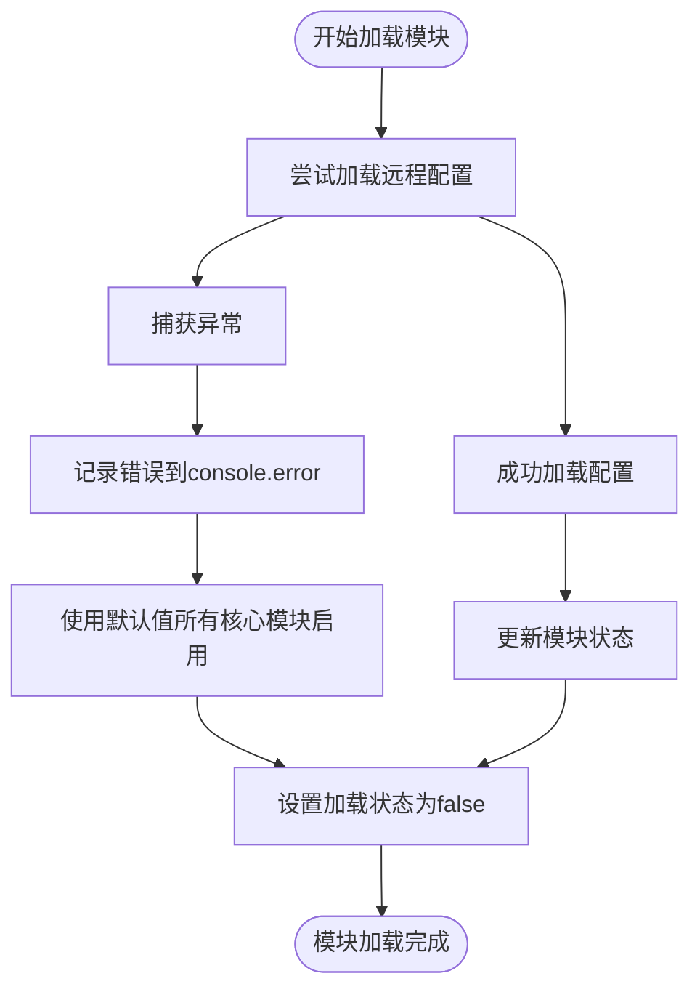
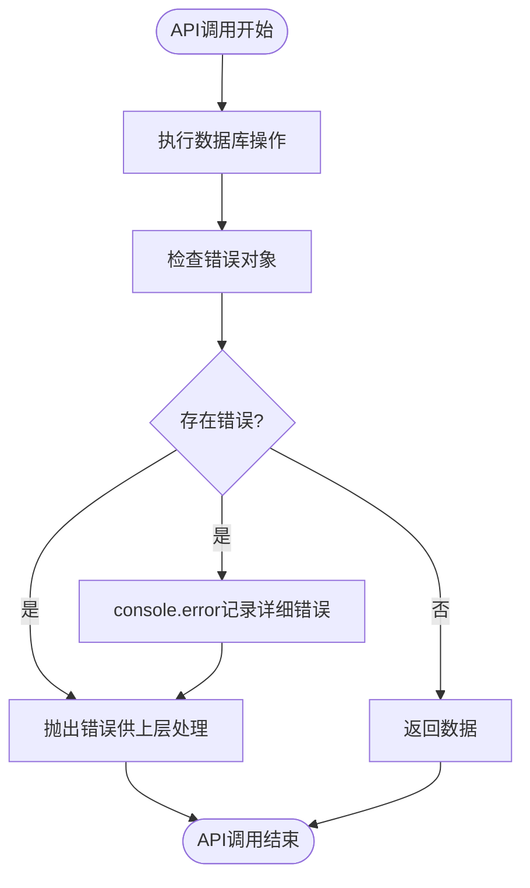
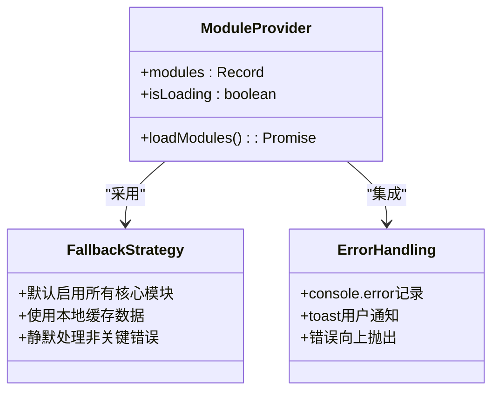
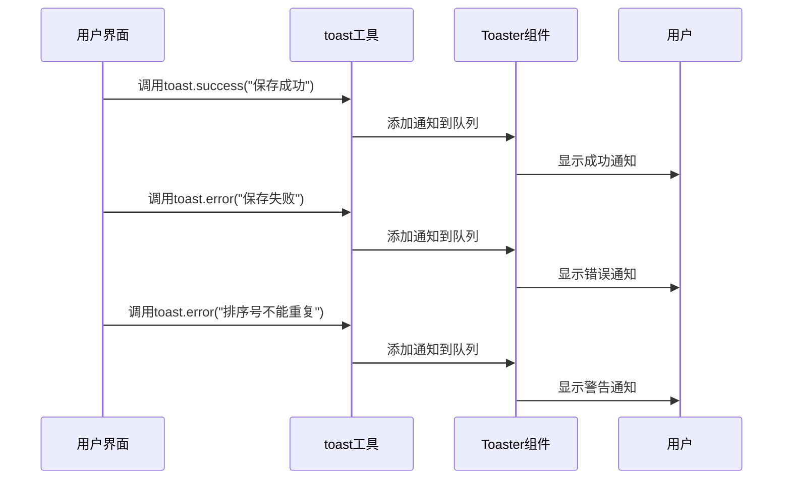
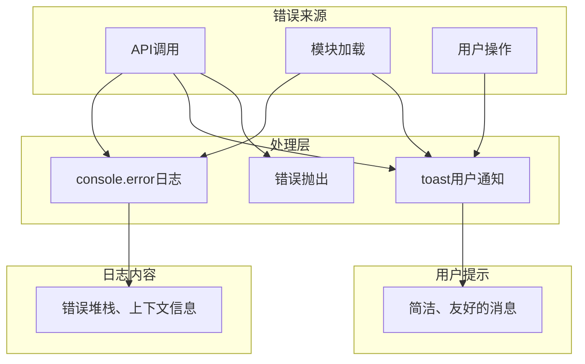

# 错误处理与用户反馈

<cite>
**本文档引用文件**   
- [ModuleContext.tsx](file://src/contexts/ModuleContext.tsx)
- [use-toast.tsx](file://src/hooks/use-toast.tsx)
- [toast.tsx](file://src/components/ui/toast.tsx)
- [toaster.tsx](file://src/components/ui/toaster.tsx)
- [api.ts](file://src/db/api.ts)
- [NavigationOrderPage.tsx](file://src/pages/admin/NavigationOrderPage.tsx)
- [ModuleControlPage.tsx](file://src/pages/admin/ModuleControlPage.tsx)
- [HomeConfigPage.tsx](file://src/pages/admin/HomeConfigPage.tsx)
</cite>

## 目录
1. [简介](#简介)
2. [模块加载错误处理](#模块加载错误处理)
3. [API调用失败处理](#api调用失败处理)
4. [降级处理方案](#降级处理方案)
5. [用户界面通知机制](#用户界面通知机制)
6. [日志记录与用户提示分层](#日志记录与用户提示分层)

## 简介
本系统实现了完善的错误处理与用户反馈机制，重点覆盖模块加载、API调用失败等关键场景。系统采用分层处理策略，结合控制台日志记录与用户友好的界面通知，确保在异常情况下既能提供开发调试信息，又能给予用户清晰的操作反馈。核心机制包括异常捕获、降级处理和toast通知集成。

## 模块加载错误处理
系统在初始化时通过`loadModules`函数加载远程模块配置，该过程包含完整的异常捕获策略。

**代码流程说明**：
- 在`ModuleContext.tsx`中，`loadModules`函数使用try-catch块包裹异步操作
- 当获取远程模块配置失败时，系统会捕获异常并记录到控制台
- 采用容错设计，失败时默认启用所有核心模块（cases, news, departments, trends, issues）
- 无论成功或失败，最终都会将`isLoading`状态设置为false，确保UI能正确反映加载状态

**Section sources**
- [ModuleContext.tsx](file://src/contexts/ModuleContext.tsx#L23-L33)

## API调用失败处理
所有API调用均采用统一的错误处理模式，确保异常情况得到妥善处理。

**处理特点**：
- 每个API函数在await操作后立即检查error对象
- 使用`throw error`将错误向上抛出，由调用方决定如何处理
- 在关键操作中（如搜索案例），会额外使用`console.error`记录上下文信息
- 对于非关键操作（如创建部门失败），采用静默处理策略，避免中断主流程

**Section sources**
- [api.ts](file://src/db/api.ts#L28-L29)
- [api.ts](file://src/db/api.ts#L446-L449)

## 降级处理方案
当系统关键功能出现故障时，采用预设的降级策略确保核心功能可用。

**降级策略实现**：
- **模块配置降级**：当无法获取远程模块配置时，默认启用所有核心模块
- **数据访问降级**：在智能导入功能中，即使部门或平台创建失败，也会继续处理其他数据
- **用户界面降级**：在管理页面中，即使加载失败，也会显示错误通知而非空白页面

**Diagram sources**
- [ModuleContext.tsx](file://src/contexts/ModuleContext.tsx#L14-L20)
- [ModuleContext.tsx](file://src/contexts/ModuleContext.tsx#L28-L31)

**Section sources**
- [ModuleContext.tsx](file://src/contexts/ModuleContext.tsx#L23-L33)
- [api.ts](file://src/db/api.ts#L800-L823)

## 用户界面通知机制
系统通过toast组件向用户提供操作反馈，集成于`sonner`通知库。

**通知场景**：
- **成功提示**：在`ModuleControlPage.tsx`和`NavigationOrderPage.tsx`中，保存成功时显示"导航排序保存成功"
- **错误提示**：API调用失败时显示"加载导航排序失败"或"保存导航排序失败"
- **警告提示**：在`NavigationOrderPage.tsx`中，检测到重复排序号时显示"排序号不能重复，请检查输入"

**Diagram sources**
- [NavigationOrderPage.tsx](file://src/pages/admin/NavigationOrderPage.tsx#L34)
- [NavigationOrderPage.tsx](file://src/pages/admin/NavigationOrderPage.tsx#L92)
- [NavigationOrderPage.tsx](file://src/pages/admin/NavigationOrderPage.tsx#L79)

**Section sources**
- [NavigationOrderPage.tsx](file://src/pages/admin/NavigationOrderPage.tsx#L9-L10)
- [ModuleControlPage.tsx](file://src/pages/admin/ModuleControlPage.tsx#L9-L10)

## 日志记录与用户提示分层
系统采用分层处理原则，区分开发日志与用户提示。

**分层原则**：
- **console.error日志**：记录详细的错误信息，包括堆栈跟踪和上下文，仅供开发人员调试使用
- **toast用户提示**：提供简洁、友好的消息，避免技术术语，指导用户下一步操作
- **错误抛出**：在适当层级抛出错误，由上层组件决定是否显示用户通知
- **静默处理**：对于不影响主流程的次要错误，仅记录日志而不打扰用户

**Section sources**
- [ModuleContext.tsx](file://src/contexts/ModuleContext.tsx#L29)
- [NavigationOrderPage.tsx](file://src/pages/admin/NavigationOrderPage.tsx#L34)
- [HomeConfigPage.tsx](file://src/pages/admin/HomeConfigPage.tsx#L388-L389)