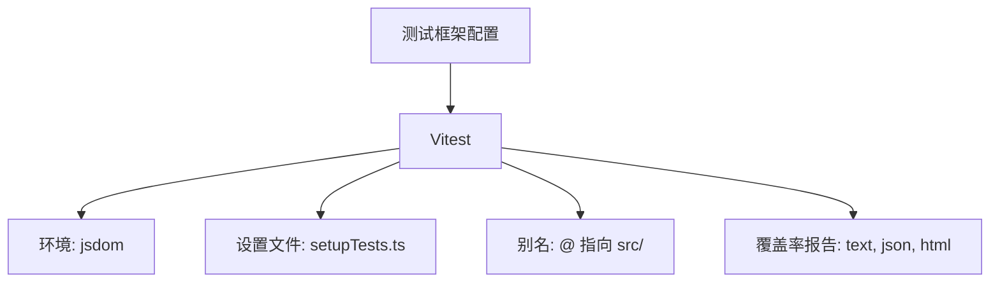
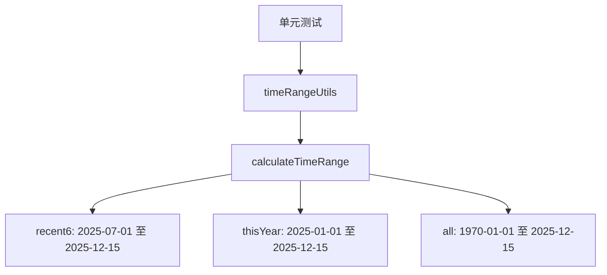
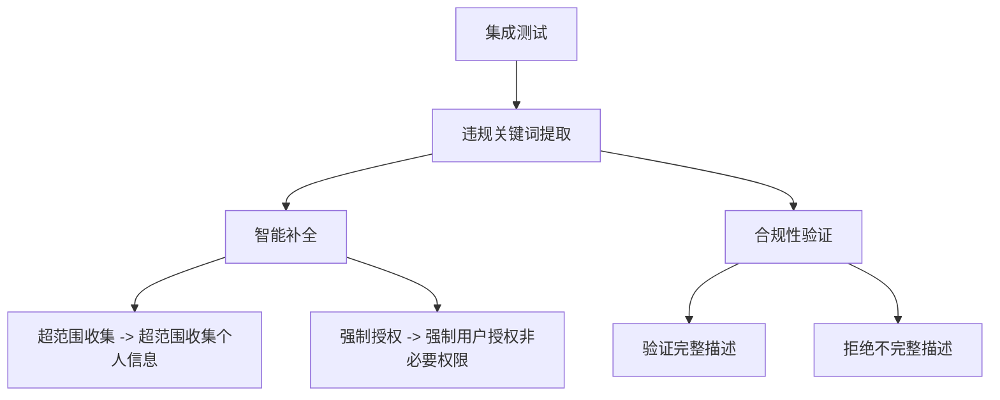
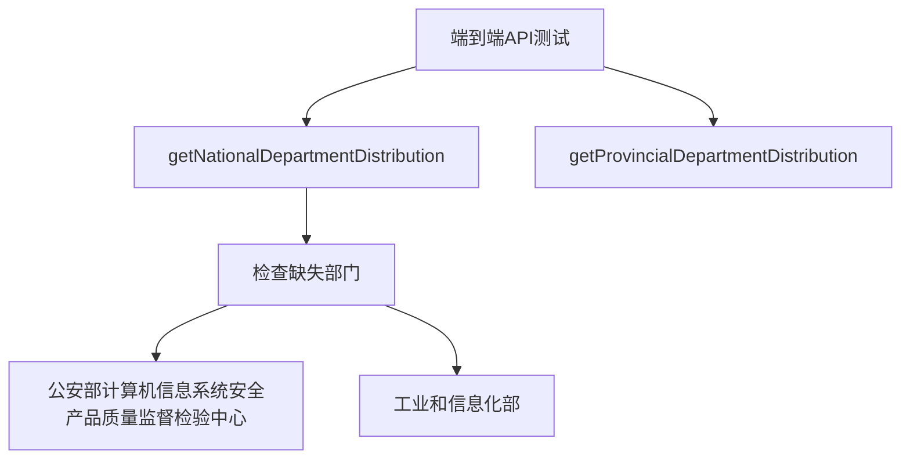
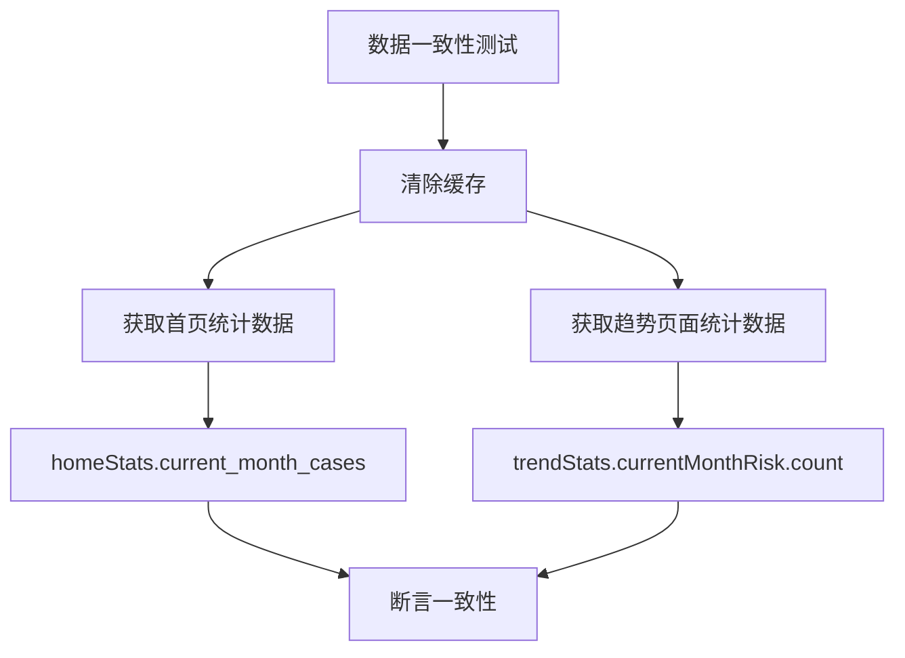
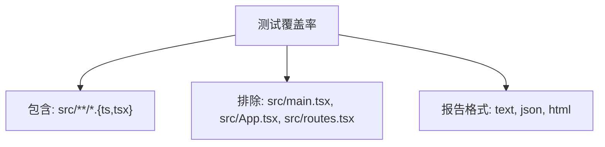
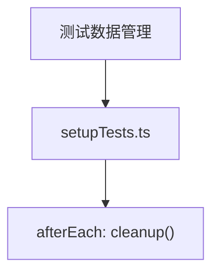

# 测试策略

<cite>
**本文档引用的文件**   
- [vitest.config.ts](file://vitest.config.ts)
- [test-api.ts](file://test-api.ts)
- [test-data-integrity.ts](file://test-data-integrity.ts)
- [src/setupTests.ts](file://src/setupTests.ts)
- [src/db/consistency.test.ts](file://src/db/consistency.test.ts)
- [src/db/extractViolationKeywords.test.ts](file://src/db/extractViolationKeywords.test.ts)
- [src/utils/__tests__/timeRangeUtils.test.ts](file://src/utils/__tests__/timeRangeUtils.test.ts)
- [src/db/api.ts](file://src/db/api.ts)
- [src/db/api-optimized.ts](file://src/db/api-optimized.ts)
- [src/db/compliance_rules.ts](file://src/db/compliance_rules.ts)
- [package.json](file://package.json)
</cite>

## 目录
1. [简介](#简介)
2. [测试框架配置](#测试框架配置)
3. [单元测试与集成测试](#单元测试与集成测试)
4. [端到端API测试](#端到端api测试)
5. [数据一致性验证](#数据一致性验证)
6. [测试覆盖率分析](#测试覆盖率分析)
7. [测试数据管理](#测试数据管理)
8. [结论](#结论)

## 简介
本测试策略文档详细说明了项目中实施的全面测试方案。文档涵盖了Vitest测试框架的配置、单元测试和集成测试的组织结构、端到端API测试的实现方法、数据一致性测试的验证逻辑，以及测试覆盖率报告的生成和分析。通过这些测试策略，确保核心业务逻辑的正确性和数据的完整性。

## 测试框架配置

项目采用Vitest作为主要的测试框架，配置了JS DOM环境以支持前端组件测试。测试配置文件`vitest.config.ts`中定义了测试环境、设置文件和代码覆盖率报告的生成方式。

**图示来源**
- [vitest.config.ts](file://vitest.config.ts#L1-L27)

**本节来源**
- [vitest.config.ts](file://vitest.config.ts#L1-L27)

## 单元测试与集成测试

### 单元测试
单元测试主要针对独立的函数和工具进行验证。例如，`timeRangeUtils.test.ts`文件中的测试用例验证了时间范围计算函数的正确性，包括最近6个月、本年度和所有时间范围的计算。

**图示来源**
- [src/utils/__tests__/timeRangeUtils.test.ts](file://src/utils/__tests__/timeRangeUtils.test.ts#L1-L90)

### 集成测试
集成测试验证多个组件或模块之间的交互。`extractViolationKeywords.test.ts`文件中的测试用例验证了违规关键词提取和合规性检查的集成逻辑，包括智能补全、标准化和验证。

**图示来源**
- [src/db/extractViolationKeywords.test.ts](file://src/db/extractViolationKeywords.test.ts#L1-L75)

**本节来源**
- [src/utils/__tests__/timeRangeUtils.test.ts](file://src/utils/__tests__/timeRangeUtils.test.ts#L1-L90)
- [src/db/extractViolationKeywords.test.ts](file://src/db/extractViolationKeywords.test.ts#L1-L75)

## 端到端API测试

端到端API测试通过`test-api.ts`文件实现，验证了API函数的正确性和数据完整性。测试用例包括获取国家级和省级部门分布数据，并检查是否包含缺失的部门。

**图示来源**
- [test-api.ts](file://test-api.ts#L1-L31)

**本节来源**
- [test-api.ts](file://test-api.ts#L1-L31)

## 数据一致性验证

数据一致性测试通过`consistency.test.ts`文件实现，验证了不同数据源之间的数据一致性。测试用例包括首页和趋势页面的当前月案例数一致性检查。

**图示来源**
- [src/db/consistency.test.ts](file://src/db/consistency.test.ts#L1-L24)

**本节来源**
- [src/db/consistency.test.ts](file://src/db/consistency.test.ts#L1-L24)

## 测试覆盖率分析

测试覆盖率报告通过Vitest的覆盖率功能生成，配置了包含和排除的文件路径。覆盖率报告包括文本、JSON和HTML格式，帮助分析核心业务逻辑的测试覆盖情况。

**图示来源**
- [vitest.config.ts](file://vitest.config.ts#L14-L19)

**本节来源**
- [vitest.config.ts](file://vitest.config.ts#L14-L19)

## 测试数据管理

测试数据的准备和清理策略通过`setupTests.ts`文件实现，确保每次测试后清理DOM，避免测试之间的相互影响。

**图示来源**
- [src/setupTests.ts](file://src/setupTests.ts#L1-L9)

**本节来源**
- [src/setupTests.ts](file://src/setupTests.ts#L1-L9)

## 结论
通过全面的测试策略，项目确保了核心业务逻辑的正确性和数据的完整性。Vitest测试框架的配置和运行方式支持了单元测试、集成测试和端到端API测试的组织结构。数据一致性测试和覆盖率分析进一步增强了代码的质量和可靠性。测试数据的准备和清理策略确保了测试的独立性和可重复性。