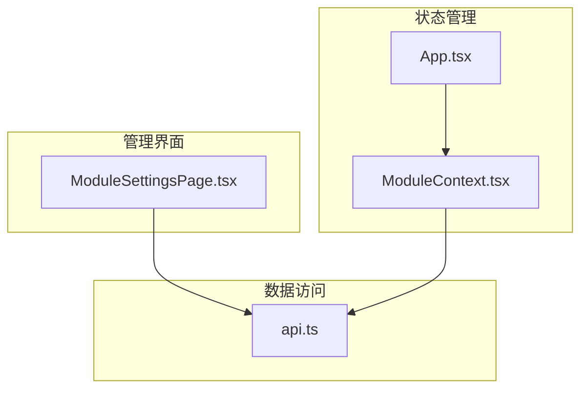
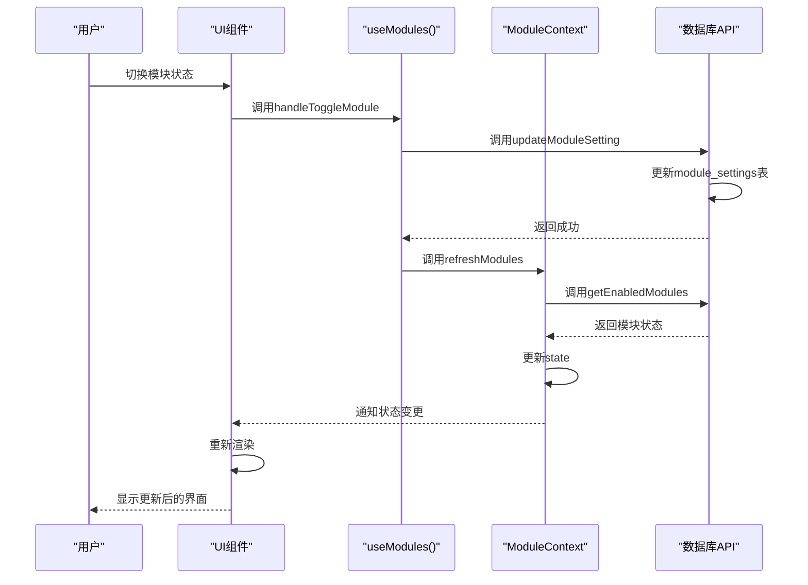
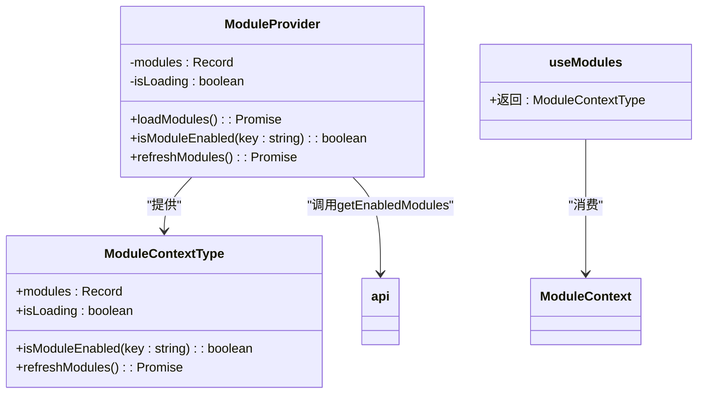
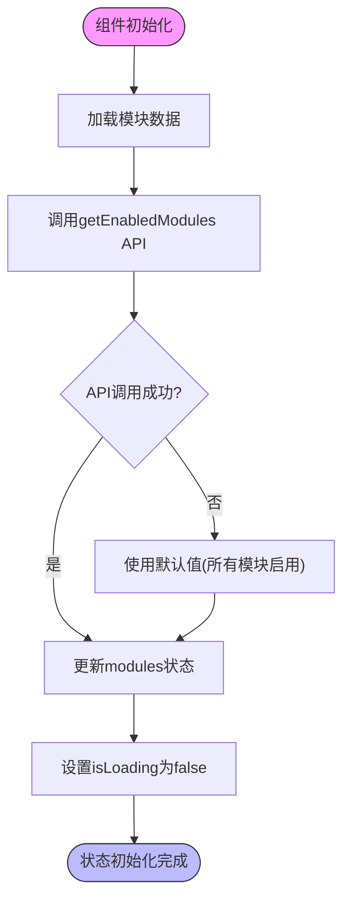
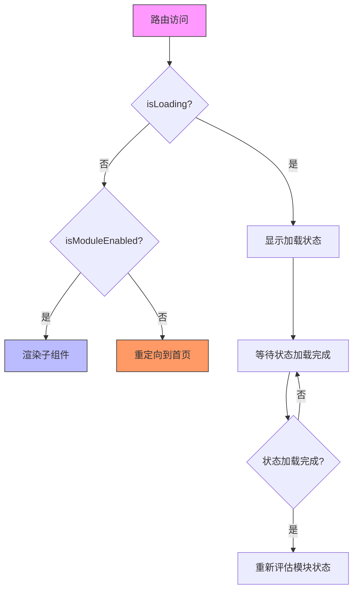
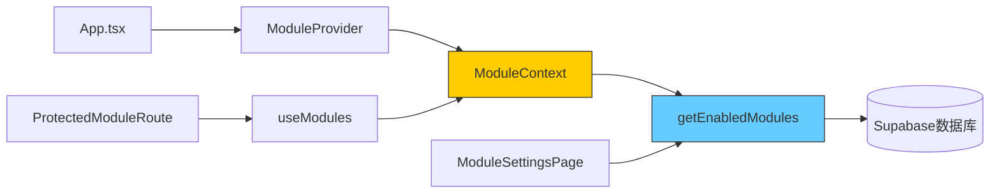

# 状态管理

<cite>
**本文档引用的文件**   
- [ModuleContext.tsx](file://src/contexts/ModuleContext.tsx)
- [App.tsx](file://src/App.tsx)
- [ModuleSettingsPage.tsx](file://src/pages/admin/ModuleSettingsPage.tsx)
- [ProtectedModuleRoute.tsx](file://src/components/common/ProtectedModuleRoute.tsx)
- [api.ts](file://src/db/api.ts)
</cite>

## 目录
1. [简介](#简介)
2. [项目结构](#项目结构)
3. [核心组件](#核心组件)
4. [架构概述](#架构概述)
5. [详细组件分析](#详细组件分析)
6. [依赖分析](#依赖分析)
7. [性能考虑](#性能考虑)
8. [故障排除指南](#故障排除指南)
9. [结论](#结论)
10. [附录](#附录)（如有必要）

## 简介
本文档详细说明了React Context在模块控制中的应用，重点介绍ModuleContext的结构设计、状态管理机制和性能优化策略。该系统通过React Context API实现了模块启用状态、权限信息和配置数据的集中管理，为整个应用提供了统一的状态管理解决方案。

## 项目结构
项目采用标准的React应用结构，状态管理相关文件位于`src/contexts`目录下。核心的ModuleContext实现位于`ModuleContext.tsx`文件中，通过Provider模式封装并提供给整个应用使用。

**图表来源**
- [ModuleContext.tsx](file://src/contexts/ModuleContext.tsx#L1-L61)
- [App.tsx](file://src/App.tsx#L1-L33)
- [api.ts](file://src/db/api.ts#L2570-L2596)

**章节来源**
- [ModuleContext.tsx](file://src/contexts/ModuleContext.tsx#L1-L61)
- [App.tsx](file://src/App.tsx#L1-L33)

## 核心组件
ModuleContext是应用的核心状态管理组件，负责管理模块的启用状态、权限信息和配置数据。它通过React的Context API实现了跨组件层级的状态传递，避免了繁琐的props逐层传递。

**章节来源**
- [ModuleContext.tsx](file://src/contexts/ModuleContext.tsx#L1-L61)

## 架构概述
ModuleContext采用Provider模式封装状态，通过useContext Hook在组件树中传递状态。整个数据流从用户操作开始，经过状态更新，最终触发UI重新渲染。

**图表来源**
- [ModuleContext.tsx](file://src/contexts/ModuleContext.tsx#L1-L61)
- [ModuleSettingsPage.tsx](file://src/pages/admin/ModuleSettingsPage.tsx#L1-L167)
- [api.ts](file://src/db/api.ts#L2570-L2596)

## 详细组件分析
### ModuleContext分析
ModuleContext组件实现了完整的状态管理解决方案，包括状态定义、Provider封装和自定义Hook。

#### 类图

**图表来源**
- [ModuleContext.tsx](file://src/contexts/ModuleContext.tsx#L4-L9)

#### 状态管理流程

**图表来源**
- [ModuleContext.tsx](file://src/contexts/ModuleContext.tsx#L23-L34)

**章节来源**
- [ModuleContext.tsx](file://src/contexts/ModuleContext.tsx#L1-L61)

### 受保护路由分析
ProtectedModuleRoute组件利用ModuleContext实现路由级别的模块控制，确保未启用的模块无法被访问。

#### 路由控制流程

**图表来源**
- [ProtectedModuleRoute.tsx](file://src/components/common/ProtectedModuleRoute.tsx#L1-L28)

**章节来源**
- [ProtectedModuleRoute.tsx](file://src/components/common/ProtectedModuleRoute.tsx#L1-L28)

## 依赖分析
ModuleContext与其他组件和模块存在明确的依赖关系，形成了清晰的架构层次。

**图表来源**
- [App.tsx](file://src/App.tsx#L11)
- [ModuleContext.tsx](file://src/contexts/ModuleContext.tsx#L2)
- [ProtectedModuleRoute.tsx](file://src/components/common/ProtectedModuleRoute.tsx#L3)

**章节来源**
- [ModuleContext.tsx](file://src/contexts/ModuleContext.tsx#L1-L61)
- [App.tsx](file://src/App.tsx#L1-L33)

## 性能考虑
为了优化ModuleContext的性能，避免不必要的重新渲染，建议采用以下策略：

1. **使用useMemo优化Context值**：将Context提供的值用useMemo包裹，避免每次渲染都创建新对象
2. **拆分Context**：如果状态过于复杂，考虑拆分为多个专用的Context
3. **避免在Provider中传递过多数据**：只传递组件真正需要的数据
4. **使用React.memo优化子组件**：防止不必要的子组件重新渲染

虽然当前实现中未显式使用useMemo，但可以通过重构进一步优化性能。

## 故障排除指南
当遇到ModuleContext相关问题时，可以按照以下步骤进行排查：

1. **检查Provider封装**：确保App根组件正确包裹了ModuleProvider
2. **验证Hook使用位置**：确认useModules Hook在ModuleProvider内部使用
3. **检查API连接**：验证getEnabledModules API是否能正常返回数据
4. **查看默认值逻辑**：当API调用失败时，系统会使用默认值（所有模块启用）

**章节来源**
- [ModuleContext.tsx](file://src/contexts/ModuleContext.tsx#L29-L31)
- [App.tsx](file://src/App.tsx#L11)

## 结论
ModuleContext提供了一个完整的模块状态管理解决方案，通过React Context API实现了跨组件的状态共享。该设计模式有效地解决了props逐层传递的问题，为应用的模块化控制提供了灵活的基础设施。通过合理的性能优化策略，可以进一步提升应用的响应速度和用户体验。