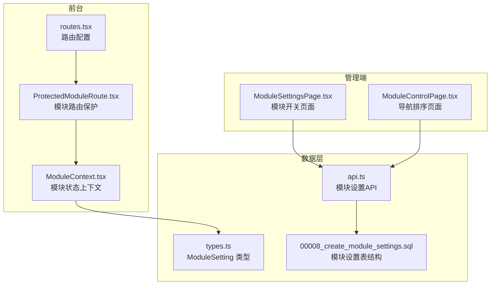
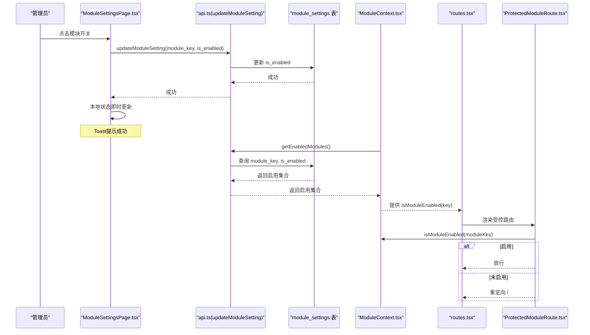
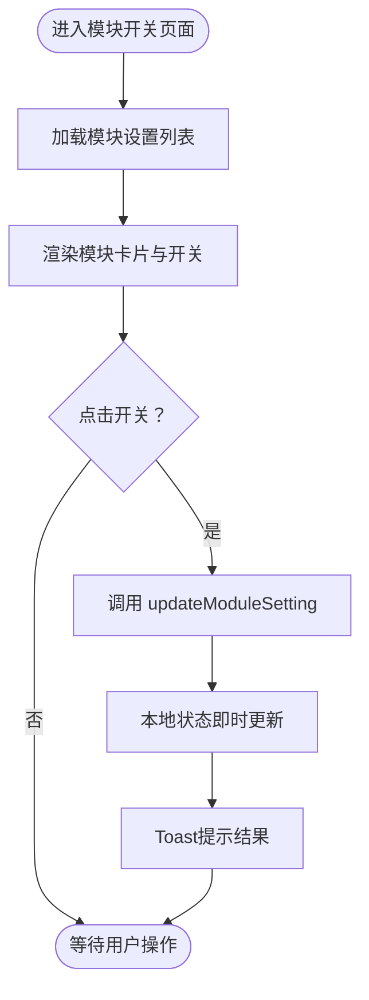
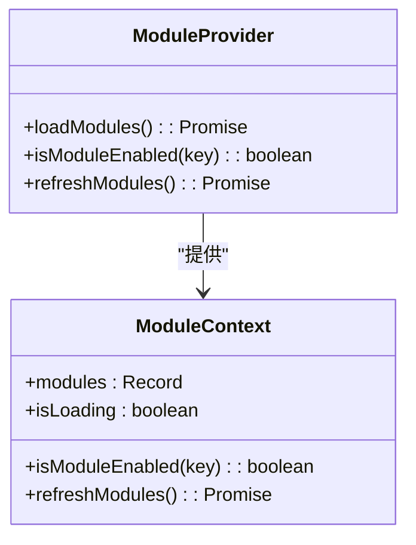
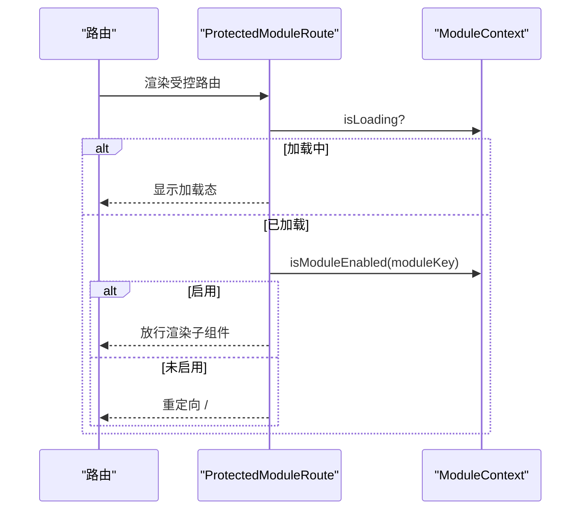
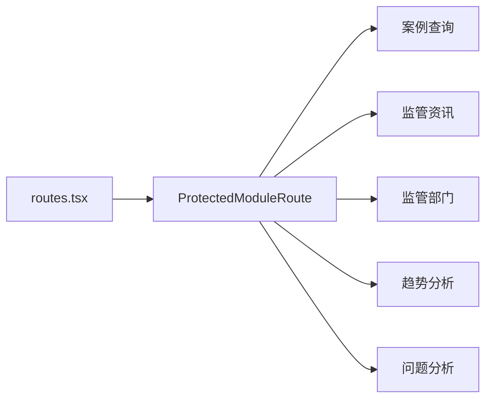
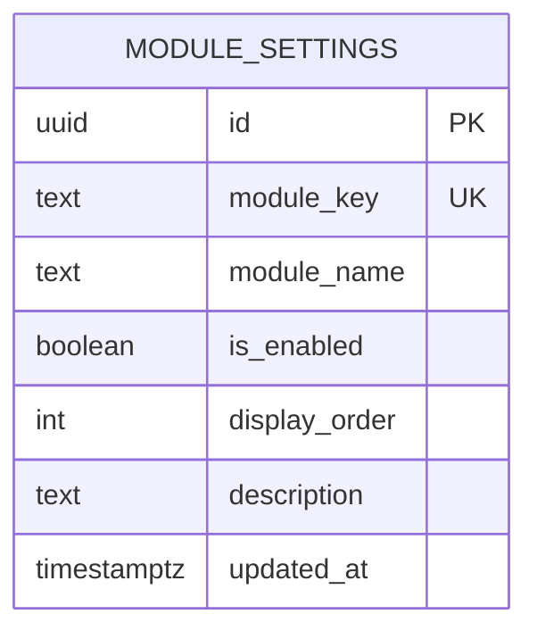
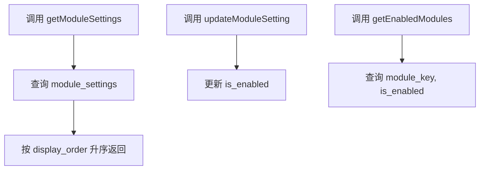
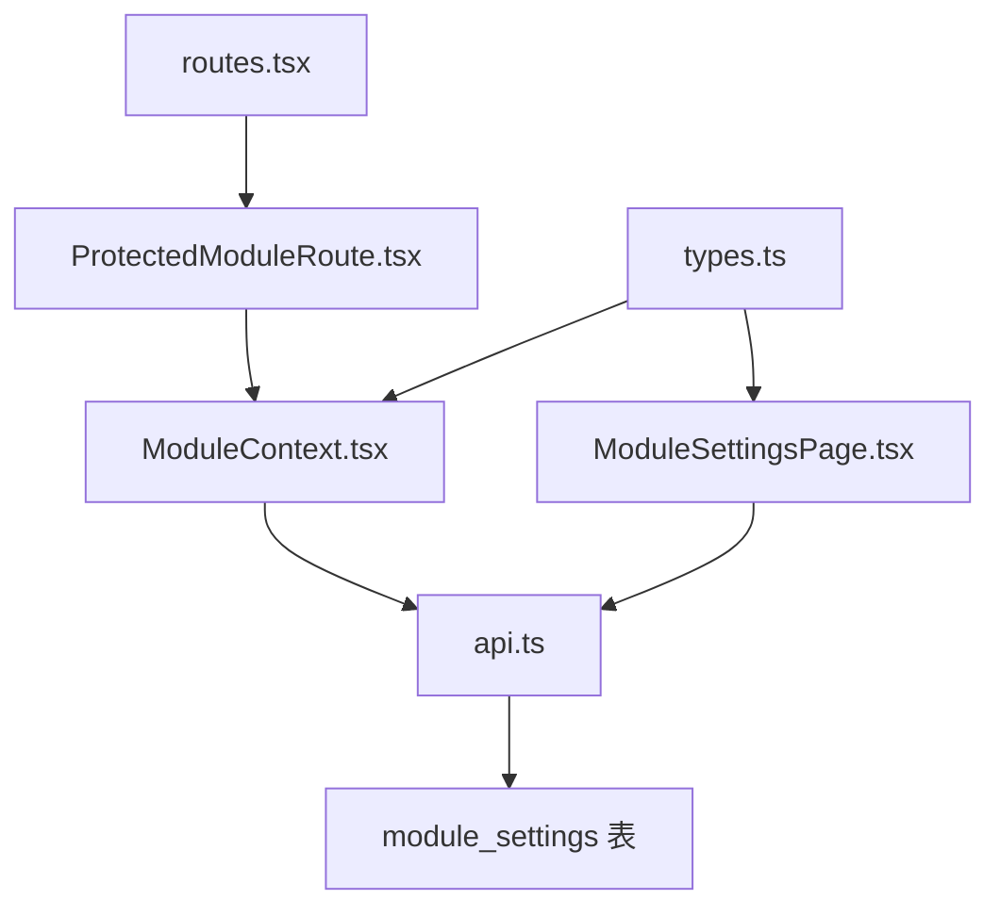

# 模块控制

<cite>
**本文引用的文件**
- [ModuleSettingsPage.tsx](file://src/pages/admin/ModuleSettingsPage.tsx)
- [ModuleContext.tsx](file://src/contexts/ModuleContext.tsx)
- [ProtectedModuleRoute.tsx](file://src/components/common/ProtectedModuleRoute.tsx)
- [routes.tsx](file://src/routes.tsx)
- [api.ts](file://src/db/api.ts)
- [types.ts](file://src/types/types.ts)
- [00008_create_module_settings.sql](file://supabase/migrations/00008_create_module_settings.sql)
- [ModuleControlPage.tsx](file://src/pages/admin/ModuleControlPage.tsx)
- [NavigationOrderPage.tsx](file://src/pages/admin/NavigationOrderPage.tsx)
</cite>

## 目录
1. [简介](#简介)
2. [项目结构](#项目结构)
3. [核心组件](#核心组件)
4. [架构总览](#架构总览)
5. [详细组件分析](#详细组件分析)
6. [依赖关系分析](#依赖关系分析)
7. [性能考量](#性能考量)
8. [故障排查指南](#故障排查指南)
9. [结论](#结论)
10. [附录](#附录)

## 简介
本文件围绕“模块控制”功能，系统性阐述模块开关的界面布局、交互逻辑、数据库设计与实时生效机制，并说明模块状态如何通过全局上下文在前台导航菜单与功能模块中同步生效。同时给出可控制模块清单、批量操作思路与使用场景，以及与导航排序页面的协同关系。

## 项目结构
模块控制涉及以下关键文件：
- 管理端页面：模块开关页面、导航排序页面
- 前台路由保护：受控模块路由包装
- 全局上下文：模块状态缓存与刷新
- 数据层：模块设置表与API接口
- 类型定义：模块设置的数据模型

**图表来源**
- [ModuleSettingsPage.tsx](file://src/pages/admin/ModuleSettingsPage.tsx#L1-L167)
- [ModuleControlPage.tsx](file://src/pages/admin/ModuleControlPage.tsx#L1-L274)
- [routes.tsx](file://src/routes.tsx#L1-L207)
- [ProtectedModuleRoute.tsx](file://src/components/common/ProtectedModuleRoute.tsx#L1-L28)
- [ModuleContext.tsx](file://src/contexts/ModuleContext.tsx#L1-L62)
- [api.ts](file://src/db/api.ts#L2530-L2577)
- [types.ts](file://src/types/types.ts#L81-L89)
- [00008_create_module_settings.sql](file://supabase/migrations/00008_create_module_settings.sql#L1-L78)

**章节来源**
- [ModuleSettingsPage.tsx](file://src/pages/admin/ModuleSettingsPage.tsx#L1-L167)
- [ModuleContext.tsx](file://src/contexts/ModuleContext.tsx#L1-L62)
- [ProtectedModuleRoute.tsx](file://src/components/common/ProtectedModuleRoute.tsx#L1-L28)
- [routes.tsx](file://src/routes.tsx#L1-L207)
- [api.ts](file://src/db/api.ts#L2530-L2577)
- [types.ts](file://src/types/types.ts#L81-L89)
- [00008_create_module_settings.sql](file://supabase/migrations/00008_create_module_settings.sql#L1-L78)

## 核心组件
- 模块开关页面：提供模块列表、开关切换、状态反馈与加载态
- 模块上下文：拉取启用模块集合，提供判断与刷新能力
- 路由保护组件：根据模块状态决定是否放行
- 路由配置：为各模块挂载受控路由
- 数据API：提供模块设置的读取与更新
- 数据库表：模块设置表，含模块键、启用状态、显示顺序等字段

**章节来源**
- [ModuleSettingsPage.tsx](file://src/pages/admin/ModuleSettingsPage.tsx#L1-L167)
- [ModuleContext.tsx](file://src/contexts/ModuleContext.tsx#L1-L62)
- [ProtectedModuleRoute.tsx](file://src/components/common/ProtectedModuleRoute.tsx#L1-L28)
- [routes.tsx](file://src/routes.tsx#L1-L207)
- [api.ts](file://src/db/api.ts#L2530-L2577)
- [00008_create_module_settings.sql](file://supabase/migrations/00008_create_module_settings.sql#L1-L78)

## 架构总览
模块控制的端到端流程如下：
- 管理端：管理员在模块开关页面点击开关，调用API更新数据库中的模块启用状态，同时本地即时更新UI状态
- 前台：应用启动时加载启用模块集合；路由访问时通过受控路由包装进行模块状态校验，未启用则重定向至首页
- 数据库：模块设置表包含模块键、启用状态、显示顺序等字段，提供索引与触发器保证一致性

**图表来源**
- [ModuleSettingsPage.tsx](file://src/pages/admin/ModuleSettingsPage.tsx#L35-L63)
- [api.ts](file://src/db/api.ts#L2555-L2565)
- [00008_create_module_settings.sql](file://supabase/migrations/00008_create_module_settings.sql#L30-L78)
- [ModuleContext.tsx](file://src/contexts/ModuleContext.tsx#L23-L46)
- [routes.tsx](file://src/routes.tsx#L40-L109)
- [ProtectedModuleRoute.tsx](file://src/components/common/ProtectedModuleRoute.tsx#L10-L27)

## 详细组件分析

### 模块开关页面（ModuleSettingsPage）
- 加载与渲染
  - 首次加载时调用API获取模块设置列表，按显示顺序排序
  - 每个模块卡片展示模块名称、键、描述、当前状态与开关
- 交互逻辑
  - 点击开关触发状态翻转
  - 调用API更新数据库中的启用状态
  - 本地即时更新UI状态，避免等待网络响应
  - 提供加载态与错误提示
- 实时生效
  - 数据库更新成功后，本地状态立即反映在UI
  - 前台通过模块上下文拉取启用集合，从而影响路由保护与导航显示

**图表来源**
- [ModuleSettingsPage.tsx](file://src/pages/admin/ModuleSettingsPage.tsx#L22-L63)

**章节来源**
- [ModuleSettingsPage.tsx](file://src/pages/admin/ModuleSettingsPage.tsx#L1-L167)
- [api.ts](file://src/db/api.ts#L2536-L2565)
- [types.ts](file://src/types/types.ts#L81-L89)

### 模块上下文（ModuleContext）
- 职责
  - 启动时拉取启用模块集合（module_key -> true/false）
  - 提供 isModuleEnabled(key) 判断方法
  - 提供 refreshModules() 重新拉取
- 默认行为
  - 加载失败时仍维持默认启用集合，保证前台可用性
- 前台影响
  - 路由保护组件通过上下文判断模块是否启用，未启用则重定向首页

**图表来源**
- [ModuleContext.tsx](file://src/contexts/ModuleContext.tsx#L1-L62)

**章节来源**
- [ModuleContext.tsx](file://src/contexts/ModuleContext.tsx#L1-L62)

### 路由保护组件（ProtectedModuleRoute）
- 职责
  - 在模块状态加载期间显示加载态
  - 若模块未启用，则重定向到首页
  - 启用时渲染子组件
- 与上下文协作
  - 依赖 useModules() 获取 isModuleEnabled 与 isLoading

**图表来源**
- [ProtectedModuleRoute.tsx](file://src/components/common/ProtectedModuleRoute.tsx#L10-L27)
- [ModuleContext.tsx](file://src/contexts/ModuleContext.tsx#L23-L46)

**章节来源**
- [ProtectedModuleRoute.tsx](file://src/components/common/ProtectedModuleRoute.tsx#L1-L28)
- [ModuleContext.tsx](file://src/contexts/ModuleContext.tsx#L1-L62)

### 路由配置（routes.tsx）
- 将各模块页面包裹在受控路由中，使用 moduleKey 标识模块
- 例如：案例查询、监管资讯、监管部门、趋势分析、问题分析等均受控

**图表来源**
- [routes.tsx](file://src/routes.tsx#L40-L109)
- [ProtectedModuleRoute.tsx](file://src/components/common/ProtectedModuleRoute.tsx#L10-L27)

**章节来源**
- [routes.tsx](file://src/routes.tsx#L1-L207)

### 数据库设计（module_settings）
- 表结构要点
  - module_key：模块唯一标识符（唯一非空）
  - module_name：模块显示名称（非空）
  - is_enabled：是否启用（布尔，默认true）
  - display_order：显示顺序（整数，默认0）
  - description：模块描述
  - updated_at：自动更新时间戳
- 索引与触发器
  - 为 module_key、is_enabled、display_order 建立索引
  - 触发器自动维护 updated_at 字段
- 初始数据
  - 包含案例查询、监管资讯、监管部门、趋势分析、问题分析五个默认模块

**图表来源**
- [00008_create_module_settings.sql](file://supabase/migrations/00008_create_module_settings.sql#L30-L78)

**章节来源**
- [00008_create_module_settings.sql](file://supabase/migrations/00008_create_module_settings.sql#L1-L78)

### 数据API（模块设置）
- getModuleSettings
  - 从 module_settings 表按 display_order 升序返回模块设置列表
- updateModuleSetting
  - 根据 module_key 更新 is_enabled
- getEnabledModules
  - 返回启用模块的键值对集合，供前台使用

**图表来源**
- [api.ts](file://src/db/api.ts#L2536-L2565)
- [api.ts](file://src/db/api.ts#L2571-L2577)

**章节来源**
- [api.ts](file://src/db/api.ts#L2536-L2577)

### 可控制模块清单与影响范围
- 案例查询模块
  - 影响范围：案例列表、详情页、筛选排序等功能
- 监管资讯模块
  - 影响范围：资讯列表、详情页、筛选排序等功能
- 监管部门模块
  - 影响范围：部门信息展示、统计分布
- 趋势分析模块
  - 影响范围：年度/月度趋势图表、统计概览
- 问题分析模块
  - 影响范围：违规问题词云分析、热点问题可视化

以上模块均通过 module_key 标识，受 is_enabled 控制，且在前台通过受控路由保护生效。

**章节来源**
- [00008_create_module_settings.sql](file://supabase/migrations/00008_create_module_settings.sql#L47-L53)
- [routes.tsx](file://src/routes.tsx#L40-L109)

### 批量操作（全部开启/关闭）实现思路与使用场景
- 现状说明
  - 管理端模块开关页面未提供“全部开启/全部关闭”的一键操作
- 实现建议
  - 在管理端新增“批量操作”按钮组，如“全部启用”、“全部禁用”
  - 点击后遍历模块列表，调用批量更新API（若后端支持），否则逐条调用 updateModuleSetting
  - 前端本地状态同步更新，Toast反馈执行结果
- 使用场景
  - 新站点上线初期统一启用核心模块
  - 特定活动期间临时启用/禁用某些模块
  - 系统维护时临时下线部分模块

[本节为通用实现建议，不直接分析具体文件，故无章节来源]

### 与导航排序页面的关系
- 模块开关页面控制模块是否“显示”，即前台导航是否出现
- 导航排序页面控制模块在导航栏中的“显示顺序与可见性”
- 两者协同：模块开关决定模块是否出现在导航中，排序决定其在导航中的位置

**章节来源**
- [ModuleControlPage.tsx](file://src/pages/admin/ModuleControlPage.tsx#L1-L274)
- [routes.tsx](file://src/routes.tsx#L40-L109)

## 依赖关系分析
- 模块开关页面依赖数据API与UI组件
- 路由保护组件依赖模块上下文
- 路由配置依赖受控路由包装
- 数据API依赖数据库表结构
- 类型定义约束模块设置的数据模型

**图表来源**
- [ModuleSettingsPage.tsx](file://src/pages/admin/ModuleSettingsPage.tsx#L1-L167)
- [api.ts](file://src/db/api.ts#L2536-L2577)
- [ModuleContext.tsx](file://src/contexts/ModuleContext.tsx#L1-L62)
- [ProtectedModuleRoute.tsx](file://src/components/common/ProtectedModuleRoute.tsx#L1-L28)
- [routes.tsx](file://src/routes.tsx#L1-L207)
- [types.ts](file://src/types/types.ts#L81-L89)

**章节来源**
- [ModuleSettingsPage.tsx](file://src/pages/admin/ModuleSettingsPage.tsx#L1-L167)
- [ModuleContext.tsx](file://src/contexts/ModuleContext.tsx#L1-L62)
- [ProtectedModuleRoute.tsx](file://src/components/common/ProtectedModuleRoute.tsx#L1-L28)
- [routes.tsx](file://src/routes.tsx#L1-L207)
- [api.ts](file://src/db/api.ts#L2536-L2577)
- [types.ts](file://src/types/types.ts#L81-L89)

## 性能考量
- 数据库层面
  - 为 module_key、is_enabled、display_order 建立索引，提升查询与排序性能
  - 触发器自动维护 updated_at，减少应用层逻辑复杂度
- 前端层面
  - 模块开关页面本地即时更新UI，避免不必要的重渲染
  - 模块上下文懒加载失败时采用默认启用集合，降低首屏风险
- API层面
  - getModuleSettings 按 display_order 排序，减少前端排序成本
  - getEnabledModules 返回键值对集合，便于快速判断

[本节为通用性能建议，不直接分析具体文件，故无章节来源]

## 故障排查指南
- 模块开关页面无法加载
  - 检查 getModuleSettings 是否抛错
  - 确认数据库连接与权限
- 模块开关后前台未生效
  - 确认 getEnabledModules 是否正确返回启用集合
  - 检查受控路由是否正确包裹目标页面
  - 确认模块上下文是否已刷新
- 导航排序页面异常
  - 检查排序号是否重复
  - 确认保存与重置操作是否成功

**章节来源**
- [ModuleSettingsPage.tsx](file://src/pages/admin/ModuleSettingsPage.tsx#L22-L63)
- [ModuleContext.tsx](file://src/contexts/ModuleContext.tsx#L23-L46)
- [ProtectedModuleRoute.tsx](file://src/components/common/ProtectedModuleRoute.tsx#L10-L27)
- [ModuleControlPage.tsx](file://src/pages/admin/ModuleControlPage.tsx#L68-L105)

## 结论
模块控制通过“管理端开关 + 前台受控路由 + 全局上下文”的组合，实现了模块状态的实时生效与全局同步。数据库表结构清晰、索引完备，API简洁可靠，前端交互即时友好。未来可在管理端增加批量操作能力，进一步提升运维效率。

## 附录
- 模块键与名称对应关系
  - cases：案例查询模块
  - news：监管资讯模块
  - departments：监管部门模块
  - trends：趋势分析模块
  - issues：问题分析模块

**章节来源**
- [00008_create_module_settings.sql](file://supabase/migrations/00008_create_module_settings.sql#L47-L53)