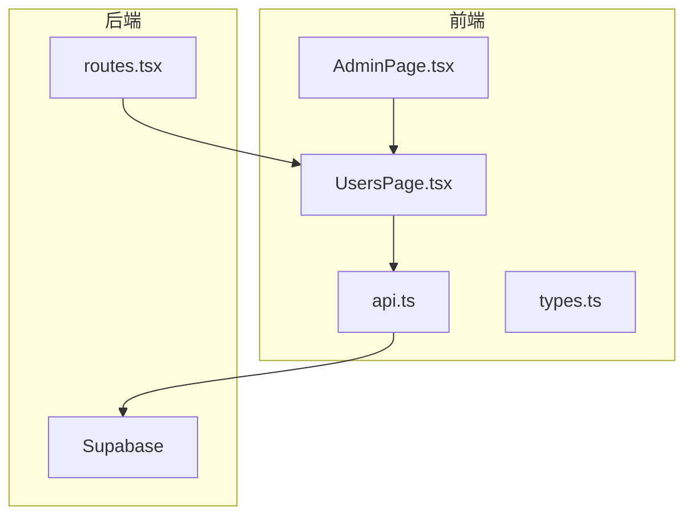
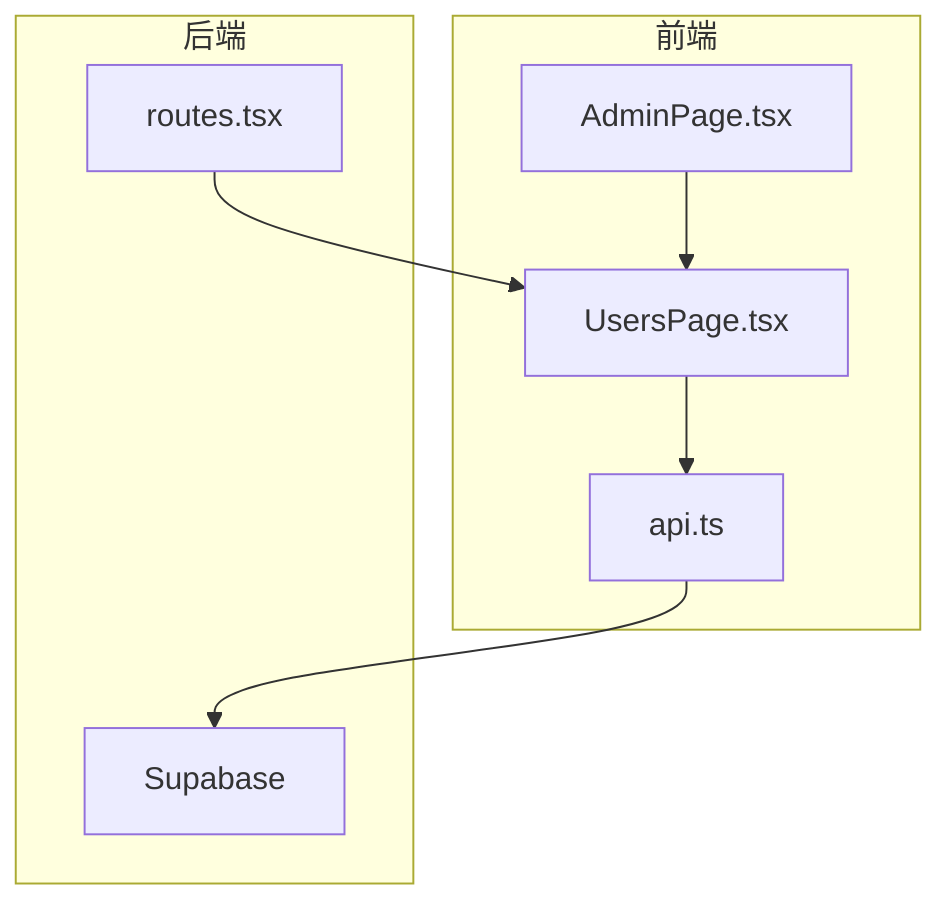
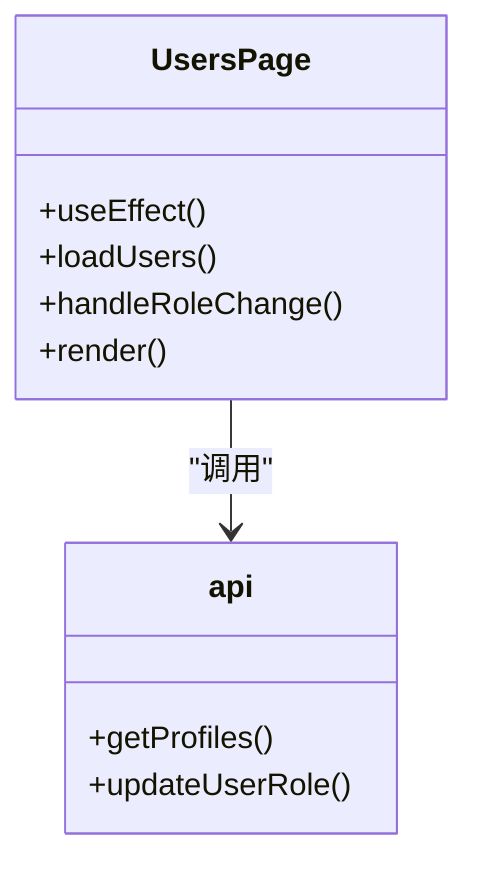
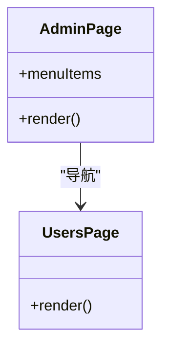
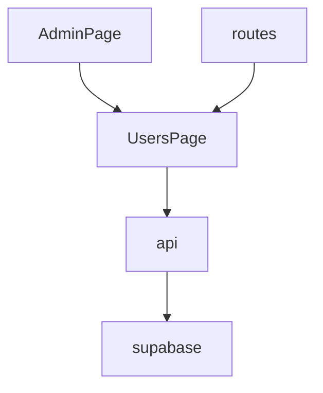

# 用户管理

<cite>
**本文档引用的文件**  
- [UsersPage.tsx](file://src/pages/admin/UsersPage.tsx)
- [AdminPage.tsx](file://src/pages/admin/AdminPage.tsx)
- [api.ts](file://src/db/api.ts)
- [types.ts](file://src/types/types.ts)
- [routes.tsx](file://src/routes.tsx)
- [supabase.ts](file://src/db/supabase.ts)
- [00001_create_initial_schema.sql](file://supabase/migrations/00001_create_initial_schema.sql)
</cite>

## 目录
1. [简介](#简介)
2. [项目结构](#项目结构)
3. [核心组件](#核心组件)
4. [架构概述](#架构概述)
5. [详细组件分析](#详细组件分析)
6. [依赖分析](#依赖分析)
7. [性能考虑](#性能考虑)
8. [故障排除指南](#故障排除指南)
9. [结论](#结论)

## 简介
本文档详细说明了用户管理功能，重点介绍UsersPage的用户增删改查操作流程和权限分配机制。文档描述了用户列表的展示方式、搜索过滤功能和分页机制，详细解释了如何通过界面进行用户角色分配和权限控制，包括不同角色的权限差异。同时提供了用户状态变更（启用/禁用）的操作说明和安全确认机制，并结合AdminPage的导航结构，说明用户管理功能的访问路径和权限要求。

## 项目结构
用户管理功能主要位于`src/pages/admin/`目录下，核心文件为`UsersPage.tsx`，该文件实现了用户列表的展示、角色分配和权限控制功能。`AdminPage.tsx`文件提供了管理后台的导航结构，用户管理功能作为其中一个模块集成在管理后台中。

**图表来源**  
- [UsersPage.tsx](file://src/pages/admin/UsersPage.tsx)
- [AdminPage.tsx](file://src/pages/admin/AdminPage.tsx)
- [api.ts](file://src/db/api.ts)
- [types.ts](file://src/types/types.ts)
- [routes.tsx](file://src/routes.tsx)

**章节来源**  
- [UsersPage.tsx](file://src/pages/admin/UsersPage.tsx)
- [AdminPage.tsx](file://src/pages/admin/AdminPage.tsx)

## 核心组件
用户管理功能的核心组件是`UsersPage`，它负责展示用户列表、处理用户角色变更和权限分配。该组件通过调用`getProfiles`和`updateUserRole` API来获取和更新用户信息。`AdminPage`组件提供了管理后台的导航结构，用户管理功能作为其中一个模块集成在管理后台中。

**章节来源**  
- [UsersPage.tsx](file://src/pages/admin/UsersPage.tsx)
- [AdminPage.tsx](file://src/pages/admin/AdminPage.tsx)

## 架构概述
用户管理功能的架构分为前端和后端两部分。前端部分由`UsersPage`和`AdminPage`组件构成，负责用户界面的展示和交互。后端部分由Supabase数据库和API构成，负责数据的存储和访问控制。

**图表来源**  
- [UsersPage.tsx](file://src/pages/admin/UsersPage.tsx)
- [AdminPage.tsx](file://src/pages/admin/AdminPage.tsx)
- [api.ts](file://src/db/api.ts)
- [routes.tsx](file://src/routes.tsx)

## 详细组件分析

### UsersPage分析
`UsersPage`组件是用户管理功能的核心，它通过调用`getProfiles` API获取用户列表，并通过`updateUserRole` API更新用户角色。组件使用React的`useState`和`useEffect`钩子来管理状态和生命周期。

**图表来源**  
- [UsersPage.tsx](file://src/pages/admin/UsersPage.tsx)
- [api.ts](file://src/db/api.ts)

**章节来源**  
- [UsersPage.tsx](file://src/pages/admin/UsersPage.tsx)

### AdminPage分析
`AdminPage`组件提供了管理后台的导航结构，用户管理功能作为其中一个模块集成在管理后台中。该组件通过`Link`组件将用户导航到`UsersPage`。

**图表来源**  
- [AdminPage.tsx](file://src/pages/admin/AdminPage.tsx)
- [UsersPage.tsx](file://src/pages/admin/UsersPage.tsx)

**章节来源**  
- [AdminPage.tsx](file://src/pages/admin/AdminPage.tsx)

## 依赖分析
用户管理功能依赖于多个组件和API。前端组件依赖于`UsersPage`和`AdminPage`，后端API依赖于`getProfiles`和`updateUserRole`。这些依赖关系通过`import`语句在代码中明确声明。

**图表来源**  
- [UsersPage.tsx](file://src/pages/admin/UsersPage.tsx)
- [AdminPage.tsx](file://src/pages/admin/AdminPage.tsx)
- [api.ts](file://src/db/api.ts)
- [routes.tsx](file://src/routes.tsx)

**章节来源**  
- [UsersPage.tsx](file://src/pages/admin/UsersPage.tsx)
- [AdminPage.tsx](file://src/pages/admin/AdminPage.tsx)
- [api.ts](file://src/db/api.ts)
- [routes.tsx](file://src/routes.tsx)

## 性能考虑
用户管理功能在性能方面主要考虑了数据加载和更新的效率。`getProfiles` API通过Supabase的`select`方法获取用户列表，并按创建时间降序排列。`updateUserRole` API通过Supabase的`update`方法更新用户角色，并在更新成功后重新加载用户列表。

**章节来源**  
- [api.ts](file://src/db/api.ts)

## 故障排除指南
在使用用户管理功能时，可能会遇到一些常见问题。例如，用户列表加载失败可能是由于网络问题或API调用失败。角色更新失败可能是由于权限不足或数据库更新失败。在这种情况下，应检查网络连接和API调用日志，以确定问题的根本原因。

**章节来源**  
- [UsersPage.tsx](file://src/pages/admin/UsersPage.tsx)
- [api.ts](file://src/db/api.ts)

## 结论
用户管理功能通过`UsersPage`和`AdminPage`组件实现了用户列表的展示、角色分配和权限控制。该功能依赖于Supabase数据库和API，通过`getProfiles`和`updateUserRole` API获取和更新用户信息。整体架构清晰，依赖关系明确，性能表现良好。