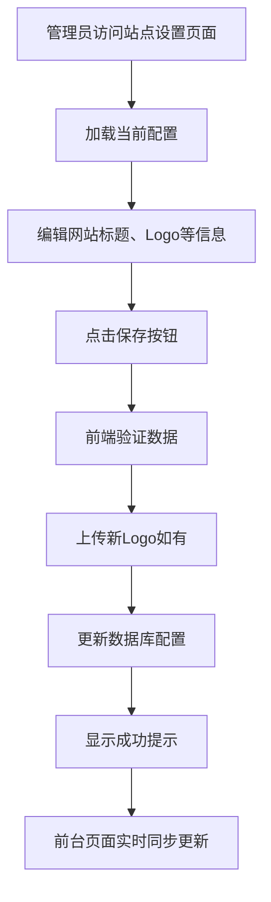
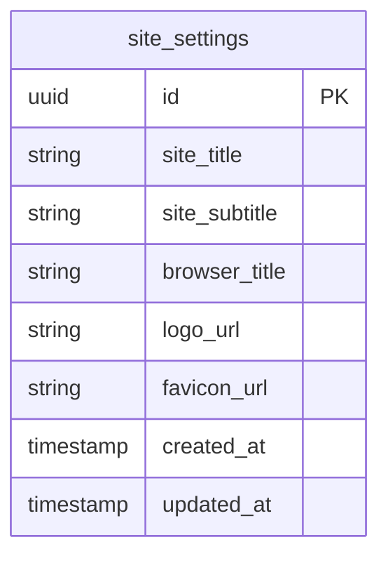
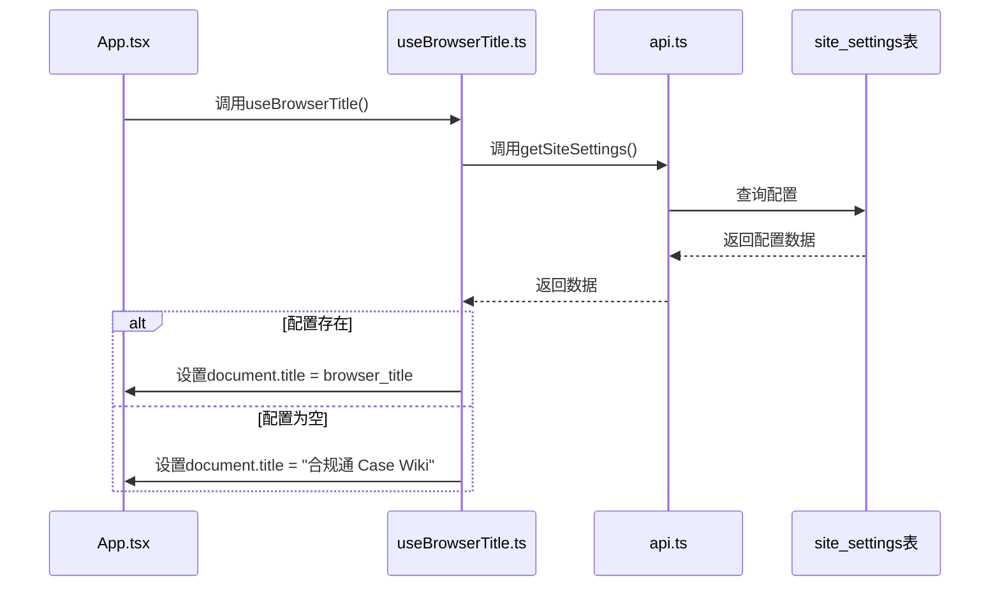
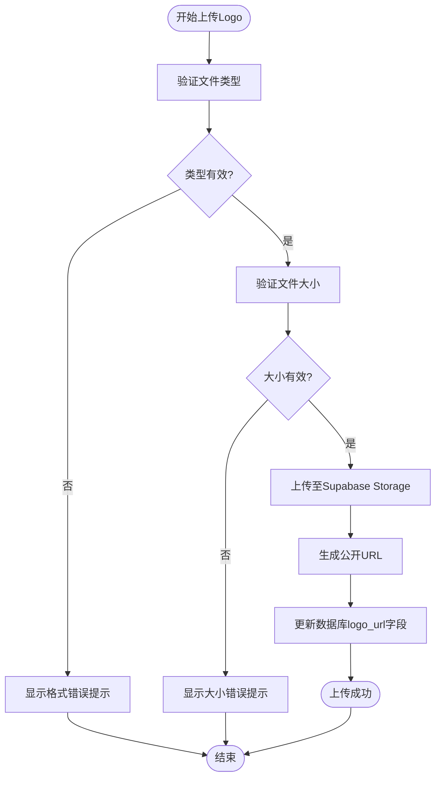

# 站点设置

<cite>
**本文档引用文件**   
- [SiteSettingsPage.tsx](file://src/pages/admin/SiteSettingsPage.tsx)
- [types.ts](file://src/types/types.ts)
- [api.ts](file://src/db/api.ts)
- [useBrowserTitle.ts](file://src/hooks/useBrowserTitle.ts)
- [00014_create_site_settings_table.sql](file://supabase/migrations/00014_create_site_settings_table.sql)
- [00015_add_browser_title_to_site_settings.sql](file://supabase/migrations/00015_add_browser_title_to_site_settings.sql)
- [网站基本信息配置功能说明.md](file://docs/网站基本信息配置功能说明.md)
- [浏览器标题配置-实施总结.md](file://docs/浏览器标题配置-实施总结.md)
</cite>

## 目录
1. [简介](#简介)
2. [核心功能](#核心功能)
3. [数据库设计](#数据库设计)
4. [配置持久化与前端更新](#配置持久化与前端更新)
5. [Logo上传与管理](#logo上传与管理)
6. [浏览器标题特殊处理](#浏览器标题特殊处理)
7. [API调用示例](#api调用示例)
8. [故障排查](#故障排查)

## 简介
站点设置功能为系统管理员提供了一个集中管理网站基本信息的界面，允许配置网站标题、Logo、浏览器标签页标题等核心信息。该功能通过数据库持久化存储配置，并在前端实现动态更新，确保修改后能实时同步到用户界面。系统采用React前端框架和Supabase后端服务，实现了安全、高效的配置管理机制。

**Section sources**
- [SiteSettingsPage.tsx](file://src/pages/admin/SiteSettingsPage.tsx#L1-L800)
- [网站基本信息配置功能说明.md](file://docs/网站基本信息配置功能说明.md#L1-L503)

## 核心功能
站点设置功能主要包含网站基本信息的配置与管理，具体包括：
- **网站主标题**：网站的全称或主要展示标题，为必填项，最多200个字符。
- **网站备用名称/简称**：网站的简短名称或用于特定场景的替代名称，为可选项，最多100个字符。
- **网站Logo图片**：代表网站品牌标识的主要图像，支持上传PNG、JPG、SVG格式的图片，最大2MB。
- **浏览器标签标题**：显示在浏览器标签页的标题，为可选项，最多100个字符，若未配置则使用默认标题"合规通 Case Wiki"。

这些配置项通过一个统一的管理页面进行维护，管理员修改后点击保存，配置将立即同步到前台展示。



**Diagram sources **
- [SiteSettingsPage.tsx](file://src/pages/admin/SiteSettingsPage.tsx#L22-L414)

**Section sources**
- [SiteSettingsPage.tsx](file://src/pages/admin/SiteSettingsPage.tsx#L22-L414)
- [网站基本信息配置功能说明.md](file://docs/网站基本信息配置功能说明.md#L9-L137)

## 数据库设计
站点设置功能的核心是`site_settings`数据库表，该表存储了所有网站的基本配置信息。

### site_settings 表结构
| 字段名 | 数据类型 | 说明 | 约束 |
|--------|----------|------|------|
| id | uuid | 主键，唯一标识 | PRIMARY KEY |
| site_title | text | 网站主标题 | NOT NULL, 最大200字符 |
| site_subtitle | text | 网站备用名称/简称 | 可选, 最大100字符 |
| browser_title | text | 浏览器标签页显示的标题 | 可选, 最大100字符 |
| logo_url | text | Logo图片的公开URL | 可选 |
| favicon_url | text | Favicon图片的公开URL | 可选 |
| created_at | timestamptz | 记录创建时间 | 默认为当前时间 |
| updated_at | timestamptz | 记录最后更新时间 | 自动更新 |

### 数据库迁移
该表通过Supabase的迁移文件创建和维护：
- **00014_create_site_settings_table.sql**：创建`site_settings`表，定义了主标题、备用名称和Logo URL等基础字段。
- **00015_add_browser_title_to_site_settings.sql**：向表中添加`browser_title`字段，用于支持浏览器标签页标题的配置。



**Diagram sources **
- [00014_create_site_settings_table.sql](file://supabase/migrations/00014_create_site_settings_table.sql#L40-L48)
- [00015_add_browser_title_to_site_settings.sql](file://supabase/migrations/00015_add_browser_title_to_site_settings.sql#L26-L27)

**Section sources**
- [00014_create_site_settings_table.sql](file://supabase/migrations/00014_create_site_settings_table.sql#L1-L146)
- [00015_add_browser_title_to_site_settings.sql](file://supabase/migrations/00015_add_browser_title_to_site_settings.sql#L1-L36)
- [types.ts](file://src/types/types.ts#L161-L171)

## 配置持久化与前端更新
站点设置的配置信息通过数据库持久化存储，并通过前端Hook实现动态更新。

### 持久化机制
配置的读取和更新通过`src/db/api.ts`中的API函数实现：
- `getSiteSettings()`：从`site_settings`表中查询配置数据。
- `updateSiteSettings(id, updates)`：更新指定ID的配置记录。
- `uploadLogo(file)` 和 `deleteLogo(url)`：用于管理Logo文件的上传和删除。

### 前端实时更新
前端通过`useBrowserTitle` Hook实现浏览器标题的动态更新。该Hook在应用启动时执行，从数据库获取最新的`browser_title`配置，并更新`document.title`。如果配置为空，则使用默认标题。



**Diagram sources **
- [api.ts](file://src/db/api.ts#L21-L2933)
- [useBrowserTitle.ts](file://src/hooks/useBrowserTitle.ts#L1-L24)

**Section sources**
- [api.ts](file://src/db/api.ts#L21-L2933)
- [useBrowserTitle.ts](file://src/hooks/useBrowserTitle.ts#L1-L24)

## Logo上传与管理
Logo上传功能允许管理员上传、预览和管理网站Logo，支持多种操作模式。

### 上传模式
系统提供两种Logo配置模式：
1. **上传文件**：选择本地图片文件上传至Supabase Storage。
2. **输入URL**：直接输入外部图片的URL地址。

### 格式与尺寸要求
- **支持格式**：PNG、JPG、SVG。
- **大小限制**：单个文件不超过2MB。
- **尺寸建议**：建议使用正方形图片，最小尺寸为200x200像素，以确保在不同设备上清晰显示。

### 错误处理
上传过程中会进行严格的前端验证：
- 文件类型不支持时，提示“请上传 PNG、JPG 或 SVG 格式的图片”。
- 文件大小超过2MB时，提示“图片大小不能超过 2MB”。
- URL格式不正确时，提示“请输入有效的图片URL”。



**Diagram sources **
- [SiteSettingsPage.tsx](file://src/pages/admin/SiteSettingsPage.tsx#L79-L109)
- [api.ts](file://src/db/api.ts#L8099-L8120)

**Section sources**
- [SiteSettingsPage.tsx](file://src/pages/admin/SiteSettingsPage.tsx#L79-L109)
- [api.ts](file://src/db/api.ts#L8099-L8120)
- [LOGO_UPLOAD_FIX_GUIDE.md](file://docs/LOGO_UPLOAD_FIX_GUIDE.md#L158-L233)

## 浏览器标题特殊处理
`browser_title`字段在SEO优化和用户体验中扮演着重要角色。

### 特殊处理逻辑
- **默认值机制**：当`browser_title`字段为空时，前端会自动使用默认标题"合规通 Case Wiki"，避免出现空标题。
- **长度限制**：字段有100字符的数据库约束，前端也进行实时字符计数，建议用户将标题控制在60字符以内，以确保在浏览器标签页中完整显示。
- **动态更新**：通过`useBrowserTitle` Hook，标题的变更无需重新部署即可生效，提升了管理效率。

### SEO优化作用
- **提高可发现性**：一个描述性强、包含关键词的浏览器标题有助于搜索引擎理解页面内容，提升搜索排名。
- **提升点击率**：在搜索结果中，一个清晰、吸引人的标题能显著提高用户的点击意愿。
- **品牌一致性**：统一的标题格式有助于建立和强化品牌形象。

**Section sources**
- [浏览器标题配置-实施总结.md](file://docs/浏览器标题配置-实施总结.md#L1-L707)
- [useBrowserTitle.ts](file://src/hooks/useBrowserTitle.ts#L1-L24)

## API调用示例
以下示例展示了如何通过API读取和更新站点设置配置。

### 读取配置
```typescript
import { getSiteSettings } from '@/db/api';

// 获取当前站点设置
const settings = await getSiteSettings();
console.log(settings.site_title); // 输出: "合规通"
console.log(settings.browser_title); // 输出: "合规通 Case Wiki"
```

### 更新配置
```typescript
import { updateSiteSettings } from '@/db/api';

// 更新站点设置
await updateSiteSettings(settings.id, {
  site_title: "合规通 - 案例查询平台",
  browser_title: "合规通案例查询",
  site_subtitle: "App监管案例查询平台"
});
// 配置更新后，前端将自动同步
```

**Section sources**
- [api.ts](file://src/db/api.ts#L21-L2933)

## 故障排查
### 常见问题及解决方案
- **保存失败**：检查网络连接，确认管理员权限，并确保所有必填字段符合长度要求。
- **Logo上传失败**：确认文件格式和大小符合要求，若使用上传功能失败，可尝试切换到“输入URL”模式。
- **前台未更新**：刷新页面或清除浏览器缓存，因为配置更新后需要重新加载页面才能生效。
- **Logo显示异常**：检查图片尺寸和格式，确保图片清晰且未损坏。

**Section sources**
- [网站基本信息配置功能说明.md](file://docs/网站基本信息配置功能说明.md#L391-L443)