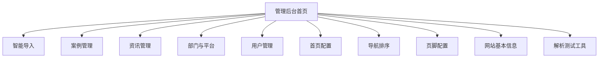
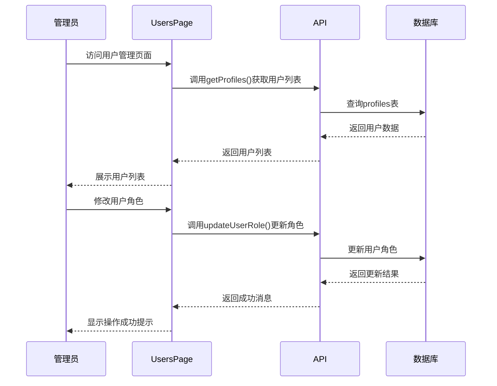
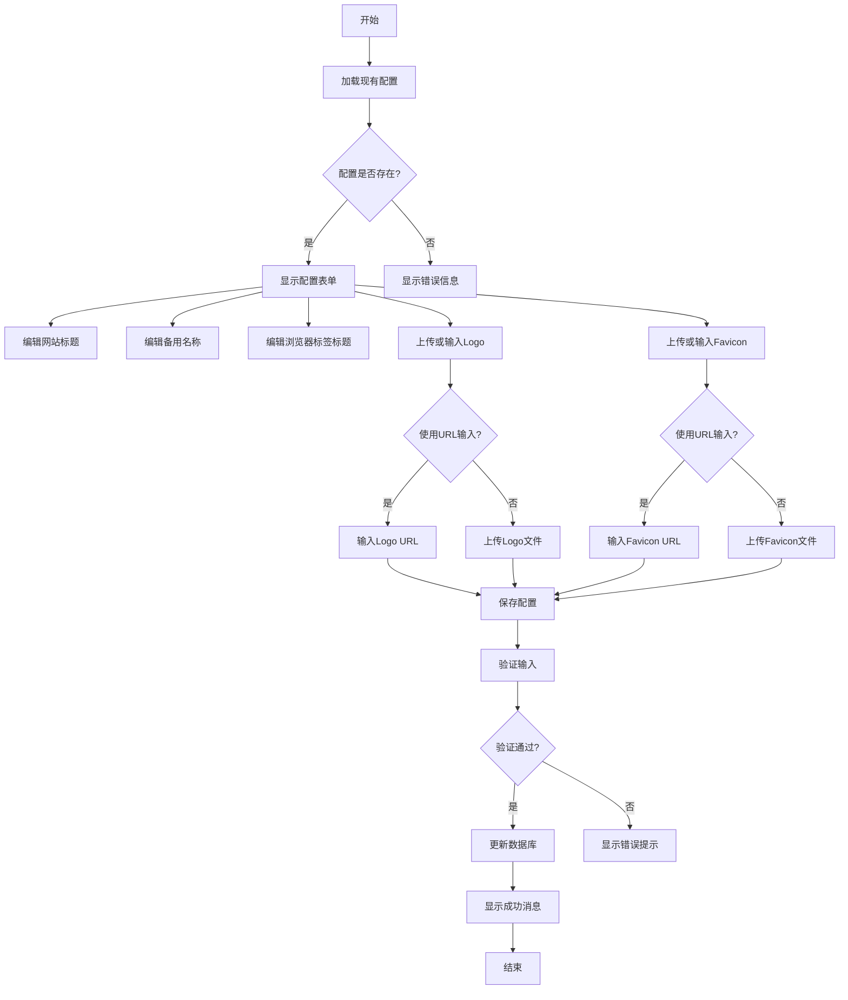
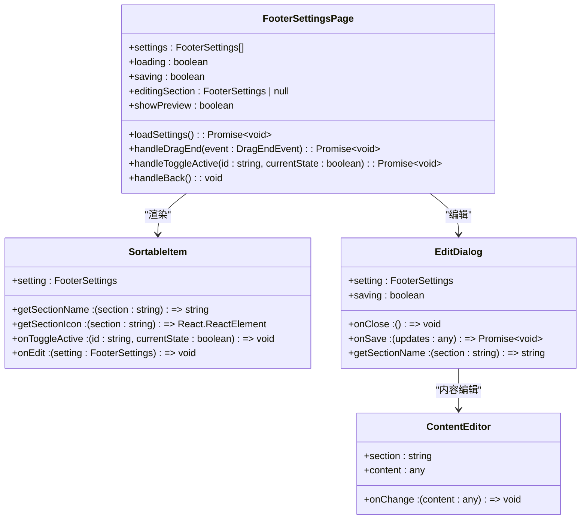

# 管理后台

<cite>
**本文档引用的文件**   
- [AdminPage.tsx](file://src/pages/admin/AdminPage.tsx)
- [UsersPage.tsx](file://src/pages/admin/UsersPage.tsx)
- [SiteSettingsPage.tsx](file://src/pages/admin/SiteSettingsPage.tsx)
- [FooterSettingsPage.tsx](file://src/pages/admin/FooterSettingsPage.tsx)
- [api.ts](file://src/db/api.ts)
- [types.ts](file://src/types/types.ts)
- [routes.tsx](file://src/routes.tsx)
</cite>

## 目录
1. [管理后台概述](#管理后台概述)
2. [导航结构与权限控制](#导航结构与权限控制)
3. [用户管理功能](#用户管理功能)
4. [网站基本信息配置](#网站基本信息配置)
5. [页脚内容管理](#页脚内容管理)
6. [安全审计与变更日志](#安全审计与变更日志)

## 管理后台概述

管理后台是系统的核心管理界面，为管理员提供对用户、系统配置和站点设置等关键功能的集中管理能力。通过该后台，管理员可以维护用户权限、配置网站基本信息、管理页脚内容，并执行其他系统管理任务。管理后台的设计遵循直观、易用的原则，确保管理员能够高效地完成各项管理操作。

## 导航结构与权限控制

管理后台的导航结构通过`AdminPage.tsx`文件实现，采用卡片式布局展示各个管理功能模块。每个卡片代表一个独立的管理功能，用户点击卡片即可进入相应的管理页面。

**Diagram sources**
- [AdminPage.tsx](file://src/pages/admin/AdminPage.tsx)

管理后台的权限控制通过路由配置和组件级保护实现。在`routes.tsx`文件中，所有管理后台相关的路由都设置了`requireAuth: true`和`requireAdmin: true`属性，确保只有经过身份验证的管理员用户才能访问这些页面。此外，`ProtectedModuleRoute`组件用于保护特定模块的访问，进一步增强了系统的安全性。

**Section sources**
- [AdminPage.tsx](file://src/pages/admin/AdminPage.tsx)
- [routes.tsx](file://src/routes.tsx)
- [ProtectedModuleRoute.tsx](file://src/components/common/ProtectedModuleRoute.tsx)

## 用户管理功能

用户管理功能通过`UsersPage.tsx`文件实现，允许管理员查看、编辑和管理所有用户的信息和权限。该功能提供了用户列表的展示、角色分配和状态管理。

**Diagram sources**
- [UsersPage.tsx](file://src/pages/admin/UsersPage.tsx)
- [api.ts](file://src/db/api.ts)

用户管理功能的核心操作包括：
- **用户列表展示**：显示所有用户的用户名、角色、注册时间等信息
- **角色分配**：通过下拉菜单为用户分配"管理员"或"普通用户"角色
- **实时更新**：角色变更后立即生效，并通过消息提示告知管理员

该功能通过`getProfiles()`和`updateUserRole()` API函数与后端进行交互，确保用户数据的准确性和实时性。

**Section sources**
- [UsersPage.tsx](file://src/pages/admin/UsersPage.tsx)
- [api.ts](file://src/db/api.ts)

## 网站基本信息配置

网站基本信息配置功能通过`SiteSettingsPage.tsx`文件实现，允许管理员配置网站的标题、备用名称、Logo和浏览器标签标题等基本信息。该功能提供了直观的表单界面，支持文件上传和URL输入两种方式。

**Diagram sources**
- [SiteSettingsPage.tsx](file://src/pages/admin/SiteSettingsPage.tsx)

网站基本信息配置功能的关键特性包括：
- **多模式输入**：支持文件上传和URL输入两种方式，提高配置灵活性
- **实时预览**：上传或输入图片后可立即预览效果
- **数据验证**：对输入的字符长度、文件大小和格式进行严格验证
- **错误处理**：提供详细的错误提示，帮助管理员快速解决问题

该功能通过`getSiteSettings()`、`updateSiteSettings()`、`uploadLogo()`和`deleteLogo()`等API函数与后端进行交互，确保配置数据的完整性和一致性。

**Section sources**
- [SiteSettingsPage.tsx](file://src/pages/admin/SiteSettingsPage.tsx)
- [api.ts](file://src/db/api.ts)

## 页脚内容管理

页脚内容管理功能通过`FooterSettingsPage.tsx`文件实现，允许管理员管理网站页脚的各个模块，包括"关于我们"、"快速导航"、"友情链接"、"社交媒体"、"订阅资讯"、"版权信息"、"备案信息"和"免责声明"等。该功能提供了拖拽排序、实时预览和富文本编辑等高级功能。

**Diagram sources**
- [FooterSettingsPage.tsx](file://src/pages/admin/FooterSettingsPage.tsx)

页脚内容管理功能的核心特性包括：
- **拖拽排序**：通过`dnd-kit`库实现模块的拖拽排序，调整页脚模块的显示顺序
- **实时预览**：提供实时预览功能，管理员可即时查看配置效果
- **富文本编辑**：针对不同模块提供定制化的编辑表单，如"关于我们"模块支持描述和联系邮箱的编辑，"快速导航"模块支持链接的增删改
- **批量更新**：支持批量更新页脚设置的显示顺序和状态

该功能通过`getAllFooterSettings()`、`updateFooterSetting()`和`batchUpdateFooterSettings()`等API函数与后端进行交互，确保页脚配置的准确性和一致性。

**Section sources**
- [FooterSettingsPage.tsx](file://src/pages/admin/FooterSettingsPage.tsx)
- [api.ts](file://src/db/api.ts)

## 安全审计与变更日志

系统通过多种机制实现安全审计和变更日志功能，确保所有管理操作的可追溯性和安全性。

1. **数据库层面**：所有关键数据表（如`profiles`、`site_settings`、`footer_settings`）都包含`created_at`和`updated_at`字段，记录数据的创建和更新时间。
2. **API层面**：所有更新操作的API函数（如`updateUserRole`、`updateSiteSettings`、`updateFooterSetting`）都会自动更新`updated_at`字段，确保变更时间的准确性。
3. **前端层面**：所有管理操作都通过`toast`组件提供操作成功或失败的提示，帮助管理员及时了解操作结果。
4. **权限控制**：通过`requireAdmin`路由属性和`is_admin(auth.uid())`安全策略，确保只有管理员才能执行关键操作。

这些机制共同构成了系统的安全审计和变更日志体系，为系统的稳定运行和问题排查提供了有力支持。

**Section sources**
- [api.ts](file://src/db/api.ts)
- [routes.tsx](file://src/routes.tsx)
- [supabase/migrations/*.sql](file://supabase/migrations/)