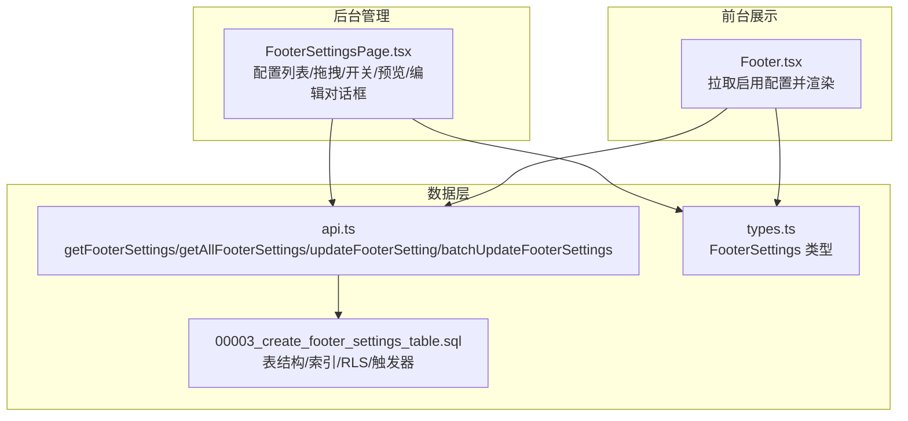
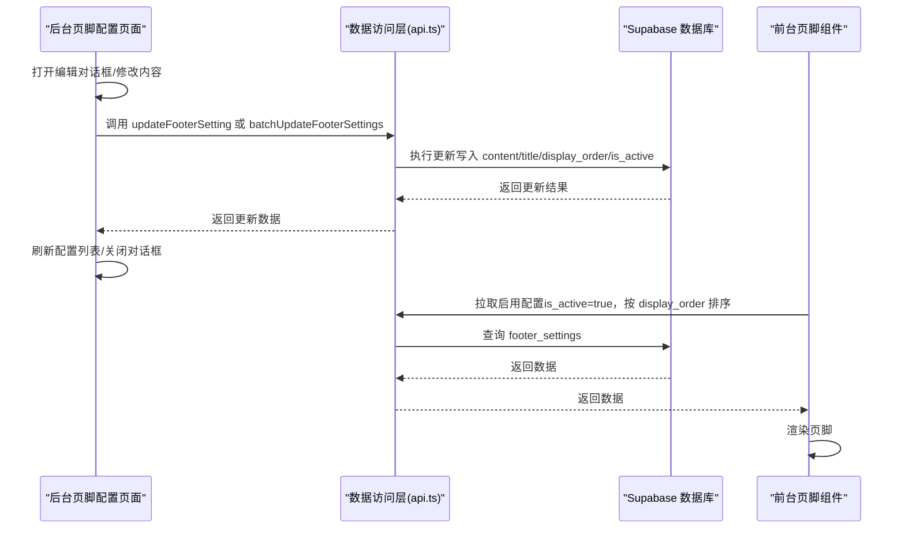
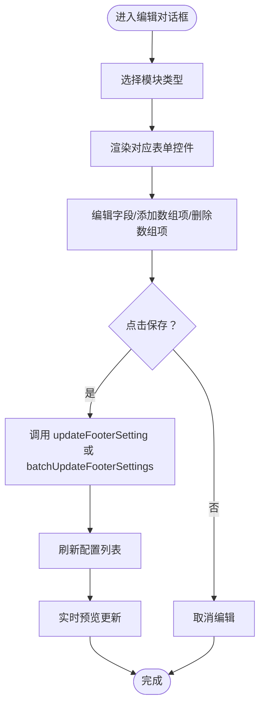
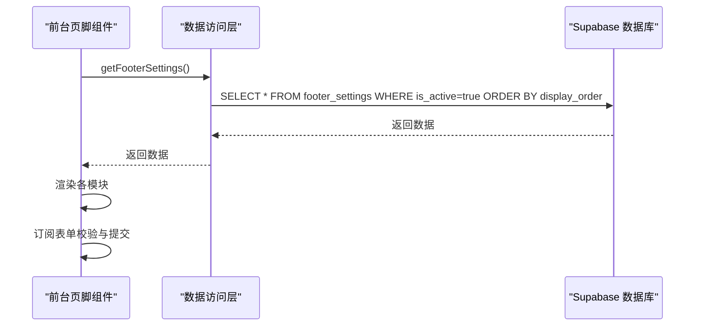
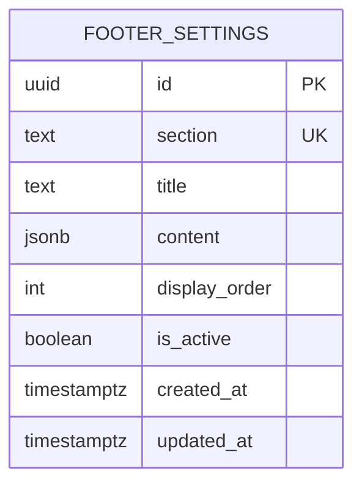
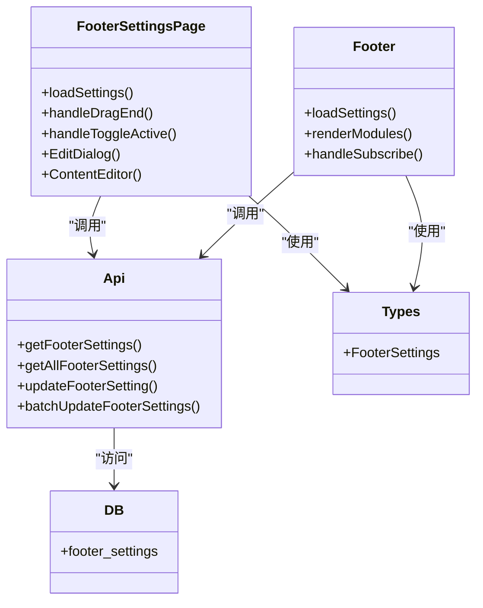

# 页脚配置

<cite>
**本文引用的文件**
- [FooterSettingsPage.tsx](file://src/pages/admin/FooterSettingsPage.tsx)
- [Footer.tsx](file://src/components/common/Footer.tsx)
- [api.ts](file://src/db/api.ts)
- [types.ts](file://src/types/types.ts)
- [00003_create_footer_settings_table.sql](file://supabase/migrations/00003_create_footer_settings_table.sql)
</cite>

## 目录
1. [简介](#简介)
2. [项目结构](#项目结构)
3. [核心组件](#核心组件)
4. [架构总览](#架构总览)
5. [详细组件分析](#详细组件分析)
6. [依赖关系分析](#依赖关系分析)
7. [性能考量](#性能考量)
8. [故障排查指南](#故障排查指南)
9. [结论](#结论)
10. [附录](#附录)

## 简介
本文件面向“页脚配置”功能，聚焦于后台页脚设置页面（FooterSettingsPage）的富文本编辑能力与内容管理机制，系统性说明：
- 页脚设置表的数据库结构、内容存储格式与时间戳更新策略
- 富文本编辑器的集成方式与安全过滤机制（防XSS）
- 多行文本输入、链接插入与格式化操作的使用指南
- 配置变更的保存机制与前台页面的同步更新策略
- 错误处理与输入验证，确保内容的合法性与完整性

## 项目结构
该功能由三部分协同构成：
- 后台管理界面：负责配置列表、拖拽排序、开关显示、实时预览与编辑对话框
- 前台展示组件：负责拉取启用配置并渲染页脚内容
- 数据层：通过 Supabase 访问 footer_settings 表，提供增删改查与批量更新接口

图表来源
- [FooterSettingsPage.tsx](file://src/pages/admin/FooterSettingsPage.tsx#L54-L263)
- [Footer.tsx](file://src/components/common/Footer.tsx#L1-L120)
- [api.ts](file://src/db/api.ts#L7128-L7160)
- [types.ts](file://src/types/types.ts#L62-L71)
- [00003_create_footer_settings_table.sql](file://supabase/migrations/00003_create_footer_settings_table.sql#L1-L41)

章节来源
- [FooterSettingsPage.tsx](file://src/pages/admin/FooterSettingsPage.tsx#L54-L263)
- [Footer.tsx](file://src/components/common/Footer.tsx#L1-L120)
- [api.ts](file://src/db/api.ts#L7128-L7160)
- [types.ts](file://src/types/types.ts#L62-L71)
- [00003_create_footer_settings_table.sql](file://supabase/migrations/00003_create_footer_settings_table.sql#L1-L41)

## 核心组件
- 后台页脚配置页面（FooterSettingsPage）
  - 支持拖拽排序、开关显示、实时预览、编辑对话框
  - 编辑对话框内嵌“内容编辑器”，根据 section 类型渲染不同表单控件
- 前台页脚组件（Footer）
  - 仅拉取 is_active=true 的配置，按 display_order 升序渲染
- 数据访问层（db/api.ts）
  - 提供获取全部/启用配置、更新单条、批量更新等方法
- 类型定义（types/types.ts）
  - FooterSettings 定义 content 字段为任意 JSON 类型
- 数据库（Supabase）
  - footer_settings 表采用 jsonb 存储 content，含 RLS 策略与更新时间触发器

章节来源
- [FooterSettingsPage.tsx](file://src/pages/admin/FooterSettingsPage.tsx#L54-L263)
- [Footer.tsx](file://src/components/common/Footer.tsx#L1-L120)
- [api.ts](file://src/db/api.ts#L7128-L7160)
- [types.ts](file://src/types/types.ts#L62-L71)
- [00003_create_footer_settings_table.sql](file://supabase/migrations/00003_create_footer_settings_table.sql#L1-L41)

## 架构总览
后台编辑流程：用户在后台编辑配置 -> 保存 -> 触发数据库更新 -> 前台重新拉取 -> 展示最新页脚

图表来源
- [FooterSettingsPage.tsx](file://src/pages/admin/FooterSettingsPage.tsx#L115-L125)
- [FooterSettingsPage.tsx](file://src/pages/admin/FooterSettingsPage.tsx#L266-L288)
- [Footer.tsx](file://src/components/common/Footer.tsx#L17-L31)
- [api.ts](file://src/db/api.ts#L7128-L7160)
- [00003_create_footer_settings_table.sql](file://supabase/migrations/00003_create_footer_settings_table.sql#L192-L205)

## 详细组件分析

### 后台页脚配置页面（富文本编辑与内容管理）
- 配置列表与交互
  - 拖拽排序：使用 DnD Kit 实现，拖拽结束时计算新的 display_order 并批量更新
  - 开关显示：切换 is_active，即时生效并刷新列表
  - 实时预览：右侧卡片展示前台页脚效果
  - 编辑对话框：支持修改标题与内容，保存后刷新列表
- 内容编辑器（ContentEditor）
  - 根据 section 类型渲染不同表单：
    - 关于我们：多行文本（描述）、邮箱输入
    - 快速导航：数组项（名称/路径），支持添加/删除链接
    - 友情链接：数组项（名称/URL），支持添加/删除链接
    - 社交媒体：数组项（名称/图标/链接），支持添加/删除平台
    - 订阅资讯：开关（是否启用）、描述、隐私说明
    - 版权信息：公司名称、是否显示年份
    - 备案信息：ICP/公安备案号与链接
    - 免责声明：多行文本
    - 默认：JSON 文本编辑器（字符串化/解析）
  - 多行文本输入：Textarea 控件，支持换行
  - 链接插入：通过数组项表单添加 name/path 或 name/url
  - 格式化操作：通过表单控件进行字段级编辑；未见富文本编辑器组件，富文本内容需以 JSON 结构存储
- 保存机制
  - 单条保存：updateFooterSetting
  - 批量保存：batchUpdateFooterSettings（同时更新多个记录）
  - 成功/失败提示：使用 toast
- 前台同步更新策略
  - 保存后主动刷新配置列表，确保后台与前台一致
  - 前台仅拉取 is_active=true 的配置，并按 display_order 升序渲染

图表来源
- [FooterSettingsPage.tsx](file://src/pages/admin/FooterSettingsPage.tsx#L266-L288)
- [FooterSettingsPage.tsx](file://src/pages/admin/FooterSettingsPage.tsx#L378-L443)
- [FooterSettingsPage.tsx](file://src/pages/admin/FooterSettingsPage.tsx#L445-L778)

章节来源
- [FooterSettingsPage.tsx](file://src/pages/admin/FooterSettingsPage.tsx#L54-L263)
- [FooterSettingsPage.tsx](file://src/pages/admin/FooterSettingsPage.tsx#L266-L288)
- [FooterSettingsPage.tsx](file://src/pages/admin/FooterSettingsPage.tsx#L378-L443)
- [FooterSettingsPage.tsx](file://src/pages/admin/FooterSettingsPage.tsx#L445-L778)

### 前台页脚组件（渲染与订阅）
- 数据拉取
  - 仅拉取 is_active=true 的配置，并按 display_order 升序排序
- 渲染逻辑
  - 关于我们：标题、描述、邮箱
  - 快速导航：标题、链接列表
  - 友情链接：标题、外链列表
  - 社交媒体：标题、平台图标
  - 订阅资讯：启用时显示订阅表单与隐私说明
  - 版权信息：公司名称与年份显示
  - 备案信息：ICP/公安备案号与链接
  - 免责声明：底部说明
- 订阅校验
  - 邮箱非空与格式校验，提示 toast

图表来源
- [Footer.tsx](file://src/components/common/Footer.tsx#L17-L31)
- [Footer.tsx](file://src/components/common/Footer.tsx#L36-L62)
- [Footer.tsx](file://src/components/common/Footer.tsx#L68-L241)
- [api.ts](file://src/db/api.ts#L7128-L7160)

章节来源
- [Footer.tsx](file://src/components/common/Footer.tsx#L1-L120)
- [Footer.tsx](file://src/components/common/Footer.tsx#L120-L241)
- [api.ts](file://src/db/api.ts#L7128-L7160)

### 数据库结构与内容存储
- 表结构要点
  - id：主键（uuid）
  - section：模块标识（唯一）
  - title：模块标题
  - content：JSONB 内容（默认空对象）
  - display_order：显示顺序（默认0）
  - is_active：是否启用（默认true）
  - created_at/updated_at：时间戳（默认当前时间）
- 索引
  - section、display_order、is_active
- Row Level Security（RLS）
  - 仅管理员可写（插入/更新/删除）
  - 公共可读：仅 is_active=true 的记录
- 触发器
  - 更新时自动更新 updated_at

图表来源
- [00003_create_footer_settings_table.sql](file://supabase/migrations/00003_create_footer_settings_table.sql#L1-L41)
- [00003_create_footer_settings_table.sql](file://supabase/migrations/00003_create_footer_settings_table.sql#L192-L205)

章节来源
- [00003_create_footer_settings_table.sql](file://supabase/migrations/00003_create_footer_settings_table.sql#L1-L41)
- [00003_create_footer_settings_table.sql](file://supabase/migrations/00003_create_footer_settings_table.sql#L192-L205)

### 富文本编辑器集成与安全过滤
- 富文本编辑器集成
  - 当前实现未集成第三方富文本编辑器（如 Quill/TinyMCE）。内容编辑器通过表单控件与 JSON 文本编辑器实现字段级编辑。
- 安全过滤机制
  - 前台渲染直接使用 JSONB 字段内容，未发现专门的 HTML/JS 过滤器。
  - 建议在写入数据库前对 content 进行白名单过滤与转义，避免 XSS。
  - 前台渲染时，对于外链使用安全属性（rel="noopener noreferrer"）与受控链接，避免执行不受信任脚本。

章节来源
- [FooterSettingsPage.tsx](file://src/pages/admin/FooterSettingsPage.tsx#L445-L778)
- [Footer.tsx](file://src/components/common/Footer.tsx#L140-L160)
- [Footer.tsx](file://src/components/common/Footer.tsx#L206-L228)

### 多行文本输入、链接插入与格式化操作使用指南
- 多行文本输入
  - 使用 TextArea 控件，支持换行与较长文本
- 链接插入
  - 快速导航/友情链接：通过数组项表单添加 name/path 或 name/url
  - 社交媒体：添加平台名称、图标与链接
- 格式化操作
  - 通过表单控件进行字段级编辑；未见富文本格式化工具
  - 如需富文本，建议在编辑器中进行 HTML 输入，并在入库前进行严格过滤

章节来源
- [FooterSettingsPage.tsx](file://src/pages/admin/FooterSettingsPage.tsx#L499-L741)

### 配置变更保存机制与前台同步
- 保存机制
  - 单条保存：updateFooterSetting
  - 批量保存：batchUpdateFooterSettings（同时更新多个记录）
- 前台同步
  - 保存后主动刷新配置列表，确保后台与前台一致
  - 前台仅拉取 is_active=true 的配置，并按 display_order 升序渲染

章节来源
- [FooterSettingsPage.tsx](file://src/pages/admin/FooterSettingsPage.tsx#L115-L125)
- [FooterSettingsPage.tsx](file://src/pages/admin/FooterSettingsPage.tsx#L266-L288)
- [Footer.tsx](file://src/components/common/Footer.tsx#L17-L31)

### 错误处理与输入验证
- 输入验证
  - 订阅邮箱：非空与格式校验，提示 toast
  - JSON 编辑器：尝试解析字符串，失败则忽略（保持原值）
- 错误处理
  - 加载失败、保存失败、排序更新失败均通过 toast 提示
  - 拖拽排序失败时回滚原顺序并重新加载

章节来源
- [Footer.tsx](file://src/components/common/Footer.tsx#L36-L62)
- [FooterSettingsPage.tsx](file://src/pages/admin/FooterSettingsPage.tsx#L73-L85)
- [FooterSettingsPage.tsx](file://src/pages/admin/FooterSettingsPage.tsx#L115-L125)
- [FooterSettingsPage.tsx](file://src/pages/admin/FooterSettingsPage.tsx#L266-L288)

## 依赖关系分析
- 组件耦合
  - FooterSettingsPage 依赖 DnD Kit 实现拖拽排序，依赖对话框与表单控件
  - Footer 依赖 getFooterSettings，渲染各模块
- 数据依赖
  - db/api.ts 提供统一的数据访问接口
  - types/types.ts 定义 FooterSettings 类型
- 数据库依赖
  - Supabase footer_settings 表，RLS 与触发器保障安全与时间戳

图表来源
- [FooterSettingsPage.tsx](file://src/pages/admin/FooterSettingsPage.tsx#L54-L263)
- [Footer.tsx](file://src/components/common/Footer.tsx#L1-L120)
- [api.ts](file://src/db/api.ts#L7128-L7160)
- [types.ts](file://src/types/types.ts#L62-L71)
- [00003_create_footer_settings_table.sql](file://supabase/migrations/00003_create_footer_settings_table.sql#L1-L41)

章节来源
- [FooterSettingsPage.tsx](file://src/pages/admin/FooterSettingsPage.tsx#L54-L263)
- [Footer.tsx](file://src/components/common/Footer.tsx#L1-L120)
- [api.ts](file://src/db/api.ts#L7128-L7160)
- [types.ts](file://src/types/types.ts#L62-L71)
- [00003_create_footer_settings_table.sql](file://supabase/migrations/00003_create_footer_settings_table.sql#L1-L41)

## 性能考量
- 前台渲染
  - 仅拉取启用配置并按 display_order 排序，减少渲染负担
- 后台编辑
  - 批量更新排序时一次性提交多个更新，降低往返次数
- 数据库
  - 为 section/display_order/is_active 建立索引，提升查询效率

[本节为通用指导，无需列出具体文件来源]

## 故障排查指南
- 加载失败
  - 检查网络与 Supabase 连接状态
  - 查看 toast 错误提示，定位具体错误
- 保存失败
  - 检查字段合法性（邮箱格式、JSON 格式）
  - 查看后端错误信息，确认权限与 RLS 设置
- 排序更新失败
  - 拖拽排序失败会自动回滚并重新加载
- 前台不显示
  - 确认 is_active 已开启
  - 确认 display_order 正确且已保存

章节来源
- [FooterSettingsPage.tsx](file://src/pages/admin/FooterSettingsPage.tsx#L73-L85)
- [FooterSettingsPage.tsx](file://src/pages/admin/FooterSettingsPage.tsx#L115-L125)
- [Footer.tsx](file://src/components/common/Footer.tsx#L17-L31)

## 结论
- 本功能通过表单控件与 JSON 文本编辑器实现了灵活的内容管理，满足多模块、多字段的配置需求
- 通过 RLS 与触发器保障了数据安全与时间戳一致性
- 前后台通过明确的保存与刷新流程实现配置同步
- 建议在富文本场景下增加严格的 XSS 过滤与白名单策略，确保前台渲染安全

[本节为总结性内容，无需列出具体文件来源]

## 附录
- 数据库迁移脚本说明
  - 表结构、索引、RLS 策略与更新时间触发器
- 类型定义
  - FooterSettings 的字段与类型约束

章节来源
- [00003_create_footer_settings_table.sql](file://supabase/migrations/00003_create_footer_settings_table.sql#L1-L41)
- [00003_create_footer_settings_table.sql](file://supabase/migrations/00003_create_footer_settings_table.sql#L192-L205)
- [types.ts](file://src/types/types.ts#L62-L71)