# UI组件库

<cite>
**本文档中引用的文件**   
- [button.tsx](file://src/components/ui/button.tsx)
- [input.tsx](file://src/components/ui/input.tsx)
- [card.tsx](file://src/components/ui/card.tsx)
- [table.tsx](file://src/components/ui/table.tsx)
- [dropdown-menu.tsx](file://src/components/ui/dropdown-menu.tsx)
- [checkbox.tsx](file://src/components/ui/checkbox.tsx)
- [dialog.tsx](file://src/components/ui/dialog.tsx)
- [tabs.tsx](file://src/components/ui/tabs.tsx)
- [select.tsx](file://src/components/ui/select.tsx)
- [form.tsx](file://src/components/ui/form.tsx)
- [label.tsx](file://src/components/ui/label.tsx)
- [badge.tsx](file://src/components/ui/badge.tsx)
- [avatar.tsx](file://src/components/ui/avatar.tsx)
- [alert.tsx](file://src/components/ui/alert.tsx)
- [utils.ts](file://src/lib/utils.ts)
- [tailwind.config.js](file://tailwind.config.js)
</cite>

## 目录
1. [简介](#简介)
2. [项目结构](#项目结构)
3. [核心组件](#核心组件)
4. [架构概述](#架构概述)
5. [详细组件分析](#详细组件分析)
6. [依赖分析](#依赖分析)
7. [性能考虑](#性能考虑)
8. [故障排除指南](#故障排除指南)
9. [结论](#结论)
10. [附录](#附录)（如有必要）

## 简介
本文档详细介绍了基于Radix UI封装的原子化UI组件库。该组件库采用Tailwind CSS进行样式定制，通过class-variance-authority实现变体支持，并利用react-hook-form提供表单管理功能。组件设计遵循无障碍访问标准，支持键盘导航和屏幕阅读器兼容性。文档将深入探讨每个基础组件的Props接口、事件回调机制、受控与非受控模式的使用方式，以及响应式布局中的行为表现。

## 项目结构
该UI组件库位于`src/components/ui`目录下，包含一系列原子化组件实现。每个组件文件都封装了Radix UI原语，并通过Tailwind CSS进行样式定制。工具函数位于`src/lib/utils.ts`，提供了类名合并等实用功能。

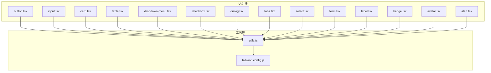
```mermaid
graph TB
subgraph "UI组件"
Button["button.tsx"]
Input["input.tsx"]
Card["card.tsx"]
Table["table.tsx"]
Dropdown["dropdown-menu.tsx"]
Checkbox["checkbox.tsx"]
Dialog["dialog.tsx"]
Tabs["tabs.tsx"]
Select["select.tsx"]
Form["form.tsx"]
Label["label.tsx"]
Badge["badge.tsx"]
Avatar["avatar.tsx"]
Alert["alert.tsx"]
end
subgraph "工具库"
Utils["utils.ts"]
Tailwind["tailwind.config.js"]
end
Button --> Utils
Input --> Utils
Card --> Utils
Table --> Utils
Dropdown --> Utils
Checkbox --> Utils
Dialog --> Utils
Tabs --> Utils
Select --> Utils
Form --> Utils
Label --> Utils
Badge --> Utils
Avatar --> Utils
Alert --> Utils
Utils --> Tailwind
```

**图示来源**
- [button.tsx](file://src/components/ui/button.tsx)
- [utils.ts](file://src/lib/utils.ts)
- [tailwind.config.js](file://tailwind.config.js)

**本节来源**
- [src/components/ui](file://src/components/ui)
- [src/lib/utils.ts](file://src/lib/utils.ts)

## 核心组件
核心组件包括按钮、输入框、卡片、表格、下拉菜单等基础UI元素。这些组件通过Radix UI提供无障碍访问支持，并使用Tailwind CSS进行样式定制。组件设计遵循原子化原则，每个组件都有明确的职责和接口定义。

**本节来源**
- [button.tsx](file://src/components/ui/button.tsx)
- [input.tsx](file://src/components/ui/input.tsx)
- [card.tsx](file://src/components/ui/card.tsx)
- [table.tsx](file://src/components/ui/table.tsx)

## 架构概述
该UI组件库采用分层架构设计，底层依赖Radix UI原语提供无障碍访问和交互逻辑，中层通过Tailwind CSS进行样式定制，上层提供简洁的API接口供应用层使用。组件间通过标准的React Props进行通信，状态管理由父组件或表单库负责。

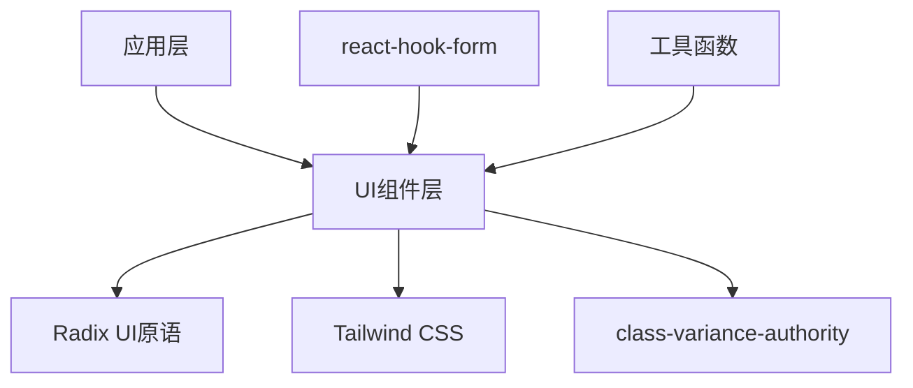
```mermaid
graph TD
A[应用层] --> B[UI组件层]
B --> C[Radix UI原语]
B --> D[Tailwind CSS]
B --> E[class-variance-authority]
F[react-hook-form] --> B
G[工具函数] --> B
```

**图示来源**
- [button.tsx](file://src/components/ui/button.tsx)
- [form.tsx](file://src/components/ui/form.tsx)
- [utils.ts](file://src/lib/utils.ts)

## 详细组件分析
本节将深入分析各个关键组件的实现细节、API接口和使用方式。

### 按钮组件分析
按钮组件是用户界面中最基本的交互元素之一，提供了多种变体和尺寸选项。

#### 组件接口
按钮组件通过`ButtonProps`接口定义其属性，继承自原生按钮元素属性并扩展了变体支持。

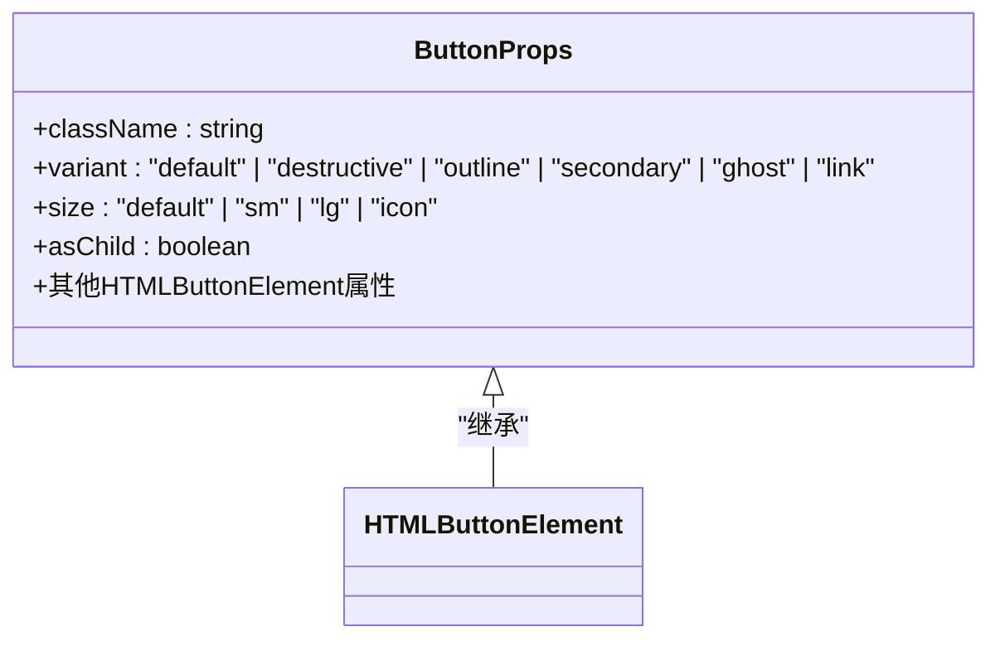
```mermaid
classDiagram
class ButtonProps {
+className : string
+variant : "default" | "destructive" | "outline" | "secondary" | "ghost" | "link"
+size : "default" | "sm" | "lg" | "icon"
+asChild : boolean
+其他HTMLButtonElement属性
}
ButtonProps <|-- HTMLButtonElement : "继承"
```

**图示来源**
- [button.tsx](file://src/components/ui/button.tsx#L37-L41)

#### 变体系统
按钮组件使用class-variance-authority（cva）创建变体系统，定义了不同状态下的样式。

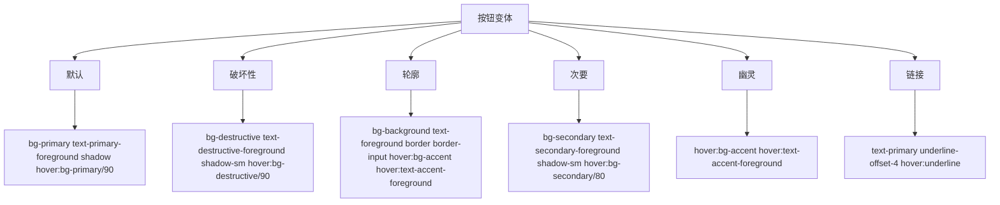
```mermaid
graph TD
A[按钮变体] --> B[默认]
A --> C[破坏性]
A --> D[轮廓]
A --> E[次要]
A --> F[幽灵]
A --> G[链接]
B --> H["bg-primary text-primary-foreground shadow hover:bg-primary/90"]
C --> I["bg-destructive text-destructive-foreground shadow-sm hover:bg-destructive/90"]
D --> J["bg-background text-foreground border border-input hover:bg-accent hover:text-accent-foreground"]
E --> K["bg-secondary text-secondary-foreground shadow-sm hover:bg-secondary/80"]
F --> L["hover:bg-accent hover:text-accent-foreground"]
G --> M["text-primary underline-offset-4 hover:underline"]
```

**图示来源**
- [button.tsx](file://src/components/ui/button.tsx#L7-L35)

#### 状态管理
按钮组件处理多种UI状态，包括悬停、焦点、禁用等，通过Tailwind的伪类选择器实现。

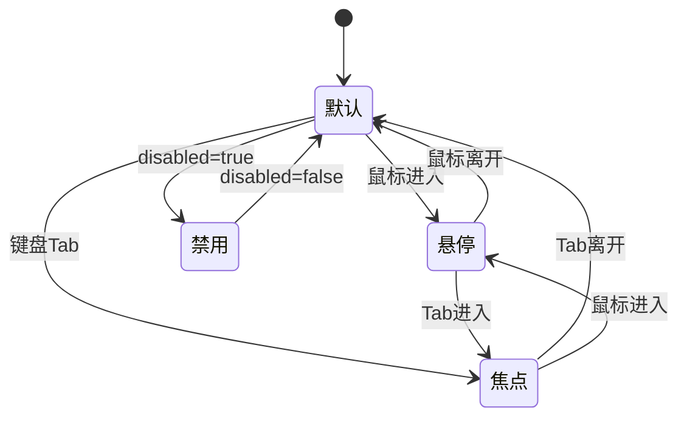
```mermaid
stateDiagram-v2
[*] --> 默认
默认 --> 悬停 : 鼠标进入
悬停 --> 默认 : 鼠标离开
默认 --> 焦点 : 键盘Tab
焦点 --> 默认 : Tab离开
默认 --> 禁用 : disabled=true
禁用 --> 默认 : disabled=false
悬停 --> 焦点 : Tab进入
焦点 --> 悬停 : 鼠标进入
```

**图示来源**
- [button.tsx](file://src/components/ui/button.tsx#L8-L9)

**本节来源**
- [button.tsx](file://src/components/ui/button.tsx)

### 输入框组件分析
输入框组件提供基础的文本输入功能，支持无障碍访问和错误状态处理。

#### 组件实现
输入框组件是一个简单的函数组件，通过`cn`工具函数合并类名，实现样式定制。

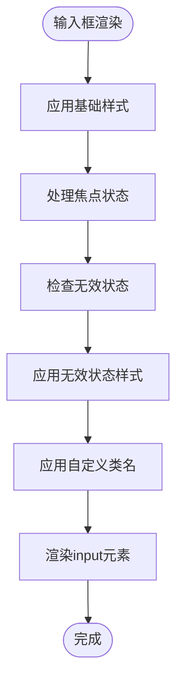
```mermaid
flowchart TD
Start([输入框渲染]) --> ApplyBaseStyles["应用基础样式"]
ApplyBaseStyles --> HandleFocus["处理焦点状态"]
HandleFocus --> CheckInvalid["检查无效状态"]
CheckInvalid --> ApplyInvalidStyles["应用无效状态样式"]
ApplyInvalidStyles --> ApplyCustomClass["应用自定义类名"]
ApplyCustomClass --> Render["渲染input元素"]
Render --> End([完成])
```

**图示来源**
- [input.tsx](file://src/components/ui/input.tsx)

#### 无障碍访问
输入框组件通过ARIA属性和语义化HTML确保屏幕阅读器兼容性，支持键盘导航。

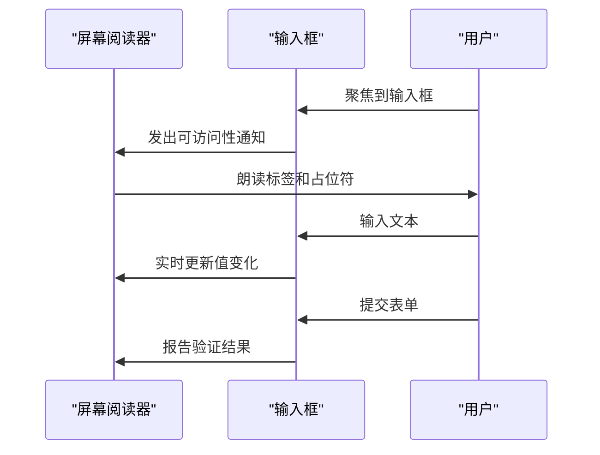
```mermaid
sequenceDiagram
participant ScreenReader as "屏幕阅读器"
participant Input as "输入框"
participant User as "用户"
User->>Input : 聚焦到输入框
Input->>ScreenReader : 发出可访问性通知
ScreenReader->>User : 朗读标签和占位符
User->>Input : 输入文本
Input->>ScreenReader : 实时更新值变化
User->>Input : 提交表单
Input->>ScreenReader : 报告验证结果
```

**图示来源**
- [input.tsx](file://src/components/ui/input.tsx)
- [label.tsx](file://src/components/ui/label.tsx)

**本节来源**
- [input.tsx](file://src/components/ui/input.tsx)
- [label.tsx](file://src/components/ui/label.tsx)

### 卡片组件分析
卡片组件是一个复合组件，由多个子组件组成，提供结构化的信息展示。

#### 组件结构
卡片组件包含标题、描述、内容、页脚等多个部分，通过数据属性进行语义化标记。

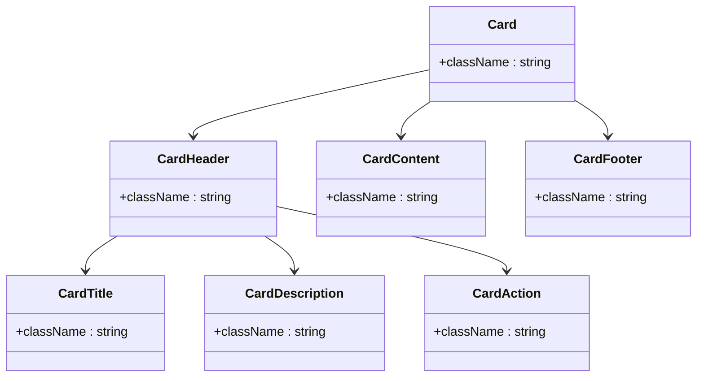
```mermaid
classDiagram
class Card {
+className : string
}
class CardHeader {
+className : string
}
class CardTitle {
+className : string
}
class CardDescription {
+className : string
}
class CardContent {
+className : string
}
class CardFooter {
+className : string
}
class CardAction {
+className : string
}
Card --> CardHeader
CardHeader --> CardTitle
CardHeader --> CardDescription
CardHeader --> CardAction
Card --> CardContent
Card --> CardFooter
```

**图示来源**
- [card.tsx](file://src/components/ui/card.tsx)

#### 布局系统
卡片组件使用CSS Grid和Flexbox实现灵活的布局，支持响应式设计。

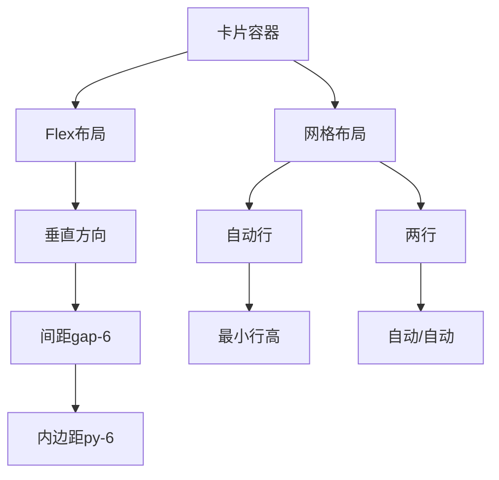
```mermaid
flowchart TD
A[卡片容器] --> B[Flex布局]
B --> C[垂直方向]
C --> D[间距gap-6]
D --> E[内边距py-6]
A --> F[网格布局]
F --> G[自动行]
G --> H[最小行高]
F --> I[两行]
I --> J[自动/自动]
```

**图示来源**
- [card.tsx](file://src/components/ui/card.tsx#L10)

**本节来源**
- [card.tsx](file://src/components/ui/card.tsx)

### 表格组件分析
表格组件提供数据展示功能，支持排序、选择和响应式布局。

#### 组件层次
表格组件由多个语义化子组件构成，确保无障碍访问和结构清晰。

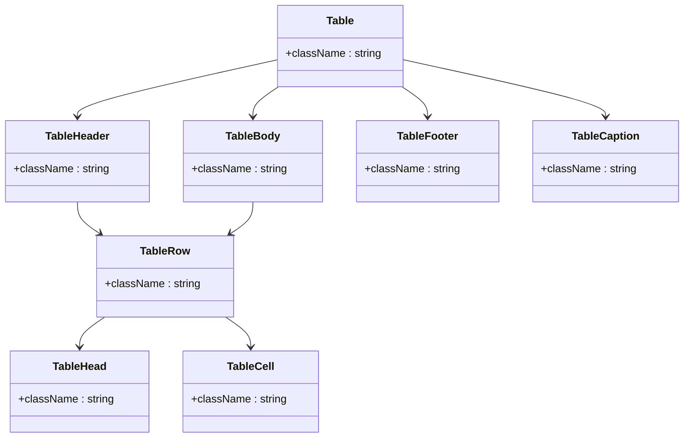
```mermaid
classDiagram
class Table {
+className : string
}
class TableHeader {
+className : string
}
class TableBody {
+className : string
}
class TableFooter {
+className : string
}
class TableRow {
+className : string
}
class TableHead {
+className : string
}
class TableCell {
+className : string
}
class TableCaption {
+className : string
}
Table --> TableHeader
Table --> TableBody
Table --> TableFooter
Table --> TableCaption
TableHeader --> TableRow
TableRow --> TableHead
TableBody --> TableRow
TableRow --> TableCell
```

**图示来源**
- [table.tsx](file://src/components/ui/table.tsx)

#### 交互行为
表格组件支持行悬停高亮和选择状态，通过数据属性管理组件状态。

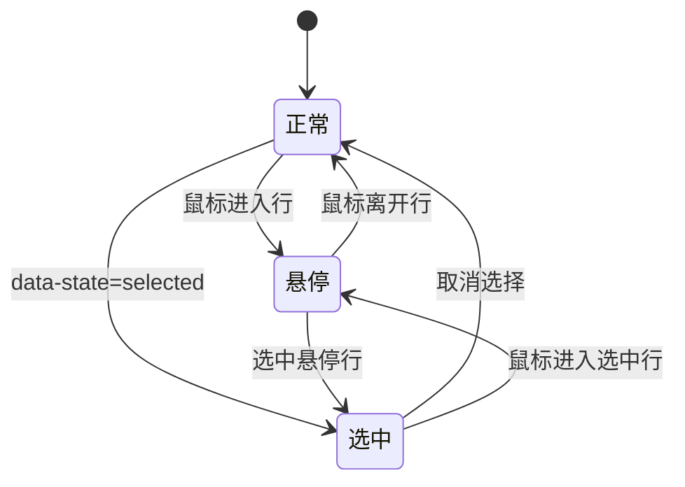
```mermaid
stateDiagram-v2
[*] --> 正常
正常 --> 悬停 : 鼠标进入行
悬停 --> 正常 : 鼠标离开行
正常 --> 选中 : data-state=selected
选中 --> 正常 : 取消选择
悬停 --> 选中 : 选中悬停行
选中 --> 悬停 : 鼠标进入选中行
```

**图示来源**
- [table.tsx](file://src/components/ui/table.tsx#L58)

**本节来源**
- [table.tsx](file://src/components/ui/table.tsx)

### 下拉菜单组件分析
下拉菜单组件提供复杂的菜单交互，支持嵌套子菜单和多种菜单项类型。

#### 组件组成
下拉菜单由触发器、内容、项目、分隔符等多个部分组成，形成完整的菜单系统。

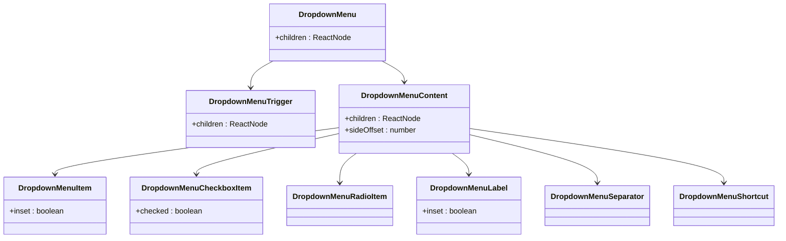
```mermaid
classDiagram
class DropdownMenu {
+children : ReactNode
}
class DropdownMenuTrigger {
+children : ReactNode
}
class DropdownMenuContent {
+children : ReactNode
+sideOffset : number
}
class DropdownMenuItem {
+inset : boolean
}
class DropdownMenuCheckboxItem {
+checked : boolean
}
class DropdownMenuRadioItem {
}
class DropdownMenuLabel {
+inset : boolean
}
class DropdownMenuSeparator {
}
class DropdownMenuShortcut {
}
DropdownMenu --> DropdownMenuTrigger
DropdownMenu --> DropdownMenuContent
DropdownMenuContent --> DropdownMenuItem
DropdownMenuContent --> DropdownMenuCheckboxItem
DropdownMenuContent --> DropdownMenuRadioItem
DropdownMenuContent --> DropdownMenuLabel
DropdownMenuContent --> DropdownMenuSeparator
DropdownMenuContent --> DropdownMenuShortcut
```

**图示来源**
- [dropdown-menu.tsx](file://src/components/ui/dropdown-menu.tsx)

#### 键盘导航
下拉菜单组件实现完整的键盘导航支持，符合WAI-ARIA最佳实践。

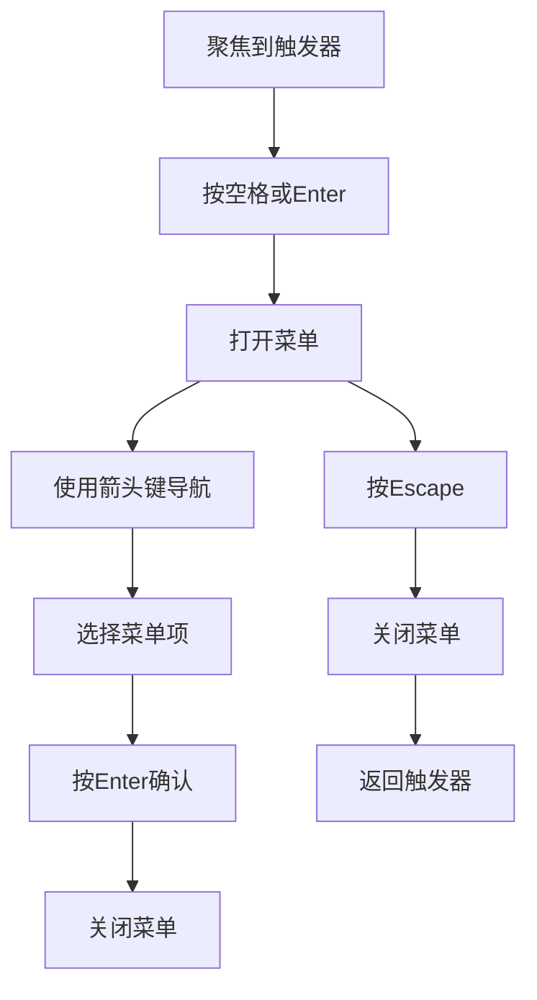
```mermaid
flowchart TD
A[聚焦到触发器] --> B[按空格或Enter]
B --> C[打开菜单]
C --> D[使用箭头键导航]
D --> E[选择菜单项]
E --> F[按Enter确认]
F --> G[关闭菜单]
C --> H[按Escape]
H --> I[关闭菜单]
I --> J[返回触发器]
```

**图示来源**
- [dropdown-menu.tsx](file://src/components/ui/dropdown-menu.tsx)

**本节来源**
- [dropdown-menu.tsx](file://src/components/ui/dropdown-menu.tsx)

### 复选框组件分析
复选框组件封装Radix UI的复选框原语，提供视觉指示器和状态管理。

#### 视觉反馈
复选框组件通过数据属性和CSS类名提供视觉反馈，显示不同状态。

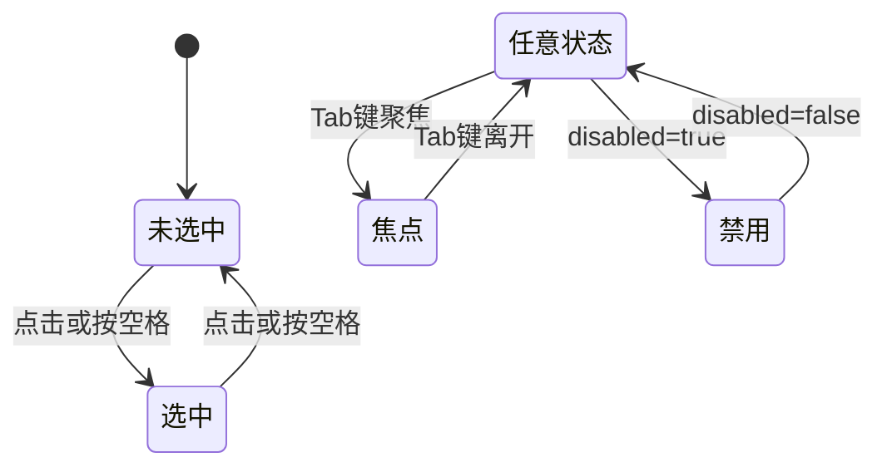
```mermaid
stateDiagram-v2
[*] --> 未选中
未选中 --> 选中 : 点击或按空格
选中 --> 未选中 : 点击或按空格
任意状态 --> 焦点 : Tab键聚焦
焦点 --> 任意状态 : Tab键离开
任意状态 --> 禁用 : disabled=true
禁用 --> 任意状态 : disabled=false
```

**图示来源**
- [checkbox.tsx](file://src/components/ui/checkbox.tsx)

#### 指示器实现
复选框使用Radix UI的Indicator组件，在选中时显示检查图标。

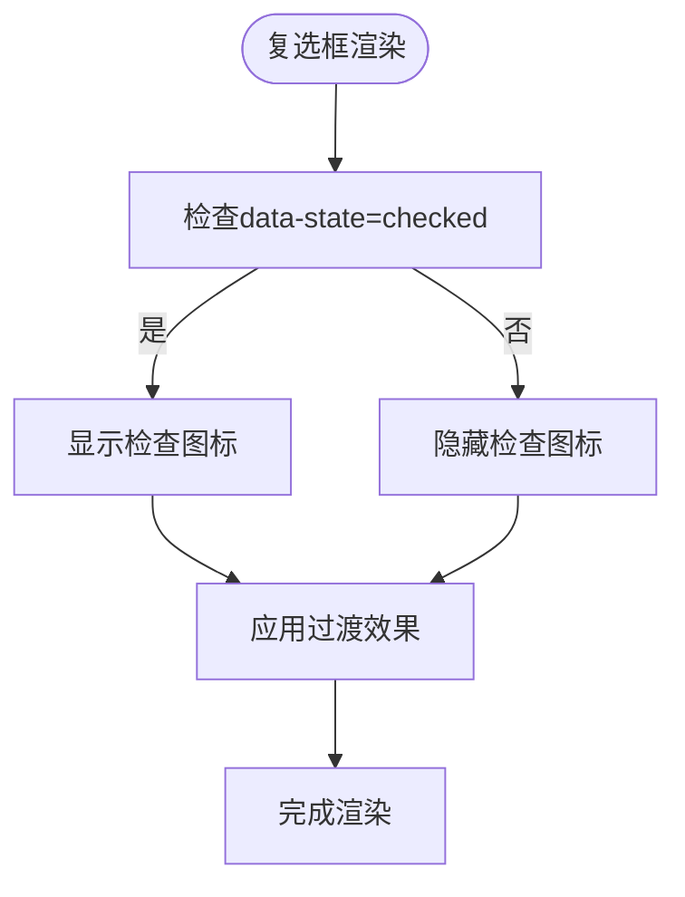
```mermaid
flowchart TD
Start([复选框渲染]) --> CheckState["检查data-state=checked"]
CheckState --> |是| ShowIndicator["显示检查图标"]
CheckState --> |否| HideIndicator["隐藏检查图标"]
ShowIndicator --> ApplyTransition["应用过渡效果"]
HideIndicator --> ApplyTransition
ApplyTransition --> Complete["完成渲染"]
```

**图示来源**
- [checkbox.tsx](file://src/components/ui/checkbox.tsx#L20-L25)

**本节来源**
- [checkbox.tsx](file://src/components/ui/checkbox.tsx)

### 对话框组件分析
对话框组件提供模态和非模态对话框功能，包含遮罩层和可访问性支持。

#### 组件结构
对话框由根组件、触发器、内容、遮罩层、标题、描述等多个部分组成。

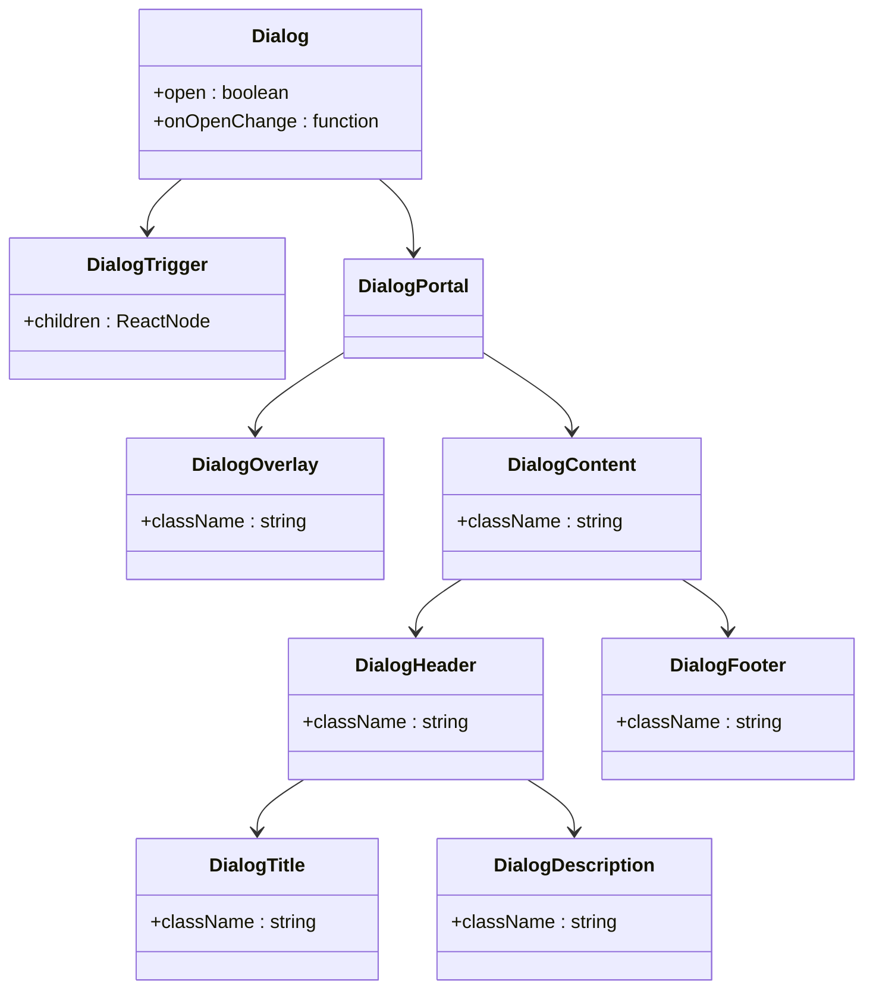
```mermaid
classDiagram
class Dialog {
+open : boolean
+onOpenChange : function
}
class DialogTrigger {
+children : ReactNode
}
class DialogPortal {
}
class DialogOverlay {
+className : string
}
class DialogContent {
+className : string
}
class DialogHeader {
+className : string
}
class DialogFooter {
+className : string
}
class DialogTitle {
+className : string
}
class DialogDescription {
+className : string
}
Dialog --> DialogTrigger
Dialog --> DialogPortal
DialogPortal --> DialogOverlay
DialogPortal --> DialogContent
DialogContent --> DialogHeader
DialogHeader --> DialogTitle
DialogHeader --> DialogDescription
DialogContent --> DialogFooter
```

**图示来源**
- [dialog.tsx](file://src/components/ui/dialog.tsx)

#### 遮罩层动画
对话框遮罩层使用数据属性控制动画，实现平滑的淡入淡出效果。

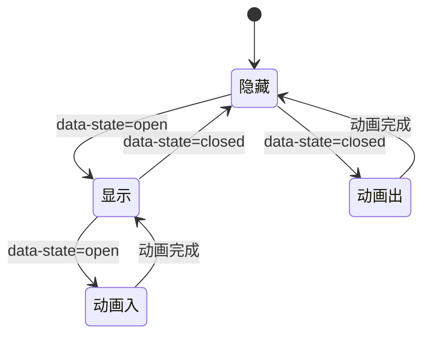
```mermaid
stateDiagram-v2
[*] --> 隐藏
隐藏 --> 显示 : data-state=open
显示 --> 隐藏 : data-state=closed
隐藏 --> 动画出 : data-state=closed
动画出 --> 隐藏 : 动画完成
显示 --> 动画入 : data-state=open
动画入 --> 显示 : 动画完成
```

**图示来源**
- [dialog.tsx](file://src/components/ui/dialog.tsx#L41)

**本节来源**
- [dialog.tsx](file://src/components/ui/dialog.tsx)

### 标签页组件分析
标签页组件提供选项卡式界面，支持水平布局和状态切换。

#### 样式系统
标签页组件使用复杂的状态样式系统，区分激活、悬停和默认状态。

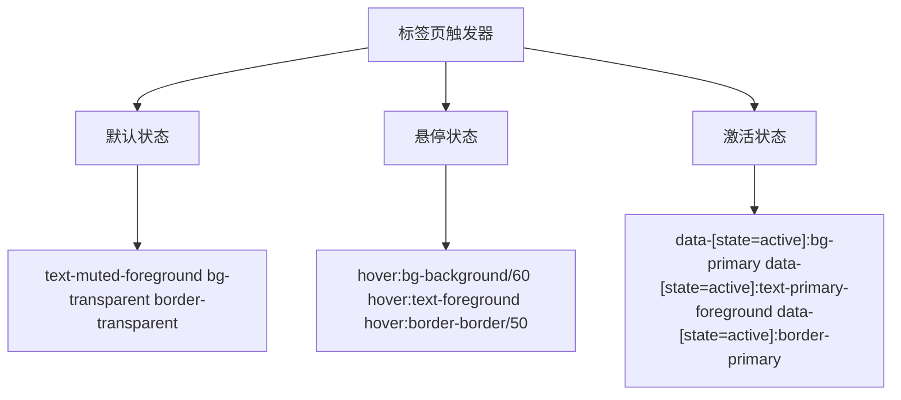
```mermaid
graph TD
A[标签页触发器] --> B[默认状态]
A --> C[悬停状态]
A --> D[激活状态]
B --> E["text-muted-foreground bg-transparent border-transparent"]
C --> F["hover:bg-background/60 hover:text-foreground hover:border-border/50"]
D --> G["data-[state=active]:bg-primary data-[state=active]:text-primary-foreground data-[state=active]:border-primary"]
```

**图示来源**
- [tabs.tsx](file://src/components/ui/tabs.tsx#L49-L59)

#### 布局结构
标签页组件使用Flexbox布局，确保标签项均匀分布。

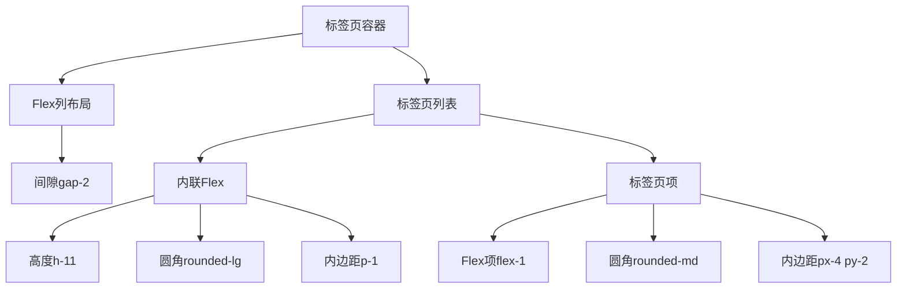
```mermaid
flowchart TD
A[标签页容器] --> B[Flex列布局]
B --> C[间隙gap-2]
A --> D[标签页列表]
D --> E[内联Flex]
E --> F[高度h-11]
E --> G[圆角rounded-lg]
E --> H[内边距p-1]
D --> I[标签页项]
I --> J[Flex项flex-1]
I --> K[圆角rounded-md]
I --> L[内边距px-4 py-2]
```

**图示来源**
- [tabs.tsx](file://src/components/ui/tabs.tsx)

**本节来源**
- [tabs.tsx](file://src/components/ui/tabs.tsx)

### 选择器组件分析
选择器组件提供下拉选择功能，支持滚动按钮和键盘导航。

#### 组件层次
选择器由触发器、内容、项目、滚动按钮等多个部分组成。

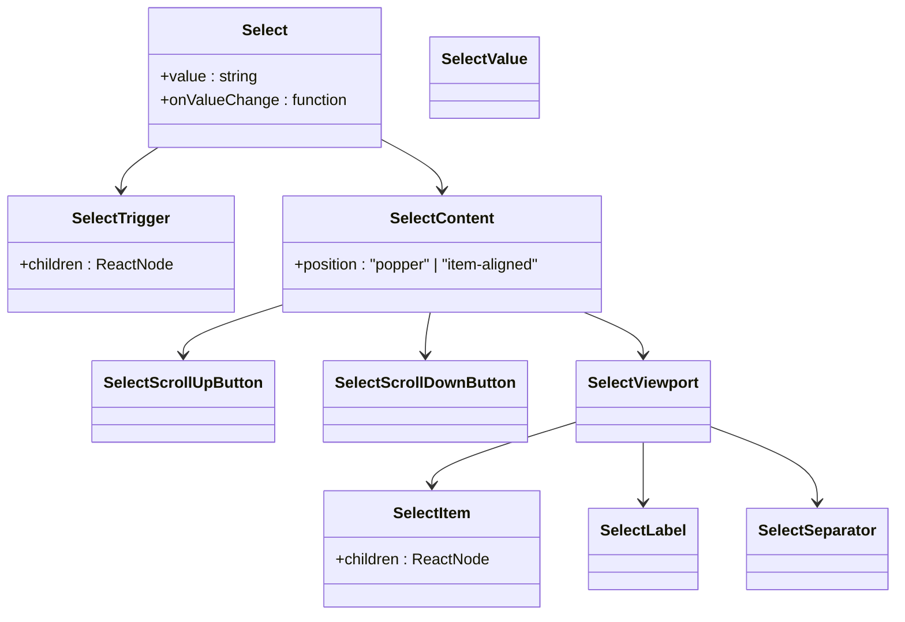
```mermaid
classDiagram
class Select {
+value : string
+onValueChange : function
}
class SelectTrigger {
+children : ReactNode
}
class SelectContent {
+position : "popper" | "item-aligned"
}
class SelectItem {
+children : ReactNode
}
class SelectScrollUpButton {
}
class SelectScrollDownButton {
}
class SelectValue {
}
class SelectLabel {
}
class SelectSeparator {
}
Select --> SelectTrigger
Select --> SelectContent
SelectContent --> SelectScrollUpButton
SelectContent --> SelectViewport
SelectContent --> SelectScrollDownButton
SelectViewport --> SelectItem
SelectViewport --> SelectLabel
SelectViewport --> SelectSeparator
```

**图示来源**
- [select.tsx](file://src/components/ui/select.tsx)

#### 滚动机制
选择器组件在内容过长时显示滚动按钮，支持鼠标和键盘滚动。

```mermaid
flowchart TD
A[选择器打开] --> B[检查内容高度]
B --> |超过最大高度| C[显示滚动按钮]
B --> |未超过| D[隐藏滚动按钮]
C --> E[点击上滚动按钮]
E --> F[向上滚动]
C --> G[点击下滚动按钮]
G --> H[向下滚动]
C --> I[使用键盘箭头]
I --> J[滚动视口]
```

**图示来源**
- [select.tsx](file://src/components/ui/select.tsx)

**本节来源**
- [select.tsx](file://src/components/ui/select.tsx)

### 表单组件分析
表单组件基于react-hook-form构建，提供字段注册、验证和错误处理功能。

#### 组件架构
表单组件使用React Context管理字段状态，实现高效的重新渲染。

```mermaid
classDiagram
class Form {
+children : ReactNode
}
class FormField {
+name : string
+render : function
}
class FormItem {
+children : ReactNode
}
class FormLabel {
+children : ReactNode
}
class FormControl {
+children : ReactNode
}
class FormDescription {
+children : ReactNode
}
class FormMessage {
+children : ReactNode
}
Form --> FormField
FormField --> FormItem
FormItem --> FormLabel
FormItem --> FormControl
FormItem --> FormDescription
FormItem --> FormMessage
```

**图示来源**
- [form.tsx](file://src/components/ui/form.tsx)

#### 状态流
表单组件通过Context传递字段状态，实现标签和消息的自动关联。

```mermaid
sequenceDiagram
participant Form as "表单"
participant Field as "字段"
participant Context as "FormFieldContext"
participant Item as "FormItemContext"
Form->>Field : 渲染FormField
Field->>Context : 提供字段名称
Context->>Field : 创建Controller
Field->>Item : 渲染FormItem
Item->>Item : 生成唯一ID
Item->>Item : 提供ID到Context
FormLabel->>Context : 使用useFormField
FormLabel->>Context : 获取字段状态和ID
FormLabel->>FormLabel : 设置htmlFor属性
```

**图示来源**
- [form.tsx](file://src/components/ui/form.tsx)

**本节来源**
- [form.tsx](file://src/components/ui/form.tsx)

### 徽章组件分析
徽章组件提供小型标签功能，支持不同变体和图标。

#### 变体系统
徽章组件定义了多种视觉变体，满足不同场景需求。

```mermaid
graph TD
A[徽章变体] --> B[默认]
A --> C[次要]
A --> D[破坏性]
A --> E[轮廓]
B --> F["border-transparent bg-primary text-primary-foreground"]
C --> G["border-transparent bg-secondary text-secondary-foreground"]
D --> H["border-transparent bg-destructive text-white"]
E --> I["text-foreground"]
```

**图示来源**
- [badge.tsx](file://src/components/ui/badge.tsx#L11-L20)

#### 图标支持
徽章组件支持在内容前添加图标，通过CSS选择器控制样式。

```mermaid
flowchart TD
A[徽章渲染] --> B[检查子元素]
B --> C{包含SVG图标?}
C --> |是| D[应用图标样式]
D --> E["[&>svg]:size-3 gap-1 [&>svg]:pointer-events-none"]
C --> |否| F[正常渲染]
E --> G[完成]
F --> G
```

**图示来源**
- [badge.tsx](file://src/components/ui/badge.tsx#L8)

**本节来源**
- [badge.tsx](file://src/components/ui/badge.tsx)

### 头像组件分析
头像组件提供用户头像展示功能，支持图片和占位符。

#### 组件组成
头像组件由根容器、图片和备用内容三个部分组成。

```mermaid
classDiagram
class Avatar {
+children : ReactNode
}
class AvatarImage {
+src : string
+alt : string
}
class AvatarFallback {
+children : ReactNode
}
Avatar --> AvatarImage
Avatar --> AvatarFallback
```

**图示来源**
- [avatar.tsx](file://src/components/ui/avatar.tsx)

#### 样式特性
头像组件使用相对定位和溢出隐藏，确保图片裁剪效果。

```mermaid
flowchart TD
A[头像容器] --> B["position: relative"]
B --> C["overflow: hidden"]
C --> D["border-radius: 50%"]
D --> E[圆形裁剪]
A --> F[头像图片]
F --> G["position: absolute"]
G --> H["width: 100%"]
H --> I["height: 100%"]
I --> J[覆盖容器]
```

**图示来源**
- [avatar.tsx](file://src/components/ui/avatar.tsx#L14)

**本节来源**
- [avatar.tsx](file://src/components/ui/avatar.tsx)

### 警告组件分析
警告组件提供信息提示功能，支持标题和描述内容。

#### 语义结构
警告组件使用ARIA角色和语义化标签，确保可访问性。

```mermaid
classDiagram
class Alert {
+variant : "default" | "destructive"
+children : ReactNode
}
class AlertTitle {
+children : ReactNode
}
class AlertDescription {
+children : ReactNode
}
Alert --> AlertTitle
Alert --> AlertDescription
```

**图示来源**
- [alert.tsx](file://src/components/ui/alert.tsx)

#### 网格布局
警告组件使用CSS Grid布局，支持图标和文本的对齐。

```mermaid
flowchart TD
A[警告容器] --> B["display: grid"]
B --> C["grid-template-columns: auto 1fr"]
C --> D[两列布局]
D --> E[第一列: 图标]
D --> F[第二列: 文本]
A --> G[图标检查]
G --> H{包含SVG?}
H --> |是| I[应用has-[>svg]样式]
I --> J["grid-cols-[calc(var(--spacing)*4)_1fr]"]
```

**图示来源**
- [alert.tsx](file://src/components/ui/alert.tsx#L7)

**本节来源**
- [alert.tsx](file://src/components/ui/alert.tsx)

## 依赖分析
该UI组件库依赖多个外部库和工具，形成完整的开发堆栈。

```mermaid
graph TD
A[UI组件库] --> B[Radix UI]
A --> C[Tailwind CSS]
A --> D[class-variance-authority]
A --> E[clsx]
A --> F[tailwind-merge]
A --> G[react-hook-form]
A --> H[lucide-react]
B --> I[无障碍访问]
C --> J[实用优先CSS]
D --> K[条件类名]
E --> L[类名合并]
F --> M[类名优化]
G --> N[表单管理]
H --> O[图标系统]
```

**图示来源**
- [package.json](file://package.json)
- [tailwind.config.js](file://tailwind.config.js)

**本节来源**
- [package.json](file://package.json)
- [tailwind.config.js](file://tailwind.config.js)

## 性能考虑
组件库在设计时考虑了性能优化，避免不必要的重新渲染和布局抖动。

- 使用`React.memo`和`useCallback`减少重新渲染
- 通过`data-slot`属性优化样式作用域
- 使用`cn`工具函数合并类名，减少重复
- 避免内联对象和函数创建
- 使用虚拟化技术处理大型列表

**本节来源**
- [button.tsx](file://src/components/ui/button.tsx)
- [utils.ts](file://src/lib/utils.ts)

## 故障排除指南
当组件出现问题时，可以参考以下常见问题的解决方案。

- **样式未应用**: 检查`tailwind.config.js`是否正确配置
- **交互失效**: 确认组件在客户端渲染，使用`"use client"`
- **图标不显示**: 确保`lucide-react`已正确安装和导入
- **类型错误**: 检查组件Props是否符合接口定义
- **无障碍问题**: 验证ARIA属性和键盘导航是否正常工作

**本节来源**
- [dialog.tsx](file://src/components/ui/dialog.tsx#L1)
- [dropdown-menu.tsx](file://src/components/ui/dropdown-menu.tsx#L1)

## 结论
该UI组件库通过封装Radix UI原语，提供了高质量、无障碍的原子化组件。结合Tailwind CSS的实用优先方法，实现了灵活的样式定制和主题扩展。组件设计考虑了性能、可访问性和开发者体验，为构建现代化Web应用提供了坚实的基础。