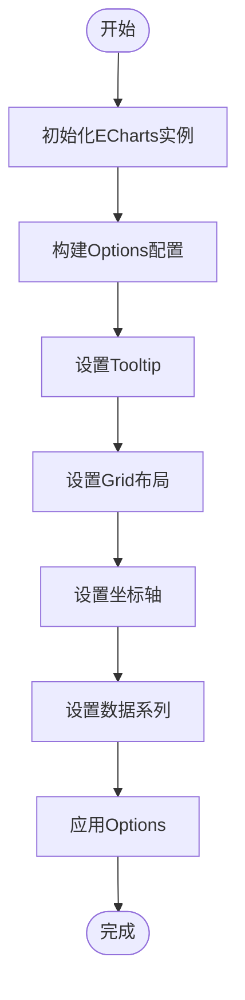
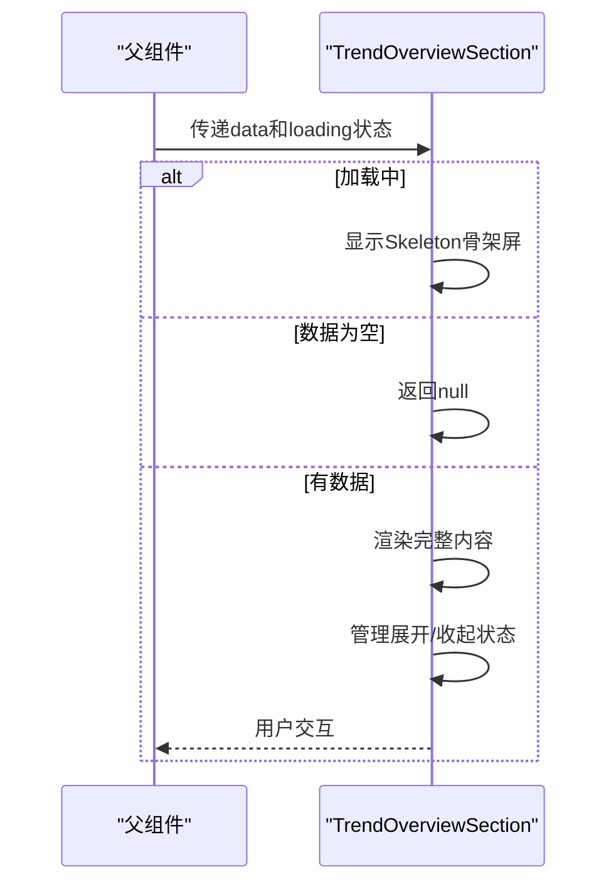
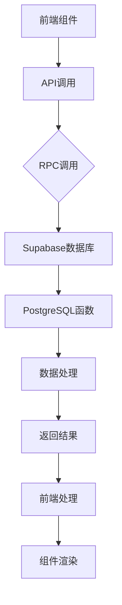

# 业务组件

<cite>
**本文档引用文件**   
- [TrendChart.tsx](file://src/components/charts/TrendChart.tsx)
- [PieChart.tsx](file://src/components/charts/PieChart.tsx)
- [TrendOverviewChart.tsx](file://src/components/charts/TrendOverviewChart.tsx)
- [StatsCard.tsx](file://src/components/home/StatsCard.tsx)
- [StatisticsInfo.tsx](file://src/components/common/StatisticsInfo.tsx)
- [TrendOverviewSection.tsx](file://src/components/trend/TrendOverviewSection.tsx)
- [colors.ts](file://src/lib/colors.ts)
- [use-debounce.ts](file://src/hooks/use-debounce.ts)
- [api.ts](file://src/db/api.ts)
- [TrendAnalysisPage.tsx](file://src/pages/TrendAnalysisPage.tsx)
</cite>

## 目录
1. [引言](#引言)
2. [图表组件设计](#图表组件设计)
3. [数据适配层实现](#数据适配层实现)
4. [响应式更新机制](#响应式更新机制)
5. [性能优化策略](#性能优化策略)
6. [统计卡片组件](#统计卡片组件)
7. [趋势概览组件](#趋势概览组件)
8. [组件集成实践](#组件集成实践)
9. [错误处理与加载状态](#错误处理与加载状态)
10. [最佳实践总结](#最佳实践总结)

## 引言

本文档详细阐述了监管平台中核心业务组件的设计与实现，重点分析了基于ECharts的图表组件与业务逻辑的紧密结合方式。文档涵盖了TrendChart、PieChart等图表组件的数据适配层设计，包括options生成逻辑、响应式更新机制和性能优化策略。同时，详细说明了StatsCard和StatisticsInfo组件如何从API获取数据并进行格式化展示，以及TrendOverviewSection组件如何组合多个图表形成聚合视图。

## 图表组件设计

### TrendChart组件

TrendChart组件是一个基于ECharts的折线图封装组件，用于展示时间序列数据的趋势变化。该组件通过props接收数据和配置参数，生成相应的图表options并渲染。

**组件特性：**
- 支持月度和年度两种时间维度展示
- 具备平滑曲线和面积填充效果
- 提供自定义tooltip样式和交互效果
- 支持响应式设计，适配不同屏幕尺寸

**数据结构设计：**
```typescript
interface TrendChartProps {
  data: { month: string; count: number }[] | { year: string; count: number }[];
  title: string;
  type?: 'monthly' | 'yearly';
}
```

**Section sources**
- [TrendChart.tsx](file://src/components/charts/TrendChart.tsx#L6-L10)

### PieChart组件

PieChart组件是一个基于ECharts的饼图封装组件，用于展示分类数据的占比情况。该组件具有丰富的配置选项和响应式布局能力。

**组件特性：**
- 支持水平和垂直两种图例布局
- 具备滚动分页功能，处理大量分类数据
- 提供百分比显示选项
- 支持数据截断和"其他"类别聚合

**数据结构设计：**
```typescript
interface PieChartProps {
  data: { name: string; count: number }[];
  title: string;
  children?: ReactNode;
  tooltipContent?: ReactNode;
  showHeader?: boolean;
  className?: string;
  limit?: number;
  showPercentage?: boolean;
}
```

**Section sources**
- [PieChart.tsx](file://src/components/charts/PieChart.tsx#L8-L17)

## 数据适配层实现

### Options生成逻辑

图表组件的核心是将业务数据转换为ECharts可识别的options配置对象。TrendChart组件通过useEffect钩子在数据变化时重新生成options。

**TrendChart options生成流程：**
1. 初始化ECharts实例
2. 构建完整的options配置对象
3. 设置tooltip、grid、坐标轴等基础配置
4. 配置xAxis数据映射和显示样式
5. 定义series数据系列和视觉效果
6. 应用options到ECharts实例



**Diagram sources **
- [TrendChart.tsx](file://src/components/charts/TrendChart.tsx#L20-L115)

### 颜色管理策略

系统通过colors.ts文件集中管理图表颜色，确保视觉一致性。颜色配置使用HSL格式而非CSS变量，以兼容Canvas渲染器。

**颜色配置特点：**
- 定义主色、辅色和调色板
- 支持带透明度的颜色生成函数
- 提供10种颜色的调色板，满足多数据系列展示需求

```typescript
export const chartColors = {
  primary: 'hsl(213, 78%, 35%)',
  secondary: 'hsl(18, 95%, 55%)',
  chart1: 'hsl(213, 78%, 35%)',
  // ...其他颜色
};

export const chartColorsWithAlpha = {
  primary: (alpha: number) => `hsla(213, 78%, 35%, ${alpha})`,
  // ...其他带透明度颜色
};
```

**Section sources**
- [colors.ts](file://src/lib/colors.ts#L4-L50)

## 响应式更新机制

### 数据变化监听

图表组件使用React的useEffect钩子监听数据变化，实现响应式更新。当props中的data或type参数发生变化时，组件会重新生成图表配置。

**TrendChart响应式更新实现：**
```typescript
useEffect(() => {
  if (!chartRef.current || !data.length) return;
  
  const chart = echarts.init(chartRef.current);
  const option = generateChartOption(data, type);
  chart.setOption(option);
  
  const handleResize = () => chart.resize();
  window.addEventListener('resize', handleResize);
  
  return () => {
    window.removeEventListener('resize', handleResize);
    chart.dispose();
  };
}, [data, type]);
```

**Section sources**
- [TrendChart.tsx](file://src/components/charts/TrendChart.tsx#L15-L126)

### 屏幕尺寸适配

PieChart组件通过ResizeObserver监听容器尺寸变化，动态调整布局和显示效果。

**屏幕尺寸适配逻辑：**
- 小屏幕（<768px）：水平图例，紧凑布局
- 中等屏幕（768-1024px）：垂直图例，中等布局
- 大屏幕（>1024px）：垂直图例，宽松布局

```typescript
useEffect(() => {
  const container = containerRef.current;
  if (!container) return;

  const observer = new ResizeObserver((entries) => {
    const width = entries[0].contentRect.width;
    const nextLayout = width < 768 ? 'sm' : width < 1024 ? 'md' : 'lg';
    setLayout(nextLayout);
  });

  observer.observe(container);
  return () => observer.disconnect();
}, []);
```

**Section sources**
- [PieChart.tsx](file://src/components/charts/PieChart.tsx#L32-L54)

## 性能优化策略

### 防抖处理

系统使用use-debounce自定义钩子实现防抖功能，避免频繁的状态更新。

**防抖钩子实现：**
```typescript
export function useDebounce<T>(value: T, delay?: number): T {
  const [debouncedValue, setDebouncedValue] = React.useState<T>(value);

  React.useEffect(() => {
    const timer = setTimeout(() => setDebouncedValue(value), delay ?? 500);
    return () => clearTimeout(timer);
  }, [value, delay]);

  return debouncedValue;
}
```

**Section sources**
- [use-debounce.ts](file://src/hooks/use-debounce.ts#L3-L14)

### 懒加载优化

PieChart组件通过ReactECharts的lazyUpdate和notMerge属性优化渲染性能。

**懒加载配置：**
- `notMerge`: 避免不必要的配置合并
- `lazyUpdate`: 延迟更新，提高渲染效率
- `opts.renderer`: 使用SVG渲染器

```typescript
<ReactECharts
  option={option}
  style={{ height: '100%', width: '100%', touchAction: 'none' }}
  notMerge
  lazyUpdate
  opts={{ renderer: 'svg' }}
/>
```

**Section sources**
- [PieChart.tsx](file://src/components/charts/PieChart.tsx#L180-L182)

### 数据截断与聚合

PieChart组件实现了智能数据截断和"其他"类别聚合，避免图例过长影响用户体验。

**数据处理逻辑：**
1. 根据屏幕尺寸确定最大显示项数
2. 截取前N项数据
3. 将剩余数据聚合为"其他"类别
4. 动态更新显示数据

```typescript
const chartData = useMemo(() => {
  const maxLegendItems = limit || (layout === 'sm' ? 8 : layout === 'md' ? 12 : 15);
  const displayData = data.slice(0, maxLegendItems);

  if (data.length <= maxLegendItems) return displayData;

  const othersCount = data.slice(maxLegendItems).reduce((sum, item) => sum + item.count, 0);
  return [...displayData, { name: '其他', count: othersCount }];
}, [data, layout, limit]);
```

**Section sources**
- [PieChart.tsx](file://src/components/charts/PieChart.tsx#L57-L65)

## 统计卡片组件

### StatsCard组件

StatsCard组件用于展示关键指标数据，提供丰富的视觉效果和交互功能。

**组件特性：**
- 支持多种变体样式（默认、渐变、强调色）
- 显示趋势变化和百分比
- 提供图标和工具提示支持
- 响应式设计，适配不同布局

**数据结构设计：**
```typescript
interface StatsCardProps {
  title: string;
  value: string | number;
  icon: LucideIcon;
  description?: string;
  change?: number | null;
  changePercent?: number | null;
  showTrend?: boolean;
  variant?: 'default' | 'gradient' | 'accent';
  trendLabel?: string;
  tooltipContent?: React.ReactNode;
}
```

**Section sources**
- [StatsCard.tsx](file://src/components/home/StatsCard.tsx#L8-L19)

### StatisticsInfo组件

StatisticsInfo组件用于展示统计说明信息，采用卡片式布局。

**组件特性：**
- 支持标题和说明内容
- 可自定义图标或序号
- 提供浅色背景和深色文字对比
- 响应式间距和排版

**数据结构设计：**
```typescript
interface StatisticsInfoItem {
  label: string;
  description: string;
  icon?: string;
}

interface StatisticsInfoProps {
  title?: string;
  items: StatisticsInfoItem[];
  className?: string;
}
```

**Section sources**
- [StatisticsInfo.tsx](file://src/components/common/StatisticsInfo.tsx#L4-L14)

## 趋势概览组件

### TrendOverviewSection组件

TrendOverviewSection组件是一个复合组件，整合了多个业务指标卡片，形成趋势分析的聚合视图。

**组件特性：**
- 包含风险等级、高频时段、高频部门和平台等指标
- 支持展开/收起交互
- 提供加载状态和空状态处理
- 响应式网格布局

**数据结构设计：**
```typescript
interface TrendOverviewData {
  currentMonthRisk: {
    level: 'high' | 'medium' | 'low';
    count: number;
    month: string;
  };
  highFrequencyMonths: Array<{
    month: string;
    count: number;
  }>;
  topDepartments: {
    monthly: Array<{ name: string; count: number }>;
    yearly: Array<{ name: string; count: number }>;
  };
  topPlatforms: {
    monthly: Array<{ name: string; count: number }>;
    yearly: Array<{ name: string; count: number }>;
  };
}

interface TrendOverviewSectionProps {
  data: TrendOverviewData | null;
  loading: boolean;
}
```

**Section sources**
- [TrendOverviewSection.tsx](file://src/components/trend/TrendOverviewSection.tsx#L9-L32)

### 数据流管理

TrendOverviewSection组件通过props接收数据和加载状态，内部管理展开/收起状态。

**数据流流程：**
1. 父组件传递data和loading状态
2. 组件根据loading状态显示加载骨架屏
3. 根据data是否存在显示内容或隐藏组件
4. 内部状态管理高频时段的展开/收起



**Diagram sources **
- [TrendOverviewSection.tsx](file://src/components/trend/TrendOverviewSection.tsx#L74-L93)

## 组件集成实践

### 趋势分析页面集成

TrendAnalysisPage组件展示了如何将多个业务组件集成到一个完整的功能页面。

**集成要点：**
- 使用TrendOverviewSection作为趋势概览模块
- 结合StatsCard展示关键指标
- 通过API获取数据并传递给子组件
- 管理全局加载状态和错误处理

**API数据获取：**
```typescript
const loadTrendOverviewData = async () => {
  try {
    setTrendOverviewLoading(true);
    const data = await getTrendOverview();
    setTrendOverviewData(data);
  } catch (error) {
    console.error('加载趋势概览数据失败:', error);
    toast.error('加载趋势概览数据失败');
  } finally {
    setTrendOverviewLoading(false);
  }
};
```

**Section sources**
- [TrendAnalysisPage.tsx](file://src/pages/TrendAnalysisPage.tsx#L87-L98)

### 数据获取流程

系统通过api.ts文件集中管理所有API调用，确保数据获取的一致性和可维护性。

**主要API函数：**
- `getTrendOverview()`: 获取趋势概览数据
- `getDepartmentRanking()`: 获取部门排名数据
- `getDepartmentApplicationTrend()`: 获取部门应用趋势数据
- `getAvailableYears()`: 获取可用年份列表



**Diagram sources **
- [api.ts](file://src/db/api.ts#L2712-L2759)

## 错误处理与加载状态

### 加载状态管理

所有业务组件都实现了完善的加载状态管理，提供良好的用户体验。

**加载状态实现：**
- 使用Skeleton组件显示加载骨架屏
- 在数据获取期间显示加载指示器
- 处理空数据状态，显示友好提示

```typescript
if (loading) {
  return (
    <Card className="mb-6">
      <CardHeader>
        <CardTitle className="text-xl">趋势总览</CardTitle>
      </CardHeader>
      <CardContent>
        <div className="grid grid-cols-1 md:grid-cols-2 lg:grid-cols-4 gap-4">
          {Array.from({ length: 4 }).map((_, i) => (
            <Skeleton key={i} className="h-40 w-full bg-muted" />
          ))}
        </div>
      </CardContent>
    </Card>
  );
}
```

**Section sources**
- [TrendOverviewSection.tsx](file://src/components/trend/TrendOverviewSection.tsx#L74-L88)

### 错误边界处理

系统通过try-catch语句和错误提示机制处理API调用异常。

**错误处理策略：**
- 捕获API调用异常
- 记录错误日志
- 显示用户友好的错误提示
- 提供重试机制

```typescript
try {
  const data = await getTrendOverview();
  setTrendOverviewData(data);
} catch (error) {
  console.error('加载趋势概览数据失败:', error);
  toast.error('加载趋势概览数据失败');
} finally {
  setTrendOverviewLoading(false);
}
```

**Section sources**
- [TrendAnalysisPage.tsx](file://src/pages/TrendAnalysisPage.tsx#L89-L98)

## 最佳实践总结

### 组件props设计原则

1. **类型安全**：使用TypeScript接口定义props，确保类型安全
2. **合理默认值**：为可选props提供合理的默认值
3. **单一职责**：每个组件只负责一个明确的功能
4. **可扩展性**：设计灵活的props结构，支持未来扩展

### 性能优化建议

1. **避免不必要的重渲染**：使用React.memo和useMemo优化性能
2. **懒加载大数据**：对大数据集实现分页或虚拟滚动
3. **防抖输入**：对频繁触发的操作使用防抖技术
4. **资源释放**：及时清理事件监听器和定时器

### 可访问性考虑

1. **语义化HTML**：使用合适的HTML标签和ARIA属性
2. **键盘导航**：确保所有交互元素可通过键盘访问
3. **对比度**：保证文本与背景的足够对比度
4. **屏幕阅读器支持**：为图表提供替代文本描述

### 维护性建议

1. **集中配置管理**：将颜色、尺寸等设计系统参数集中管理
2. **文档化**：为每个组件提供清晰的使用文档
3. **测试覆盖**：编写单元测试和集成测试
4. **版本控制**：遵循语义化版本控制规范

**Section sources**
- [TrendChart.tsx](file://src/components/charts/TrendChart.tsx)
- [PieChart.tsx](file://src/components/charts/PieChart.tsx)
- [StatsCard.tsx](file://src/components/home/StatsCard.tsx)
- [StatisticsInfo.tsx](file://src/components/common/StatisticsInfo.tsx)
- [TrendOverviewSection.tsx](file://src/components/trend/TrendOverviewSection.tsx)