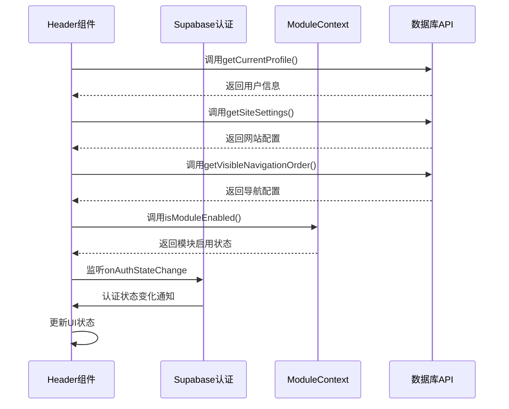
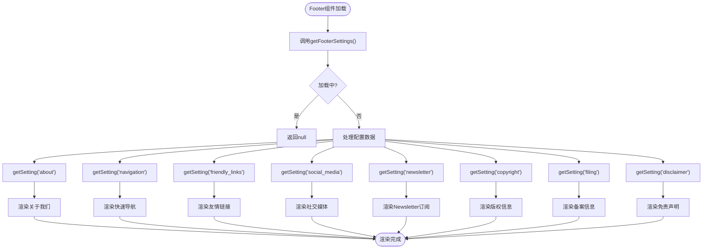
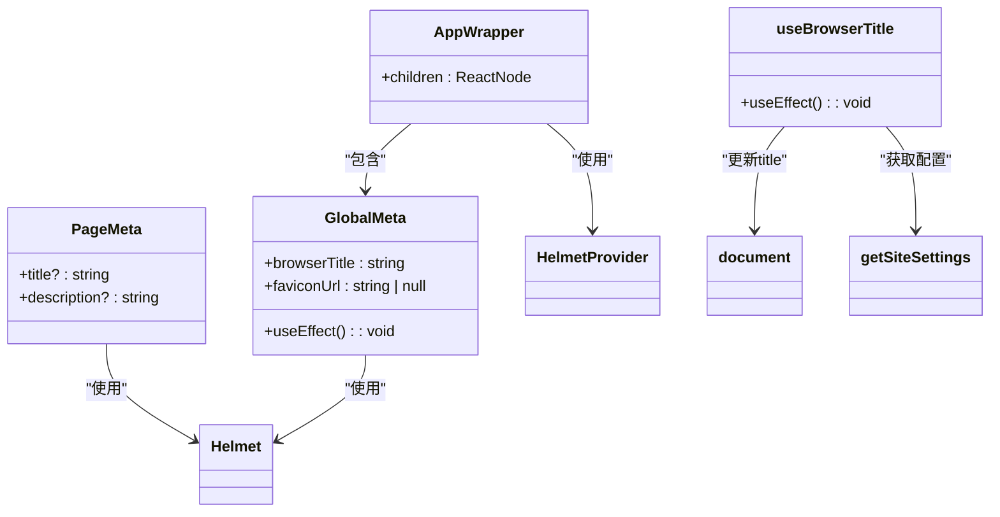
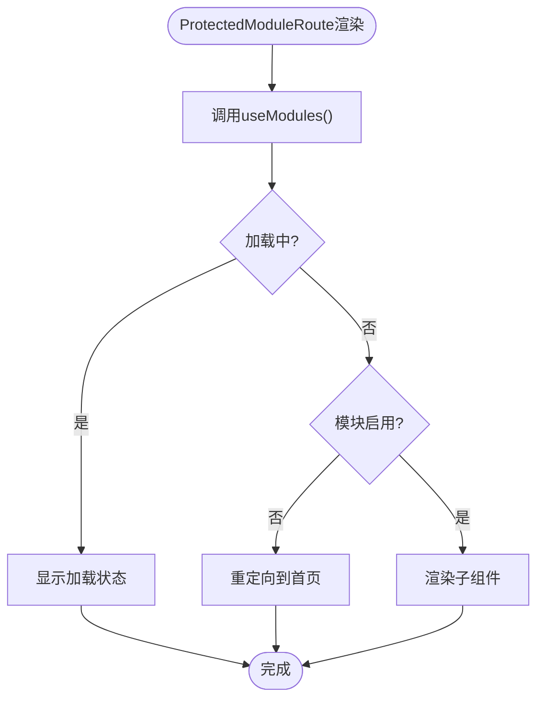
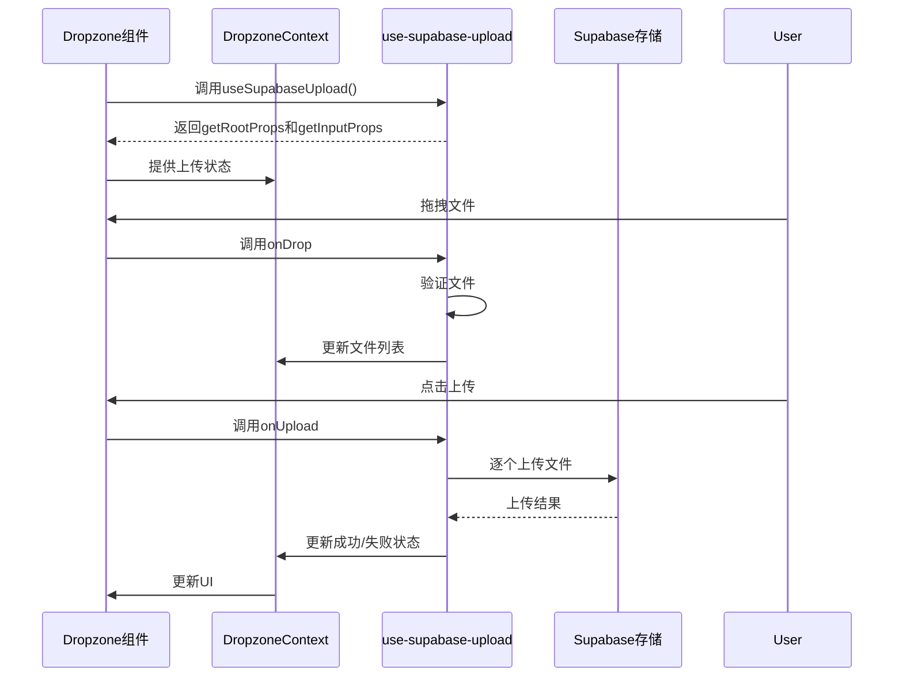
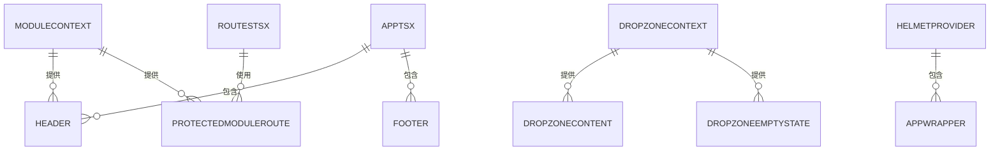

# 布局组件

<cite>
**本文档引用文件**   
- [Header.tsx](file://src/components/common/Header.tsx)
- [Footer.tsx](file://src/components/common/Footer.tsx)
- [PageMeta.tsx](file://src/components/common/PageMeta.tsx)
- [ProtectedModuleRoute.tsx](file://src/components/common/ProtectedModuleRoute.tsx)
- [dropzone.tsx](file://src/components/dropzone.tsx)
- [ModuleContext.tsx](file://src/contexts/ModuleContext.tsx)
- [useBrowserTitle.ts](file://src/hooks/useBrowserTitle.ts)
- [use-supabase-upload.ts](file://src/hooks/use-supabase-upload.ts)
- [types.ts](file://src/types/types.ts)
- [api.ts](file://src/db/api.ts)
- [App.tsx](file://src/App.tsx)
- [routes.tsx](file://src/routes.tsx)
</cite>

## 目录
1. [Header组件](#header组件)
2. [Footer组件](#footer组件)
3. [PageMeta组件](#pagemeta组件)
4. [ProtectedModuleRoute组件](#protectedmoduleroute组件)
5. [Dropzone组件](#dropzone组件)
6. [布局组件通信与样式策略](#布局组件通信与样式策略)

## Header组件

Header组件作为应用的全局导航栏，实现了导航、认证状态和模块控制功能的集成。组件通过`useEffect`在初始化时加载用户信息、网站配置和导航顺序，并监听认证状态变化。导航菜单的渲染基于`ModuleContext`中的模块启用状态进行动态过滤，确保只显示已启用的模块。

用户认证状态通过`supabase.auth.onAuthStateChange`进行监听，当用户登录或登出时自动更新状态。已登录用户会显示用户下拉菜单，管理员用户可访问管理后台。移动端通过`Sheet`组件实现汉堡菜单，提供响应式设计。

**Diagram sources**
- [Header.tsx](file://src/components/common/Header.tsx#L20-L263)

**Section sources**
- [Header.tsx](file://src/components/common/Header.tsx#L20-L263)
- [ModuleContext.tsx](file://src/contexts/ModuleContext.tsx#L13-L62)
- [api.ts](file://src/db/api.ts#L32-L44)

## Footer组件

Footer组件负责展示网站的底部信息，包括关于我们、快速导航、友情链接、社交媒体、Newsletter订阅、版权信息、备案信息和免责声明。组件通过`getFooterSettings`从数据库获取配置数据，支持多部分配置。

组件采用条件渲染，只有当相应配置存在时才显示对应部分。Newsletter订阅功能包含表单验证，确保邮箱格式正确。社交媒体图标使用文本图标而非图片，提高加载性能。备案信息中的链接可点击跳转。

**Diagram sources**
- [Footer.tsx](file://src/components/common/Footer.tsx#L10-L246)

**Section sources**
- [Footer.tsx](file://src/components/common/Footer.tsx#L10-L246)
- [types.ts](file://src/types/types.ts#L62-L71)
- [api.ts](file://src/db/api.ts#L8-L17)

## PageMeta组件

PageMeta组件统一管理页面的SEO元信息，包括浏览器标题和favicon。组件通过`GlobalMeta`函数组件在应用根级别设置全局元信息，从数据库获取网站配置并更新`document.title`和favicon。

`PageMeta`组件用于设置页面级别的描述信息。`AppWrapper`提供了`HelmetProvider`上下文，确保元信息的正确管理。`useBrowserTitle` Hook在页面加载时动态更新浏览器标题，与PageMeta组件协同工作。

**Diagram sources**
- [PageMeta.tsx](file://src/components/common/PageMeta.tsx#L7-L57)
- [useBrowserTitle.ts](file://src/hooks/useBrowserTitle.ts#L8-L24)

**Section sources**
- [PageMeta.tsx](file://src/components/common/PageMeta.tsx#L7-L57)
- [useBrowserTitle.ts](file://src/hooks/useBrowserTitle.ts#L8-L24)
- [api.ts](file://src/db/api.ts#L16-L17)

## ProtectedModuleRoute组件

ProtectedModuleRoute组件实现路由守卫功能，基于`ModuleContext`进行功能模块访问控制。组件接收`moduleKey`作为参数，通过`useModules` Hook获取模块启用状态。

当模块未启用时，组件重定向到首页。加载过程中显示加载状态。该组件在`routes.tsx`中被广泛使用，保护案例查询、监管资讯、监管部门、趋势分析等模块的访问。

**Diagram sources**
- [ProtectedModuleRoute.tsx](file://src/components/common/ProtectedModuleRoute.tsx#L10-L29)

**Section sources**
- [ProtectedModuleRoute.tsx](file://src/components/common/ProtectedModuleRoute.tsx#L10-L29)
- [ModuleContext.tsx](file://src/contexts/ModuleContext.tsx#L55-L61)
- [routes.tsx](file://src/routes.tsx#L43-L47)

## Dropzone组件

Dropzone组件实现文件拖拽上传交互，与`use-supabase-upload` Hook深度集成。组件采用Context模式，通过`DropzoneContext`提供上传状态和方法。`Dropzone`组件负责渲染拖拽区域，`DropzoneContent`显示文件列表和上传按钮，`DropzoneEmptyState`提供空状态提示。

`use-supabase-upload` Hook封装了`react-dropzone`和Supabase存储的集成，处理文件选择、验证、上传和错误处理。组件支持文件大小限制、MIME类型限制、最大文件数限制和并发上传。

**Diagram sources**
- [dropzone.tsx](file://src/components/dropzone.tsx#L29-L228)
- [use-supabase-upload.ts](file://src/hooks/use-supabase-upload.ts#L58-L198)

**Section sources**
- [dropzone.tsx](file://src/components/dropzone.tsx#L29-L228)
- [use-supabase-upload.ts](file://src/hooks/use-supabase-upload.ts#L58-L198)
- [types.ts](file://src/types/types.ts#L5-L8)

## 布局组件通信与样式策略

布局组件间通过React Context进行通信，`ModuleContext`为Header和ProtectedModuleRoute提供模块状态，`DropzoneContext`为Dropzone子组件提供上传状态。这种模式避免了深层prop传递，提高了组件复用性。

样式方面，组件采用Tailwind CSS进行样式隔离，通过BEM命名约定避免样式冲突。Header和Footer使用`sticky`和`flex-grow`实现固定布局。可访问性方面，组件提供适当的ARIA标签、键盘导航支持和屏幕阅读器优化。

**Diagram sources**
- [App.tsx](file://src/App.tsx#L8-L33)
- [routes.tsx](file://src/routes.tsx#L33-L207)

**Section sources**
- [App.tsx](file://src/App.tsx#L8-L33)
- [routes.tsx](file://src/routes.tsx#L33-L207)
- [ModuleContext.tsx](file://src/contexts/ModuleContext.tsx#L11-L52)