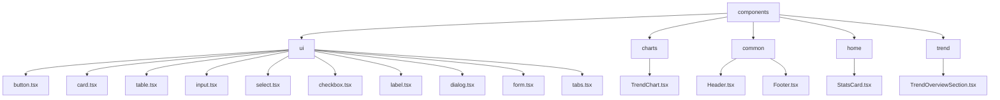
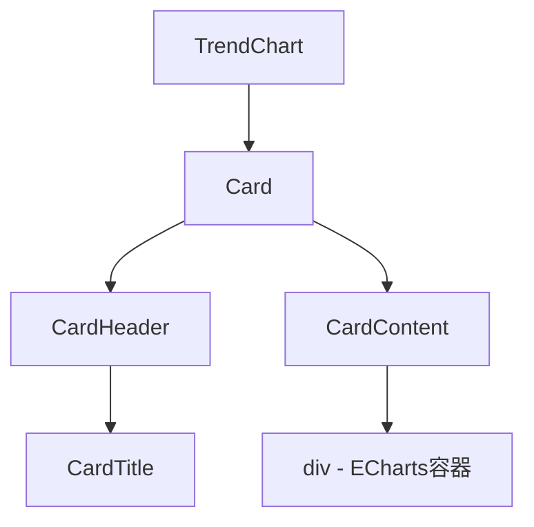
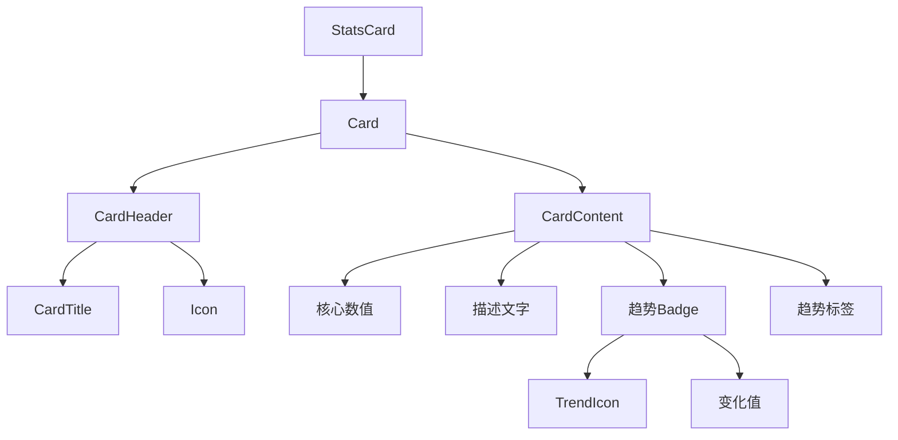
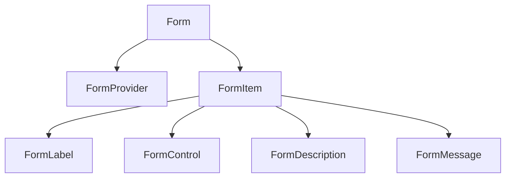

# 组件架构

<cite>
**本文档引用的文件**
- [button.tsx](file://src/components/ui/button.tsx)
- [card.tsx](file://src/components/ui/card.tsx)
- [table.tsx](file://src/components/ui/table.tsx)
- [dialog.tsx](file://src/components/ui/dialog.tsx)
- [form.tsx](file://src/components/ui/form.tsx)
- [input.tsx](file://src/components/ui/input.tsx)
- [select.tsx](file://src/components/ui/select.tsx)
- [checkbox.tsx](file://src/components/ui/checkbox.tsx)
- [label.tsx](file://src/components/ui/label.tsx)
- [tabs.tsx](file://src/components/ui/tabs.tsx)
- [TrendChart.tsx](file://src/components/charts/TrendChart.tsx)
- [Header.tsx](file://src/components/common/Header.tsx)
- [StatsCard.tsx](file://src/components/home/StatsCard.tsx)
- [utils.ts](file://src/lib/utils.ts)
- [colors.ts](file://src/lib/colors.ts)
</cite>

## 目录

1. [项目结构](#项目结构)
2. [Radix UI 封装组件](#radix-ui-封装组件)
3. [基础UI组件](#基础ui组件)
4. [组件组合模式](#组件组合模式)
5. [无障碍访问与响应式设计](#无障碍访问与响应式设计)

## 项目结构

项目采用功能模块化的目录结构，将UI组件按功能和用途进行组织。核心UI组件位于 `src/components/ui` 目录下，这些组件是对 Radix UI 原始组件的封装和样式化。此外，还有按业务功能划分的组件目录，如 `charts`、`common`、`home` 和 `trend`。

**图示来源**
- [button.tsx](file://src/components/ui/button.tsx)
- [TrendChart.tsx](file://src/components/charts/TrendChart.tsx)
- [Header.tsx](file://src/components/common/Header.tsx)
- [StatsCard.tsx](file://src/components/home/StatsCard.tsx)

**本节来源**
- [src/components/ui](file://src/components/ui)
- [src/components/charts](file://src/components/charts)
- [src/components/common](file://src/components/common)
- [src/components/home](file://src/components/home)
- [src/components/trend](file://src/components/trend)

## Radix UI 封装组件

项目中的UI组件大量使用了 Radix UI 库。Radix UI 提供了无样式的、可访问性良好的原始组件（primitives），项目在此基础上通过 Tailwind CSS 进行样式定制，创建了符合项目设计规范的封装组件。

### 封装方式

封装的核心在于使用 Radix UI 的组件作为基础，通过 `@radix-ui/react-*` 导入，然后使用 `cn` 工具函数（来自 `@/lib/utils`）合并自定义的 Tailwind CSS 类名。这种方式既保留了 Radix UI 的无障碍访问和交互逻辑，又实现了灵活的样式控制。

例如，`button.tsx` 组件使用 `@radix-ui/react-slot` 来支持 `asChild` 属性，允许将按钮的样式应用到其子元素上，从而实现更灵活的组合。

### 自定义扩展方法

1.  **使用 `cva` 定义变体**：`button.tsx` 使用 `class-variance-authority (cva)` 库来定义按钮的 `variant`（如 `default`, `destructive`, `outline`）和 `size`（如 `default`, `sm`, `lg`）等变体。这使得通过简单的属性即可切换不同的样式组合。
2.  **利用 `data-slot` 属性**：所有封装组件都添加了 `data-slot` 属性（如 `data-slot="button"`），这为未来的主题化或样式覆盖提供了清晰的钩子。
3.  **导出类型定义**：组件会导出其 Props 接口（如 `ButtonProps`），方便在其他地方进行类型扩展或检查。

**本节来源**
- [button.tsx](file://src/components/ui/button.tsx#L1-L58)
- [utils.ts](file://src/lib/utils.ts#L4-L6)

## 基础UI组件

### 按钮 (Button)

`Button` 组件是应用中最常用的交互元素。它通过 `buttonVariants` 函数定义了多种预设样式，并支持 `asChild` 属性。

- **Props 接口**: `ButtonProps` 扩展了原生的 `HTMLButtonElement` 属性，并集成了 `VariantProps<typeof buttonVariants>`，从而支持 `variant` 和 `size` 等自定义属性。
- **事件处理**: 继承了原生按钮的所有事件处理机制，如 `onClick`。
- **样式定制**: 样式主要通过 `cva` 函数和 `cn` 工具函数进行管理。开发者可以通过 `className` prop 添加额外的 Tailwind 类来覆盖或增强样式。

**本节来源**
- [button.tsx](file://src/components/ui/button.tsx#L37-L57)

### 卡片 (Card)

`Card` 组件是一个复合组件，由多个子组件构成，包括 `CardHeader`, `CardTitle`, `CardDescription`, `CardAction`, `CardContent`, 和 `CardFooter`。这种设计模式提供了极大的布局灵活性。

- **Props 接口**: 每个子组件都接受 `React.ComponentProps<"div">`，这意味着它们可以接收任何 `div` 元素的标准属性，包括 `className`。
- **事件处理**: 作为容器组件，其事件处理依赖于内部嵌套的可交互元素（如按钮）。
- **样式定制**: 样式通过 `cn` 函数和预设的 Tailwind 类进行定义。`Card` 组件本身使用 `flex flex-col` 布局，子组件通过 `gap-6` 等类控制间距。

**本节来源**
- [card.tsx](file://src/components/ui/card.tsx#L5-L92)

### 表格 (Table)

`Table` 组件同样是一个复合组件，封装了 `table`, `thead`, `tbody`, `tr`, `th`, `td` 等 HTML 表格元素。

- **Props 接口**: 与 `Card` 类似，每个子组件都接受其对应 HTML 元素的属性。
- **事件处理**: 支持在 `TableRow` 等组件上添加点击事件。
- **样式定制**: 通过 `data-slot` 属性和 Tailwind 类进行样式控制。例如，`TableRow` 在悬停时会应用 `hover:bg-muted/50` 的背景色。

**本节来源**
- [table.tsx](file://src/components/ui/table.tsx#L5-L114)

### 其他基础组件

- **输入框 (Input)**: 提供了基础的文本输入功能，样式通过 `cn` 函数定义，支持 `focus-visible` 和 `aria-invalid` 状态的样式。
- **选择器 (Select)**: 封装了 Radix UI 的 `Select` 组件，提供了下拉选择功能，支持滚动按钮和自定义指示器。
- **复选框 (Checkbox)**: 封装了 Radix UI 的 `Checkbox` 组件，通过 `data-[state=checked]` 等属性控制选中状态的样式。
- **标签 (Label)**: 与表单控件配合使用，通过 `htmlFor` 属性与控件关联。
- **标签页 (Tabs)**: 实现了标签页切换功能，`TabsTrigger` 组件的样式根据 `data-[state=active]` 属性动态变化，实现激活态的视觉效果。

**本节来源**
- [input.tsx](file://src/components/ui/input.tsx#L5-L21)
- [select.tsx](file://src/components/ui/select.tsx#L9-L159)
- [checkbox.tsx](file://src/components/ui/checkbox.tsx#L7-L30)
- [label.tsx](file://src/components/ui/label.tsx#L8-L24)
- [tabs.tsx](file://src/components/ui/tabs.tsx#L6-L85)

## 组件组合模式

项目中的高级组件通过组合基础UI组件来构建复杂的用户界面。

### 趋势图表 (TrendChart)

`TrendChart` 组件是一个典型的组合模式示例。

**图示来源**
- [TrendChart.tsx](file://src/components/charts/TrendChart.tsx#L12-L138)

**本节来源**
- [TrendChart.tsx](file://src/components/charts/TrendChart.tsx#L12-L138)
- [card.tsx](file://src/components/ui/card.tsx)

该组件将 `Card` 组件作为容器，内部包含 `CardHeader` 和 `CardTitle` 用于展示标题，`CardContent` 作为 ECharts 图表的渲染区域。这种模式将数据可视化逻辑与UI布局逻辑分离，提高了组件的可维护性。

### 统计卡片 (StatsCard)

`StatsCard` 组件展示了更复杂的组合和状态逻辑。

**图示来源**
- [StatsCard.tsx](file://src/components/home/StatsCard.tsx#L21-L135)

**本节来源**
- [StatsCard.tsx](file://src/components/home/StatsCard.tsx#L21-L135)
- [card.tsx](file://src/components/ui/card.tsx)
- [badge.tsx](file://src/components/ui/badge.tsx)
- [tooltip-info.tsx](file://src/components/ui/tooltip-info.tsx)

该组件组合了 `Card`、`Badge` 和图标组件。它通过 `props` 接收数据，并根据 `change` 值动态计算趋势颜色、Badge 变体和图标。`memo` 的使用确保了组件在 props 不变时不会重新渲染，优化了性能。`tooltipContent` 的存在表明它还集成了 `TooltipInfo` 组件以提供额外信息。

### 表单 (Form)

`Form` 组件展示了与状态管理库（react-hook-form）的深度集成。

**图示来源**
- [form.tsx](file://src/components/ui/form.tsx#L17-L166)

**本节来源**
- [form.tsx](file://src/components/ui/form.tsx#L17-L166)

`Form` 组件本身是 `react-hook-form` 的 `FormProvider`。`FormItem` 使用 React Context 来为内部的 `FormLabel`、`FormControl` 等组件提供共享的 `id`，确保了标签与控件的正确关联。`FormMessage` 组件会根据 `useFormField` 返回的 `error` 状态来决定是否显示错误信息。

## 无障碍访问与响应式设计

### 无障碍访问 (Accessibility)

项目中的UI组件高度重视无障碍访问：

1.  **语义化HTML**: 所有组件都基于正确的HTML元素构建，如 `button` 用于按钮，`label` 用于标签。
2.  **ARIA 属性**: 广泛使用 `aria-*` 属性。例如，`FormControl` 组件会根据错误状态设置 `aria-invalid` 和 `aria-describedby`，帮助屏幕阅读器用户理解表单状态。
3.  **键盘导航**: Radix UI 组件本身保证了良好的键盘导航支持，如 `Tab` 键切换焦点，`Enter` 键激活按钮等。
4.  **焦点可见性**: 通过 `focus-visible:outline-none focus-visible:ring-1` 等类确保键盘焦点有清晰的视觉指示。

### 响应式设计

项目通过 Tailwind CSS 的响应式断点实现响应式设计：

1.  **断点系统**: 使用 `sm`, `md`, `lg` 等前缀来定义不同屏幕尺寸下的样式。例如，在 `Header` 组件中，导航菜单在 `md` 断点以上显示为桌面版，在以下则折叠为移动端的抽屉菜单（Sheet）。
2.  **流体布局**: 使用 `flex`, `grid` 等布局方式，结合 `w-full`, `max-w-*` 等类，使内容能够根据容器大小自适应。
3.  **移动端优先**: 许多组件的默认样式针对移动设备设计，然后通过断点类进行增强。

**本节来源**
- [button.tsx](file://src/components/ui/button.tsx#L8-L9)
- [form.tsx](file://src/components/ui/form.tsx#L105-L119)
- [Header.tsx](file://src/components/common/Header.tsx#L120-L134)
- [Header.tsx](file://src/components/common/Header.tsx#L215-L256)