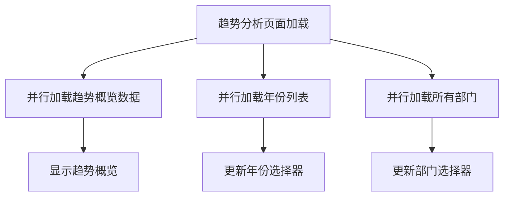
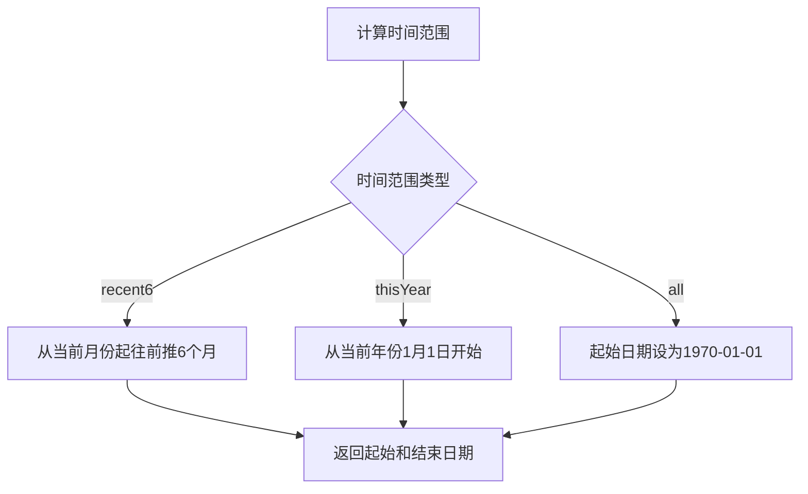
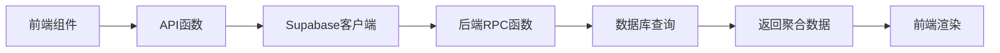

# 数据聚合与统计

<cite>
**本文档引用文件**   
- [api.ts](file://src/db/api.ts)
- [TrendOverviewSection.tsx](file://src/components/trend/TrendOverviewSection.tsx)
- [TrendOverviewChart.tsx](file://src/components/charts/TrendOverviewChart.tsx)
- [TrendAnalysisPage.tsx](file://src/pages/TrendAnalysisPage.tsx)
- [20251230130000_fix_trend_overview_stats.sql](file://supabase/migrations/20251230130000_fix_trend_overview_stats.sql)
- [timeRangeUtils.ts](file://src/utils/timeRangeUtils.ts)
</cite>

## 目录
1. [引言](#引言)
2. [核心API函数实现逻辑](#核心api函数实现逻辑)
3. [数据去重规则与统计口径](#数据去重规则与统计口径)
4. [多维度并行查询技术实现](#多维度并行查询技术实现)
5. [时间范围配置机制](#时间范围配置机制)
6. [数据准确性与性能保障](#数据准确性与性能保障)
7. [数据流路径说明](#数据流路径说明)

## 引言
本文档深入分析监管趋势分析模块中的数据聚合与统计功能，详细阐述 `getTrendOverview` 等核心API函数的实现逻辑。文档将解释数据去重规则、统计口径、聚合方法，以及并行查询多个数据维度的技术实现。同时，将说明默认时间范围（近6年）的配置机制和可扩展性设计，并涵盖数据准确性保障措施和性能优化策略。

## 核心API函数实现逻辑

`getTrendOverview` 函数是趋势概览模块的核心API，负责获取当前月风险等级、本年高频时段、高频通报部门和平台等关键统计数据。该函数通过调用Supabase的RPC（远程过程调用）函数 `get_trend_overview` 来获取数据，确保了数据处理的高效性和一致性。

该函数的实现逻辑如下：
1.  获取当前年份和月份。
2.  调用后端RPC函数 `get_trend_overview`，传入当前年份和月份作为参数。
3.  处理RPC函数返回的数据，确保数据格式的统一和完整性。
4.  返回处理后的趋势概览数据。

**Section sources**
- [api.ts](file://src/db/api.ts#L8180-L8208)

## 数据去重规则与统计口径

### 数据去重规则
系统采用“部门+日期”组合进行数据去重，以确保每个监管部门在同一天的通报活动只被计为一次。这种去重规则避免了因同一部门在同一天发布多条通报而导致的统计偏差。

在代码实现中，通过以下方式实现去重：
```sql
COUNT(DISTINCT department_id || '_' || report_date)
```
此SQL语句将部门ID和通报日期拼接成唯一字符串，然后使用 `DISTINCT` 关键字进行去重计数。

### 统计口径
- **当前月风险等级**：根据当月全部监管部门通报活动次数划分风险等级。≥10次为高风险，>5次且<10次为中风险，≤5次为低风险。
- **本年通报高频时段**：统计本年度内通报活动次数超过5次的月份。
- **高频通报部门**：分别统计本月和本年度通报频次最多的前三个部门。
- **高频被通报平台**：分别统计本月和本年度被通报应用所属平台出现频次最高的前三个平台。

**Section sources**
- [20251230130000_fix_trend_overview_stats.sql](file://supabase/migrations/20251230130000_fix_trend_overview_stats.sql#L20-L28)
- [TrendOverviewSection.tsx](file://src/components/trend/TrendOverviewSection.tsx#L124-L128)

## 多维度并行查询技术实现

系统通过并行查询多个数据维度来提高数据加载效率。在 `TrendAnalysisPage` 组件中，通过 `useEffect` 钩子函数并行加载趋势概览数据、年份列表和所有部门数据。



**Diagram sources**
- [TrendAnalysisPage.tsx](file://src/pages/TrendAnalysisPage.tsx#L69-L73)

## 时间范围配置机制

系统默认时间范围为近6年，该配置通过 `timeRangeUtils.ts` 文件中的 `calculateTimeRange` 函数实现。该函数根据传入的时间范围类型（`recent6`、`thisYear`、`all`）计算起始和结束日期。



**Diagram sources**
- [timeRangeUtils.ts](file://src/utils/timeRangeUtils.ts#L21-L40)

## 数据准确性与性能保障

### 数据准确性保障
- **后端聚合**：关键统计数据在数据库层面进行聚合，避免了前端计算可能带来的误差。
- **数据验证**：在数据导入时进行去重处理，确保数据的唯一性和准确性。
- **缓存机制**：使用缓存管理器对统计数据进行缓存，减少数据库查询次数，提高数据加载速度。

### 性能优化
- **RPC函数**：使用Supabase的RPC函数进行复杂数据聚合，减轻前端计算负担。
- **并行查询**：并行加载多个数据维度，减少页面加载时间。
- **分页加载**：对于大量数据，采用分页加载方式，避免一次性加载过多数据影响性能。

**Section sources**
- [api-optimized.ts](file://src/db/api-optimized.ts#L51-L93)
- [api.ts](file://src/db/api.ts#L666-L725)

## 数据流路径说明

数据从后端到前端的完整路径如下：
1.  前端组件（如 `TrendAnalysisPage`）调用API函数 `getTrendOverview`。
2.  API函数通过Supabase客户端调用后端RPC函数 `get_trend_overview`。
3.  后端RPC函数执行SQL查询，聚合统计数据并返回JSON格式结果。
4.  前端接收到数据后，通过 `TrendOverviewSection` 组件进行渲染展示。



**Diagram sources**
- [TrendAnalysisPage.tsx](file://src/pages/TrendAnalysisPage.tsx#L88-L99)
- [TrendOverviewSection.tsx](file://src/components/trend/TrendOverviewSection.tsx#L34-L330)
- [20251230130000_fix_trend_overview_stats.sql](file://supabase/migrations/20251230130000_fix_trend_overview_stats.sql#L4-L134)