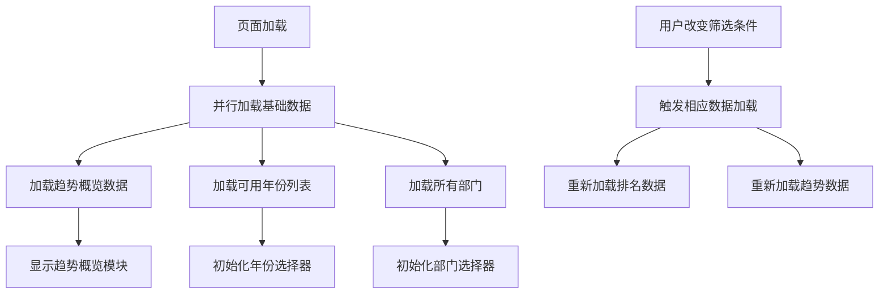
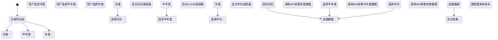
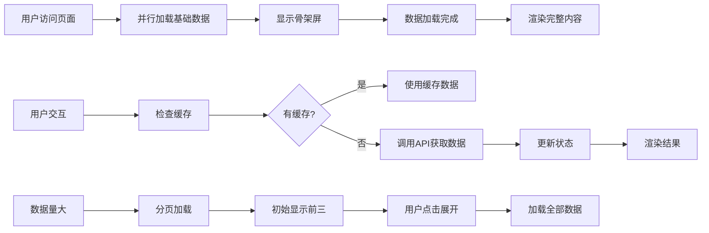

# 趋势分析功能

<cite>
**本文档引用文件**   
- [TrendAnalysisPage.tsx](file://src/pages/TrendAnalysisPage.tsx)
- [TrendChart.tsx](file://src/components/charts/TrendChart.tsx)
- [TrendOverviewSection.tsx](file://src/components/trend/TrendOverviewSection.tsx)
- [api.ts](file://src/db/api.ts)
- [timeRangeUtils.ts](file://src/utils/timeRangeUtils.ts)
- [colors.ts](file://src/lib/colors.ts)
- [20251230130000_fix_trend_overview_stats.sql](file://supabase/migrations/20251230130000_fix_trend_overview_stats.sql)
</cite>

## 目录
1. [介绍](#介绍)
2. [页面结构与数据加载流程](#页面结构与数据加载流程)
3. [趋势图表可视化实现](#趋势图表可视化实现)
4. [趋势概览模块数据聚合方法](#趋势概览模块数据聚合方法)
5. [筛选条件配置与时间范围选择](#筛选条件配置与时间范围选择)
6. [性能优化策略](#性能优化策略)
7. [结论](#结论)

## 介绍
趋势分析功能为用户提供多维度的监管通报趋势分析能力，通过时间维度数据分析帮助用户洞察监管动态。该功能包含趋势概览、通报排名和监管部门趋势分析三大核心模块，支持按月度、半年度、年度等不同时间维度进行数据筛选和分析。系统通过Supabase数据库的RPC函数实现高效的数据聚合和查询，结合ECharts和Recharts等可视化库呈现直观的数据图表。

**Section sources**
- [TrendAnalysisPage.tsx](file://src/pages/TrendAnalysisPage.tsx#L1-L678)

## 页面结构与数据加载流程

趋势分析页面采用模块化设计，主要由三个核心组件构成：趋势概览模块、通报排名模块和监管部门趋势分析模块。页面初始化时通过`useEffect`钩子并行加载基础数据，包括趋势概览数据、可用年份列表和所有部门信息。

数据加载流程遵循以下步骤：
1. 页面加载时触发`useEffect`，并行调用`loadTrendOverviewData`、`loadAvailableYears`和`loadAllDepartments`函数
2. 趋势概览数据通过`getTrendOverview` API从Supabase获取，包含当前月风险等级、高频时段、高频通报部门和平台等聚合信息
3. 可用年份列表通过`getAvailableYears` RPC函数查询数据库中所有案例的年份，按倒序排列返回
4. 所有部门信息通过`getDepartments` API获取，用于后续的排名和趋势分析

当用户交互改变筛选条件时，系统会根据不同的依赖关系触发相应的数据加载：
- 改变时间维度、年份、月份或半年度选择时，触发`loadRankingData`函数重新加载排名数据
- 选择不同部门或改变趋势分析维度时，触发`loadApplicationTrendData`函数重新加载趋势数据



**Diagram sources **
- [TrendAnalysisPage.tsx](file://src/pages/TrendAnalysisPage.tsx#L69-L138)

**Section sources**
- [TrendAnalysisPage.tsx](file://src/pages/TrendAnalysisPage.tsx#L69-L138)

## 趋势图表可视化实现

趋势图表组件采用ECharts作为主要可视化引擎，通过`TrendChart`组件实现折线图的渲染。该组件接收数据数组、图表标题和类型参数，使用`useRef`创建图表容器引用，并在`useEffect`中初始化ECharts实例。

图表配置包含以下关键特性：
- **响应式设计**：通过`ResponsiveContainer`确保图表在不同屏幕尺寸下的适配
- **视觉效果**：使用平滑曲线(`smooth: true`)、圆形标记点(`symbol: 'circle'`)和渐变填充区域(`areaStyle`)
- **交互功能**：支持鼠标悬停提示(`tooltip`)、图例显示(`legend`)和坐标轴阴影指针(`axisPointer`)
- **颜色配置**：从`colors.ts`导入预定义的颜色方案，确保全站视觉一致性

对于监管部门趋势分析模块，系统使用Recharts库的`LineChart`组件渲染折线图，同时提供数据表格作为补充。图表与表格数据同步显示，用户可以同时查看可视化趋势和具体数值。

```mermaid
classDiagram
class TrendChart {
+data : Array<{month/year : string, count : number}>
+title : string
+type : 'monthly' | 'yearly'
-chartRef : RefObject<HTMLDivElement>
-initChart() : void
-disposeChart() : void
}
class ECharts {
+init(container : HTMLDivElement) : EChartsInstance
+setOption(option : EChartsOption) : void
+resize() : void
+dispose() : void
}
TrendChart --> ECharts : "使用"
TrendChart --> colors : "导入颜色配置"
```

**Diagram sources **
- [TrendChart.tsx](file://src/components/charts/TrendChart.tsx#L1-L139)
- [colors.ts](file://src/lib/colors.ts#L1-L50)

**Section sources**
- [TrendChart.tsx](file://src/components/charts/TrendChart.tsx#L1-L139)

## 趋势概览模块数据聚合方法

趋势概览模块通过Supabase的RPC函数`get_trend_overview`实现复杂的数据聚合，该函数在PostgreSQL数据库层面完成所有计算，确保高性能和数据一致性。数据聚合遵循严格的统计口径，确保分析结果的准确性和可比性。

### 统计口径说明
- **通报频次统计**：按"部门+日期"组合去重统计，避免同一部门同一天多次通报被重复计算
- **应用数量统计**：对应用名称进行去重计数，确保每个应用只计一次
- **风险等级划分**：
  - 高风险：当月通报活动次数 ≥ 10次
  - 中风险：当月通报活动次数 > 5次 且 < 10次
  - 低风险：当月通报活动次数 ≤ 5次

### 数据聚合维度
趋势概览模块提供四个维度的聚合分析：

| 分析维度 | 统计指标 | 筛选条件 |
|---------|---------|---------|
| 当月通报风险等级 | 通报活动次数、风险等级 | 当前年月 |
| 本年通报高频时段 | 月度通报次数 | 本年度1月至当前月份，筛选次数>5次的月份 |
| 高频通报部门 | 通报频次 | 本月前三、本年前三 |
| 高频被通报平台 | 被通报次数 | 本月前三、本年前三 |

```mermaid
flowchart TD
A[调用get_trend_overview函数] --> B[计算当前月起止日期]
B --> C[查询当月通报风险等级]
C --> D[COUNT DISTINCT department_id || '_' || report_date]
D --> E[根据次数划分风险等级]
E --> F[返回风险等级信息]
C --> G[查询本年高频时段]
G --> H[GROUP BY DATE_TRUNC('month', report_date)]
H --> I[HAVING COUNT > 5]
I --> J[返回高频月份列表]
C --> K[查询高频通报部门]
K --> L[JOIN regulatory_departments]
L --> M[GROUP BY department name]
M --> N[ORDER BY count DESC LIMIT 3]
N --> O[返回部门排名]
C --> P[查询高频被通报平台]
P --> Q[JOIN app_platforms]
Q --> R[GROUP BY platform name]
R --> S[ORDER BY count DESC LIMIT 3]
S --> T[返回平台排名]
```

**Diagram sources **
- [20251230130000_fix_trend_overview_stats.sql](file://supabase/migrations/20251230130000_fix_trend_overview_stats.sql#L1-L134)
- [TrendOverviewSection.tsx](file://src/components/trend/TrendOverviewSection.tsx#L1-L330)

**Section sources**
- [20251230130000_fix_trend_overview_stats.sql](file://supabase/migrations/20251230130000_fix_trend_overview_stats.sql#L1-L134)
- [TrendOverviewSection.tsx](file://src/components/trend/TrendOverviewSection.tsx#L1-L330)

## 筛选条件配置与时间范围选择

趋势分析功能提供灵活的筛选条件配置，支持用户自定义时间范围选择。系统通过`TimeDimension`类型定义四种时间维度：月度、半年度、年度和全部时间段，满足不同粒度的分析需求。

### 默认筛选条件
系统初始化时设置以下默认筛选条件：
- **时间维度**：全部时间段
- **年份选择**：当前年份
- **月份选择**：1月
- **半年度选择**：上半年
- **趋势分析维度**：全部数据

这些默认值通过React状态管理实现，确保用户首次访问时能立即看到有意义的数据。

### 用户自定义时间范围
用户可以通过以下方式自定义时间范围：

1. **时间维度选择**：通过下拉菜单选择分析的时间粒度
2. **年份选择**：动态加载数据库中存在的年份列表，确保用户只能选择有数据的年份
3. **月份/半年度选择**：根据所选时间维度显示相应的子选项
4. **部门选择**：提供排序后的部门列表，国家级部门优先显示

当用户选择特定时间维度时，界面会动态调整显示相应的筛选控件：
- 选择"月度"时显示月份选择器
- 选择"半年度"时显示上半年/下半年选择器
- 选择"年度"或"全部"时仅显示年份选择器



**Section sources**
- [TrendAnalysisPage.tsx](file://src/pages/TrendAnalysisPage.tsx#L47-L54)
- [api.ts](file://src/db/api.ts#L2856-L2886)

## 性能优化策略

趋势分析功能采用多种性能优化策略，确保在大数据量下的流畅用户体验。

### 数据分页加载
系统通过Supabase的`range`方法实现数据分页，避免一次性加载过多数据。对于排名模块，采用"显示前三，可展开查看全部"的设计模式，初始只渲染前3个排名项，减少DOM节点数量。

### 缓存机制
- **RPC函数缓存**：Supabase自动缓存RPC函数结果，减少数据库查询压力
- **前端状态缓存**：使用React状态管理避免重复API调用
- **数据预加载**：页面初始化时并行加载所有基础数据，减少用户等待时间

### 懒加载与条件渲染
- **条件渲染**：仅在必要时渲染组件，如趋势图表在未选择部门时不渲染
- **骨架屏**：使用`Skeleton`组件在数据加载时显示占位符，提升感知性能
- **防抖处理**：对频繁触发的操作进行防抖，避免过度请求

### 数据库优化
后端通过精心设计的SQL查询和索引优化性能：
- 使用`DISTINCT`和`GROUP BY`在数据库层面完成聚合计算
- 通过`DATE_TRUNC`函数高效进行时间维度分组
- 利用Supabase的自动索引优化查询速度



**Section sources**
- [TrendAnalysisPage.tsx](file://src/pages/TrendAnalysisPage.tsx#L400-L421)
- [TrendOverviewSection.tsx](file://src/components/trend/TrendOverviewSection.tsx#L74-L88)

## 结论
趋势分析功能通过精心设计的架构和实现，为用户提供强大而直观的时间维度数据分析能力。系统采用前后端分离架构，前端通过React组件化设计实现灵活的用户界面，后端利用Supabase的RPC函数完成复杂的数据聚合。ECharts和Recharts等可视化库的结合使用，确保了图表的美观性和交互性。通过数据分页、缓存机制和条件渲染等性能优化策略，系统能够在大数据量下保持流畅的用户体验。整体设计遵循可维护性和可扩展性原则，为未来的功能迭代奠定了良好基础。