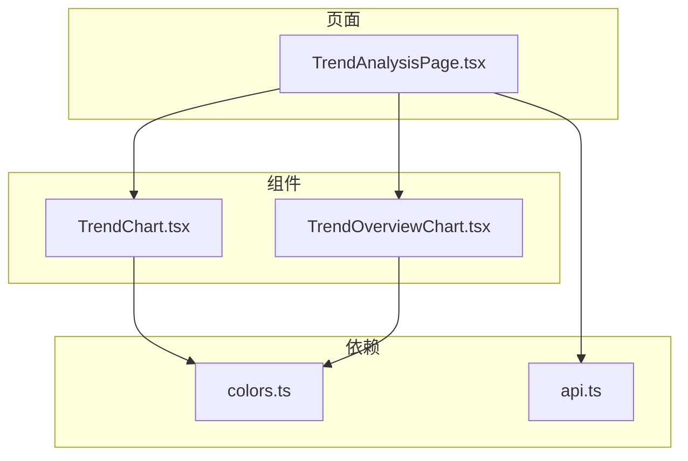
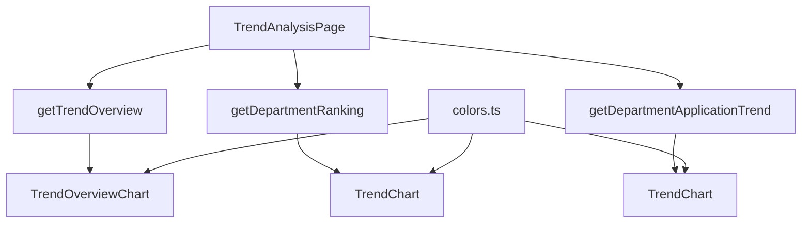
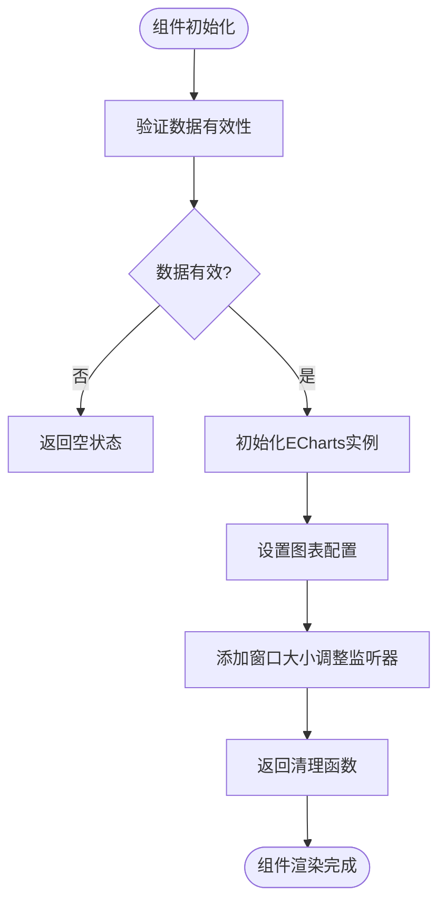
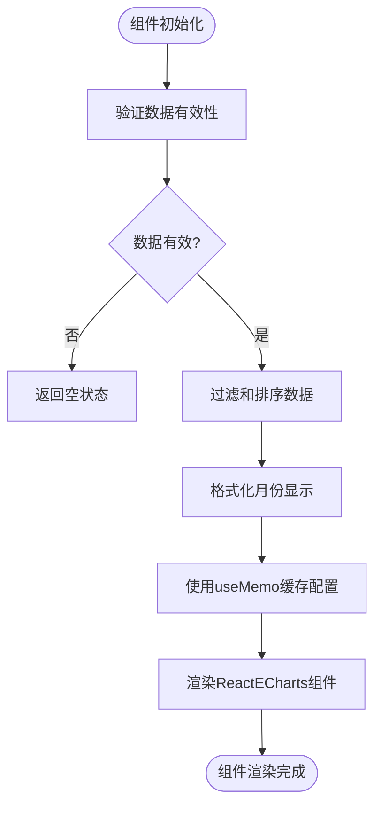
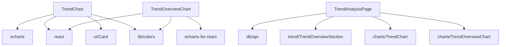

# 趋势图表组件

<cite>
**本文档引用文件**  
- [TrendChart.tsx](file://src/components/charts/TrendChart.tsx)
- [TrendOverviewChart.tsx](file://src/components/charts/TrendOverviewChart.tsx)
- [TrendAnalysisPage.tsx](file://src/pages/TrendAnalysisPage.tsx)
- [TrendOverviewSection.tsx](file://src/components/trend/TrendOverviewSection.tsx)
- [colors.ts](file://src/lib/colors.ts)
- [api.ts](file://src/db/api.ts)
- [vitest.config.ts](file://vitest.config.ts)
</cite>

## 目录
1. [项目结构](#项目结构)
2. [核心组件](#核心组件)
3. [架构概述](#架构概述)
4. [详细组件分析](#详细组件分析)
5. [依赖分析](#依赖分析)
6. [性能考虑](#性能考虑)
7. [故障排除指南](#故障排除指南)
8. [结论](#结论)

## 项目结构

根据项目目录结构，趋势图表组件位于 `src/components/charts/` 目录下，主要包括 `TrendChart.tsx` 和 `TrendOverviewChart.tsx` 两个核心文件。这些组件被 `TrendAnalysisPage.tsx` 页面使用，并依赖于 `lib/colors.ts` 中的颜色配置和 `db/api.ts` 中的数据获取逻辑。

**图表来源**  
- [TrendChart.tsx](file://src/components/charts/TrendChart.tsx)
- [TrendOverviewChart.tsx](file://src/components/charts/TrendOverviewChart.tsx)
- [TrendAnalysisPage.tsx](file://src/pages/TrendAnalysisPage.tsx)
- [colors.ts](file://src/lib/colors.ts)
- [api.ts](file://src/db/api.ts)

**章节来源**  
- [TrendChart.tsx](file://src/components/charts/TrendChart.tsx)
- [TrendOverviewChart.tsx](file://src/components/charts/TrendOverviewChart.tsx)
- [TrendAnalysisPage.tsx](file://src/pages/TrendAnalysisPage.tsx)

## 核心组件

`TrendChart` 和 `TrendOverviewChart` 是两个核心的可视化组件，它们都基于 ECharts-for-React 封装，用于展示监管趋势数据。`TrendChart` 用于展示单个趋势数据，而 `TrendOverviewChart` 用于展示趋势概览数据。

**章节来源**  
- [TrendChart.tsx](file://src/components/charts/TrendChart.tsx)
- [TrendOverviewChart.tsx](file://src/components/charts/TrendOverviewChart.tsx)

## 架构概述

整个趋势分析功能由 `TrendAnalysisPage` 统一管理，它通过调用 `api.ts` 中的 API 获取数据，并将数据传递给 `TrendChart` 和 `TrendOverviewChart` 组件进行渲染。颜色配置由 `colors.ts` 统一管理，确保整个应用的视觉一致性。

**图表来源**  
- [TrendAnalysisPage.tsx](file://src/pages/TrendAnalysisPage.tsx)
- [api.ts](file://src/db/api.ts)
- [TrendOverviewChart.tsx](file://src/components/charts/TrendOverviewChart.tsx)
- [TrendChart.tsx](file://src/components/charts/TrendChart.tsx)
- [colors.ts](file://src/lib/colors.ts)

## 详细组件分析

### TrendChart 分析

`TrendChart` 组件使用原生 ECharts API 进行初始化和渲染。它通过 `useEffect` 钩子在组件挂载时初始化图表，并在数据变化时更新图表。组件支持月度和年度两种时间维度，并根据时间维度调整 X 轴标签的旋转角度。

#### 配置选项和渲染逻辑

**图表来源**  
- [TrendChart.tsx](file://src/components/charts/TrendChart.tsx#L1-L139)

**章节来源**  
- [TrendChart.tsx](file://src/components/charts/TrendChart.tsx#L1-L139)

### TrendOverviewChart 分析

`TrendOverviewChart` 组件使用 `echarts-for-react` 封装，通过 `ReactECharts` 组件进行渲染。与 `TrendChart` 不同，它使用 `useMemo` 钩子来优化性能，避免不必要的重新渲染。组件还关闭了动画效果以提高性能。

#### 配置选项和渲染逻辑

**图表来源**  
- [TrendOverviewChart.tsx](file://src/components/charts/TrendOverviewChart.tsx#L1-L158)

**章节来源**  
- [TrendOverviewChart.tsx](file://src/components/charts/TrendOverviewChart.tsx#L1-L158)

## 依赖分析

**图表来源**  
- [TrendChart.tsx](file://src/components/charts/TrendChart.tsx)
- [TrendOverviewChart.tsx](file://src/components/charts/TrendOverviewChart.tsx)
- [TrendAnalysisPage.tsx](file://src/pages/TrendAnalysisPage.tsx)

**章节来源**  
- [TrendChart.tsx](file://src/components/charts/TrendChart.tsx)
- [TrendOverviewChart.tsx](file://src/components/charts/TrendOverviewChart.tsx)
- [TrendAnalysisPage.tsx](file://src/pages/TrendAnalysisPage.tsx)

## 性能考虑

两个图表组件都采取了不同的性能优化策略。`TrendChart` 通过手动管理 ECharts 实例的生命周期来避免内存泄漏，而 `TrendOverviewChart` 则通过 `useMemo` 钩子和关闭动画来提高性能。此外，`TrendOverviewChart` 还使用了 `notMerge` 和 `lazyUpdate` 属性来优化更新性能。

**章节来源**  
- [TrendChart.tsx](file://src/components/charts/TrendChart.tsx)
- [TrendOverviewChart.tsx](file://src/components/charts/TrendOverviewChart.tsx)

## 故障排除指南

当前测试覆盖率较低，`coverage` 目录下的 HTML 报告显示 `components/charts` 目录的语句覆盖率、分支覆盖率和函数覆盖率均为 0%。建议增加单元测试和集成测试，特别是针对 `TrendChart` 和 `TrendOverviewChart` 组件的渲染逻辑和数据处理逻辑。

**章节来源**  
- [vitest.config.ts](file://vitest.config.ts)
- [consistency.test.ts](file://src/db/consistency.test.ts)
- [timeRangeUtils.test.ts](file://src/utils/__tests__/timeRangeUtils.test.ts)

## 结论

`TrendChart` 和 `TrendOverviewChart` 组件通过不同的方式封装了 ECharts，提供了灵活的可视化解决方案。`TrendChart` 适合需要精细控制的场景，而 `TrendOverviewChart` 适合需要高性能的场景。建议统一使用 `echarts-for-react` 封装，以提高代码一致性和可维护性，并增加测试覆盖率以确保代码质量。